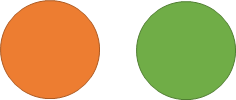
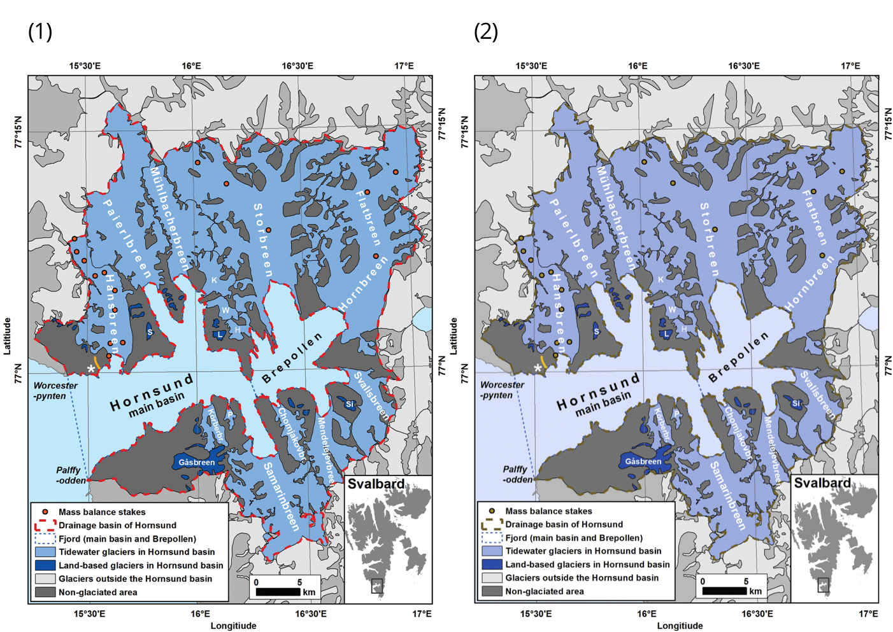

# General principles for creating accessible content

## Alt text for images

Alt text (“alternative text”) is a machine-readable tag that describes an image in words if the image cannot be displayed for any reason, including slow internet connection, error in the HTML code, or the use of assistive technology.

### Where to add alt text

* Not all images need alt text. If an image is informative versus decorative, it will need alt text that also gives context to the image.
* Examples of images that are considered informative:
  * **Images that are links or buttons**
    * Clickable images should have alt text or be part of a clickable area that includes a description or context of the image. It should give clues on what will happen when clicking the link
    * If there is no text around the image, it needs alt text.
  * **Images that contain important text**
    * Logos
      * The alt text for a company or organisation’s logo in the header should be the company or organisation’s name. Add additional alt text for a link destination, for example, the UserTesting logo could have the alt text “User Testing -- Home”.
     * The description of an image can also be found at the bottom of the image as a “caption”.
* Examples of images that are considered decorative:
  * Used for aesthetic purposes (visual enhancements, decorations, embellishments)
  * Provide no information
  * Have no function beyond aesthetics

### How to write alt text for images
* The recommended number of characters for alt text is 125 characters or less for compatibility with popular screen readers.
* All alt text should end with a “.” so that the screen reader will pause after reading.
* Issue and article cover images should have alt text.
* Image clues to write about in alt text:
  * The placement of objects in the image
  * Image style (e.g. painting, graph)
  * Colours
  * Names of people in the image
  * Clothes, if they are important details
  * Animals
  * The placement of text within the image
  * Emotions (e.g. smiling)
  * Surroundings
* Image descriptions that can be left out:
  * Description of colours
  * Obvious details, such as a person has two eyes, a nose, and a mouth
  * Details that are not the focus of the image
  * Overly poetic and detailed descriptions
  * Emojis

### Icons
* Icons follow the same principles; are they informative or decorative?
  * Is there text directly next to the icon?
  * If there is text, does it describe what the icon is for?
  * If the icon is a link or a button, what happens when it is clicked or activated? Where does it go?

### Complex images
* Complex images contain substantial information, for example:
  * Graphs or charts (e.g. flow charts, organizational charts)
  * Illustrations or diagrams
  * Maps or other geographical or topographical images
* The recommended alternative to writing about complex images is to write both a short and long description:
  * The short description in alt text first identifies the image, and then indicates the location of the long description. E.g. `alt="Graph of quarterly temperature changes. Discussion available below."`.
  * The long description on the page contains essential information that is conveyed by the image.

### Image positioning for screen readers

Image positioning matters for text documents (e.g. Word, PDF) when read by screen readers. 

Only images with the Wrap Text style of "In Line with Text" are recognized by screen reader software. When exported to PDF, images with other wrapping styles will be skipped by a screen reader even when an alt tag is present.

### Video and audio content

When creating video and audio content, it is important to ensure that it is accessible to users with visual, auditory, and neurological disabilities. Make sure that the video does not play automatically, as people should be able to choose when to play the content. A hearing impaired person may not be aware of the audio volume; users with physical or cognitive disabilities may not be as fast to stop the video and may impact other people in their environment, as well as feel embarrassed by the situation.

#### Video and audio quality

-   Ensure that the video contains no unannounced flashing/strobing that could trigger seizures due to photosensitivity;
    
-   Provide high-quality foreground audio that is clearly distinguishable from any background noise to aid people who are hard of hearing.
    
#### Providing alternatives for video and audio

-   **Captions**. Captions are text alternatives to the spoken word presented within multimedia. They are beneficial to those who cannot hear the audio, those who may not be fluent in the language or those who prefer to receive information via text over sound.

       You can have automated captions generated that will then need to be reviewed and corrected by a human reader, using tools like:

    -   [YouTube auto captioning for video](https://www.youtube.com/)
    
    -   [Kapwing Caption Video Online](https://www.kapwing.com/tools/caption-video)
    
    -   [IBM Watson auto captioning for audio](https://speech-to-text-demo.ng.bluemix.net/) (demo)
    
-   **Transcripts**. Transcripts contain the full text of the spoken word (not necessarily verbatim) that could be accessed and read separately from the multimedia itself. Transcripts allow deaf/blind users to get content through the use of refreshable Braille devices. They are also useful for searching and navigating to a specific part of the text.
    
    When planning a video/audio recording, it is a good idea to have the transcript written out ahead of time. It can then be used both for the multimedia creation and to be made available afterwards.

-   **Audio descriptions**. Audio descriptions are meant to provide additional information about content that is visible on the screen for users with visual disabilities. They typically take the form of a narrator that describes visual-only content in the multimedia and can be provided with the primary video, or in another audio track.
    
    When producing a video, the need for audio descriptions can often be avoided by describing or presenting the visual content via spoken audio. For example instead of saying “click here and then here”, you can say “click File and then Save” thus conveying visual content through audio.

-   **Sign language interpretation**. While closed captions or transcripts provide a suitable alternative for users with hearing disabilities who are comfortable reading written language, they may not be sufficient for deaf users who rely on sign language as their primary (or only) language of communication. In this case an alternative can be provided via sign language interpretation or other tools outlined in the [Accessibility for Sign Language users section](#accessibility-for-sign-language-users).
    
### Accessible hyperlinks

Users who navigate using a screen reader must be able to unambiguously understand the purpose of the link and skip links they are not interested in. To achieve this, link text needs to be:

-   **Descriptive.** When writing URL text, make sure it can be understood without additional context. E.g.:
    
    -   Do not use: "[Click here](https://pkp.sfu.ca/ojs/) to read about OJS”.
    -    Use instead: “More information is available on the [Open Journal Systems (OJS) page](https://pkp.sfu.ca/ojs/)”.
    
-   **Concise**. Use keyword(s) as linked text rather than longer sentences. For text that is meant to be printed, hyperlink the text and add a full URL. E.g.:
    - For online display: “More information is available on the [Open Journal Systems (OJS) page](https://pkp.sfu.ca/ojs/)”.   
    
    -   For print display or online + print: “More information is available on the [Open Journal Systems (OJS) page](https://pkp.sfu.ca/ojs/) at [https://pkp.sfu.ca/ojs/](https://pkp.sfu.ca/ojs/)”.
    
-   **Unique**. Avoid similarly named hyperlinks if they link to different places.

- **Visually distinct**. Use the default blue underlined style for hyperlinks. If you change it, make sure the links are still high contrast and underlined. Don't use underline for non-hyperlinked text.

### Contrast and colour reliance

Contrast and colour use are vital to accessibility. Having insufficient contrast may affect users with visual disabilities. Having content that relies on colour to convey meaning may affect users with colour vision deficiencies (CVD) and those who rely on screen readers.

#### Contrast ratio

Text colour against the background may appear as sufficiently distinct to a sighted reader, but may present issues to a reader with visual disabilities. To help evaluate it, [WCAG 2.1 Guidelines](https://www.w3.org/TR/WCAG21/#contrast-minimum) quantify accessible contrast ratio as at least 4.5:1 for normal text and 3:1 for large text, for Level AA.

You can use [WebAim’s Contrast Checker](http://webaim.org/resources/contrastchecker), [Contrast Ratio Checker](http://leaverou.github.io/contrast-ratio), or the [Colour Contrast Analyser](https://www.paciellogroup.com/resources/contrastanalyser) to check the contrast ratio between your website’s background and text colours. Here is an example of a check done using [WebAim’s Contrast Checker](http://webaim.org/resources/contrastchecker):

*Example of WebAim's Colour Contrast Checker interface options*

In this example, normal text of purple colour #666FF is not sufficiently distinct against the white background #FFFFFF and fails the Level AA standard, but large text of the same colour passes. To fix the issue, you can darken the text colour or increase the font size.

Similarly, you can use the WebAIM [Link Contrast Checker](https://webaim.org/resources/linkcontrastchecker/) to evaluate the visibility of your links.

#### Use of colour

We often use colour in web content or in published content to convey meaning. Using coloured graphs or illustration is one such example. When making the choice to use colour, consider whether a reader with colour vision deficiencies (CVD) or using a screen reader would still be able to understand the meaning conveyed. It is essential for the colour to not be the only means of conveying the information - consider adding other textual queues (e.g. numbers or % on a graph).

**Don’t do this:**

**Do this:**
 

Other tools, such as the [Spectrum Chrome extension](https://chrome.google.com/webstore/detail/spectrum/ofclemegkcmilinpcimpjkfhjfgmhieb?hl=en) allow you to emulate different types of CVD on any website. This is particularly useful if your articles contain data visualisations. The following two figures, obtained from an article published in the journal Polar Research, illustrate how CVD can affect a user’s understanding of a graph or a chart.

*In this figure, the original (1) is still accessible and legible to users with deuteranopia, a green blindness, as shown in (2).*

 
*In this figure, the original’s (1) colour legend is not as clear for users with achromatopsia, total colour blindness, as shown in (2). Some of the data’s categories are too similar to each other.*
  
Certain web-based tools like [ColorBrewer](http://colorbrewer2.org/) provide accessible colour palettes for data visualisation, adapted to different types of datasets (sequential, diverging, qualitative). When in doubt, you may also fall back on different shapes or patterns to indicate delimitations in large groups of data points.
