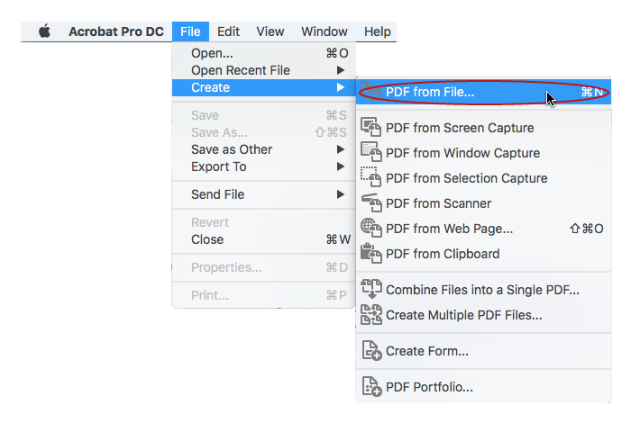
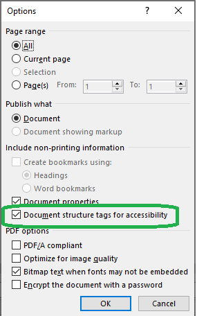
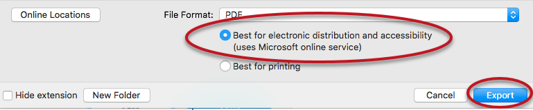

# Criando documentos para publicação acessíveis

Esta seção apresenta uma visão geral de como incorporar os princípios de conteúdo acessível listados acima em formatos de publicação específicos provavelmente adotados pelo seu periódico.

## Como verificar a acessibilidade de um documento do MS Word

O Verificador de Acessibilidade do MS Word verifica o arquivo em busca de problemas comuns que podem torná-lo menos acessível para usuários com necessidades especiais.

Execute o Verificador de Acessibilidade:

- Windows: Arquivo> Verificar problemas> Verificar acessibilidade
- Mac: Avaliar> "Verificar acessibilidade"

Após a execução do Verificador, os "Resultados da inspeção" exibirão uma ou mais das seguintes mensagens:

- **Erro**: identifica o conteúdo que torna um documento difícil de ler e entender
- **Aviso**: identifica o conteúdo que, na maioria dos casos, torna o documento difícil de entender
- **Dica**: identifica o conteúdo que pode não constituir um problema para o leitor, mas pode ser apresentado de maneira diferente para otimizar a experiência de leitura

Clicar em um item na lista "Resultados da inspeção" levará diretamente ao problema - o item será removido dos resultados da inspeção automaticamente assim que for resolvido. Não é necessário executar o verificador novamente.

Para obter mais suporte, consulte o recurso de Suporte da MS. [Melhorar a acessibilidade com o Verificador de acessibilidade](https://support.office.com/en-us/article/improve-accessibility-with-the-accessibility-checker-a16f6de0-2f39-4a2b-8bd8-5ad801426c7f#PickTab=Windows) .

## Rotulando seus documentos para publicação

As composições devem ser rotuladas de acordo com o tipo de arquivo que está sendo publicado, como PDF ou HTML (veja abaixo as informações sobre como escolher quais formatos de publicação usar). Suas composições também devem seguir um padrão de nomenclatura comum e consistente em todas as publicações, de modo que todas as composições do mesmo tipo (por exemplo, PDF) tenham o mesmo rótulo. Os leitores de tela lerão o tipo seguido pelo título, como “PDF: Crachás abertos como credenciais em sistemas de educação aberta: estudos de caso da Grécia e da Europa”.

Documentos complementares devem ter uma etiqueta que descreva o conteúdo. Por exemplo, “Dados Suplementares” não são muito descritivos. “Dados de renda regional” ou “Transcrições de entrevista” são mais descritivos.

## Quais formatos de publicação usar?

Os periódicos on-line publicam seus artigos em uma variedade de formatos de arquivos. Os mais comuns são PDF e HTML, mas cada vez mais formatos diferentes estão sendo usados: ePub, MP3 e XML. Como regra geral, os formatos mais estruturados (aqueles com marcação para indicar os recursos, como cabeçalhos, texto alternativo etc.) são os mais acessíveis. Com todos os formatos, existem coisas que se pode fazer para maximizar a acessibilidade e preservar a estrutura do documento original.

### PDF

O PDF é o formato mais comum para publicação de artigos, mas pode apresentar vários problemas do ponto de vista da acessibilidade. Um dos principais problemas é que um documento de texto criado com considerações de acessibilidade em mente pode perder alguns desses recursos ao ser convertido para PDF, como marcações, texto alternativo, cabeçalhos etc. A seguir apresentamos as etapas para minimizar esses riscos:

#### 1 - Certifique-se de que o documento de origem seja acessível

Siga os [Princípios Gerais](./principles.md) para criar o documento de origem com acessibilidade em mente. Se você estiver usando o MS Word, use o [Verificador de Acessibilidade para validá-lo.](#como-verificar-a-acessibilidade-de-um-documento-do-ms-word)

#### 2 - Converta o documento para PDF

O método escolhido para exportar o Documento Word para PDF afetará a preservação de características de acessibilidade incluídas no original. Para orientações adicionais veja o [Guia de Acessibilidade para PDF da WebAIM - Convertendo documentos para PDF](https://webaim.org/techniques/acrobat/converting).

##### Método recomendado (exige o Adobe Acrobat Pro)

Exporte seu documento do Word usando “Criar PDF” a partir de um arquivo no Adobe Acrobat Pro. Abra Adobe Acrobat Pro> Arquivo> Criar> PDF do arquivo> Selecione o documento desejado para converter.

Caso esteja criando um documento por meio da aba Acrobat no MS Office, certifique-se de **Marcas estruturais do documento para acessibilidade** está habilitado.

##### Próximo melhor método (não requer Adobe Acrobat Pro)

Salve seu documento do Word como PDF usando a função “Salvar como”. Isso pode não preservar todos os recursos de acessibilidade, como marcações, portanto, é melhor usar o Acrobat Pro, caso esteja disponível.

No Windows:
Selecione **Arquivo> Salvar como**. Selecione “PDF” da lista de arquivos suspensos.
Clique em “Opções” e certifique-se de que a opção **“Marcas estruturais do documento para acessibilidade”** esteja habilitada e salve o arquivo.

No Mac:
Abra o menu do aplicativo **Arquivo** e selecione **Salvar como ...**
Em **Formato de arquivo**, selecione “PDF”. Em seguida, escolha a opção **Melhor para distribuição eletrônica e acessibilidade** (**usa o serviço on-line da Microsoft**) e, em seguida, **Exportar**.

**IMPORTANTE** : **Nunca use “Imprimir para PDF”** ao exportar um documento do Word para PDF. Um usuário de leitor de tela ainda pode acessar o texto de um PDF criado dessa maneira, mas a estrutura do título, o texto alternativo e qualquer outra marca estrutural será perdida.

#### 3 - Verifique a acessibilidade de um documento PDF

Se estiver criando um documento no MS Word, comece verificando a acessibilidade usando o [Verificador de Acessibilidade do MS Word](#como-verificar-a-acessibilidade-de-um-documento-do-ms-word).

Após a conversão do documento para PDF, é importante verificar se os recursos de acessibilidade foram preservados e nada foi perdido. Isso inclui verificar se as marcas estruturais estão presentes e se a ordem de leitura está correta para um leitor de tela.

Este processo requer o Adobe Acrobat Pro e é descrito em detalhes no [Guia de acessibilidade em PDF do WebAim](https://webaim.org/techniques/acrobat/acrobat).

#### 4 - Corrigir um documento PDF

Caso receba um PDF sem marcações ou marcado ou no qual as marcas estruturais estão incompletas ou incorretas, geralmente é melhor verificar o documento de origem, fazer os reparos de acessibilidade necessários e recriar o PDF. Caso o documento de origem não estiver disponível, é possível usar o Acrobat para converter um PDF de volta em um arquivo do Word, Excel ou PowerPoint. Selecione Arquivo > Exportar para e escolha o formato desejado.

A correção de um documento em PDF requer o Adobe Acrobat Pro. Para mais detalhes consulte o [Guia de acessibilidade em PDF do WebAim](https://webaim.org/techniques/acrobat/acrobat).

### HTML

HTML é outro formato popular de publicação usado por editores. Ele oferece mais flexibilidade que o PDF para se ajustar a diferentes tamanhos de tela e permitir o uso de multimídia. Tem o potencial de ser mais acessível que o PDF, desde que o documento siga os [princípios gerais de criação de conteúdo acessível](./principles.md#strutura-de-cabeçalhos-de-seções), como cabeçalhos estruturados, uso de texto alternativo etc.

Para instruções sobre como criar e aplicar formatação acessível em documentos HTML, adicionar conteúdo multimídia e enviar composições HTML para publicação no OJS, consulte [Aprendendo o OJS 3 - Capítulo 15: Produção e publicação - Documentos HTML](/learning-ojs/en/production-publication#html-files).

### XML

Arquivos XML tem o potencial de serem muito acessíveis. Eles contêm marcação extensível que os divide em elementos (por exemplo, capítulos, parágrafos, tabelas, listas, notas de rodapé) e têm definição de tipo de documento (DTD) que define as regras para o documento, descreve os elementos estruturais e atributos, e informa os sistemas de computador (como tecnologias assistivas) a forma de interpretar os dados. Os arquivos XML podem ser altamente estruturados e marcados, o que fornece a oportunidade de adicionar contexto a imagens, figuras etc. A marcação semântica pode melhorar a navegação e a ordem de leitura lógica. Por exemplo, as marcações semânticas podem informar a um leitor de tela a ordem de leitura do conteúdo.

A marcação XML é estrutural e semântica, em vez de ter qualquer relação com a forma como o conteúdo do texto deve ser apresentado, e o arquivo pode ser processado automaticamente para criar vários formatos. Muitos editores usam um fluxo de trabalho de publicação “primeiro em XML”, produzindo um arquivo XML mestre que é usado para gerar HTML, PDF, EPUB e outros formatos. Isso permite que os editores incluam todos os recursos de acessibilidade no início de seu fluxo de trabalho.

Para mais informações sobre a publicação de XML no OJS, consulte [Aprendendo o OJS 3: Produção e Publicação - XML](/learning-ojs/en/production-publication#xml-files).

O DAISY Digital Talking Book ou DAISY XML é um formato de livro eletrônico baseado em XML que foi desenvolvido pelo Consórcio DAISY como um formato de arquivo acessível para pessoas com deficiências para a leitura de impressos. É um pacote de arquivos digitais que pode incluir arquivos de áudio digital, arquivos de texto marcados, arquivos de sincronização e arquivos de navegação. Aplicativos especiais DAISY podem reproduzir o áudio, ler o texto usando Text to Speech (de Texto para Fala) e navegar pelo livro de uma forma acessível. [Este tutorial](https://cynthiang.ca/2015/08/18/accessible-format-production-part-6-daisy-book/) explica como fazer um livro DAISY.

### EPUB

Usado comumente na publicação de e-books, o EPUB define um meio de representar, empacotar e codificar conteúdo da Web estruturado e semanticamente aprimorado - incluindo HTML5, CSS, SVG, imagens e outros recursos - para distribuição em um formato de arquivo único.

A seguir apresentamos alguns recursos para a criação de EPUB acessível:

- [Aprendendo OJS 3: Produção e Publicação - EPUB](/learning-ojs/en/production-publication#epub-files) - como criar composições EPUB
- [EPUB - o Consórcio DAISY](https://daisy.org/activities/standards/epub/) - pacotes EPUB e acessibilidade
- [Principais dicas para criar arquivos EPUB 3 acessíveis](http://diagramcenter.org/54-9-tips-for-creating-accessible-epub-3-files.html) - dicas do Diagram Center
- [Processo de validação EPUB](https://kb.daisy.org/publishing/docs/epub/validation/overview.html) - verificadores de acessibilidade EPUB
