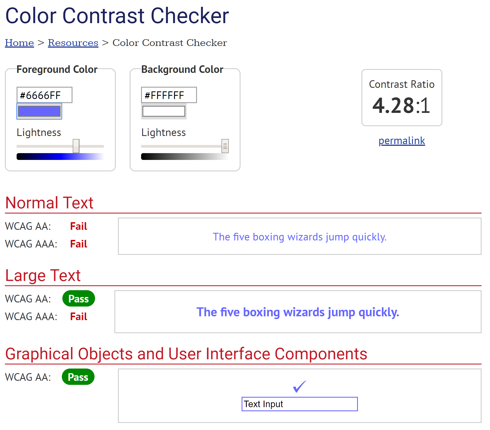
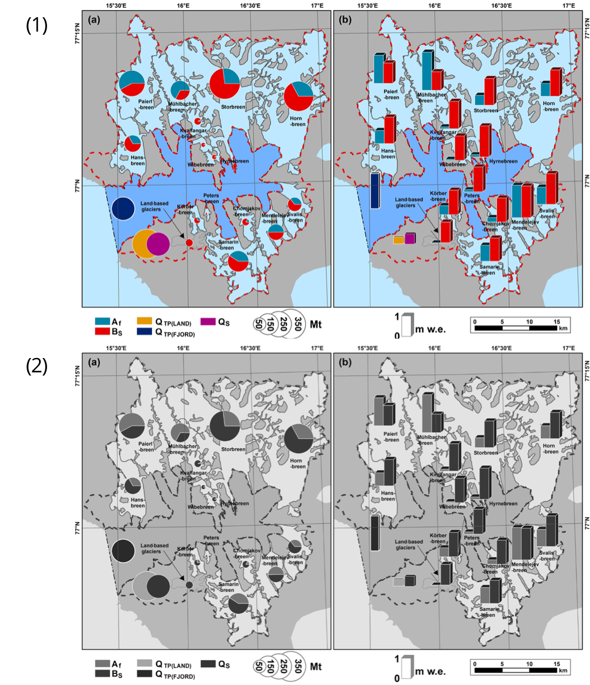
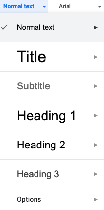

# Princípios gerais para a criação de conteúdo acessível

## Texto alternativo para imagens

Alt text (“texto alternativo”) é uma marcação (tag) legível por máquinas que descreve uma imagem em palavras caso a imagem não possa ser exibida por qualquer motivo, incluindo conexão lenta com a Internet, erro no código HTML ou o uso de tecnologia assistiva.

### Onde incluir texto alternativo

- Nem todas as imagens precisam de texto alternativo. Caso uma imagem seja informativa ou decorativa, será necessário incluir texto alternativo que também forneça contexto para a imagem.
- Exemplos de imagens consideradas informativas:
  - **Imagens que são links ou botões**
    - Imagens clicáveis devem ter um texto alternativo ou fazer parte de uma área interativa que inclua uma descrição ou contexto para a imagem. Deve dar pistas sobre o que acontecerá ao clicar no link;
    - Caso não haja texto explicativo ao redor da imagem, será necessário o texto alternativo.
  - **Imagens que contêm texto importante**
    - Logotipos
      - O texto alternativo para o logotipo de uma empresa ou organização no cabeçalho deve ser o nome da empresa ou organização. Inclua texto alternativo adicional para o destino do link. Por exemplo, o logotipo do UserTesting pode apresentar o texto alternativo “UserTestin - Início”.
      - A descrição de uma imagem também pode ser apresentada abaixo da imagem como uma “legenda”.
- Exemplos de imagens consideradas decorativas:
  - Usada para fins estéticos (melhorias visuais, decorações, enfeites);
  - Não oferece informação relevante;
  - Não tem função além da estética.

### Como escrever texto alternativo para imagens

- O número recomendado de caracteres para texto alternativo é 125 caracteres ou menos para compatibilidade com leitores de tela populares.
- Todo texto alternativo deve terminar com “.” para que o leitor de tela faça uma pausa após a leitura.
- As imagens de capa da edição e do artigo devem apresentar texto alternativo.
- Dicas na imagem sobre as quais escrever no texto alternativo:
  - O posicionamento de objetos na imagem;
  - Tipo de imagem (por exemplo, pintura, gráfico);
  - Cores;
  - Nomes de pessoas na imagem;
  - Roupas, se forem detalhes importantes;
  - Animais;
  - O posicionamento do texto na imagem;
  - Emoções (por exemplo, sorrindo);
  - Arredores.
- Descrições de imagens que podem ser omitidas:
  - Descrição das cores;
  - Detalhes óbvios, como o fato de uma pessoa ter dois olhos, um nariz e uma boca;
  - Detalhes que não são o foco da imagem;
  - Descrições excessivamente poéticas e detalhadas;
  - Emojis.

### Ícones

- Os ícones seguem os mesmos princípios; são informativos ou decorativos?
  - Existe texto diretamente ao lado do ícone?
  - Se houver texto, ele descreve para que serve o ícone?
  - Se o ícone for um link ou um botão, o que acontece quando ele é clicado ou ativado? Onde isso leva o leitor?

### Imagens complexas

- Imagens complexas contêm informações substanciais, por exemplo:
  - Gráficos ou diagramas (por exemplo, fluxogramas, organogramas);
  - Ilustrações ou diagramas;
  - Mapas ou outras imagens geográficas ou topográficas.
- A alternativa recomendada para escrever sobre imagens complexas é escrever uma descrição curta e uma longa:
  - A descrição curta em texto alternativo primeiro identifica a imagem e, em seguida, indica a localização da descrição longa. Por exemplo, `alt="Gráfico trimestral de alterações climáticas. Discussão disponível abaixo."`.
  - A longa descrição na página contém as informações essenciais transmitidas pela imagem.

### Posicionamento de imagem para leitores de tela

O posicionamento de imagem é importante para documentos de texto (por exemplo, Word, PDF) quando lidos por leitores de tela.

Somente imagens com opção de layout "Alinhado com o texto" são reconhecidas pelo software de leitura de tela. Quando exportadas para PDF, imagens com outros estilos de disposição serão ignoradas por um leitor de tela, mesmo quando uma tag de texto alternativo estiver presente.

## Conteúdo de áudio e vídeo

Ao criar conteúdo de áudio e vídeo, é fundamental garantir que seja acessível a usuários com deficiências visuais, auditivas e neurológicas. Certifique-se de que o vídeo não seja reproduzido automaticamente, pois deve-se permitir escolher quando reproduzir o conteúdo. Uma pessoa com deficiência auditiva pode não estar ciente do volume do áudio; espectadores com deficiência física ou cognitiva podem não ser tão rápidos para interromper o vídeo e podem impactar outras pessoas em seu ambiente, além de se sentirem constrangidos com a situação.

### Qualidade de áudio e vídeo

- Certifique-se de que o vídeo não contém flashes/efeitos estroboscópicos não anunciados que podem desencadear convulsões devido à fotossensibilidade;
- Forneça áudio de alta qualidade no primeiro plano que seja claramente distinguível de qualquer ruído de fundo para ajudar pessoas com deficiência auditiva.

### Oferecendo alternativas para áudio e vídeo

- **Legendas** . As legendas são alternativas de texto à fala apresentada em multimídia. São benéficos para quem não consegue ouvir o áudio, quem pode não ser fluente no idioma ou quem prefere receber informações por texto em vez de som.

    Podem ser geradas legendas automatizadas que precisarão ser revisadas e corrigidas por um leitor humano, usando ferramentas como:

    - [Legenda automática do YouTube para vídeo](https://www.youtube.com/)
    - [Kapwing Caption Video Online](https://www.kapwing.com/tools/caption-video)
    - [Legendas automáticas Watson da IBM para áudio](https://speech-to-text-demo.ng.bluemix.net/) (demonstração)

- **Transcrições**. A transcrição contém o texto completo das falas (não necessariamente literal) que pode ser acessado e lido separadamente da própria multimídia. Transcrições permitem que pessoas surdas/cegas obtenham conteúdo por meio do uso de dispositivos Braille atualizáveis. Eles também são úteis para pesquisa e navegação para uma seção específica do texto.

    Ao planejar uma gravação de áudio/vídeo, é importante escrever a transcrição com antecedência. Ela pode então ser usada tanto para a criação da multimídia quanto para disponibilização posterior.

- **Descrições de áudio**. As descrições de áudio têm o objetivo de fornecer informações adicionais sobre o conteúdo visível na tela para usuários com deficiência visual. Elas normalmente assumem a forma de um narrador que descreve o conteúdo apenas visual na multimídia e podem ser apresentados com o vídeo principal ou em outra faixa de áudio.

    Ao produzir um vídeo, a necessidade de descrições de áudio pode muitas vezes ser evitada descrevendo ou apresentando o conteúdo visual por meio de áudio falado. Por exemplo, em vez de dizer “clique aqui e depois aqui”, pode-se dizer “clique em Arquivo e depois em Salvar”, transmitindo conteúdo visual por meio de áudio.

- **Interpretação de linguagem de sinais**. Embora as legendas ou transcrições forneçam uma alternativa adequada para usuários com deficiências auditivas que se sentem confortáveis com a leitura da linguagem escrita, elas podem não ser suficientes para usuários surdos que dependem da linguagem de sinais como sua principal (ou única) língua de comunicação. Neste caso, uma alternativa pode ser fornecida por meio da interpretação em linguagem de sinais ou outras ferramentas descritas na seção [Acessibilidade para usuários de linguagem de sinais](#acessibilidade-para-usuários-de-língua-de-sinais).

## Hiperlinks acessíveis

Aqueles que navegam usando um leitor de tela devem ser capazes de compreender sem ambiguidade a finalidade do link e pular os links nos quais não estão interessados. Para conseguir isso, o texto do link precisa ser:

- **Descritivo.** Ao escrever um endereço eletrônico, certifique-se de que pode ser compreendido sem contexto adicional. Por exemplo:

    - Não use: "[Clique aqui](https://pkp.sfu.ca/ojs/) para ler sobre o OJS".
    - Use: “Mais informações estão disponíveis [na página do Open Journal Systems (OJS)](https://pkp.sfu.ca/ojs/)”.

- **Conciso**. Use palavras-chave como texto vinculado em vez de frases mais longas. Para texto que deve ser impresso, crie um hiperlink para o texto e adicione o endereço completo. Por exemplo:

    - Para exibição on-line: “Mais informações disponíveis [na página do Open Journal Systems (OJS)](https://pkp.sfu.ca/ojs/)”.
    - Para exibição impressa ou online + impressa: “Mais informações estão disponíveis [na página do Open Journal Systems (OJS)](https://pkp.sfu.ca/ojs/) em [https://pkp.sfu.ca/ojs/](https://pkp.sfu.ca/ojs/)”.

- **Único**. Evite hiperlinks com nomes semelhantes se eles direcionarem para lugares diferentes.

- **Visualmente distinto**. Use o estilo sublinhado em azul padrão para hiperlinks. Se você alterar, certifique-se de que os links ainda estejam com alto contraste e sublinhados. Não use sublinhado para texto sem hiperlink.

## Contraste e dependência de cores

O uso de contraste e cor são vitais para a acessibilidade. Ter contraste insuficiente pode afetar usuários com deficiência visual. Ter conteúdo que depende de cores para transmitir significado pode afetar usuários com deficiências de visão de cores (DVC) e aqueles que dependem de leitores de tela.

### Taxa de contraste

A cor do texto contra o fundo pode parecer suficientemente distinta para um leitor com boa visão, mas pode apresentar problemas para um leitor com deficiência visual. Para ajudar na avaliação, as [diretrizes WCAG 2.1](https://www.w3.org/TR/WCAG21/#contrast-minimum) quantificam a taxa de contraste acessível em pelo menos 4,5:1 para texto normal e 3:1 para texto grande, para nível AA.

Use o [Verificador de Contraste da WebAim](https://webaim.org/resources/contrastchecker/), [Verificador de Taxa de Contraste](https://contrast-ratio.com/), ou o [Analisador de Contraste de Cores](https://developer.paciellogroup.com/resources/contrastanalyser/) para verificar a taxa de contraste entre as cores de fundo e do texto em suas páginas. Apresentamos a seguir um exemplo usando o [Verificador de Contraste da WebAim](https://webaim.org/resources/contrastchecker/):



*Exemplo de opções de interface do Verificador de contraste de cores do WebAim*

Neste exemplo, o texto normal de cor roxa #666FF não é suficientemente distinto contra o fundo branco #FFFFFF e falha no padrão de Nível AA, mas o texto grande da mesma cor é aprovado. Para corrigir o problema, você pode escurecer a cor do texto ou aumentar o tamanho da fonte.

Da mesma forma, o [Verificador de Contraste de Link](https://webaim.org/resources/linkcontrastchecker/) da WebAIM pode ser usado para avaliar a visibilidade de seus links.

### Uso de cor

Frequentemente, usamos cores em conteúdo da Web ou em conteúdo publicado para transmitir significado. O uso de gráficos coloridos ou ilustração é um exemplo. Ao fazer a escolha de usar cores, considere se um leitor com deficiência de visão de cores (DVC) ou usando um leitor de tela ainda seria capaz de entender o significado transmitido. É essencial que a cor não seja o único meio de transmitir as informações - considere adicionar outros contextos textuais (por exemplo, números ou % em um gráfico).

**Não faça isso:**


**Faça isso:**


Outras ferramentas, como a [extensão Spectrum do Chrome](https://chrome.google.com/webstore/detail/spectrum/ofclemegkcmilinpcimpjkfhjfgmhieb?hl=en), permitem emular diferentes tipos de DVC em qualquer site. Isso é particularmente útil se seus artigos contiverem visualizações de dados. As duas figuras a seguir, obtidas de um artigo publicado na revista Polar Research, ilustram como o DVC pode afetar a compreensão de um diagrama ou gráfico pelo leitor.


*Nesta figura, o original (1) ainda está acessível e legível para usuários com deuteranopia, uma cegueira verde, conforme mostrado em (2).*



*Nesta figura, a legenda da cor do original (1) não é tão clara para leitores com acromatopsia, daltonismo total, como mostrado em (2). Algumas das categorias de dados são muito semelhantes entre si.*

Certas ferramentas baseadas na web, como o [ColorBrewer](https://colorbrewer2.org/), fornecem paletas de cores acessíveis para visualização de dados, adaptadas a diferentes tipos de conjuntos de dados (sequencial, divergente, qualitativo). Em caso de dúvida, recorra a diferentes formas ou padrões para indicar delimitações em grandes grupos de pontos de dados.

## Facilidade de leitura e legibilidade da escrita

Compreensivelmente, a redação e a formatação do texto para um periódico provavelmente seguirão as convenções de uma comunidade acadêmica específica. Mas existem princípios gerais que podem ser seguidos para torná-lo mais fácil de ler e compreender.

Parágrafos mais curtos facilitarão a leitura do texto em telas pequenas e ajudarão pessoas com deficiências cognitivas, neurológicas e/ou de aprendizagem. Da mesma forma, expandir acrônimos e abreviações no primeiro uso e manter uma lista de acrônimos como apêndice para referência é uma prática comum e útil.

[O guia de escrita clara e simples do WebAim](https://webaim.org/techniques/writing/) contém outras dicas úteis para que os autores alcancem clareza e simplicidade. Além disso, ferramentas como o [aplicativo Hemingway](http://www.hemingwayapp.com/) podem ajudar a avaliar a complexidade do texto e sugerir maneiras de melhorar sua legibilidade geral.

## Estrutura de cabeçalhos de seções

Os cabeçalhos de seções, ou títulos de seções, ajudam os leitores a entender como o conteúdo de uma página é organizado. Além disso, fornecem navegação dentro da página que é usada por navegadores da Web, plug-ins e tecnologias assistivas. Ao criar conteúdo para a Web, o uso da hierarquia de títulos em ordem de classificação ajudará os leitores a navegar no documento com mais facilidade.

Os títulos de seções podem fornecer uma ideia mais clara sobre o conteúdo, uma vez que mostram sua estrutura básica. Por esse motivo, em vez de escrever um título de seção principal longo, é aconselhável usar subtítulos.

É possível criar seções de conteúdo usando subtítulos, e estes podem conectar parágrafos relacionados.


*Exemplo de formação de títulos deseção para artigos do JMIR em [Base de Conhecimento e Central de Ajuda das Publicações JMIR](https://support.jmir.org/hc/en-us/articles/360017464552-How-should-headings-be-formatted-).*

### Documentos HTML

Em documentos HTML acessíveis, os cabeçalhos são estruturados usando as seguintes tags: `<h1>`, `<h2>`, `<h3>`, `<h4>`, `<h5>` e `<h6>`. Eles são aninhados de acordo com sua hierarquia ou nível. O nível de classificação é definido pelo número de tags de título. Consequentemente, `<h1>` é o nível mais alto em importância e `<h6>` é o subtítulo mais baixo na classificação da estrutura de títulos.

Evite pular títulos na estrutura de um documento para evitar confusão, mesmo se preferir a apresentação visual. Um `<h2>` deve ser seguido por um `<h3>` como o próximo subtítulo na mesma seção. No entanto, é bom que um `<h4>` seja seguido diretamente por um `<h2>` ao abrir uma nova seção, desde que `<h4>` feche a anterior.

Deve-se usar **apenas um título** `<h1>` por documento, pois é o título do documento ou título do artigo.

#### Exemplos

O exemplo a seguir mostra a estrutura de um artigo com cabçalhos de seção onde o *Título do artigo* é o nível mais alto e a informação mais importante na estrutura.

> (h1) *Título do artigo*  
(h2) Resumo  
(h2) Introdução  
(h3) Fundamentação teórica  
(h2) Métodos  
(h2) Conclusão  

O exemplo a seguir demonstra como aninhar seções, com o nível mais baixo fechando a seção anterior. Neste exemplo, o "(h4) Plano de fundo por região" fecha a seção "(h2) Introdução" e está de acordo em termos de acessibilidade.

> (h1) Título do artigo  
(h2) Resumo  
(h2) Introdução  
(h3) Fundamentação teórica  
(h4) **Histórico por região**  
(h2) Métodos  
(h2) Conclusão  

### Documentos de texto

Existem muitos editores de texto disponíveis para criar documentos, incluindo Microsoft Word, Apple Pages, LibreOffice e editores online como o Google Docs. Use qualquer editor de sua preferência para criar documentos com estruturas de títulos acessíveis.

Outros editores normalmente seguem o mesmo conceito de classificação e aninhamento de títulos. Normalmente, é possível selecionar uma parte do texto e formatá-la como um título.

A imagem a seguir mostra as opções de título para o Google Docs:



A hierarquia de títulos para documentos em editores de texto deve seguir o mesmo conceito de nível de classificação para documentos HTML:

- Todo documento deve ter um *Título 1*
- Não pule níveis de título, por exemplo: um *Título 2* deve ser seguido por um *Título 3 e, em* seguida, *Título 4*, exceto ao iniciar uma nova seção
- Os títulos devem ser exclusivos para evitar qualquer confusão ao navegar, deslizar ou ler todo o documento

## Listas

De acordo com o conteúdo apresentado e como o criador do conteúdo deseja organizá-lo, existem três tipos de listas para conteúdo da Web. O tipo de lista usada depende do tipo de informação que está sendo organizada e sua finalidade.

- lista não ordenada
- lista ordenada
- lista descritiva

As tecnologias assistivas informam aos leitores que tipo de lista será lida antes de prosseguir para cada item. Também descreve quantos itens estão em uma lista, o item atual e quantos itens da lista ainda restam.

### Lista não ordenada

Em uma lista não ordenada, a ordem dos elementos não é importante e é usada para mostrar um grupo ou um conjunto de elementos. Essa lista geralmente mostra um marcador para cada elemento.

Esta lista é codificada usando `<ul>` para o elemento principal e `<li>` para cada item. Exemplo:

**Código**

```html
<ul>
	<li>Pesquisadores</li>
	<li>Estudantes</li>
	<li>Editores</li>
	<li>Autores</li>
</ul>
```

**Renderizado**

> - Pesquisadores
> - Estudantes
> - Editores
> - Autores

### Lista ordenada

O objetivo principal é mostrar uma hierarquia ou informação sequencial. Ele também pode mostrar etapas de instrução a seguir ou procedimentos. Ele pode mostrar um número ou uma letra para cada elemento listado.

Esta lista é codificada usando `<ol>` para o elemento principal e `<li>` para cada item. Exemplo:

**Código**

```html
<ol>
	<li>Aceitar submissão</li>
	<li>Designar avaliadores</li>
	<li>Enviar para avaliação</li>
	<li>Definir data de conclusão da atividade</li>
</ol>
```

**Renderizado**

> 1. Aceitar submissão
> 2. Designar avaliadores
> 3. Enviar para avaliação
> 4. Defina uma data de conclusão da tarefa

### Lista descritiva (lista de definições)

Uma lista descritiva consiste em agrupar termos e suas descrições. É possível associar um ou mais termos a uma ou mais descrições dos termos.
A marcação para listas de descrição inclui a marca `<dl>` para o início da lista, a marca `<dt>` para o(s) termo(s) e a marca `<dd>` para a(s) descrição(ões).
Um termo pode ser agrupado em mais de uma descrição. Da mesma forma, um ou mais termos podem ser agrupados com uma descrição. Muitos termos para muitas descrições também são aceitáveis.

Leitores de tela anunciarão o número de termos, bem como as descrições.
A seguir apresentamos alguns exemplos de listas descritivas:

**Um termo, várias descrições**:

```html
<dl>
	<dt>Autores</dt>
    	<dd>John</dd>
    	<dd>Kevin</dd>
    	<dd>Juan</dd>
	<dt>Editor</dt>
		<dd>James</dd>
</dl>
```

**Renderizado**

> <dl>
> 	<dt>Autores</dt>
>   	<dd>John</dd>
>   	<dd>Kevin</dd>
>   	<dd>Juan</dd>
>   <dt>Editor</dt>
>   	<dd>James</dd>
> </dl>

**Vários termos, uma descrição**:

```html
<dl>
	<dt>OJS</dt>
	<dt>OMP</dt>
		<dd>Plataformas de software para publicações desenvolvidas pelo PKP.</dd>
</dl>
```

**Renderizado**

> <dl>
>   <dt>OJS</dt>
>   <dt>OMP</dt>
>     <dd>Plataformas de software para publicações desenvolvidas pelo PKP.</dd>
> </dl>

**Vários termos, várias descrições**:

```html
<dl>
    <dt>Autores</dt>
    <dt>Editores</dt>
        <dd>James</dd>
        <dd>Michael</dd>
</dl>
```

**Renderizado**

> <dl>
> <dt>Autores</dt>
> <dt>Editores</dt>
>     <dd>James</dd>
>     <dd>Michael</dd>
> </dl>

## Colunas

Embora os leitores de tela mais atualizados sejam normalmente compatíveis com o layout de várias colunas, alguns leitores de tela mais antigos podem ler a página da esquerda para a direita, linha por linha, tornando o texto fora de ordem.

As tabelas são frequentemente usadas para criar formatação em coluna, mas esse é um uso comum incorreto. As tabelas (conforme detalhado mais adiante) devem ser usadas exclusivamente para dados ou conteúdo tabular. Espera-se que os leitores de tela anunciem isso como uma “Tabela” e interpretem a primeira linha de uma Tabela como o Cabeçalho da Tabela, causando provável confusão.

Caso determine que colunas são a melhor maneira de apresentar seu conteúdo na Web, a maneira recomendada é usar [CSS para formatar várias colunas](https://www.w3schools.com/css/css3_multiple_columns.asp). No entanto, é importante garantir que o texto seja ordenado de forma coerente, mesmo quando o CSS estiver desativado.

Para documentos de texto (por exemplo, Word, PDF), é importante criar colunas usando a ferramenta de formatação Colunas em vez de usar a tecla TAB ou a barra de espaço para criar espaços em branco entre as linhas de texto.

## Tabelas

Tabelas devem ser usadas exclusivamente para apresentar dados ou conteúdo tabulares. Tabelas podem ajudar a organizar o conteúdo com uma relação lógica em grade, facilitando a leitura e o entendimento. Para obter mais informações sobre acessibilidade em tabelas, consulte a [página de Conceitos de Tabela da W3C/WAI](https://www.w3.org/WAI/tutorials/tables/).

É possível usar tabelas para posicionar elementos visualmente em um documento ou página, embora não seja aconselhável. Isso pode causar confusão para tecnologias assistivas que anunciariam o elemento como uma “tabela” onde ele pode de fato conter conteúdo diferente. Pode dar uma sensação de falta de dados no elemento agrupador.

### Estrutura de tabelas

Diferentes tipos de dados ou conteúdo podem ser apresentados em diferentes estruturas de tabelas. O conjunto completo da estrutura deste elemento envolve:

- **Legenda/Resumo**: ou título da tabela, pode ser uma descrição curta ou longa dos dados da tabela, ou seja: "Como escolho gastar meu dinheiro". Serve para descrever o conteúdo que será lido e encontrado na tabela.
- **Cabeçalho da tabela**: geralmente a primeira linha de uma tabela. Fornece um rótulo para a coluna e o tipo de informação esperado na coluna respectiva. No entanto, para tabelas longas, também é possível usar a primeira coluna inteira como cabeçalho da tabela. Por exemplo, tabelas contendo países e indicadores sociais geralmente têm a primeira linha e a primeira coluna como cabeçalhos.
- **Corpo da tabela**: envolve o conteúdo principal ou dados de uma tabela. É apresentado abaixo do cabeçalho da tabela e acima do rodapé da tabela.
- **Rodapé da tabela**: este elemento serve para resumir as colunas de uma tabela. É útil para valores de tabelas ou dados numéricos. Não é obrigatório para tabelas com valores que não exijam resumo, por exemplo: tabela com nomes, idades, nacionalidade etc... Ou seja, mesmo que idade seja um valor numérico, não deve ser resumida na parte inferior de uma tabela.

A seguir apresentamos um exemplo de uma tabela com seus elementos conforme descrito anteriormente: *Legenda/Resumo* , *Cabeçalho* , *Corpo* e *Rodapé*.

<table>
  <caption>Como escolho gastar meu dinheiro</caption>
  <thead>
    <tr>
      <th>Compra</th>
      <th>Localização</th>
      <th>Data</th>
      <th>Avaliação</th>
      <th>Custo (€)</th>
    </tr>
  </thead>
  <tbody>
    <tr>
      <td>Corte de cabelo</td>
      <td>Cabeleireiro</td>
      <td>12/09</td>
      <td>Grande ideia</td>
      <td>30</td>
    </tr>
    <tr>
      <td>Lasanha</td>
      <td>Restaurante</td>
      <td>12/09</td>
      <td>Arrependimento</td>
      <td>18</td>
    </tr>
    <tr>
      <td>Sapatos</td>
      <td>Loja de sapatos</td>
      <td>13/09</td>
      <td>Grande arrependimento</td>
      <td>65</td>
    </tr>
    <tr>
      <td>Creme dental</td>
      <td>Mercado</td>
      <td>13/09</td>
      <td>Bom</td>
      <td>5</td>
    </tr>
  </tbody>
  <tfoot>
    <tr>
      <td colspan="4">TOTAL</td>
      <td>118</td>
    </tr>
  </tfoot>
</table>

*Exemplo de tabela com: Legenda/Resumo, Cabeçalho, Corpo e Rodapé (resumindo) - Fonte: [https://developer.mozilla.org/en-US/docs/Learn/HTML/Tables/Advanced](https://developer.mozilla.org/en-US/docs/Learn/HTML/Tables/Advanced)*

Para documentos HTML as tags a seguir são usadas para definir a estrutura principal de uma tabela: `<table>`, `<thead>`, `<tbody>` e `<tfoot>`. Os últimos 3 elementos são sempre envoltos por uma tag `<table>`. Informações técnica mais detalhadas sobre como produzir tableas HTML para pessoas com deficiência visual estão disponíveis nos [Documentos Web da Mozilla](https://developer.mozilla.org/en-US/docs/Learn/HTML/Tables/Advanced#Tables_for_visually_impaired_users).

Para [criar tabelas acessíveis no Microsoft Word](https://kb.iu.edu/d/aqjl):

- Certifique-se que "Linha de Cabeçalho" e "Primeira Coluna" estão marcadas (caixa de seleção marcada);
- Repita colunas de títulos onde uma tabela se estende por várias páginas;
- Inclua texto alternativo nas propriedades da tabela;
- Escolha a formatação da tabela que atenda aos [requisitos de contraste WCAG](#contraste-e-dependência-de-cores).

## Metadados do documento

Incluir metadados ao documento aumenta sua capacidade de ser pesquisável. Também permite que aplicativos de software e tecnologias adaptativas forneçam aos usuários as principais informações sobre o documento, para que possam localizar facilmente o documento desejado e determinar se é o que precisam.

### Nome do arquivo

- Os leitores de tela leem o nome do arquivo ao navegar para um documento a partir de outro documento. Tornar o nome do arquivo identificável e significativo ajudará quem usa leitores de tela e qualquer pessoa que salve o arquivo localmente para referência futura;
- Evite caracteres especiais em nomes de arquivos;
- Palavras separadas por hífens "-" e por letras maiúsculas (por exemplo, dogShow) podem ser lidas como palavras individuais dependendo do leitor de tela;
- Arquivos para publicação devem seguir um padrão de nomenclatura comum que seja consistente em todas as publicações.

### Título, autor e mais

Para adicionar ou modificar o título, autor ou assunto de um documento do MS Office, navegue até:

- Windows: Arquivo > Informações > Propriedades
- Mac: Arquivo > Propriedades > Resumo

A inclusão das seguintes informações no MS Word deve ser transferida para o PDF na conversão:

- “Título”, que corresponde a “Título do Documento” no arquivo PDF
- “Assunto”, que corresponde a “Descrição” no arquivo PDF
- “Autor”, que corresponde a “Autor” no arquivo PDF
- “Tags”, que corresponde a “Palavras-chave” no arquivo PDF

*Nota sobre o uso de letras maiúsculas nos títulos*

Se sua disciplina frequentemente exibe títulos de artigos em maiúsculas, evite inserir os títulos em maiúsculas manualmente, pois os leitores de tela podem ler isto como um acrônimo em vez de um título. Em vez disso, o título e o subtítulo devem ser inseridos com caracteres maiúsculos e minúsculos, por exemplo, “O problema do bonde das mudanças climáticas”, e então colocados em maiúsculas na folha de estilo de sua publicação. Isso também garantirá que o título seja disponibilizado em sua forma original para indexadores downstream como Crossref e Google Acadêmico.

### Língua

Um leitor de tela que oferece suporte a vários idiomas dependerá da tag de idioma das páginas da web para saber em qual idioma lê-lo. Caso use o OJS com vários idiomas, certifique-se de usar a localidade de idioma adequada para esse idioma (por exemplo, localidade francesa para o idioma francês), pois a localidade determina a tag de idioma da página.

Além disso, caso publique as composições em PDF, poderá definir a tag de idioma do documento da seguinte maneira:

1. Abra a caixa de diálogo Propriedades do documento: Escolha Arquivo > Propriedades
2. Selecione um idioma no menu Idioma na área Opções de leitura da guia Avançado.

Caso publique composições em HTML ou XML, é uma prática recomendada definir o lang, atributo de idioma global, como o elemento raiz de cada documento. Isso declara o idioma de toda a composição e ajuda as tecnologias assistivas a determinar como pronunciar as palavras. Também ajuda os mecanismos de pesquisa e navegadores da Web.

Você também pode adicionar o atributo de idioma a elementos específicos, quando o idioma muda no meio do documento. Por exemplo, um documento em inglês pode citar um parágrafo em francês.

Em HTML:

`<p lang="fr">Ceci est un paragraphe.</p>`

Em XML:

```html
<section id="test" xml:lang="fr">
	<title>En Français</title>
	<p>Ceci est un paragraphe.</p>
</section>
```

## Acessibilidade para usuários de língua de sinais

Para algumas pessoas com deficiência auditiva, a linguagem de sinais pode ser a língua principal, e elas podem não ler a linguagem escrita fluentemente ou nem mesmo ler. Aqui estão algumas das estratégias para tornar seu conteúdo acessível para eles:

- Apresente as informações por meio de vídeo acompanhado de interpretação em língua de sinais - ver por exemplo a [Revista Brasileira de Vídeo-Registros em Libras](https://revistabrasileiravrlibras.paginas.ufsc.br/);
- Inclua a interpretação automatizada de linguagem de sinais por um avatar virtual de linguagem de sinais ao site - ver por exemplo [VLibras](https://www.vlibras.gov.br/) para a Linguagem de Sinais portuguesa Libras;
- Use texto mais simples complementado por imagens, gráficos e outras ilustrações.

Use a escrita de sinais, quando disponível, para a língua de sinais de seu país. Para obter mais recursos, consulte o [site SignWriting da Sutton](https://www.signwriting.org/).
