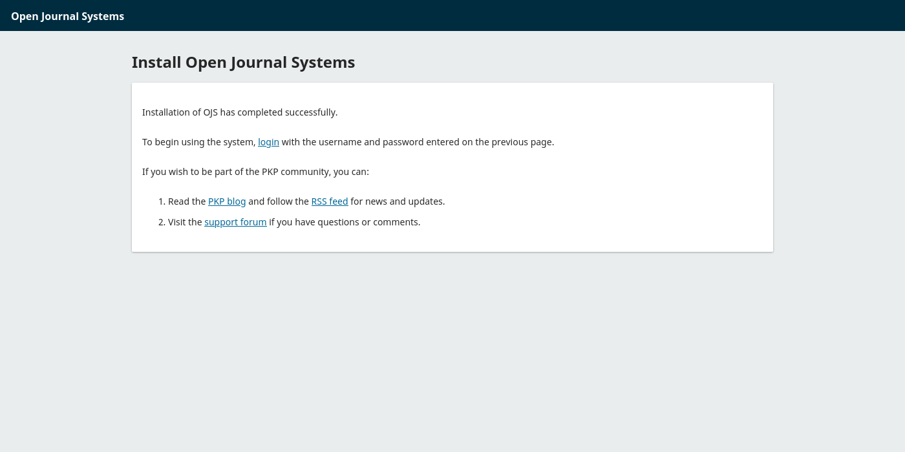
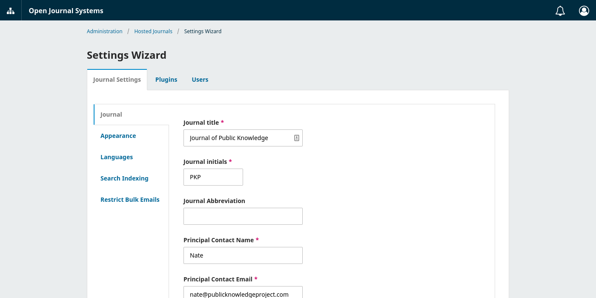

# Getting Started

This is a quick-start guide to install and run OJS, OMP or OPS in a local test environment. Use this guide to try out the software on your own or to install it to a private, test environment. Before hosting the installation on a public server, you should read the [Deployment](./deploy) guide to learn how to safely configure the application.

## System Requirements

Your server — or your local development environment — must meet the following requirements in order to run the 3.5 release of OJS, OMP or OPS.

- [PHP 8.2+](http://www.php.net/) with php-mbstring, php-xml, and php-intl enabled
- [MySQL 5.7.22+](http://www.mysql.com/), [MariaDB 4.1+](https://mariadb.org/) or [PostgreSQL 9.5+](http://www.postgresql.org/)
- Linux, or one of the following: BSD, Solaris, Mac OS X, Windows

> **Older Versions**: Check the README.md file located in the download package of the version you want to install.

## Download

Download the latest stable release package (`.tar.gz`) from the PKP website.

- [Open Journal Systems](https://pkp.sfu.ca/software/ojs/download) (OJS)
- [Open Monograph Press](https://pkp.sfu.ca/software/omp/download) (OMP)
- [Open Preprint Systems](https://pkp.sfu.ca/software/ops/download) (OPS)

Use the `tar` command, or any archive software on your system, to unpack the `.tar.gz` file to a local directory. For example, if you downloaded the OJS 3.5.0 release package, you can use the following command to unpack the file.

```
tar -xvf ojs-3.5.0.tar.gz
```

This will create a directory for the software at `ojs-3.5.0`. Create another directory for file uploads.

```
mkdir ojs-files
```

> ⚠️  This creates the file uploads directory in which submission files are stored. When deploying the software to a public web server, make sure this directory is **not web-accessible** e.g. by placing it outside the web root. See the [Deployment](./deploy) guide for information on installing the application safely on a public web server.
{:.warning}

Start PHP's built-in server from the release package's root directory.

```
cd ojs-3.5.0
php -S localhost:8000
```

## Install

Open your browser and navigate to the installation page at the following URL.

```
http://localhost:8000
```

You should see an installation screen like the one below.


Complete the form to finish the installation, using the file uploads directory that you created. It may take a minute to install. You should see the following success screen when it is finished.



Once you have finished the installation, login with the administrator account you set up to access the admin area. Depending on whether you installed OJS, OMP or OPS, you will be taken to a screen where you can create your first journal, press or preprint server.

- In OJS, click the **Add Journal** button.
- In OMP, click the **Add Press** button.
- In OPS, click the **Add Server** button.

Once you have created your first journal, press, or preprint server, you will be taken to it's Settings Wizard.



Click the **Users** tab to create a new user for the Journal Manager, Press Manager, or Server Manager who will be responsible for managing the journal, press or preprint server.

And you're done! You've successfully installed the software and created a manager user account. Login as the manager to explore the software as it will appear to the managing user of the journal, press or preprint server. This is usually a managing editor, an editor-in-chief, or a publishing assistant responsible for the day-to-day running of the journal. Or you can stay logged in as the administrator to see all of the features available to you as an admin.

To explore the software further, click the small icon at the top to switch to your new journal, press or preprint server.


---

Congratulations! The software is now installed and you can begin testing it out. In a real environment, you will need to ensure your install is configured correctly and secured properly. Learn how to [deploy the software](./deploy).
