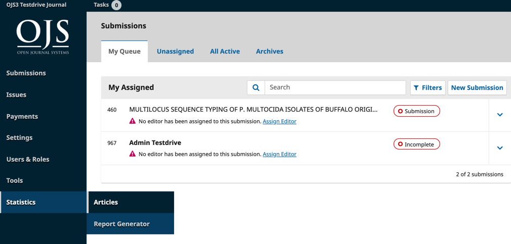
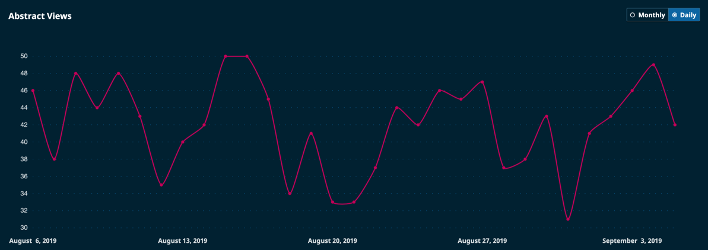
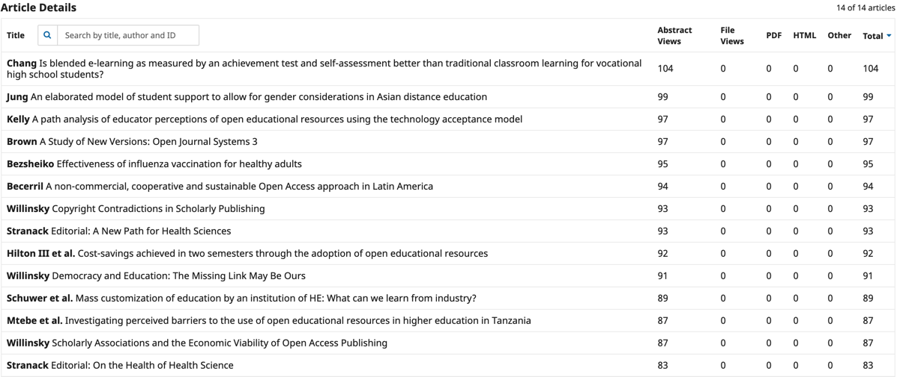
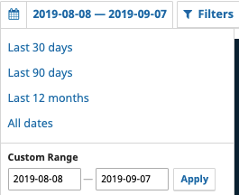
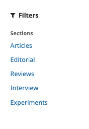
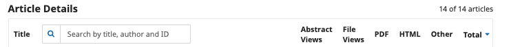
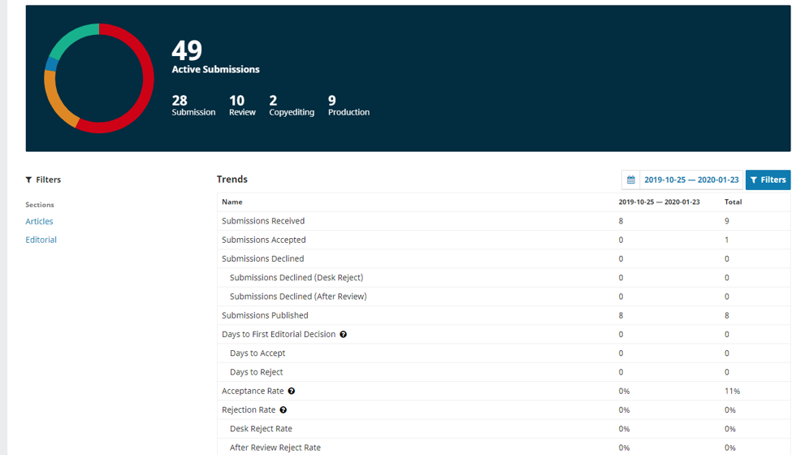
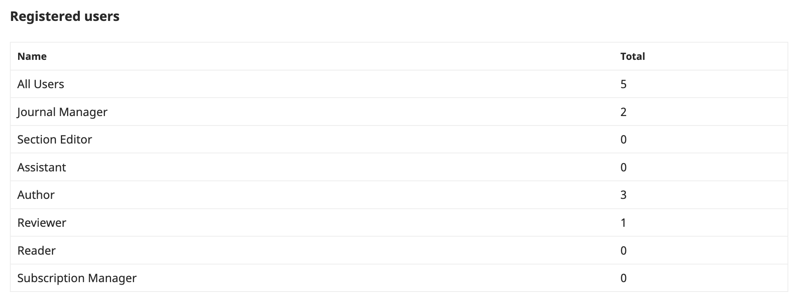

# Statistics

This chapter of the Administrator's Guide provides a general overview of statistics in Open Journal Systems \(OJS\) and by extension in Open Monograph Press \(OMP\). It contains general usage guidelines for common scenarios suitable for editors and journal managers to use. It also contains a fair bit of technical detail suitable for systems administrators. Where possible we have tried to distinguish between both areas of expertise.

The types of statistics available in OJS 3.2 and later are Articles, Editorial Activity, and Users. There is also a Report Generator section for producing various reports from some of the available data.

The development of this chapter has been funded by the Government of Canada via a grant from Canadian Heritage and by the Canadian Association of Learned Journals / Association canadienne des revues savantes. Public Knowledge Project provided additional in-kind assistance toward the development of this project.


## Definitions

To best use this document, it is necessary to understand the following definitions as they relate to Open Journal Systems \(OJS\).

* **Abstract page:** the landing page for an article, containing the title, author information, abstract, DOI, and links to any article full-text galleys.  Also known as the “article page” or “landing page.” This page is normally used as the point of record for the article for DOIs or other hyperlinks: Crossref DOIs resolve to article abstract pages, as opposed to galley files, for example, as would most other indexing services.
* **Article view:** within the statistics framework, any reference to an “article view” means a single unique view of the article abstract page by a visitor. This is not an aggregate count of all article and galley views - it refers to abstract views only.
* **Galley view:** within the statistics framework, any reference to a “galley view” means a single unique view or download of the a specific galley file by a visitor. Also known as a “galley download.” This is not an aggregate count of all galley views - if there are multiple galleys for an article \(e.g., an HTML file, a PDF file, etc.\), each will have its own unique galley view count. OJS does not distinguish between galley downloads and views in the metrics table; downloads are counted as galley views.
* **Multi-clicks:** the process \(accidental or nefarious\) of increasing usage counts by clicking on an abstract page or galley file multiple times in quick succession. OJS identifies and removes these attempts from its usage metrics, as per the Project COUNTER Code of Practice.
* **Project COUNTER Code of Practice:** a set of practices developed by COUNTER to establish a means to report on usage metrics for electronic resources in a consistent way. The Code provides rules on what should be counted as a view, including specific rules for robot usage and multi-click abuse. OJS filters metrics through these rules. It should also be noted that PKP is part of the COUNTER Bots and Crawlers Working Group.
* **Robots, crawlers, bots:** nonhuman site visitors who may still view and download article data. These are usually identified as such to the server, and OJS does not count them in its usage metrics, as per the Project COUNTER Code of Practice.

## Introduction to the Statistics Framework

“What counts as a view” can seem like a straightforward enough question when considering article use metrics, but there are any number of ways to provide - or complicate - the answer. Answering this question depends on which counting mechanism is being used \(e.g., Google Analytics vs. log file hits vs. filtered metrics\), whether attempting to review historical data spans different methodologies, and whether these methodologies have been configured correctly or not.

This handbook mainly serves to explain, in some detail, how to configure, use, and troubleshoot PKP’s Usage Statistics Framework. It also contains some information on other statistics-gathering methods that are supported by OJS.

### OJS and Stats: Some History

OJS has recorded article usage since the beginning of the launch of OJS 2. The methodology used to count metrics has undergone one significant change between then and now. That change is key to understanding how to review and manage historical statistical data.

#### Metrics the Old Way: OJS 2.0 -&gt; 2.4.3:

Versions of OJS prior to OJS 2.4.3 count views in a very rudimentary manner: they record page views and file downloads for article landing pages and galley files only and do not filter out bot views/downloads, multiple clicks, and so on. These views are recorded in a simple database table and represented in OJS 2.4.2 and below via a “View” report. Metrics are only available for abstract/landing pages and galley downloads and only track one facet: whether the item was viewed or downloaded. These counts are considered accurate though possibly misrepresentative of actual readership, as bot views, crawler indexing, and potential author or visitor abuse \(eg. multi-clicking\) are not filtered out.

#### Metrics the New Way: OJS 2.4.3+ and 3.0+

As of version 2.4.3, Open Journal Systems uses a new structure for collecting statistics and generating reports. These metrics count abstract and galley views, date viewed, and regional information like country and city \(if properly configured\). Beyond article metrics, issue and homepage views are also included. Finally, these metrics are filtered according to COUNTER Project processing rules so that multi-clicks and bot views are filtered by default.

#### Understanding what you have: Key Takeaways

The following describes the data to which users of various iterations of OJS have access. The OJS version can be determined by a journal staff member by visiting About &gt; About this Publication System \(OJS 2\).

- OJS 2.4.2 or older:
    - Metrics are based on the old metrics method. Only simple article view counts are recorded for each abstract or galley view. These are not filtered by any of the COUNTER Project filter rules.
    - These are available from a View Report under Journal Management &gt; Stats and Reports.
    - You may also have access to a rudimentary Timed Views Report. This report, if available in a pre- OJS 2.4.2 or older install, should be considered buggy and unpredictable. It should not be used.
    - Upgrading is advised so that better metrics can be gathered going forward. \(Note that upgrading will not provide you with better metrics from before the upgrade date, at least by default. See the FAQ section for more information on reprocessing old metrics.\)
- OJS 2.4.3 or newer:
    - Metrics are based on the new metrics method described above.
    - If this OJS instance has been at some point upgraded from pre-OJS 2.4.3, you will also have access to a legacy View Report \(for data collected when you were using earlier versions\).
    - All reports are available from Journal Management &gt; Stats and Reports.
    - NOTES FOR UPGRADED JOURNALS:
        - The legacy View Report is for archival purposes only. It provides a record of usage prior to the adoption of 2.4.3. It does not record new views after the adoption of OJS 2.4.3.
        - The new reports \(the Timed Views report, the Custom Report Generator, etc.\) that use the new metrics method will only include metrics from the date of upgrade onwards.
        - In order to achieve a complete understanding of the view counts for your content, you will have to consider both legacy and new reports.
    - IMPORTANT BUG NOTES:
        - There was a bug in OJS 2.4.5 that resulted in some metrics counts being doubled. See the FAQ and Frequently Encountered Problems sections for more information.
        - There was a bug in OJS 2.4.8.0 that resulted in some file views not being properly recorded. See the FAQ and Frequently Encountered Problems sections for more information.
        - If your OJS instance is currently on either version, we strongly recommend upgrading \(and, optionally, reprocessing your statistics - see Appendix B: Processing Log Files\).
- 3.0 or newer:
    - You will have metrics based on the new metrics method defined above.
    - All metrics will be available from the User Dashboard, via Tools &gt; Statistics.
    - NOTES FOR UPGRADED JOURNALS:
        - If your use of OJS 3 is an upgrade of an OJS instance that had legacy View Report data \(that is: your install began prior to OJS 2.4.2\), the legacy View Report data will no longer be available for download. You should download and store this data before upgrading.

## Types of Reports

OJS’ reports can be broadly grouped into “usage” reports that contain usage metrics indicative of visitor readership and “content” reports that provide data on the respective item \(eg. subscriber info\). Some of these reports also contain legacy information, provided that your OJS install was created at some point before OJS 2.4.3. OJS 3 has dropped support for legacy reports.

To generate reports in OJS 3.x, log in as Journal Manager and go to Tools &gt; Statistics.

To generate reports in OJS 2.x, log in as Journal Manager and go to User Home &gt; Stats & Reports.

The following table is a quick cheatsheet and comparison tool for each report; more detailed descriptions of each report follow.

### Comparison Table of All OJS Usage Reports

| Name | Description | Contents | Legacy | OJS 2 | OJS 3 |
| --- | --- | --- | --- | --- | --- |
| Timed Views | Provides article and galley views by date span. Can be used to retrieve legacy or current data. | Usage | Y/N | Y | N |
| View | Provides overall usage counts for abstract/landing page and galley downloads, per article. | Usage | Y | Y | N |
| Usage Statistics | Provides granular daily usage metrics for all article, article file, issue and homepage views/downloads. Will include visitor country data, if that is being logged. | Usage | N | Y | Y |
| Custom Report Generator | Customizable version of the Usage Statistics report, where various facets can be selected and specific date spans can be set. | Usage | N | Y | Y |
| COUNTER | Provides COUNTER reports for all journals on the OJS application. Provides monthly and year to date aggregate counts for abstract and galley views. | Usage | N | Y | Y |

### Comparison Table of All OJS Content Reports

| Articles | Provides general information on all articles in the system, incl. Title, abstract, authors, editor decision, and status. | Content | N | Y | Y |
| --- | --- | --- |
| Subscriptions | Provides information on any individual and institutional subscriptions. | Content | N | Y | Y |
| Review | Provides review information on all articles in the system, incl. reviewer names, reviews, and recommendation. | Content | N | Y | Y |

###  Timed Views Report

**Availability: OJS 2 only**

**Format: CSV**

**Description:** This report provides overall usage metrics for articles and galley usage. A date span must be specified. It has a legacy and non-legacy mode available. It is the only report that operates in this way.

**Use for**: downloading legacy or non-legacy timed view data.

**Do Not Use for**: downloading data in OJS 3.0+, as it no longer exists. Instead, use the Custom Report Generator.

**Special Notes:**

* Due to the way OJS processes metrics, the report will almost certainly not include data from today’s date, so attempting to report on today’s date only will probably return an empty report.
* This report can optionally provide legacy data for pre-OJS 2.4.3 installs. If you are looking for timed view data from before an OJS 2.4.3 upgrade, select the “include legacy data” option.

**Example Data \(edited for clarity\):**

In the sample below, which was generated for the date span March 29 2017 - March 30 2017 \(i.e., 1 day\), we can see that the article “Amusing Ourselves to Death” was quite highly viewed, with 2 abstract views and 11 total galley views \(3 PDF and 8 HTML\). The “Comobility” article only had its abstract viewed once.
****

| **ID** | **Article Title** | **Authors** | **Issue** | **Date Published** | **Abstract** | **Total Galley** | **PDF** | **HTML** |
| --- | --- | --- |
| **2**508 | "Amusing Ourselves to Death?" Social Media, Political Satire, and the 2011 Election | Ian Reilly | Vol 36, No 3 \(2011\): Canadian Fascinations | 2011-09-13 22:11 | 2 | 11 | 3 | 8 |
| 2512 | Comobility: How Proximity and Distance Travel Together in Locative Media | Jen Southern | Vol 37, No 1 \(2012\): Media Arts Revisited \(MARs\) | 2012-04-13 9:38 | 1 |  **** |  **** |  **** |


### View Report

**Availability:** OJS 2 only

**Format:** CSV

**Description:** This report provides per-article abstract views and galley views/downloads. It is a pre-OJS 2.4.3 legacy report; use it only to retrieve basic usage metrics from journals that are or have been using OJS from before version OJS 2.4.3.

**Use For:** legacy view data only.

**Do Not Use for:** current usage metrics, unless you are still on OJS &lt; 2.4.3.

**Special Notes:**

* This is a legacy report and will not include new usage metrics if your OJS install has been upgraded to version OJS 2.4.3+.
* These usage metrics are not filtered for multi-clicks or bot/crawler activity and thus may seem inflated in comparison to more recent statistics.
* This report is no longer available in OJS 3.

**Example Data \(slightly edited for clarity\):**

In the sample below we can see that article 95, “The Making of the Canadian Media,” has had 443 abstract views and 1476 total galley views. The PDF and Total Galley views are the same because there were no HTML views. With article 1125, “Digital Networks,” the abstract was viewed 1821 times and total galley views are 8478, which is the sum of the HTML and PDF views.
****

| **ID** | **Article Title** | **Issue** | **Date Published** | **Abstract** | **Total Galleys** | **HTML** | **PDF** |
| --- | --- | --- |
| 95 | The Making of the Canadian Media | Vol 6, No 1 \(1979\) | 1979-01-03 | 443 | 1476 |   | 1476 |
| 1125 | Digital Networks | Vol 24, No 4 \(1999\) | 1999-04-01 | 1821 | 8478 | 2093 | 6385 |

### Usage Statistics Report

**Availability:** OJS 2 and 3

**Format:** CSV

**Description:** This report provides granular data on monthly views for the journal homepage, issue TOCs, article abstract/landing pages, and file views. It provides country information \(if configured\). Each row provides a total monthly view count for a particular object \(journal home page, article abstract page, article galley, or issue table of contents\). It further facets this by country if country support has been enabled and properly configured.

**Use for:** generating a multifaceted overview content usage from month to month. It lists monthly view counts for all articles, article file downloads, issue TOC views, and journal homepage views for the specified timespan. Additional manual manipulation of the resulting report must be done to achieve aggregate results.

**Do Not Use for:** attempting to get a quick usage snapshot, legacy usage, or journals that have a very large metrics dataset \(due to long history, high readership, or depth of metrics granularity\). Use the Custom Report Generator instead.

**Special Notes:**

* This report attempts to capture the entire usage history for: the journal home page, all article abstracts, all article galleys, and all issue table of contents.
* **OJS version 3.1.1 or older installs**: To reduce the potential for exceeding time limits for downloads, this report only provides 5,000 records. If you have a lot of reportable data, this report will most likely not report it all. If this is the case, the Custom Report Generator plugin should be used instead, using smaller date ranges. (This restriction was removed in OJS 3.1.2.)

**Example Data \(slightly edited for clarity\):**


| **ID** | **Type** | **Title** | **Issue** | **Journal** | **Country** | **Month** | **Count** |
| --- | --- | --- | --- |
| 1 | Journal | Canadian Journal of Communication | CJC | CA | 201502 | 1678 |  |
| 112 | Article | Toronto Star Fires Reporter Claire Hoy, Sues Him and TV Stations on Libel Charge | Vol 1, No 3 \(1974\) | CJC | CA | 201502 | 3 |
| 112 | Article | Toronto Star Fires Reporter Claire Hoy, Sues Him and TV Stations on Libel Charge | Vol 1, No 3 \(1974\) | CJC | US | 201502 | 1 |

From the above example, we can see that in February 2015 the main CJC journal homepage was viewed 1,678 times, which the article “Toronto Star Fires Reporter …” was viewed 3 times from Canada and once from the United States.

### Custom Report Generator

**Availability:** OJS 2 and 3

**Format:** CSV

**Description:** This report provides granular data on daily views for the journal using the full metrics dataset. You are able to aggregate results by:

* Country
* Region
* City
* Month
* Day

**Metrics are tracked against specific item types \(AKA “objects”\):**

* File downloads
* Abstract views
* Issue Table of Contents views
* Journal Homepage views

You are also able to limit results to specific date spans. This is the most flexible report option available in OJS and can provide a very detailed amount of data. For more information, see Appendix C, OJS Report Generator: Examples and Tips.

**Use for:** creating very specific bespoke reports for new data

**Do Not Use for:** legacy data

**Special Notes:**

* This is a very flexible, but also very complex, tool and needs to be properly configured in order to provide useful results.
* Depending on the amount of data in your system, the facets you choose to retrieve, and the date span you choose, the system may fail to completely generate a report without timing out. If you encounter this, try reducing the requested date span.
* **OJS version 3.1.1 or older installs**: To reduce the potential for exceeding time limits for downloads, this report only provides 5,000 records. If you have a lot of reportable data, this report will most likely not report it all. If this is the case, the Custom Report Generator plugin should be used instead, using smaller date ranges. (This restriction was removed in OJS 3.1.2.)
* If you generate a custom report, the report will also provide you with a Report URL that you can save to use to repeat the identical report process.
* If you create a report that reports on “yesterday” or “current month,” the resulting Report URL will always use “yesterday” or the “current month” relative to the day you run it. So if you originally created a report to report on “yesterday” a year ago and then ran it today, it would report on yesterday. However, if you specify a specific date range, say April 1 - April 15 2018, the resulting Report URL will always report metrics for that specific range.

**Example Data \(slightly edited for clarity\):**

The following example will provide us with article abstract and galley view counts broken down into daily, monthly, and country columns for the current month. In order to do this we set the following parameters:

* Default Report Templates: left as-is;
* Select Report Range: left as-is;
* Columns: left as-is on the current month;
* Filters: for Object Type, selected Article and Galley in order to retrieve all article \(abstract\) and galley \(galley file\) views;
* Order By: left as-is.

In the resulting data below, we can see that the article abstract “Toronto Star Fires Reporter” was downloaded once on March 4 2018, while the article “Blowing up the Brand” was downloaded four times from Germany on March 22nd 2018 and twice from the US on March 4th 2018. \(Note the difference between an “Article” type, which refers to the abstract view, and the “Galley” type, which refers to the galley file view or download.\)

| **Type** | **Article** | **Issue** | **Country** | **Day** | **Month** | **Count** |
| --- | --- | --- | --- |
| Article | Toronto Star Fires Reporter Claire Hoy, Sues Him and TV Stations on Libel Charge | Vol 1, No 3 \(1974\) | US | 20180304 | 201803 | 1 |
| Galley | Blowing Up the Brand: Critical Perspectives on Promotional Culture | Digital Life | DE | 20180322 | 201803 | 4 |
| Galley | Blowing Up the Brand: Critical Perspectives on Promotional Culture | Digital Life | US | 20180304 | 201803 | 2 |

## Generate Reports: Examples and Tips

This section was originally authored by Andrea Kosavic at York University Library and has been slightly revised \(mostly with OJS 3 updates\).

The Report Generator can be found in OJS 2 at Home &gt; User &gt; Journal Management &gt; Stats & Reports &gt; Generate Custom Report

The Report Generator can be found in OJS 3 at Dashboard &gt; Tools &gt; Statistics &gt; Generate Custom Report

### A few tips for using the Report Generator

* Note that the current day’s data will not be available until the next day.
* The generator works like a funnel for data. The trick is to narrow down the bigger elements \(such as date range\), select what you’re interested in from there \(issues, articles, etc.\), then tweak the data at the end \(i.e., sort by number of downloads\).
* The Report Generator is most useful if you use the Advanced Options. All the examples below make use of the advanced options.
* The Report Generator spits out a URL at the very bottom that allows you to re-run your query at any time! Make sure to copy and save the URL somewhere so that you can re-run your search later \(it will disappear once the page is reloaded\).
* This section in the simple search...


...is actually repeated in the “Columns” section below...along with a number of other options. \(Visible in the advanced options.\)


### Example report: How well has a particular \(i.e., most recent\) issue performed over the last few months?

This particular query will give you a monthly count of how many full text galleys have been downloaded from a particular issue. You’ll have a column for month and total count for month and a separate row for every month.

* Under “Default report templates” select “Article file downloads” from the dropdown list.
* Uncheck all boxes in the “Aggregate stats by.”
* Click on the “Month” radio button and enter date range under “Or select range by.”


* Select only “Month” under Columns


* We want only a very light filtering of our data. Select the issue that you’re interested in, for example “Vol 6 \(2004\)” here. We also want to select only “Galley” under “By object type.”


* Ignore the “By geo location” and “Order by” options, and click “Generate custom report.”
* You’ll end up with a very simple monthly report of the galley downloads for the one issue of interest for your journal.


Save the URL at the bottom of the page for your records!

### Example report: What are the most downloaded articles over the last 5 years?

This report will present a list of article titles \(and the issues they come from\) ordered by descending download counts.

* Select “Article file downloads” from the dropdown box.
* Uncheck all boxes under “Aggregate stats by.”
* Select the “Month” radio button and enter a date range.


* Select only “Article” and “Issue” under Columns. We’ll be narrowing down the type at a later point in the query.


* Ignore the “By context” area but select “Galley” under “by object type.” This will ensure that you’re looking at all possible article downloads \(for all galley types\).


* Ignore “geo location” \(not shown here\).
* “Order by” will arrange your articles in descending order by number of downloads. To achieve this, select “Count” in the first drop down box, and the select “Descending."


* The resulting report will appear as follows \(truncated\):


* Save your URL at the bottom of the page!

### Example: What’s our most popular issue?

This query displays a count of fulltext downloads for each journal issue and orders the results from highest to lowest.

* Select “Article file downloads” from the dropdown box.
* Uncheck all boxes under “Aggregate stats by.”
* Select the “Month” radio button and enter a date range.


* Under columns, click on “Issue.”


* Under “Filters”, ignore “By context” and select “Galley” under “By object type…”
* Ignore “By geo location.”


* Under “Order by,” select “Count” from the left dropdown box and “Descending” from the right dropdown box.


* Run your report.  Here is what you'll get:


### Example: What countries are downloading our articles \(for a specific date interval\)?

This query will display aggregate counts for fulltext downloads by country in descending order. Note that one will need to specify a date range.

* Select “Article file downloads” from the dropdown box.
* Uncheck all boxes under “Aggregate stats by.”
* Select the “Month” radio button and enter a date range.


* Select only “Journal” and “Country” under Columns. We’ll be narrowing down the type at a later point in the query.


* Ignore the “By context” area but select “Galley” under “by object type.” This will ensure that you’re looking at all possible article downloads \(for all galley types\).


* Under “Order by,” select “Count” from the left dropdown box and “Descending” from the right dropdown box.


* Run the report...here’s what you’ll get…
* Don’t forget to save your URL to run at a later date.


## Article Usage Visual Statistics
OJS 3.1.2 now offers Editors and Journal Managers the option of viewing graph and table representations of article usage, including abstract views and full-text downloads.

The visual statistics can be found under **Statistics** on the left menu panel, by clicking  **Articles**.



The Articles statistics show the articles' abstract views in both graph and table format. The visual graphic can be changed from Monthly or Daily view. While the table format will allow you to filter the Total in ascending or descending order.




The calendar icon on the top right corner of your dashboard gives you the option of changing the article view to the Last 30 days, Last 90 days, Last 12 months, All dates or a Custom Date Range.



The filter icon on the top right corner of your dashboard gives you the option of filtering the articles by Sections.



You also have the option of searching the statistics of a specific article by title, author, or manuscript ID by using the search function under **Article Details**.



## Display Usage Statistics for Readers

In OJS 3 you can display an article's usage statistics for the current year as a graph on the article landing page by using the Usage Statistics Plugin, like in this image.


To enable the Usage Statistics Plugin:

1. Go to Settings &gt; Website &gt; Plugins.
2. Under Generic Plugins, find the **Usage Statistics Plugin**.
3. Check the box to the right of the plugin description.

To configure the Usage Statistics Plugin:

1. Go to Settings &gt; Website &gt; Plugins.
2. Under Generic Plugins, find the **Usage Statistics Plugin**.
3. Click the blue arrow to the left of the plugin name to make links appear below the plugin.
4. Click **Settings**.
5. Scroll to the bottom of the pop-up box that opens to the section **Statistics Display Options**.
6. Check the box beside **Display submission statistics chart for reader**.
7. Below that you can select whether you would like to display the statistics as a bar or line graph and the maximum number of months to display usage for.
8. Click **Save**.


Please note the following:

* Usage statistics can only be displayed for the current year. The plugin is reset at the beginning of each year.
* The statistics being displayed indicate the number of times an article was downloaded.

<hr />

## Editorial Activity

This section provides statistics about the editorial workflow, such as number of submissions received, days to first editorial decision, and acceptance and rejection rates. You can filter these statistics using a custom date range to, e.g., find the number of articles accepted during a 12-month period.



There are some important things to note when considering the data in these reports:
* Published submissions within a date range only count the initial publication date and not subsequent versions.
* Days to decision uses an 80% threshold, so the data listed represent that 80% of submissions with a decision have received one within X number of days.
* The acceptance and decline rates only count submissions that have received an accept/decline decision, so they exclude submissions still in the queue.
* If a date range is applied, it only counts submissions that were submitted AND accepted/declined within that date range. So, e.g., a submission that was submitted before the date range but received an accept/reject decision within the date range will not be counted. For this reason, it's best to use long date ranges and older date ranges to get accurate acceptance/rejection rates.

An Editorial Activity Report will be generated monthly and can be sent by email to editors and section editors. All managers and section editors are automatically opted out of the monthly report; however, you can opt in by going to User Profile > Notifications and unchecking the box that disables the automated email.

## Users

This section provides information about new user/role registrations within a specified time period. The Total column is not a total number of accounts created; it identifies how many users have that role in the system right now. When an existing user receives a new role, such as a registered author becoming a reviewer, that addition to the total number of reviewers in the system will be reflected in the data by an increase in the number of reviewers but no change in the total number of users.



## Appendix B: Configure the Statistics Framework

This section is only relevant to those using OJS 2.4.3+ and OJS 3.0+. Older versions of OJS do not have this framework and need no configuration.

In most cases, the Statistics Framework should “just work,” in particular with fresh installs. Just the same, there are a number of configuration options available to you, and they should be reviewed after installation or upgrade. You also need to put in place some sort of mechanism to run scheduled tasks so that usage stats are processed regularly.

**Note for Journal Managers and Editors:** Most of the following steps would be considered expert level and should only be undertaken by Site Administrators and systems administrators. If you have questions about the more advanced issues presented here, consult with your service provider. The main exception to this is the Statistics Display option described in the next section. If you want to publicly display article usage statistics on article abstract pages, you can enable this option.

There are three configuration steps that you will have to consider: configuring the usage statistics plugin, configuring scheduled tasks, and configuring regional data tracking, if you want to track regional data. \(OJS can track country, region, and city data.\)

### Configure the Usage Statistics Plugin

OJS 2.4.3+ and 3+ include a generic Usage Statistics Plugin that is responsible for how these statistics are logged and recorded in the system. The plugin’s default configurations are reasonable and work for most use cases, though you will want to review them after you install or upgrade OJS.  To enable the collection of usage data, make sure that this plugin is enabled.

The plugin settings can be found in OJS 2 by going to User Home &gt; Journal Manager &gt; System Plugins &gt; Generic Plugins &gt; Usage Statistics Plugin &gt; Settings.

The plugin settings can be found in OJS 3 by going to Dashboard &gt; Settings &gt; Website &gt; Plugins &gt; Generic Plugins &gt; Usage Statistics Plugin &gt; Settings.

We won’t go into detail for every single configuration option for the plugin, but we do suggest the following as a reasonable setup:

* If it is not already enabled, check the box to the right of the plugin name.
* Click the blue arrow next to the plugin and then click **Settings**.
* Enable “Create Log Files” if it isn’t enabled already.
* Leave the “Parse Log File Regex” option alone unless you know what you are doing.
* Leave the “Compress Archives” option disabled unless server space is a consideration \(see the Troubleshooting section below\).
* Leave the “Data Privacy Option disabled unless you can follow the instructions provided.
* Enable the “City” and “Region” options and follow the section on Configuring Regional Data Tracking below.
* If available in your OJS install, consider enabling the Statistics Display Options if you want basic abstract and galley views to be available on article landing pages. See the above section Display Usage Statistics for more information.

### Configure Scheduled Tasks

Once the Usage Statistics plugin has been enabled, you need to ensure that statistics are logged and processed as part of OJS’ “scheduled tasks." There are two ways to do this:

#### 1. Enable the OJS Acron plugin

The plugin can be found in OJS 2 by going to User Home &gt; Journal Manager &gt; System Plugins &gt; Generic Plugins &gt; Acron Plugin.

The plugin can be found in OJS 3 by going to Dashboard &gt; Settings &gt; Website &gt; Plugins &gt; Generic Plugins &gt; Acron Plugin.

Once enabled, this plugin should result in the processing of log files \(along with other scheduled tasks, such as review and subscription reminders\).

#### 2. Configure a server-side cron job

This is a more advanced option requiring command-line access to the server and should only be configured by an experienced systems administrator. You will need to create a cron job that will trigger the following script in your OJS system directory:

```text
tools/runScheduledTasks.php
```

This script expects an accompanying parameter in the form of a pointer to an XML file describing the scheduled task. This file will differ depending on whether you are using OJS log files, external log files \(eg. Apache log files\), or OJS log files with an automated staging process. Most journals will be using the simple “OJS log file” option \(option 1 below\). The location of these XML files are slightly different depending on whether you are using OJS 2 or 3. The full commands are as follows and will have to be added to the server cron job, ideally so that they run daily.

**Commands to be run \(OJS 2\)**

| **Process** | **Command** |
| --- | --- | --- | --- |
| OJS log files | php tools/runScheduledTasks.php plugins/generic/usageStats/scheduledTasks.xml |
| OJS log files with automated staging process | php tools/runScheduledTasks.php plugins/generic/usageStats/scheduledTasksAutoStage.xml |
| External log files | php tools/runScheduledTasks.php plugins/generic/usageStats/scheduledTasksExternalLogFiles.xml |

**Commands to be run \(OJS 3\)**

| **Process** | **Command** |
| --- | --- | --- | --- |
| OJS log files | php tools/runScheduledTasks.php lib/pkp/plugins/generic/usageStats/scheduledTasks.xml |
| OJS log files with automated staging process | php tools/runScheduledTasks.php lib/pkp/plugins/generic/usageStats/scheduledTasksAutoStage.xml |
| External log files | php tools/runScheduledTasks.php lib/pkp/plugins/generic/usageStats/scheduledTasksExternalLogFiles.xml |

After you configure either the Acron plugin or a cron job, your statistics should start processing. They only process at set times: once every 24 hours if using the Acron plugin and at whatever frequency set in the cron job, if that is being used. Wait for that amount of time, and then check to see if stats are now available. If they aren’t, proceed to the Troubleshooting section.

### Configure Regional Data Tracking

The Usage Statistics plugin can also track regional data, including visitor country, region, and city information.

**Note 1**: This is an entirely optional step.

**Note 2:** Storing geographical data can take up a lot of space and can also increase processing time when generating reports. If you are running into space issues or are running into timeouts when attempting to generate reports, you may have to either increase disc or memory resources or disable geographic logging.

**Note 3:** If you don’t enable and configure geographic tracking immediately and decide to enable it at a later date, you will have to reprocess your old log files in order for this data to be available in older usage statistics.

In order to track this information:

1. The Usage Statistics Plugin must have the Region and City options enabled as described above.
2. The following server-side configuration must also be in place. This step requires command-line access to the server, and country and region information will not work unless this has been done.
   1. Open a shell prompt on the server.
   2. Go into the OJS installation base directory.
   3. Execute the following commands:

```text
$ wget http://geolite.maxmind.com/download/geoip/database/GeoLiteCity.dat.gz
$ gunzip GeoLiteCity.dat.gz
$ mv GeoLiteCity.dat plugins/generic/usageStats
```

<hr />

## Appendix C: Processing Log Files

### Basic \(default\)

OJS, by default, automatically starts logging the usage events into its own access log files. It also automatically process those files on a daily basis. So, for example, if you installed OJS today at 2:00 pm, the processing of the usage events for today would start tomorrow at 2:00 pm. If you don’t change any setting, this will proceed without any input.

### Advanced

If you really want to control your stats processing, you can go to the Plugins management page in the Generic Plugins category and search for the Acron plugin. If disabled, automatic processing will stop. Read the following steps to understand how to manually trigger the processing.

OJS needs to process the files to be able to retrieve statistics data from them. This process can be done using the File Loader task tool, which comes with the Usage Statistics plugin.

#### File loader

The file loader task implements a process to reliably handle all file processing. It works with 4 folders: stage, processing, archive, and reject. Every time the file loader is run, it will search for files inside the stage folder. If there are any, it will move one file to the processing folder and start working on it. If anything goes wrong, it will send an email to the system administrator with valuable information about what went wrong and will move the file to the reject folder. If the processing went well, then it will move the file to the archive folder. It will continue this process until there are no more files inside the stage folder.

#### Processes

The file loader is a scheduled task tool, which can be periodically invoked using [cron](https://help.ubuntu.com/community/CronHowto) or another system task management tool. The command to run this task depends on which process are you willing to use:

**File loader task processes:**

| **\#** | **Process** | **Command** |
| --- | --- | --- | --- |
| 1 | OJS log files | php tools/runScheduledTasks.php plugins/generic/usageStats/scheduledTasks.xml |
| 2 | OJS log files with automated staging process | php tools/runScheduledTasks.php plugins/generic/usageStats/scheduledTasksAutoStage.xml |
| 3 | External log files | php tools/runScheduledTasks.php plugins/generic/usageStats/scheduledTasksExternalLogFiles.xml |

This should be executed from the OJS installation base directory.

**NB.: For OJS 3.x, the scheduled task XML files have moved to the shared library, e.g. lib/pkp/plugins/generic/usageStats/scheduledTasks.xml**

Process 1 and 3 require files to be moved inside the stage folder \(regardless of whether it’s an apache log file or an OJS log file\). Process 2 already automatically moves OJS log files into stage folder, so the command only needs to be executed.

Everything else is handled by the file loader task. If this task isn't scheduled for automatic execution using cron or a similar mechanism, it will have to be run manually.

Note that for any process you choose, you can move files into the stage folder anytime, even while the scheduled task is running. You can also move any number of files inside the stage directory. What determines the period of time that you will be moving files into the stage directory is mainly your necessity for updated statistics.

The only thing that is **not recommended** is to move a log file that is still being used by the system \(OJS or apache\) to log access. OJS already controls that for process 2, but for 1 and 3 you have to be careful. It is not recommended because you can waste processing time when you reprocess the same file. You can guarantee that you will not do that by paying attention to the apache log files rotation \(moving only the ones that were already rotated\) or, if you use OJS log files, not moving the file that has its filename with the current day.

If you really need updated statistics from the same day, you can still copy the files \(instead of moving\) so the system can continue logging more access into the same file. However, you will be able to process what has already been logged. The system can handle with files reprocessing \(see next topic\), as long as the filename is unchanged the final copied version of the file contains all access logging.

#### Usage examples

Let’s imagine that we have the following scenarios, all three with a cron job calling the file loader task tool on a daily basis:

1. Journal Manager using apache log files that rotate each week; the log files are named using the day in which the file rotation occurs \(e.g.: 20130929-access.log\); JM uses file loader task process 3.
2. Journal Manager using OJS log files that rotate each day, having in their filenames the day that they were being used to log access; JM uses file loader task process 1.
3. Same last scenario, but JM uses file loader task process 2.

In scenario 1, if JM can’t configure the apache log files rotation to a smaller period of time, they can copy the 20130929-access.log file to the usageStats/stage directory every time they want new statistics to be processed. The system will, each time, delete all data that were processed for that file and reprocess everything again. That is why this process is not as efficient as an smaller period of log file rotation. At day 20131006 the log rotation will occur and JM can finally move or copy the 20130929-access.log file to the stage directory so the stats logged between the last time the file was staged and the log rotation can also be processed.

In scenario 2, JM can move one file per day, always moving the file from the previous day. On Monday they can move two files at the same time \(from Saturday and Sunday\). They will have a small time between access and available statistics \(one day only, for most of the week\) and will avoid reprocessing same access log entries.

In scenario 3, JM does not have to move the files. Each time the file loader task is executed, the system will automatically grab the log files that were not processed yet avoiding the current day one, will stage them, and will start processing each one.

In scenarios 1 and 2, if for some reason JM can’t move files for a whole week, in the next opportunity they can move all of them at once. The scheduled task will process one by one then until the stage directory is empty again.

### Reprocessing log files

If you need to reprocess any log file \(if a new robot list or geolocation database is introduced or you fixed problems inside rejected files\) you can move them back to the stage process. Even if they were inside “rejected” or “archived” directories. They will be processed and any existing data from these logs will be replaced by reprocessed data.

The important thing is that after a file is successfully processed and moved to the archive folder, its filename is preserved. The filename is used to keep track of statistics data and the file that it was retrieved from. For the same reason, it’s important that all log files have unique filenames. You don’t have to worry about this if you are using OJS log files. But if you are using apache access log files, ensure that you are using something unique such as dates in the filenames.

<hr />

## Frequently Asked Questions

These are the most frequently asked questions and answers concerning OJS and statistics. This isn’t an exhaustive list. If you are running into further questions for which you don’t have answers, notify your hosting service provider or take a look at the PKP Community Forum &lt;[https://forum.pkp.sfu.ca](https://forum.pkp.sfu.ca)&gt; to see if anyone else has run into the same thing.

### What’s the best possible thing I can do to ensure accurate usage reporting?

First, upgrade to the latest stable version of OJS 2 or 3. Optionally, also consider reprocessing your logs \(see the previous section **Processing Log Files**\).

Second, figure out what statistics you want and use the same method to get them each time. If you are using the Custom Report Generator, make sure you save the URL it provides to you so you can re-run that particular report.

### Do you have suggestions for which reports to use**?

It all depends on what kind of data you need. For legacy data \(i.e., data from pre-OJS 2.4.3\), the Views report gives a great overall snapshot of article usage and it’s the least complicated metric to understand.

For more recent data, we’d really recommend the Custom Report Generator. It’s quite complex, but it can provide a very wide range of data and uses the Statistics Framework to its fullest. Just make sure that you use it consistently! We have included a great set of tips and tricks, written by our colleague Andrea Kosavic at York University Library, at the end of this document that focuses specifically on the Custom Report Generator.

### I have recently upgraded from an old version of OJS, and I would like to use the improved Statistics Framework for visits from before the upgrade. Can I do this?

Yes, but only if you have web server logs from before the time that you upgraded. If you have these web server logs \(e.g., Apache access\_log files\) from before the upgrade, you can process these \(See Appendix B: Processing Log Files\). If you don’t have these old logs, you are unfortunately out of luck.

Also, it’s worth noting that you can still retrieve the old, basic usage metrics using the legacy reports \(in OJS 2 only - not OJS 3\). These aren’t as comprehensive as the new metrics, and they have bot visits and multi-clicks included as well, but they are still a good representation of general usage.

### I’ve seen some OJS journals that display nice-looking article usage metrics on article landing pages. How do I configure that?

This option is only available for OJS 3.x using the Usage Statistics Plugin.  For instructions on how to enable and configure the Usage Statistics Plugin, see the previous section in this document **Display Usage Statistics**.

### How can I track usage by institution?

This is not currently possible with OJS but will be available in the future.

### If I replace a galley file for the article, will the download count reset to 0?

OJS collects statistics based on the internal IDs of issues, articles, and galleys.

If you replace a PDF file for a galley, the galley ID will not change. This means download statistics for the galley will continue to accumulate across the two versions of the file.

If you remove a galley from an article and later add a new galley for the article, the new galley will have a new ID. The cumulative statistics for article views will be unchanged but the usage statistics for the galley file will start again at 0. Historic statistics for the old galley will remain in the metrics, unless you rebuild the access logs into new metrics. New statistics will be collected for the new galley as access happens over time.

The specific impact will also vary by report, as the reports differ as to whether they are giving information for issues, articles, galleys, or a combination of these items.

<hr />

## Frequently Encountered Statistics Problems

These are the most frequently encountered problems when trying to generate usage reports, with some suggested solutions.

### I’ve upgraded OJS from OJS &lt; 2.4.3 to a newer version and now my usage stats seem to have gone down. They haven’t disappeared entirely, but they seem to trend lower. What’s going on?

The Statistics Framework now filters views as per the COUNTER Project code of conduct. Specifically:

1. If someone reloads a page or downloads a file multiple times within 30 seconds, OJS only registers 1 view.
2. OJS filters out known bot and crawler views.

This will result in lower overall usage metrics. The drop shouldn’t be significant, though it can be noticeable.

The COUNTER Project is always adding new bots to their specification, and OJS tracks this specification on each release.

### I’ve generated a report, and it doesn’t contain any data besides column titles.

Chances are, there is a problem with your general statistics configuration. You should review this as per the Configuration section below.

### When I download the Timed Views report, it appears that my Total Galley Views are actually twice as much as they should be. For example, if I have 2 PDF downloads and no other galleys, the Total Galley Views has the value 4.

That is a known bug in OJS 2.4.5. The solution is to upgrade, which will fix the problem immediately. You shouldn’t need to reprocess statistics to fix this problem.

### Abstract view counts look OK, but some recent galley file downloads appear low or nonexistent.

A: If you are using OJS 2.4.8.0, this is a bug. To solve this, you will have to upgrade to the most recent version of OJS 2.4, or OJS 3, and reprocess your logs.

### The reports - in particular the Timed View report, the Usage Statistics Report, and the Custom Report Generator - have some data, but appear to stop at an older date or are otherwise incomplete. I know we have more recent view counts, but they aren’t appearing.

There are two likely causes for this:

**Cause 1:** At some point the statistics processing scheduled task was stopped. This can happen if your OJS instance has been migrated by a systems administrator from one server to another or if OJS has been upgraded but its configuration hasn’t been reviewed. You can confirm this in a few \(very technical\) ways:

1. Take a look at the usageStats folder in your files\_dir. If you see a large number of log files in `files/usageStats/usageEventLogs/` or `files/usageStats/stage`, the scheduled task isn’t running.
2. Take a look at the `metrics` table in the mysql database. If it’s empty or if metrics seem to have been recorded but stop at a particular date, the scheduled task isn’t running.

The solution to this problem is to review your configuration and reprocess statistics, as per the Configuration section below.

**Cause 2:** The report is hitting the report plugin’s 5,000-row limit. This should be obvious by looking at the .csv report: if it stops at or around row 5,000 \(usually around row 5,006 due to some extra rows at the top of the report\), then this is the issue. The solution here is to shrink the amount of data you are trying to extract, for example by limiting the date span, and downloading multiple reports. You can manually merge multiple reports together. **Note**: This issue only applies to OJS 3.1.1 or older. The 5,000 row limit was removed in OJS 3.1.2.

Q: I’m trying to download regional information using the Custom Report Generator, but I’m not seeing any of this in my reports.

A: Regional Data tracking hasn’t been properly or completely configured. See the Configuration section below.

### When I try to download a report, I get a blank page, a 500 error, or a PHP memory limit error \(e.g., “Memory limit exhausted …”\) instead of a report download.

This happens when the amount of data you are trying to download exceeds the server’s capacity to deliver it. This can be resolved either by shrinking the amount of data you are trying to extract in one go \(i.e., by downloading reports in multiple date spans\) or by increasing the problem resource \(e.g.. PHP’s memory\_limit or max\_execution\_time parameters\). The latter can only be undertaken by a systems administrator.

### I need some guidance on processing, re-processing, or troubleshooting log files.

See [Appendix C: Processing Log Files](#appendix-c-processing-log-files).

<hr />

## Further Resources

Project COUNTER:  [https://www.projectcounter.org/](https://www.projectcounter.org/)

Using Cron:  [https://help.ubuntu.com/community/CronHowto](https://help.ubuntu.com/community/CronHowto)

PKP Community Forum \(for follow-up questions\):  [https://forum.pkp.sfu.ca](https://forum.pkp.sfu.ca)
