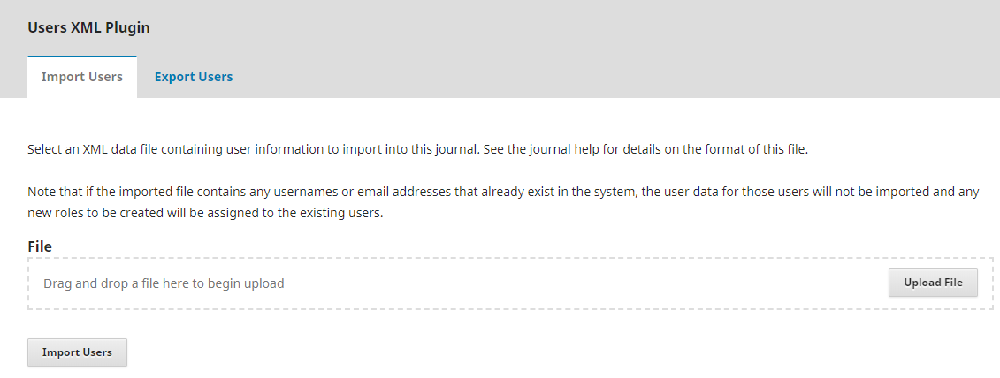

# Importation et Exportation de Données

Open Journal Systems offre une variété d'outils et de plugiciels qui vous permettent d'injecter et d'extraire des données d'OJS. Ce chapitre explique comment utiliser les outils et plugiciels d'importation et d'exportation. Plus d'informations sont disponibles dans la documentation de chaque plugiciel dans le répertoire plugiciel d'OJS (plugins/).

La plupart des fonctions d'importation et d'exportation peuvent être executées en vous connectant en tant que Directeur/trice de la revue et en allant dans Outils > Importer/Exporter.


Néanmoins, dans certains cas, les plugiciels d'importation/exportation doivent d'abord être installés ou activés sous Paramètres > Site Web > Plugiciels. Comment accéder et utiliser des plugiciels et des fonctions spécifiques est expliqué dans les sections ci-dessous.


La fonctionnalité d'importation/exportation est également disponible en tant qu'outil de ligne de commande; voir `tools/importExport.php` et la section de ligne de commande pour plus d'informations.

## Importer et exporter des articles et des publications

Les articles et les publications peuvent être rapidement importés dans OJS à l'aide du plugiciel Quick Submit ou du plugiciel Native XML (plugiciel nommé auparavant XML Articles and Issues). Le plugiciel Quick Submit est un outil utile pour importer 5 à 10 articles, mais pour un plus grand nombre d'articles et de publications, ou si vous avez vos métadonnées dans un format transformable, vous souhaiterez peut-être utiliser le plugiciel Native XML.

### Plugiciel Quick Submit

Le plugiciel Quick Submit vous permet d'ajouter rapidement des soumissions complètes à une publication. Cela fournit un processus de soumission en une seule étape pour les éditeurs qui doivent contourner le processus traditionnel de soumission, de révision et d'édition. Voir [Apprendre OJS 3](https://docs.pkp.sfu.ca/learning-ojs/en/tools) pour plus de détails.

### Plugiciel Native XML

Le plugiciel Native XML d'OJS 3.x remplace le plugiciel XML Articles and Issues, qui était utilisé dans OJS 2 pour importer les métadonnées d'un article et d'une publication dans et hors d'OJS dans un fichier XML. Cela peut être utilisé pour importer et exporter un ou plusieures publications et/ou articles, y compris des métadonnées compréhensives. Cela peut être utilisé dans les cas suivants:

- Déplacement des métadonnées d'articles et de publications d'un journal OJS à un autre
- Déplacement d'un grand nombre de publications et d'articles antérieurs dans OJS

Pour utiliser ce plugiciel, vous aurez besoin de:

- Une compréhension de base de XML
- Être inscrit en tant que Directeur/trice de la revue dans le journal OJS

Si vous importez des données, créez premièrement le fichier d'importation XML. Voici des liens vers des exemples de fichiers d'importation XML et de schémas XML:

- Exemple de fichier XML pour les métadonnées d'article: [https://github.com/pkp/ojs/blob/master/plugins/importexport/native/sample.xml](https://github.com/pkp/ojs/blob/master/plugins/importexport/native/sample.xml)
- Exemple de fichier XML pour les métadonnées de publication: [https://github.com/pkp/ojs/blob/master/plugins/importexport/native/tests/functional/testissue.xml](https://github.com/pkp/ojs/blob/master/plugins/importexport/native/tests/functional/testissue.xml)
- Schéma XML à utiliser dans les applications logicielles PKP: [https://github.com/pkp/pkp-lib/blob/master/plugins/importexport/native/pkp-native.xsd](https://github.com/pkp/pkp-lib/blob/master/plugins/importexport/native/pkp-native.xsd)
- Schéma XML à utiliser dans OJS: [https://github.com/pkp/ojs/blob/master/plugins/importexport/native/native.xsd](https://github.com/pkp/ojs/blob/master/plugins/importexport/native/native.xsd)

* Veuillez noter que le format XML utilisé par le plugiciel Native XML pour OJS 3 est différent du format XML pour le plugiciel XML Articles and Issues utilisé dans OJS 2. Si vous exportez des données depuis OJS 2 et que vous voulez les importer dans OJS 3, vous devrez premièrement modifier le fichier XML. Notez également que le schéma est révisé périodiquement; si vous exportez à partir d'une version d'OJS et que vous importez dans une autre version, vous devrez peut-être ajuster légèrement le XML pour tenir compte de ces changements.

Voici des choses à considérer:

- Assurez-vous de bien définir le type de document à l'aide de ..>.
- Votre fichier XML doit être encodé en UTF8.
- Les dates doivent être spécifiées sous la forme AAAA-MM-JJ.
- Pour importer un fichier, vous pouvez utiliser `<embed>` pour placer un fichier directement dans votre document XML, ou utilisez `<href>` pour créer un lien vers un.
- Si vous utilisez le `<embed>` tag, vous devrez encoder vos fichiers en base64. Utilisant `<embed>` avec un fichier encodé en base64 ressemblerait à ceci: [capture d'écran nécessaire]
- Vous pouvez créer un lien vers des URL ainsi que des fichiers locaux en utilisant `<href>` . Un lien URL complet ressemblerait à ceci: [capture d'écran requise]
- Vous pouvez utiliser la liaison locale si vos fichiers sont déjà stockées sur la machine de destination, mais dans ce cas, vous devez lancer l'importation depuis la ligne de commande. L'importation d'un fichier local ressemblerait à ceci: [ajouter une capture d'écran]
- Certains éléments peuvent soutenir les tags HTML intégrées, tel que l'élément abstrait. Si vous intégrez du HTML dans votre document, n'oubliez pas de placer le HTML dans des tags `<![CDATA[]]>`.
- Si votre journal prend en charge plusieurs lieux, vous pouvez inclure les termes traduits dans une entrée distincte: [capture d'écran]
- Si vous faites des erreurs typographiques dans les données que vous essayez d'importer, vous risquez de vous retrouver avec des entrées dupliquées ou fractionnées: par exemple, si votre journal a déjà une section "Articles" avec les initiales ART, mais que vous faites un typo dans votre fichier XML, par exemple, `<abbrev locale="en\_US">` AR `</abbrev>` au lieu de `<abbrev locale="en\_US">` ART `</abbrev>` , une nouvelle section dans le journal avec les initiales AR sera créée, et cet article y sera ajouté. Cela peut être facilement corrigé avant l'importation, mais difficile à nettoyer après.

Vous devez valider votre fichier XML avant de l'importer. Si vous utilisez un outil d'édition XML, tel que Liquid XML Editor ou Oxygen XML, vous pouvez valider le fichier dans l'outil d'édition. Si le XML n'est pas valide, un message d'erreur s'affiche pour identifier les lignes contenant des erreurs.

Dès que vous avez le fichier d'importation XML valide, vous pouvez l'importer:

1. Connectez-vous à OJS en tant que Directeur/trice de la revue
2. Allez dans Outils > Importer/Exporter > Plugiciel Native XML
3. Sous l'onglet Importer, cliquez sur Télécharger le fichier et sélectionnez votre fichier XML
4. Cliquez sur Importer
5. Vous serez informé si il y a une erreur ou si l'importation a réussi.


Pour exporter un article et publier des métadonnées à l'aide du plugiciel Native XML:

1. Connectez-vous à OJS en tant que Directeur/trice de la revue
2. Allez dans Outils > Importer/Exporter> Plugiciel Native XML
3. Selon que vous exportez des métadonnées d'article ou de publication, accédez à l'onglet Exporter des articles ou Exporter des publications.
4. Sélectionnez les articles ou publications que vous souhaitez exporter en cochant la case à côté d'eux.
5. Cliquez sur Exporter
6. Les articles ou publications seront exportés sous format XML et peuvent être importés dans ce journal ou dans un autre

\* Veuillez noter que l'utilisation de ce plugiciel pour exporter des articles et des publications exportera non seulement toutes les métadonnées pertinentes, mais inclura aussi tous les fichiers reliés à l'article (HTML, PDF, etc.) incorporés dans le document XML et encodé en Base64. Cela peut entraîner des fichiers XML volumineux et encombrants, en particulier lorsque plusieurs publications sont exportés à la fois. Leur ouverture dans un éditeur pour afficher ou modifier des données ou métadonnées XML peut être pénible pour votre ordinateur, et le téléchargement de ou vers serveur de ces fichiers peut prendre un certain temps, en fonction de votre connexion et des ressources du serveur source.


## Importer et exporter des utilisateurs

Le plugiciel XML Users peut être utilisé pour importer et exporter des utilisateurs et leurs rôles. Il peut être utilisé dans les cas suivants:

- Déplacer des comptes utilisateurs d'un journal OJS à un autre
- Déplacer des comptes d'utilisateurs d'un autre système vers OJS
- Déplacer des comptes d'utilisateurs d'OJS vers un autre système
- Exporter les données d'utilisateur depuis OJS, les modifier et les réimporter dans OJS

Pour utiliser ce plugiciel, vous aurez besoin des éléments suivants:

- Une compréhension de base de XML
- Être inscrit en tant que Directeur/trice de la revue dans le journal OJS

Si vous importez des utilisateurs dans OJS, créez premièrement le fichier d'importation XML. Voici un exemple de fichier d'importation XML: [https://github.com/pkp/ojs/blob/master/plugins/importexport/users/sample.xml](https://github.com/pkp/ojs/blob/master/plugins/importexport/users/sample.xml)

* Veuillez noter que le format XML utilisé par le plugiciel XML Users dans OJS 3 est différent du format XML utilisé par le plugiciel dans OJS 2. Si vous exportez des données depuis OJS 2 et que vous souhaitez les importer dans OJS 3, vous devrez d'abord modifier le fichier XML.

Voici des choses à considérer:

- Assurez-vous de bien définir le type de document à l'aide de ..>.
- Votre fichier XML doit être encodé en UTF8.
- `<firstname>`, `<lastname>` and `<email>` are mandatory.
- Si vous autorisez le système à générer des mots de passe pour les utilisateurs que vous téléchargez, vous avez l'option d'autoriser le système à envoyer un e-mail aux utilisateurs avec leurs informations d'identification de compte. Cette option se trouve sur la page du plugiciel Users XML ("Envoyer un e-mail de notification à chaque utilisateur importé contenant le nom et le mot de passe de l'utilisateur.").
- Vous pouvez exiger de l'utilisateur de modifier son mot de passe lors de sa prochaine connexion en définissant l'attribut de mot de passe "change" sur "true": `<password must_change = "true">`myoldpassword`</password>`
- Le cryptage par défaut du mot de passe est "plaintext" (c'est-à-dire aucun). Crypté suppose qu'il a été crypté par `Validation::encryptCredentials()` et utilise le même algorithme de cryptage utilisé par le système.
- Si le fichier importé contient des noms d'utilisateur ou des adresses e-mail qui existent déjà dans le système, les données de ces utilisateurs ne seront pas importées et les nouveaux rôles à créer seront attribués aux utilisateurs existants.

Vous devez valider votre fichier XML avant de l'importer. Si vous utilisez un outil d'édition XML, tel que Liquid XML Editor ou Oxygen XML, vous pouvez valider le fichier dans l'outil d'édition. Si le XML n'est pas valide, un message d'erreur s'affiche pour identifier les lignes contenant des erreurs.

Dès que vous avez le fichier d'importation XML valide, vous pouvez l'importer:

1. Connectez-vous à OJS en tant que Directeur/trice de la revue
2. Allez dans Outils > Importer/Exporter > Plugiciel Users XML
3. Sous l'onglet Importer des utilisateurs, cliquez sur Télécharger le fichier et sélectionnez votre fichier XML
4. Cliquez sur Importer des utilisateurs
5. Vous serez informé si il y a une erreur ou si l'importation a réussi.



Pour exporter des comptes d'utilisateurs à l'aide du plugiciel Users XML:

1. Connectez-vous à OJS en tant que Directeur/trice de la revue
2. Allez dans Outils > Importer/Exporter > Plugiciel Users XML
3. Sélectionnez les comptes d'utilisateurs que vous souhaitez exporter en cochant la case à côté d'eux.
4. Cliquez sur Exporter les utilisateurs
5. Les comptes d'utilisateurs seront exportés au format XML et peuvent être importés dans ce journal ou dans un autre


## Exporter les métadonnées vers des sites externes et des services d'indexation

OJS a des plugiciels qui vous permettent d'exporter des métadonnées d'article vers des sites externes et des services d'indexation compatibles avec leur format.

### Plugiciel PubMed XML Export

Le plugiciel PubMed XML Export vous permet d'exporter les métadonnées d'article sous forme de fichier XML au format NLM PubMed/MEDLINE. Pour plus d'informations sur le plugiciel, consultez son fichier README: [https://github.com/pkp/ojs/tree/master/plugins/importexport/pubmed](https://github.com/pkp/ojs/tree/master/plugins/importexport/pubmed)

### Plugiciel DataCite Export/Registration

Le plugiciel DataCite Export/Registration vous permet d'exporter des métadonnées de publication, d'article, et de fichiers supplémentaires au format DataCite et d'enregistrer les DOI avec DataCite. Pour plus d'informations sur le plugiciel, consultez son fichier README: [https://github.com/pkp/ojs/blob/master/plugins/importexport/datacite/README](https://github.com/pkp/ojs/blob/master/plugins/importexport/datacite/README)

### Plugiciel DOAJ Export

Si votre journal est indexé par le Directory of Open Access Journals (DOAJ), vous pouvez exporter votre journal de publication et les métadonnées de votre article vers DOAJ soit manuellement en utilisant le plugiciel DOAJ Export, soit automatiquement en utilisant l'API DOAJ.

Pour exporter les métadonnées du journal vers DOAJ automatiquement:

1. Obtenez une clé API de DOAJ en allant sur [https://doaj.org/](https://doaj.org/), en vous connectant et en vérifiant votre numéro de membre.
2. Connectez-vous à OJS en tant que Directeur/trice de la revue
3. Allez dans Outils > Importer/Exporter > Plugiciel DOAJ Export
4. Sous l'onglet Paramètres, entrez votre clé API DOAJ
5. Cochez «OJS déposera automatiquement les articles au DOAJ. Veuillez noter que cette procédure peut prendre un peu de temps après la publication. Vous pouvez rechercher tous les articles non enregistrés. »
6. Cliquez sur Enregistrer

Pour exporter les métadonnées d'article vers DOAJ manuellement:

1. Connectez-vous à OJS en tant que gestionnaire de journal
2. Allez dans Outils > Importer / Exporter > Plugiciel DOAJ Export
3. Allez dans l'onglet Articles
4. Sélectionnez les articles que vous souhaitez exporter. Ils doivent être publiés.
5. Cliquez sur Exporter
6. Visitez [https://doaj.org/](https://doaj.org/) et connectez-vous pour télécharger le fichier XML qui a été créé lors du processus d'exportation

### Plugiciel Crossref XML Export

Le plugiciel Crossref XML Export vous permet d'exporter les métadonnées d'articles au format XML Crossref automatiquement et manuellement, afin de les déposer avec Crossref. Pour plus d'informations sur l'utilisation de ce plugiciel, consultez le manuel Crossref OJS: [http://docs.pkp.sfu.ca/crossref-ojs-manual/](http://docs.pkp.sfu.ca/crossref-ojs-manual/)

### Plugiciel mEDRA Export/Registration

Le plugiciel mEDRA Export/Registration vous permet d'exporter des métadonnées de publications, d'articles et de fichiers au format Onix for DOI (O4DOI) et d'enregistrer les DOI avec l'agence d'enregistrement mEDRA. Pour plus d'informations sur l'utilisation du plugiciel, consultez son fichier README: [https://github.com/pkp/ojs/blob/master/plugins/importexport/medra/README](https://github.com/pkp/ojs/blob/master/plugins/importexport/medra/README)

## Utiliser les plugiciels d'import/export depuis la ligne de commande

Les plugiciels d'import/export peuvent normalement aussi être exécutés à partir de la ligne de commande. Vous pouvez afficher les noms de plugiciels applicables en exécutant la commande suivante:

```
php tools/importExport.php list
```

Vous pouvez voir les paramètres d'utilisation en exécutant la commande suivante:

```
php tools/importExport.php \[PluginName\] usage
```

## Résoudre les problèmes d'importation et d'exportation

> *"J'ai importé mon fichier XML et je reçois un message d'erreur."*

Avez-vous validé votre fichier XML avant de l'importer? Si vous ne l'avez pas fait, exécutez-le via un validateur dans votre éditeur XML ou navigateur et le validateur indiquera ce qui ne va pas avec le fichier.

> *"Quand je clique sur le bouton Exporter, j'obtiens une page blanche au lieu d'une liste de données à exporter."*

Vous devriez vérifier le fichier error_log pour trouver ce qui ne va pas exactement.
