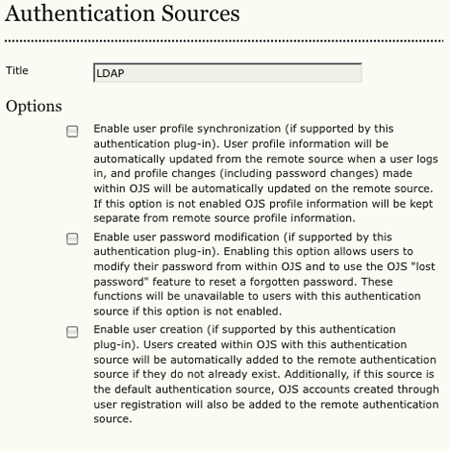
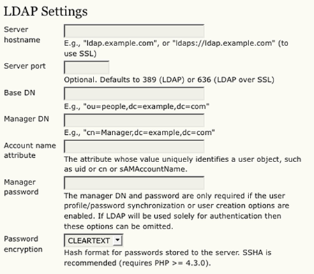

# User Authentication and Single Sign-on

For synchronizing user accounts across multiple applications, OJS and OCS support LDAP and Shibboleth, both of which have varying degrees of support in other applications including PhpBB, Drupal, WordPress, and other content management systems.

*LDAP* (the Lightweight Directory Access Protocol), while not as powerful as Shibboleth (e.g. LDAP does not support single sign-on, where logging into one service automatically logs into all others), is a common choice for centralizing authentication on a server. A popular LDAP implementation is [OpenLDAP](https://www.openldap.org/) an open source implementation of the protocol.

*Shibboleth* is a powerful alternative to LDAP for user management and authentication, and has grown in popularity. Shibboleth offers the account synchronization capabilities of LDAP as well as single-sign-on functionality (where logging into one service automatically logs into all others), providing a more seamless integration between your web applications. However, Shibboleth can be much more complex to install and configure than LDAP.

## Setting up LDAP
Setting up an LDAP server is beyond the scope of this guide, but please consult the resources section for two useful guides that help to setup and LDAP source. Likewise, please consult the documentation for your other web applications for help with LDAP integration.

To setup LDAP in OJS and OCS, log in as the Site Administrator, and under 'Site Management' on the Administrator's home page, click on 'Authentication Sources'. Under 'Create authentication source', select 'LDAP' and click 'Create'. This will bring up the LDAP settings page.

*Warning*: Please note that the LDAP plugin doesn't ship with OCS by default -- you'll have to grab it from a recent version of OJS (or from CVS). More information can be found [here](http://pkp.sfu.ca/bugzilla/show_bug.cgi?id=2960).

The title for your LDAP setup is arbitrary; leave it as is or choose your own title. The next three settings customize the level of integration between OJS/OCS and your LDAP server.

* *Enable user profile synchronization*. If checked, user information including passwords, name, email address, phone number and other personal data will automatically be synchronized between the LDAP source and OJS/OCS, allowing for a consistent user profile across applications.
* *Enable user password modification*. If checked, allows users to change their password and recover lost passwords.
* *Enable user creation*. If checked, any user created within OJS/OCS will automatically be added to the LDAP source.

The next set of settings configures OJS/OCS to allow communication with the LDAP server.

* *Server hostname*. The domain/IP address of the server that hosts the LDAP source. If OJS/OCS is running on the same server as LDAP, you can enter `localhost`.
* *Server port*. If LDAP is running on a non-standard port, enter the number here. Leave it blank if you're not sure.
* *Base DN*. This is where it gets a little complicated. LDAP is designed like a directory tree, much like your computer file system. To identify the directory entry to search for users, the LDAP plugin requires the base DN or 'Distinguished Name', on which to begin the search. In the example provided, `ou=people,dc=example,dc=com`, 'ou' (or 'Organization Unit') signifies the main group of users, which you should be able to determine from your LDAP source's configuration files. Likewise, the 'dc' (or 'Domain Component') should be under 'suffix' in your LDAP source's configuration file. Each domain component signifies a component of your domain name (e.g. example.com has the two domain components 'example' and 'com'. If you are using a localhost, use `dc=localhost,dc=localdomain`.
* *Manager DN*. Like the Base DN, but this setting is required for the plugin to communicate with the LDAP source as an administrator, i.e. to make administrative changes. The domain components should be the same as the base DN, but the cn (or 'Common Name', i.e. the nickname of the root user) should be 'Manager' or whatever was set in your LDAP server configuration.
* *Account name attribute*. This value uniquely identifies a user object, and should be 'uid' for OpenLDAP, but may be different for other LDAP sources (e.g., it would be sAMAccountName for Microsoft Active Directory).
* *Manager password*. The password for the manager account (only required if the user profile/password synchronization or user creation options are enabled).
* *Password encryption*. For security reasons, it is recommended you use some form of password encryption. If you have PHP version 4.3.0 or greater, we suggest using SSHA.

Optionally, if your PHP version 5.0 or greater, you can configure LDAP to use SASL (Simple Authentication and Security Layer) for authentication. As this feature is for advanced users, please consult the links in the Resources section for more information.

## Setting up Shibboleth

*Note*: Please note that Shibboleth support has not yet been ported to OCS.

Shibboleth is maintained by the [Internet2 Middleware Initiative](http://shibboleth.internet2.edu/), and as such their website provides a central location for downloads and documentation. Currently, they provide Shibboleth Service Provider 2.1 in binary form for all major operating systems, as well as providing source code. For further information on installing and setting up the Shibboleth Service Provider, please consult Internet2's support documentation.

Once Shibboleth is set up on your system, integration with your PKP application requires the use of the [Shibboleth plugin](https://github.com/pkp/shibboleth) from the Plugin Gallery.  After enabling this plugin, visit the plugin's Settings page for instructions on configuration.

## Frequently Asked Questions

### I can't log in to OxS with my LDAP credentials.

A major component of OxS is a consistent record of user activity, especially in respect to submissions and editing. If user records are stored outside of OxS, there is no guarantee that the record will stick around or stay consistent, causing problems with OxS. Thus, LDAP credentials won't work unless there is a matching user in OxS.

That said, there are several ways to get your LDAP users into your OxS database. If you wish to do a one time dump of users into OxS, you could build an XML file with user information to import into OxS (see the Users XML plugin). Further, code could be written to automatically insert users into the database when registered in another application. The execute function in `classes/manager/form/UserManagementForm.inc.php` shows how users are registered into OJS, and can be modeled in user registration functions in another application. Likely a variety of other solutions can be implemented to overcome this.

### OxS seems to hash passwords differently than in LDAP. How to I get OxS to conform to LDAP's hashing technique?

By default, OJS and OCS append the username to the password before hashing. To change this behavior, modify the `encryptCredentials function in classes/security/Validation.inc.php`. If you change the password hashing behavior, you will have to reset all existing passwords in the database.

I get this error when trying to connect to my LDAP server: `PHP fatal error: Call to undefined function ldap_connect()`

PHP's LDAP extension is not included by default, and may have to be compiled. See [PHP Installation Guide](http://ca.php.net/manual/en/ldap.installation.php) for more information.

## Resources

* [Quick HOWTO : Ch31 : Centralized Logins Using LDAP and RADIUS ](http://www.linuxhomenetworking.com/wiki/index.php/Quick_HOWTO_:_Ch31_:_Centralized_Logins_Using_LDAP_and_RADIUS)
* [OpenLDAP 2.1 Administrator's Guide: Using SASL](https://www.openldap.org/doc/admin21/sasl.html)
* [Cyrus SASL for System Administrators](http://www.sendmail.org/~ca/email/cyrus/sysadmin.html)
* [Shibboleth Documentation](https://wiki.shibboleth.net/confluence/display/SP3)
