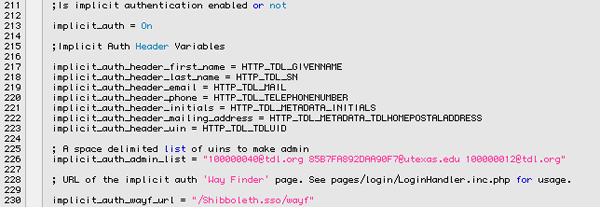

# Authentification des utilisateurs et authentification unique

Afin de synchroniser les comptes d'utilisateurs entre plusieurs applications, OJS et OCS prennent en charge LDAP et Shibboleth, qui ont tous deux des degrés de prise en charge variables dans d'autres applications, notamment PhpBB, Drupal, WordPress et d'autres systèmes de gestion de contenu.

*LDAP* (le protocole Lightweight Directory Access Protocol), bien qu'il ne soit pas aussi puissant que Shibboleth (par exemple, LDAP ne prend pas en charge l'authentification unique, où la connexion à un service se connecte automatiquement à tous les autres), est un choix courant pour centraliser l'authentification sur un serveur. Une implémentation LDAP populaire est [OpenLDAP,](https://www.openldap.org/) une implémentation open source du protocole.

*Shibboleth* est une alternative puissante à LDAP pour la gestion et l'authentification des utilisateurs, et sa popularité a grandi. Shibboleth offre les capacités de synchronisation de compte de LDAP ainsi que la fonctionnalité d'authentification unique (où la connexion à un service se connecte automatiquement à tous les autres), offrant une intégration plus harmonieuse entre vos applications Web. Cependant, Shibboleth peut être beaucoup plus complexe à installer et à configurer que LDAP.

## Configurer LDAP

La configuration d'un serveur LDAP dépasse le cadre de ce guide, mais veuillez consulter la section des ressources pour deux guides utiles qui aident à la configuration et 'à la source LDAP'. De même, veuillez consulter la documentation de vos autres applications Web pour obtenir de l'aide sur l'intégration LDAP.

Pour configurer LDAP dans OJS et OCS, connectez-vous en tant qu'administrateur du site, et sous «Gestion du site» sur la page d'accueil de l'administrateur, cliquez sur «Sources d'authentification». Sous «Créer une source d'authentification», sélectionnez «LDAP» et cliquez sur «Créer». Cela fera apparaître la page des paramètres LDAP.

*Attention* : veuillez noter que le plugin LDAP n'est pas livré avec OCS par défaut - vous devrez le récupérer à partir d'une version récente d'OJS (ou de CVS). Plus d'informations peuvent être trouvées [ici](http://pkp.sfu.ca/bugzilla/show_bug.cgi?id=2960) .

Le titre de votre configuration LDAP est arbitraire; laissez-le tel quel ou choisissez votre propre titre. Les trois paramètres suivants personnalisent le niveau d'intégration entre OJS / OCS et votre serveur LDAP.

- *Activez la synchronisation du profil utilisateur* . Si coché, les informations de l'utilisateur, y compris les mots de passe, le nom, l'adresse e-mail, le numéro de téléphone et d'autres données personnelles seront automatiquement synchronisées entre la source LDAP et OJS / OCS, permettant un profil utilisateur cohérent entre les applications.
- *Activez la modification du mot de passe utilisateur* . Si coché, permet aux utilisateurs de changer leur mot de passe et de récupérer les mots de passe perdus.
- *Activez la création d'utilisateurs* . Si coché, tout utilisateur créé dans OJS / OCS sera automatiquement ajouté à la source LDAP.

L'ensemble de paramètres suivant configure OJS / OCS pour permettre la communication avec le serveur LDAP.

- *Nom d'hôte du serveur* . Domaine / adresse IP du serveur qui héberge la source LDAP. Si OJS / OCS s'exécute sur le même serveur que LDAP, vous pouvez entrer `localhost` .
- *Port du serveur* . Si LDAP s'exécute sur un port atypique, entrez le numéro ici. Laissez ce champ vide si vous n'êtes pas sûr.
- *DN de base* . C'est là que ça devient un peu compliqué. LDAP est conçu comme une arborescence de répertoires, tout comme le système de fichiers de votre ordinateur. Pour identifier l'entrée de répertoire pour rechercher des utilisateurs, le plug-in LDAP requiert le DN de base ou «Nom distinctif», sur lequel commencer la recherche. Dans l'exemple fourni, `ou=people,dc=example,dc=com` , 'ou' (ou 'Organization Unit') signifie le groupe principal d'utilisateurs, que vous devriez pouvoir déterminer à partir des fichiers de configuration de votre source LDAP. De même, le 'dc' (ou 'Domain Component') doit être sous 'suffix' dans le fichier de configuration de votre source LDAP. Chaque composant de domaine signifie un composant de votre nom de domaine (par exemple, example.com a les deux composants de domaine «exemple» et «com». Si vous utilisez un hôte local, utilisez `dc=localhost,dc=localdomain` .
- *DN du gestionnaire* . Comme le DN de base, mais ce paramètre est requis pour que le plugin communique avec la source LDAP en tant qu'administrateur, c'est-à-dire pour effectuer des modifications administratives. Les composants du domaine doivent être les mêmes que le DN de base, mais le cn (ou 'Common Name', c'est-à-dire le surnom de l'utilisateur root) doit être 'Gestionnaire' ou ce qui a été défini dans la configuration de votre serveur LDAP.
- *Attribut du nom de compte* . Cette valeur identifie de manière unique un objet utilisateur et doit être «uid» pour OpenLDAP, mais peut être différente pour d'autres sources LDAP (par exemple, ce serait sAMAccountName pour Microsoft Active Directory).
- *Mot de passe du gestionnaire* . Le mot de passe du compte gestionnaire (requis uniquement si les options de synchronisation profil utilisateur / mot de passe ou de création d'utilisateur sont activées).
- *Cryptage du mot de passe* . Pour des raisons de sécurité, il est recommandé d'utiliser une forme de cryptage de mot de passe. Si vous avez la version 4.3.0 ou supérieure de PHP, nous vous suggérons d'utiliser SSHA.

Facultativement, si vous avez la version 5.0 ou supérieure de PHP, vous pouvez configurer LDAP pour utiliser SASL (Simple Authentication and Security Layer) pour l'authentification. Cette fonctionnalité étant destinée aux utilisateurs avancés, veuillez consulter les liens dans la section Ressources pour plus d'informations.

## Configurer Shibboleth

*Remarque* : veuillez noter que l'assistance Shibboleth n'a pas encore été portée sur OCS.

Shibboleth est géré par [Internet2 Middleware Initiative](http://shibboleth.internet2.edu/) et, en tant que tel, son site Web fournit un emplacement central pour les téléchargements et la documentation. Actuellement, ils fournissent Shibboleth Service Provider 2.1 sous forme binaire pour tous les principaux systèmes d'exploitation, ainsi que le code source. Pour plus d'informations sur l'installation et la configuration du fournisseur de services Shibboleth, veuillez consulter la documentation de support d'Internet2.

Une fois Shibboleth installé sur votre système, l'intégration avec votre application PKP nécessite la révision du fichier `config.inc.php` trouvé dans le répertoire de base, dans la section `[security]` . Les variables en question relèvent toutes de la variable `implicit_auth` - Décommentez cela en supprimant le point-virgule et décommentez toutes les autres variables commençant par `implicit_auth` . Notez qu'aucune des autres variables implicit_auth n'est consultée si la variable principale est commentée ou n'est pas «Activée». En activant `implicit_auth` , le processus de connexion passera par Shibboleth et plusieurs formulaires seront modifiés pour ne pas demander les informations personnelles stockées dans Shibboleth. 

Au départ, toutes les variables sont définies sur les valeurs de la [Fédération Shibboleth de la Texas Digital Library](http://www.tdl.org/shibboleth/). Comme vous n'êtes probablement pas affilié à la TDL, vous allez devoir modifier les valeurs pour refléter vos paramètres Shibboleth. Si votre application fait partie d'une fédération institutionnelle, consultez votre assistance technique pour connaître ces valeurs. Sinon, vous devrez examiner les fichiers de configuration dans Shibboleth. Cela peut devenir compliqué, et il y a une différence entre les variables de Shibboleth 1.x et Shibboleth 2.x. Depuis Shibboleth 2.0, ces valeurs sont stockées en tant que variables d'environnement de serveur Web, et vous pouvez les déterminer en regardant dans le fichier attribute-map.xml (généralement dans le répertoire `shibboleth_dir/etc/shibboleth/`), où l'attribut est désigné par l'attribut «id» de chaque élément Attribut. Par défaut, les valeurs doivent être `Shib-EP-[AttributeId]` où `[AttributeId]` est la valeur de l'attribut 'id', avec la première lettre en majuscule. Ces valeurs peuvent également être sous la forme de `HTTP_SHIB_EP_[AttributeID]` avec `[AttributeID]` en majuscule.

La variable `implicit_auth_admin_list` contient une liste d'UIN (adresses e-mail) séparés par des espaces. Si un utilisateur se connecte avec l'un de ces UIN, il sera automatiquement connecté avec des privilèges d'administrateur. Le `implicit_auth_wayf_url` se trouve dans le fichier `shibboleth.xml` ou `shibboleth2.xml` (selon la version que vous utilisez). Il sera situé dans une `<SessionInitiator>` , comme attribut URL.

## Questions fréquemment posées

### Je n'arrive pas à me connecter au OxS avec mes informations d'identification LDAP.

Un élément majeur d'OxS est un enregistrement cohérent de l'activité des utilisateurs, en particulier en ce qui concerne les soumissions et la révision. Si les dossiers utilisateur sont stockés en dehors d'OxS, il n'y a aucune garantie que le tout restera fidèle ou cohérent, causant des problèmes avec OxS. Ainsi, les informations d'identification LDAP ne fonctionneront pas à moins qu'il n'y ait un utilisateur correspondant dans OxS.

Cela dit, il existe plusieurs façons d'intégrer vos utilisateurs LDAP dans votre base de données OxS. Si vous souhaitez effectuer un vidage ponctuel des utilisateurs dans OxS, vous pouvez créer un fichier XML avec des informations d'utilisateur à importer dans OxS (se référer au plugin XML Users). En outre, du code pourrait être écrit pour insérer automatiquement des utilisateurs dans la base de données lorsqu'ils sont enregistrés dans une autre application. La fonction d'exécution dans `classes/manager/form/UserManagementForm.inc.php` montre comment les utilisateurs sont enregistrés dans OJS et peuvent être modélisés dans les fonctions d'enregistrement des utilisateurs dans une autre application. Une variété d'autres solutions peuvent probablement être mises en œuvre pour surmonter cela.

### OxS semble hacher les mots de passe différemment de LDAP. Comment faire en sorte qu'OxS se conforme à la technique de hachage de LDAP?

Par défaut, OJS et OCS ajoutent le nom d'utilisateur au mot de passe avant le hachage. Pour modifier ce comportement, modifiez la `encryptCredentials function in classes/security/Validation.inc.php` . Si vous modifiez le comportement de hachage du mot de passe, vous devrez réinitialiser tous les mots de passe existants dans la base de données.

J'obtiens cette erreur en essayant de me connecter à mon serveur LDAP: `PHP fatal error: Call to undefined function ldap_connect()`

L'extension LDAP de PHP n'est pas incluse par défaut et devra peut-être être compilée. Consultez [le guide d'installation de PHP](http://ca.php.net/manual/en/ldap.installation.php) pour plus d'informations.

## Ressources

- [Quick HOWTO : Ch31 : Centralized Logins Using LDAP and RADIUS ](http://www.linuxhomenetworking.com/wiki/index.php/Quick_HOWTO_:_Ch31_:_Centralized_Logins_Using_LDAP_and_RADIUS)
- [OpenLDAP 2.1 Administrator's Guide: Using SASL](https://www.openldap.org/doc/admin21/sasl.html)
- [Cyrus SASL for System Administrators](http://www.sendmail.org/~ca/email/cyrus/sysadmin.html)
- [Shibboleth Documentation](https://spaces.internet2.edu/display/SHIB/)
