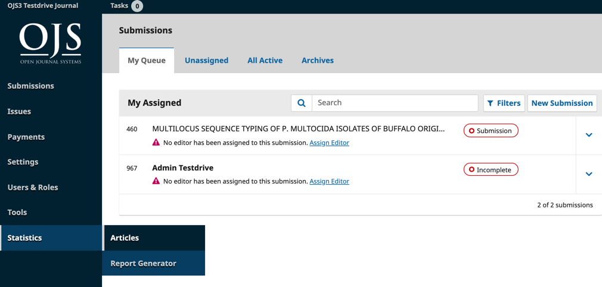
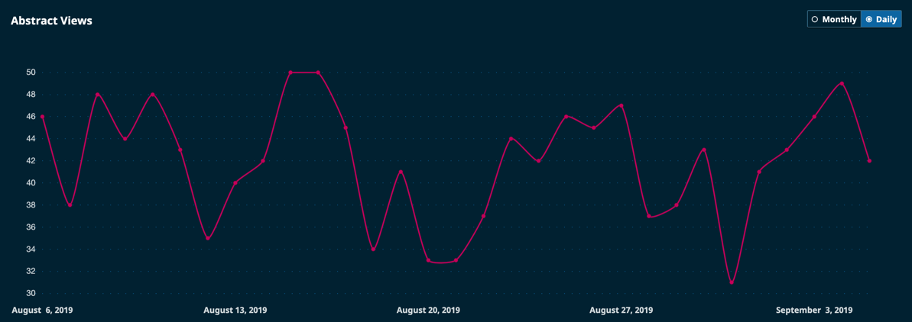
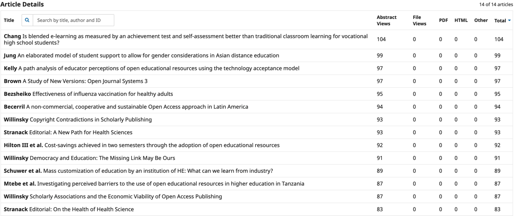
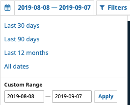
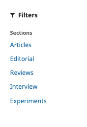
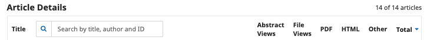
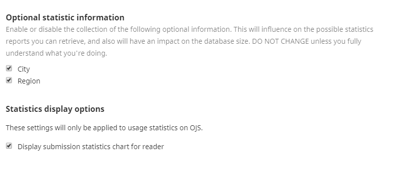
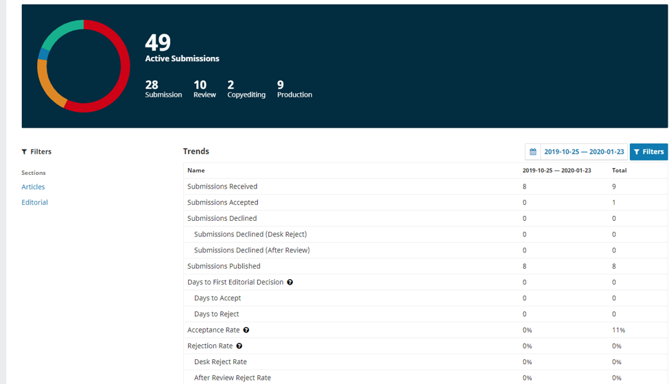
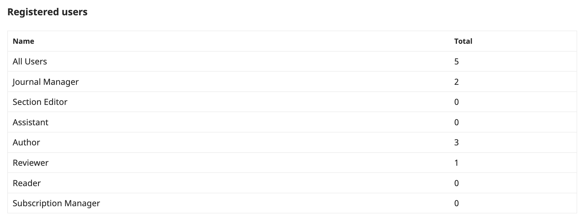

# Statistiques

Ce chapitre du Guide de l'administrateur fournit un aperçu général des statistiques dans Open Journal Systems (OJS) et par extension dans Open Monograph Press (OMP). Il contient des directives générales d'utilisation pour des scénarios courants, que les rédacteurs-trices et les directeurs-trices de la revue peuvent utiliser. Il contient également pas mal de détails techniques adaptés aux administrateurs de système. Dans la mesure du possible, nous avons essayé de faire la distinction entre les deux domaines d'expertise.

Le genre de statistiques disponibles dans OJS 3.2 et dans des versions ultérieures sont les Articles, l'Activité Rédactionnelle et les Utilisateurs-trices. Il existe également une section Générateur de Rapports pour produire divers rapports à partir de certaines des données disponibles.

L'élaboration de ce chapitre a été financée par le gouvernement du Canada grâce à une subvention du Patrimoine Canadien et par l'Association Canadienne des Revues Savantes / Canadian Association of Learned Journals. Public Knowledge Project a fourni une aide en nature supplémentaire pour le développement de ce projet.


## Définitions

Afin d'utiliser au mieux ce document, il est nécessaire de comprendre les définitions suivantes en ce qui concerne l'Open Journal Systems (OJS).

- **Page de résumé:** la page de destination d'un article, contenant le titre, les informations sur l'auteur, le résumé, le DOI et les liens vers les galeries de texte intégral de tout article. Également appelée "page d'article" ou "page de destination". Cette page est normalement utilisée comme point d'enregistrement pour l'article pour les DOI ou d'autres liens hypertexte: les DOI Crossref se résolvent à des pages de résumé d'article, par opposition aux fichiers épreuves, par exemple, comme le feraient la plupart des autres services d'indexation.
- **Consultation d'Article:** dans le cadre des statistiques, toute référence à une «consultation d'article» signifie une consultation singulière et unique de la page du résumé d'article par un visiteur. Il ne s'agit pas d'un décompte global de toutes les consultations d'articles et d'épreuves - il se réfère uniquement aux consultations de la page de résumé.
- **Consultation d'Épreuve:** dans le cadre des statistiques, toute référence à une «consultation d'épreuve» signifie une consultation unique ou un téléchargement unique d'un fichier épreuve spécifique par un visiteur. Aussi connu sous le nom de "téléchargement d'épreuves". Ce n'est pas un décompte global de toutes les consultations d'épreuve - s'il existe plusieurs épreuves pour un article (par exemple, un fichier HTML, un fichier PDF, etc.), chacune aura son propre décompte de consultation d'épreuves. OJS ne fait pas de distinction entre les téléchargements d'épreuves et les consultations dans le tableau de métriques; les téléchargements sont comptés comme des consultations d'épreuve.
- **Multi-clics:** le processus (accidentel ou néfaste) d'augmentation de l'utilisation compte en cliquant sur une page de résumé ou un fichier épreuve plusieurs fois de suite. OJS identifie et supprime ces tentatives de ses métriques d'utilisation, conformément au Code de Bonnes Pratiques du Project COUNTER.
- **Code de Bonnes Pratiques du Projet COUNTER:** un ensemble de pratiques développées par COUNTER pour établir un moyen de rendre compte, de manière cohérente, des mesures d'utilisation des ressources électroniques. Le Code fournit des règles sur ce qui doit être considéré comme une consultation, y compris des règles spécifiques pour l'utilisation du robot et les abus multi-clics. OJS filtre les métriques à travers ces règles. Il convient également de noter que PKP fait partie du groupe de travail COUNTER Bots and Crawlers.
- **Robots internet:** visiteurs non humains du site qui peuvent encore consulter et télécharger des données d'articles. Celles-ci sont généralement identifiées comme telles auprès du serveur, et OJS ne les compte pas dans ses métriques d'utilisation, conformément au Code de Bonnes Pratiques du Project COUNTER.

## Introduction au Cadre des Statistiques

«Qu'est ce qui compte comme une consultation» semble être une question assez simple lorsqu'on considère les métriques d'utilisation d'articles, mais il existe de nombreuses façons de fournir - ou de compliquer - la réponse. La réponse à cette question dépend du mécanisme de comptage utilisé (par exemple, Google Analytics vs hits de fichiers journaux vs métriques filtrées), si la tentative d'examen des données historiques couvre différentes méthodologies et si ces méthodologies ont été configurées correctement ou pas.

Ce manuel sert principalement à expliquer, en détail, comment configurer, utiliser et dépanner le Cadre de Statistiques d'Utilisation de PKP. Il contient également des informations sur d'autres méthodes de collecte de statistiques prises en charge par OJS.

### OJS et les Statistiques: Un Peu d'Histoire

OJS a enregistré l'utilisation d'articles depuis le début du lancement d'OJS 2. La méthodologie utilisée pour compter les métriques a subi un changement important depuis lors. Ce changement est essentiel pour comprendre comment examiner et gérer les données statistiques historiques.

#### Métriques à l'Ancienne: OJS 2.0 -> 2.4.3:

Les versions d'OJS antérieures à OJS 2.4.3 comptent les consultations de manière très rudimentaire: elles enregistrent les consultations de pages et les téléchargements de fichiers pour les pages de destination d'articles et les fichiers d'épreuve uniquement, et ne filtrent pas les consultations/téléchargements de bot, les clics multiples, etc. Ces consultations sont enregistrées dans un simple tableau de base de données et représentées dans OJS 2.4.2 et ci-dessous via un rapport de «Consultation». Les métriques ne sont disponibles que pour les résumés/pages de destination et les téléchargements d'épreuves et ne suivent qu'une seule facette: si l'élément a été consulté ou téléchargé. Ces décomptes sont considérés comme exacts, bien que probablement faussement représentatifs du lectorat réel, car les consultations de bot, l'indexation des robots d'exploration et les abus potentiels des auteurs ou des visiteurs (par exemple, plusieurs clics) ne sont pas filtrés.

#### Métriques à l'Ancienne: OJS 2.4.3+ et 3.0+

Depuis la version 2.4.3, Open Journal Systems utilise une nouvelle structure pour collecter des statistiques et générer des rapports. Ces métriques comptent les consultations de résumé et d'épreuves, la date de consultation et les informations régionales telles que le pays et la ville (si elles sont correctement configurées). Au-delà des métriques d'article, les consultations de numéros et de la page d'accueil sont également incluses. Enfin, ces métriques sont filtrées selon les règles de traitement du Projet COUNTER afin que les clics multiples et les consultations de bot soient filtrés par défaut.

#### Comprendre ce que vous avez: Points Clés à Retenir

Ce qui suit décrit les données auxquelles les utilisateurs-trices de diverses itérations d'OJS ont accès. La version OJS peut être déterminée par un membre du personnel de la revue en visitant À Propos > À Propos du Système de Publication (OJS 2).

- OJS 2.4.2 ou version antérieure:
    - Les métriques sont basées sur l'ancienne méthode des métriques. Seuls les décomptes de consultation d'articles simples sont enregistrés pour chaque consultation de résumé ou d'épreuve. Celles-ci ne sont filtrées par aucune des règles de filtrage du Projet COUNTER.
    - Ceux-ci sont disponibles à partir d'un rapport de consultation sous Direction de la Revue > Statistiques et Rapports.
    - Vous pouvez également avoir accès à un rapport rudimentaire de Consultations Programmées. Ce rapport, s'il est disponible dans une installation antérieure à OJS 2.4.2 ou plus ancienne, doit être considéré comme bogué et imprévisible. Il ne doit pas être utilisé.
    - La mise à niveau est conseillée afin que de meilleures métriques puissent être collectées à l'avenir. (Notez que la mise à niveau ne vous fournira pas de meilleures statistiques antérieures à la date de mise à jour, du moins par défaut. Consultez la section FAQ pour plus d'informations sur le retraitement des anciennes statistiques.)
- OJS 2.4.3 ou plus récent:
    - Les métriques sont basées sur la nouvelle méthode de métriques décrite ci-dessus.
    - Si cette instance OJS a été mise à niveau à un moment donné par rapport à la version antérieure à OJS 2.4.3, vous aurez également accès à un Rapport de Consultation hérité (pour les données collectées lorsque vous utilisiez des versions antérieures).
    - Tous les rapports sont disponibles dans l'onglet Direction de la Revue > Statistiques et Rapports.
    - REMARQUES POUR LES REVUES MISES À JOUR:
        - Le Rapport de Consultation hérité est à des fins d'archivage uniquement. Il fournit un enregistrement de l'utilisation avant l'adoption du 2.4.3. Il n'enregistre pas de nouvelles consultation après l'adoption de l'OJS 2.4.3.
        - Les nouveaux rapports (le rapport Consultations Programmées, le Générateur de Rapports Personnalisés, etc.) qui utilisent la nouvelle méthode de métriques n'incluront que les métriques à partir de la date de mise à niveau.
        - Afin de parvenir à une compréhension complète du nombre de consultations pour votre contenu, vous devrez prendre en compte à la fois les anciens et les nouveaux rapports.
    - REMARQUES IMPORTANTES SUR LES BOGUES:
        - Il y avait un bogue dans OJS 2.4.5 qui a entraîné le doublement du nombre de métriques. Consultez les sections FAQ et Problèmes Fréquemment Rencontrés pour plus d'informations.
        - Il y avait un bogue dans OJS 2.4.8.0 qui entraînait que certaines consultations de fichiers n'étaient pas correctement enregistrées. Consultez les sections FAQ et Problèmes Fréquemment Rencontrés pour plus d'informations.
        - Si votre instance OJS est actuellement sur l'une ou l'autre version, nous vous recommandons fortement de mettre à niveau (et, éventuellement, de retraiter vos statistiques - voir Annexe B: Traitement des Fichiers Journaux).
- 3.0 ou plus récent:
    - Vous aurez des métriques basées sur la nouvelle méthode de métriques définie ci-dessus.
    - Toutes les mesures seront disponibles à partir du Tableau De Bord Utilisateur, via Outils> Statistiques.
    - REMARQUES POUR LES REVUES MISES À JOUR:
        - Si votre utilisation d'OJS 3 est une mise à niveau d'une instance OJS contenant des données de Rapport de Consultations héritées (c'est-à-dire que votre installation a commencé avant OJS 2.4.2), ces données ne seront plus disponibles au téléchargement. Vous devez télécharger et stocker ces données avant la mise à niveau.

## Types de Rapports

Les rapports d'OJS peuvent être regroupés en gros en rapports «d'utilisation» qui contiennent des mesures d'utilisation indiquant le lectorat des visiteurs et des rapports de «contenu» qui fournissent des données sur l'élément respectif (par exemple, des informations sur l'abonné). Certains de ces rapports contiennent également des informations héritées, à condition que votre installation OJS ait été créée à un moment donné avant OJS 2.4.3. OJS 3 a abandonné la prise en charge des rapports hérités.

Afin de générer des rapports dans OJS 3.x, connectez-vous en tant que Directeur-trice de la Revue et allez dans Outils > Statistiques.

Afin de générer des rapports dans OJS 2.x, connectez-vous en tant que Directeur-trice de la Revue et accédez à l'Accueil Utilisateur > Statistiques et Rapports.

Le tableau suivant est une aide-mémoire rapide et un outil de comparaison pour chaque rapport; des descriptions plus détaillées de chaque rapport suivent.

### Tableau de comparaison de tous les rapports d'utilisation OJS

Nom | Description | Contenu | Héritage | OJS 2 | OJS 3
--- | --- | --- | --- | --- | ---
Consultations Programmées | Fournit des consultations d'articles et d'épreuves par période. Peut être utilisé pour récupérer des données héritées ou actuelles. | Utilisation | O/N | O | N
Consultation | Fournit le décompte d'utilisation global pour les téléchargements de résumé/page de destination et d'épreuves, par article. | Utilisation | O | O | N
Statistiques d'Utilisation | Fournit des mesures d'utilisation quotidienne et granulaires pour toutes les consultations/téléchargements d'articles, de fichiers d'article, de numéros et de pages d'accueil. Inclura les données du pays des visiteurs, si elles sont enregistrées. | Utilisation | N | O | O
Générateur de Rapports Personnalisés | Version personnalisable du rapport Statistiques d'Utilisation, où diverses facettes peuvent être sélectionnées et des périodes spécifiques peuvent être définies. | Utilisation | N | O | O
COUNTER | Fournit des rapports COUNTER pour toutes les revues sur l'application OJS. Fournit des décomptes agrégés mensuels et cumulatifs pour les consultations de résumé et d'épreuve. | Utilisation | N | O | O

### Tableau de Comparaison de Tous les Rapports de Contenu OJS

| Articles | Fournit des informations générales sur tous les articles du système, incl. Titre, résumé, auteurs, décision du/de la rédacteur-trice et statut. | Contenu | N | O | O 
 --- | --- | --- | --- | --- | --- 
Abonnements | Fournit des informations sur les abonnements individuels et institutionnels. | Contenu | N | O | O 
Revue | Fournit des informations de revue sur tous les articles du système, incl. noms, avis et recommandations des évaluateurs-trices. | Contenu | N | O | O 

### Rapport sur les Consultations Programmées

**Disponibilité: OJS 2 uniquement**

**Format: CSV**

**Description:** Ce rapport fournit des mesures générales d'utilisation pour les consultations d'articles et celles des épreuves. Une  période en terme de dates doit être spécifiée. Il a un mode hérité et non-hérité disponible. C'est le seul rapport qui fonctionne de cette manière.

**Utiliser pour**: télécharger des données de consultations programmées héritées ou non-héritées.

**Ne Pas Utiliser pour**: télécharger des données dans OJS 3.0+, car elles n'existent plus. À la place, utilisez le Générateur de Rapports Personnalisés.

**Remarques Spéciales:**

- Étant donné la façon dont OJS traite les métriques, le rapport n'inclura presque certainement pas les données de la date d'aujourd'hui, donc essayer de rapporter uniquement à la date d'aujourd'hui renverra probablement un rapport vide.
- Ce rapport peut éventuellement fournir des données héritées pour les installations pré-OJS 2.4.3. Si vous recherchez des données de consultations programmées antérieures à une mise à niveau OJS 2.4.3, sélectionnez l'option «inclure les données héritées».

**Exemple de Données (modifiées pour plus de clarté):**

Dans l'exemple ci-dessous, qui a été généré pour la période du 29 mars 2017 au 30 mars 2017 (soit 1 jour), nous pouvons voir que l'article «Amusing Ourselves to Death» a été très apprécié, avec 2 consultations de résumé et 11 consultations d'épreuve (3 PDF et 8 HTML). L'article «Comobility» n'a vu son résumé qu'une seule fois.

---

| **ID** | **Titre de l'article** | **Auteurs** | **Numéro** | **Date de Publication** | **Résumé** | **Épreuve Totale** | **PDF** | **HTML** 
 --- | --- | --- | --- | --- | --- | --- | --- | --- 
 **2** 508 | "S'Amuser à Mort?" Réseaux Sociaux, Satire Politique et l'Élection de 2011 | Ian Reilly | Vol 36, No 3 (2011): Fascinations Canadiennes | 2011-09-13 22:11 | 2 | 11 | 3 | 8 
 2512 | Comobility: Comment la Proximité et la Distance Voyagent Ensemble dans les Médias Locatifs | Jen Southern | Vol 37, No 1 (2012): Les Arts Médiatiques Revisités (MARs) | 13/04/2012 9:38 | 1 | **** | **** | **** 

### Rapport de Consultation

**Disponibilité:** OJS 2 uniquement

**Format:** CSV

**Description:** Ce rapport fournit des consultations de résumé par article et des consultations/téléchargements d'épreuve. Il s'agit d'un ancien rapport pré-OJS 2.4.3; utilisez-le uniquement pour récupérer des métriques d'utilisation de base à partir de journaux qui utilisent ou ont utilisé OJS avant la version OJS 2.4.3.

**Utiliser pour:** données de consultation héritées uniquement.

**Ne Pas Utiliser pour:** les métriques d'utilisation actuelles, sauf si vous êtes toujours sur OJS <2.4.3.

**Remarques Spéciales:**

- Il s'agit d'un rapport hérité qui n'inclura pas de nouvelles métriques d'utilisation si votre installation OJS a été mise à niveau vers la version OJS 2.4.3+.
- Ces métriques d'utilisation ne sont pas filtrées pour les multi-clics ou l'activité de robots/ robots d'exploration et peuvent donc sembler gonflées par rapport aux statistiques plus récentes.
- Ce rapport n'est plus disponible dans OJS 3.

**Exemple de Données (légèrement modifiées pour plus de clarté):**

Dans l'exemple ci-dessous, nous pouvons voir que l'article 95, «La Création des Médias Canadiens», a eu 443 consultations de résumé et 1476 consultations d'épreuve au total. Les consultations PDF et le Totale des consultations d'Épreuve sont les mêmes car il n'y avait pas de consultation HTML. Avec l'article 1125, «Réseaux Numériques», le résumé a été consulté 1821 fois et le nombre total de consultations d'épreuve est de 8478, soit la somme des consultations HTML et PDF.

---

| **ID** | **Titre de l'article** | **Numéro** | **Date de Publication** | **Résumé** | **Épreuves Totales** | **HTML** | **PDF** | 
| --- | --- | --- | --- | --- | --- | --- | --- | 
| 95 | La Création des Médias Canadiens | Vol 6, n ° 1 (1979) | 1979-01-03 | 443 | 1476 | | 1476 | 
| 1125 | Réseaux Numériques | Vol 24, n ° 4 (1999) | 1999-04-01 | 1821 | 8478 | 2093 | 6385 |

### Rapport sur les Statistiques d'Utilisation

**Disponibilité:** OJS 2 et 3

**Format:** CSV

**Description:** Ce rapport fournit des données granulaires sur les consultations mensuelles pour la page d'accueil de la revue, les tables de matières des numéros, les résumés d'articles/pages de destination et les consultations de fichiers. Il fournit des informations sur le pays (si configuré). Chaque ligne fournit un nombre total de consultations mensuelles pour un objet particulier (page d'accueil du journal, page de résumé d'article, épreuve d'articles ou table de matières du numéro). Il prend en compte cela par pays si le support par pays a été activé et correctement configuré.

**Utiliser pour:** générer une consultation d'ensemble multiforme de l'utilisation du contenu d'un mois à l'autre. Il répertorie le nombre de consultations mensuelles pour tous les articles, les téléchargements de fichiers d'article, les consultations de la table de matières des émissions et les consultations de la page d'accueil du journal pour la période spécifiée. Une manipulation manuelle supplémentaire du rapport résultant doit être effectuée pour obtenir des résultats globaux.

**Ne Pas Utiliser pour:** tenter d'obtenir un instantané d'utilisation rapide, une utilisation héritée ou des journaux qui ont un très grand ensemble de données de métriques (en raison de la longue histoire, du lectorat élevé ou de la profondeur de la granularité des métriques). Utilisez plutôt le Générateur de Rapports Personnalisés.

**Remarques Spéciales:**

- Ce rapport tente de capturer l'historique d'utilisation complet pour: la page d'accueil de la revue, tous les résumés d'articles, toutes les épreuves d'articles et la table de matières de tous les numéros.
- **OJS version 3.1.1 ou installations antérieures** : pour réduire le risque de dépassement des délais de téléchargement, ce rapport ne fournit que 5 000 enregistrements. Si vous avez beaucoup de données à déclarer, ce rapport ne les rapportera probablement pas toutes. Si tel est le cas, le plugiciel du Générateur de Rapports Personnalisés doit être utilisé à la place, en utilisant des périodes plus petites. (Cette restriction a été supprimée dans OJS 3.1.2.)

**Exemple de Données (légèrement modifiées pour plus de clarté):**

| **ID** | **Type** | **Titre** | **Numéro** | **Journal** | **Pays** | **Mois** | **Compte** | 
| --- | --- | --- | --- | --- | --- | --- | --- |
| 1 | Journal | Journal Canadien de la Communication | CJC | CA | 201502 | 1678 |
| 112 | Article | La Star de Toronto Congédie la Journaliste Claire Hoy, le Poursuit et des Chaînes de Télévision pour Diffamation | Vol 1, n ° 3 (1974) | CJC | CA | 201502 | 3 |
| 112 | Article | La Star de Toronto Congédie la Journaliste Claire Hoy, le Poursuit et des Chaînes de Télévision pour Diffamation | Vol 1, n ° 3 (1974) | CJC | US | 201502 | 1 |

D'après l'exemple ci-dessus, nous pouvons voir qu'en Février 2015, la page d'accueil principale de la revue CJC a été consultée 1 678 fois, et l'article «T La Star de Toronto ...» a été consulté 3 fois au Canada et une fois aux États-Unis.

### Générateur de Rapports Personnalisés

**Disponibilité:** OJS 2 et 3

**Format:** CSV

**Description:** Ce rapport fournit des données granulaires sur les consultations quotidiennes du journal à l'aide de l'ensemble de données de métriques complet. Vous pouvez regrouper les résultats en:

- Pays
- Région
- Ville
- Mois
- Jour

**Les métriques sont suivies par rapport à des types d’éléments spécifiques (également appelées «objets»):**

- Téléchargements de Fichiers
- Consultations de la page de Résumé
- Consultations de la Table de Matières du Numéro
- Consultations de la Page d'Accueil de la Revue

Vous pouvez également limiter les résultats à des périodes spécifiques. Il s'agit de l'option de rapport la plus flexible disponible dans OJS et peut fournir une quantité très détaillée de données. Pour plus d'informations, reportez-vous à l'annexe C, Générateur de Rapports OJS: Exemples et Astuces.

**Utilisé pour:** créer des rapports sur mesure très spécifiques pour de nouvelles données

**Ne Pas Utiliser pour:** des données héritées

**Remarques Spéciales:**

- Il s'agit d'un outil très flexible, mais également très complexe, qui doit être correctement configuré afin de fournir des résultats utiles.
- En fonction de la quantité de données dans votre système, des facettes que vous choisissez de récupérer et de la période que vous choisissez, le système peut ne pas générer un rapport complet sans délai. Si vous rencontrez ce problème, essayez de réduire la période demandée.
- **OJS version 3.1.1 ou installations antérieures** : Pour réduire le risque de dépassement des délais de téléchargement, ce rapport ne fournit que 5 000 enregistrements. Si vous avez beaucoup de données à déclarer, ce rapport ne les rapportera probablement pas toutes. Si tel est le cas, le plugiciel du Générateur de Rapports Personnalisés doit être utilisé à la place, en utilisant des périodes plus petites. (Cette restriction a été supprimée dans OJS 3.1.2.)
- Si vous générez un rapport personnalisé, le rapport vous fournira également une URL de rapport que vous pouvez enregistrer pour l'utiliser pour répéter le processus de rapport identique.
- Si vous créez un rapport qui rapporte «hier» ou «mois en cours», l'URL du rapport qui en résulte utilisera toujours «hier» ou «mois en cours» par rapport au jour où vous l'exécutez. Donc, si vous créiez un rapport sur «hier» il y a un an et que vous le diffusiez aujourd'hui, il ferait rapport sur hier. Cependant, si vous spécifiez une période spécifique, par exemple du 1er Avril au 15 Avril 2018, l'URL du rapport qui en résulte indiquera toujours les mesures pour cette période spécifique.

**Exemple de Données (légèrement modifiées pour plus de clarté):**

L'exemple suivant nous fournira les décomptes des consultations de résumé d'article et celle d'épreuve répartis en colonnes quotidiennes, mensuelles et par pays pour le mois en cours. Pour ce faire, nous définissons les paramètres suivants:

- Modèles de Rapport par Défaut: laissés tels quels;
- Sélectionnez la Période du Rapport: laissé tel quel;
- Colonnes: laissées telles quelles sur le mois en cours;
- Filtres: pour le Type d'Objet, l'Article et l'Épreuve sélectionnés afin de récupérer toutes les consultations d'article (résumé) et d'épreuve (fichier d'épreuve);
- Trier par: laissé tel quel.

Dans les données ci-dessous, nous pouvons voir que le résumé de l'article «La Star de Toronto Congédie la Journaliste» a été téléchargé une fois le 4 mars 2018, tandis que l'article «Faire Exploser la Marque» a été téléchargé quatre fois en l'Allemagne le 22 mars 2018 et deux fois aux le États-Unis, le 4 mars 2018. (Notez la différence entre un type "Article", qui fait référence à la consultation du résumé, et le type "Épreuve ", qui fait référence à la consultation ou au téléchargement du fichier d'épreuve.)

| **Type** | **Article** | **Numéro** | **Pays** | **Jour** | **Mois** | **Compte** | 
| --- | --- | --- | --- | --- | --- | --- |
| Article | La Star de Toronto Congédie la Journaliste Claire Hoy, le Poursuit et des Chaînes de Télévision pour Diffamation | Vol 1, n ° 3 (1974) | US | 20180304 | 201803 | 1 | 
| Épreuve | Faire Exploser la Marque: Perspectives Critiques sur la Culture Promotionnelle | Vie Numérique | DE | 20180322 | 201803 | 4 |
| Épreuve | Faire Exploser la Marque: Perspectives Critiques sur la Culture Promotionnelle | Vie Numérique | US | 20180304 | 201803 | 2 |

## Générer des Rapports: Exemples et Astuces

Cette section a été soumise à l'origine par Andrea Kosavic de la bibliothèque de l'Université York et a été légèrement révisée (principalement avec les mises à jour OJS 3).

Le Générateur de Rapports se trouve dans OJS 2 à la Page d'Accueil> Utilisateur> Gestion du Journal> Statistiques et Rapports> Générer un Rapport Personnalisé

Le Générateur de Rapports se trouve dans OJS 3, sous le Tableau de Bord> Outils> Statistiques> Générer un Rapport Personnalisé

### Quelques astuces pour utiliser le Générateur de Rapports

- Notez que les données du jour en cours ne seront disponibles que le lendemain.
- Le générateur fonctionne comme un entonnoir pour les données. L'astuce consiste à restreindre les éléments les plus importants (tels que la période), à sélectionner ce qui vous intéresse à partir de là (numéros, articles, etc.), puis à modifier les données à la fin (c.-à-d., Trier par nombre de téléchargements) .
- Le Générateur de Rapports est plus utile si vous utilisez les options avancées. Tous les exemples ci-dessous utilisent les options avancées.
- Le Générateur de Rapports crache une URL tout en bas qui vous permet de réexécuter votre requête à tout moment! Assurez-vous de copier et d'enregistrer l'URL quelque part afin de pouvoir relancer votre recherche plus tard (elle disparaîtra une fois la page rechargée).
- Cette section dans la recherche simple ...


... est en fait répété dans la section «Colonnes» ci-dessous ... avec un certain nombre d'autres options. (Visible dans les options avancées.)


### Exemple de Rapport: Dans quelle mesure un numéro particulier (c'est-à-dire le plus récent) s'est-il sorti au cours des derniers mois?

Cette requête particulière vous donnera un décompte mensuel du nombre d'épreuves en texte intégral qui ont été téléchargées à partir d'un numéro particulier. Vous aurez une colonne pour le mois et le compte total pour le mois et une ligne distincte pour chaque mois.

- Sous «Modèles de rapport par défaut», sélectionnez «Téléchargements de fichiers d'article» dans la liste déroulante.
- Décochez toutes les cases dans "Regrouper les statistiques par".
- Cliquez sur le bouton radio "Mois" et entrez la période sous "Ou sélectionnez la période par".


- Sélectionnez uniquement "Mois" sous Colonnes


- Nous voulons seulement un filtrage très léger de nos données. Sélectionnez le problème qui vous intéresse, par exemple «Vol 6 (2004)» ici. Nous souhaitons également sélectionner uniquement "Épreuve" sous "Par type d'objet".


- Ignorez les options "Par géolocalisation" et "Trier par", puis cliquez sur "Générer un rapport personnalisé".
- Vous vous retrouverez avec un rapport mensuel très simple des téléchargements d'épreuve pour le seul numéro d'intérêt pour votre journal.


Sauvegardez l'URL au bas de la page pour vos enregistrements!

### Exemple de Rapport: Quels sont les articles les plus téléchargés au cours des 5 dernières années?

Ce rapport présentera une liste des titres d'articles (et des numéros dont ils proviennent) classés par décroissant de téléchargements.

- Sélectionnez «Téléchargements de fichiers d'article» dans la liste déroulante.
- Décochez toutes les cases sous "Agréger les statistiques par".
- Sélectionnez le bouton radio «Mois» et entrez une période.


- Sélectionnez uniquement «Article» et «Numéro» sous Colonnes. Nous affinerons le type ultérieurement dans la requête.


- Ignorez la zone "Par contexte", mais sélectionnez "Épreuve" sous "par type d'objet". Cela garantira que vous regardez tous les téléchargements d'articles possibles (pour tous les types d'épreuves).


- Ignorez «géolocalisation» (n'est pas illustré ici).
- «Trier par» organisera vos articles par ordre décroissant en fonction du nombre de téléchargements. Pour ce faire, sélectionnez "Compte" dans la première liste déroulante, puis sélectionnez "Décroissant".


- Le rapport résultant apparaîtra comme suit (tronqué):


- Enregistrez votre URL en bas de page!

### Exemple: Quel est notre numéro le plus populaire?

Cette requête affiche un nombre de téléchargements de texte intégral pour chaque numéro de journal et classe les résultats du plus élevé au plus bas.

- Sélectionnez «Téléchargements de fichiers d'article» dans la liste déroulante.
- Décochez toutes les cases sous "Agréger les statistiques par".
- Sélectionnez le bouton radio «Mois» et entrez une période.


- Sous les colonnes, cliquez sur "Numéro".


- Sous "Filtres", ignorez "Par contexte" et sélectionnez "Épreuve" sous "Par type d'objet…"
- Ignorez "Par géolocalisation".


- Sous «Trier par», sélectionnez «Nombre» dans la liste déroulante de gauche et «Décroissant» dans la liste déroulante de droite.


- Exécutez votre rapport. Voici ce que vous obtiendrez:


### Exemple: Quels pays téléchargent nos articles (pour un intervalle de date spécifique)?

Cette requête affichera les décomptes agrégés des téléchargements de texte intégral par pays dans l'ordre décroissant. Notez qu'il faudra spécifier une période.

- Sélectionnez «Téléchargements de fichiers d'article» dans la liste déroulante.
- Décochez toutes les cases sous "Agréger les statistiques par".
- Sélectionnez le bouton radio «Mois» et entrez une période.


- Sélectionnez uniquement «Journal» et «Pays» sous Colonnes. Nous affinerons le type ultérieurement dans la requête.


- Ignorez la zone "Par contexte", mais sélectionnez "Épreuve" sous "par type d'objet". Cela garantira que vous regardez tous les téléchargements d'articles possibles (pour tous les types d'épreuves).


- Sous «Trier par», sélectionnez «Nombre» dans la liste déroulante de gauche et «Décroissant» dans la liste déroulante de droite.


- Exécutez le rapport ... voici ce que vous obtiendrez ...
- N'oubliez pas d'enregistrer votre URL pour l'exécuter à une date ultérieure.


## Statistiques Visuelles sur l'Utilisation d'Article

OJS 3.1.2 offre désormais aux Rédacteurs-trices et aux Directeurs-trices de la Revue la possibilité de visualiser des représentations graphiques et tabulaires de l'utilisation des articles, y compris des consultations de la page du résumé et des téléchargements de texte intégral.

Les statistiques visuelles se trouvent sous **Statistiques** dans le panneau de menu de gauche, en cliquant sur **Articles** .



Les statistiques des Articles présentent les consultations de la page du résumé des articles sous forme de graphique et de tableau. Le graphique visuel peut être modifié de la vue mensuelle à la vue quotidienne, et vice versa. Tandis que le format du tableau vous permettra de filtrer le total par ordre croissant ou décroissant.





L'icône calendrier dans le coin supérieur droit de votre tableau de bord vous donne la possibilité de changer la consultation de l'article sur les 30 derniers jours, les 90 derniers jours, les 12 derniers mois, Toutes les dates ou une Période Personnalisée.



L'icône filtre dans le coin supérieur droit de votre tableau de bord vous donne la possibilité de filtrer les articles par sections.



Vous avez également la possibilité de rechercher les statistiques d'un article spécifique par titre, auteur ou ID de manuscrit en utilisant la fonction de recherche sous **Détails de l'Article** .



## Afficher les Statistiques d'Utilisation pour les Lecteurs

Dans OJS 3, vous pouvez afficher les statistiques d'utilisation d'un article pour l'année en cours sous forme de graphique sur la page de destination de l'article en utilisant le Plugiciel de Statistiques d'Utilisation, comme dans cette image.


Pour activer le Plugiciel Statistiques d'Utilisation:

1. Accédez aux Paramètres> Site Web> Plugiciels
2. Sous Plugiciels Génériques, recherchez le **Plugiciel de Statistiques d'Utilisation** .
3. Cochez la case à droite de la description du plugiciel.

Pour configurer le Plugiciel de Statistiques d'Utilisation:

1. Accédez aux Paramètres> Site Web> Plugiciels
2. Sous Plugiciels Génériques, recherchez le **Plugiciel de Statistiques d'Utilisation**
3. Cliquez sur la flèche bleue à gauche du nom du plugiciel pour faire apparaître des liens sous le plugiciel.
4. Cliquez sur **Paramètres** .
5. Faites défiler vers le bas de la boîte de dialogue qui s'ouvre à la section **Options d'Affichage des Statistiques** .
6. Cochez la case à côté de **Afficher le tableau des statistiques de soumission pour le lecteur** .
7. Ci-dessous, vous pouvez sélectionner si vous souhaitez afficher les statistiques sous forme de graphique à barres ou à courbes et le nombre maximum de mois pour lesquels afficher l'utilisation.
8. Cliquez sur **Enregistrer** .



Veuillez noter ce qui suit:

- Les statistiques d'utilisation ne peuvent être affichées que pour l'année en cours. Le plugin est réinitialisé au début de chaque année.
- Les statistiques affichées indiquent le nombre de fois qu'un article a été téléchargé.

<hr>

## Activité Éditoriale

Cette section fournit des statistiques sur le flux de travail rédactionnel, telles que le nombre de soumissions reçues, les jours avant la première décision éditoriale et les taux d'acceptation et de rejet. Vous pouvez filtrer ces statistiques en utilisant une période personnalisée pour, par exemple, trouver le nombre d'articles acceptés au cours d'une période de 12 mois.



Il y a quelques points importants à noter lors de l'examen des données de ces rapports:

- Les soumissions publiées dans une période ne comptent que la date de publication initiale et non les versions suivantes.
- Les jours avant la décision utilisent un seuil de 80%, de sorte que les données répertoriées représentent les 80% des soumissions avec une décision en ont reçu une dans un délai de X jours.
- Les taux d'acceptation et de refus ne comptent que les soumissions qui ont reçu une décision d'acceptation/de refus, de sorte qu'ils excluent les soumissions toujours dans la file d'attente.
- Si une période est appliquée, elle ne compte que les soumissions qui ont été soumises ET acceptées/refusées dans cette période. Ainsi, par exemple, une soumission qui a été soumise avant la période mais qui a reçu une décision d'acceptation/de rejet dans la période ne sera pas comptée. Pour cette raison, il est préférable d'utiliser des périodes longues et plus anciennes pour obtenir des taux d'acceptation/de rejet précis.

Un Rapport d'Activité Éditoriale sera généré mensuellement et peut être envoyé par courrier électronique aux rédacteurs-trices en chef et aux rédacteurs-trices de rubrique. Tous les responsables et les rédacteurs-trices de rubrique sont automatiquement exclus du rapport mensuel; Cependant, vous pouvez vous inscrire en accédant au Profil Utilisateur > Avis et en décochant la case qui désactive l'e-mail automatisé.

## Utilisateurs-trices

Cette section fournit des informations sur les inscriptions de nouveaux utilisateurs/rôles dans une période spécifiée. La colonne Total n'est pas un nombre total de comptes créés; il identifie le nombre d'utilisateurs qui ont actuellement ce rôle dans le système. Lorsqu'un(e) utilisateur-trice existant reçoit un nouveau rôle, tel qu'un auteur enregistré devenant un(e) évaluateur-trice, cet ajout au nombre total d'évaluateurs dans le système sera reflété dans les données par une augmentation du nombre d'évaluateurs mais pas de changement dans le nombre total d'utilisateurs.



## Annexe B: Configurer le Cadre des Statistiques

Cette section ne concerne que ceux qui utilisent OJS 2.4.3+ et OJS 3.0+. Les anciennes versions d'OJS n'ont pas ce cadre et n'ont pas besoin de configuration.

Dans la plupart des cas, le Cadre des Statistiques devrait «simplement fonctionner», en particulier avec de nouvelles installations. De la même manière, un certain nombre d'options de configuration s'offrent à vous, et elles doivent être évaluées après l'installation ou la mise à niveau. Vous devez également mettre en place une sorte de mécanisme pour exécuter des tâches planifiées afin que les statistiques d'utilisation soient traitées régulièrement.

**Remarque pour les Directeurs de Revue et les Rédacteurs: ** la plupart des étapes suivantes sont considérées comme du niveau expert et ne doivent être effectuées que par les administrateurs du site et ceux du système. Si vous avez des questions sur les problèmes plus avancés présentés ici, consultez votre fournisseur de services. La principale exception à cela est l'option d'Affichage des Statistiques décrite dans la section suivante. Si vous souhaitez afficher publiquement les statistiques d'utilisation des articles sur les pages de résumé d'article, vous pouvez activer cette option.

Vous devrez prendre en compte trois étapes de configuration: la configuration du plugiciel de statistiques d'utilisation, la configuration des tâches planifiées et la configuration du suivi des données régionales, si vous souhaitez suivre les données régionales. (OJS peut suivre les données de pays, de région et de ville.)

### Configurer le Plugiciel de Statistiques d'Utilisation

OJS 2.4.3+ et 3+ incluent un Pugiciel de Statistiques d'Utilisation générique qui est responsable de la façon dont ces statistiques sont consignées et enregistrées dans le système. Les configurations par défaut du plugiciel sont raisonnables et fonctionnent pour la plupart des cas d'utilisation, bien que vous souhaitiez les revoir après avoir installé ou mis à niveau OJS. Pour activer la collecte des données d'utilisation, assurez-vous que ce plugiciel est activé.

Les paramètres du plugiciel peuvent être trouvés dans OJS 2 en accédant à Accueil d'Utilisateur > Directeur-trice de la Revue > Plugiciels de Système > Plugiciels Génériques > Plugiciel de Statistiques d'Utilisation > Paramètres.

Les paramètres du plugiciel peuvent être trouvés dans OJS 3 en allant dans Tableau de Bord > Paramètres > Site Web > Plugiciels > Plugiciels Génériques > Plugin de Statistiques d'Utilisation > Paramètres.

Nous n'entrerons pas dans les détails pour chaque option de configuration du plugiciel, mais nous suggérons ce qui suit comme configuration raisonnable:

- S'il n'est pas déjà activé, cochez la case à droite du nom du plugiciel.
- Cliquez sur la flèche bleue à côté du plugiciel, puis sur **Paramètres** .
- Activez «Créer des Fichiers Journaux» s'il n'est pas déjà activé.
- Laissez l'option «Analyse du Fichier Journal en Expression Régulière» seule, sauf si vous savez ce que vous faites.
- Laissez l'option «Compresser les archives» désactivée à moins que l'espace du serveur ne soit pris en considération (voir la section Dépannage ci-dessous).
- Laissez l'option «Option de Confidentialité des Données» désactivée, sauf si vous pouvez suivre les instructions fournies.
- Activez les options «Ville» et «Région» et suivez la section sur la Configuration du Suivi des Données Régionales ci-dessous.
- Si elles sont disponibles dans votre installation OJS, envisagez d'activer les Options d'Affichage de Statistiques si vous souhaitez que les consultations de résumé et d'épreuve de base soient disponibles sur les pages de destination des articles. Voir la section ci-dessus Afficher les Statistiques d'Utilisation pour plus d'informations.

### Configurer les Tâches Planifiées

Une fois que le Plugiciel de Statistiques d'Utilisation a été activé, vous devez vous assurer que les statistiques sont consignées et traitées dans le cadre des «tâches planifiées» d'OJS. Il existe deux façons de procéder:

#### 1. Activez le plugiciel OJS Acron

Le plugiciel peut être trouvé dans OJS 2 en accédant à l'Accueil Utilisateur > Directeur-trice de la Revue > Plugiciels de Système > Plugiciels Génériques > Plugiciel Acron.

Le plugiciel se trouve dans OJS 3 en accédant à Tableau de Bord > Paramètres > Site Web > Plugiciels > Plugiciels génériques > Plugiciel Acron.

Une fois activé, ce plugiciel devrait entraîner le traitement des fichiers journaux (ainsi que d'autres tâches planifiées, telles que les rappels de révision et d'abonnement).

#### 2. Configurer une tâche cron côté serveur

Il s'agit d'une option plus avancée nécessitant un accès en ligne de commande au serveur et ne doit être configurée que par un administrateur de système expérimenté. Vous devrez créer une tâche cron qui déclenchera le script suivant dans votre répertoire de système OJS:

```text
tools/runScheduledTasks.php
```

Ce script attend un paramètre d'accompagnement sous la forme d'un pointeur vers un fichier XML décrivant la tâche planifiée. Ce fichier diffère selon que vous utilisez des fichiers journaux OJS, des fichiers journaux externes (par exemple, des fichiers journaux Apache) ou des fichiers journaux OJS avec un processus de transfert automatisé. La plupart des revues utiliseront l'option simple «fichier journal OJS» (option 1 ci-dessous). L'emplacement de ces fichiers XML est légèrement différent selon que vous utilisez OJS 2 ou 3. Les commandes complètes sont les suivantes et devront être ajoutées au travail cron du serveur, idéalement pour qu'elles s'exécutent quotidiennement.

**Commandes à exécuter (OJS 2)**

| **Processus** | **Commande** | 
| --- | --- |
| Fichiers journaux OJS | php tools/runScheduledTasks.php plugins/generic/usageStats/schedulesTasks.xml |
| Fichiers journaux OJS avec un processus de transfert automatisé | php tools/runScheduledTasks.php plugins/generic/usageStats/scheduledTasksAutoStage.xml | 
| Fichiers journaux externes | php tools/runScheduledTasks.php plugins/generic/usageStats/scheduledTasksExternalLogFiles.xml |

**Commandes à exécuter (OJS 3)**

| **Processus** | **Commande** |
| --- | --- | 
| Fichiers journaux OJS | php tools/runScheduledTasks.php lib/pkp/plugins/generic/usageStats/scheduledTasks.xml |
| Fichiers journaux OJS avec un processus de transfert automatisé | php tools/runScheduledTasks.php lib/pkp/plugins/generic/usageStats/scheduledTasksAutoStage.xml | 
| Fichiers journaux externes | php tools/runScheduledTasks.php lib/pkp/plugins/generic/usageStats/scheduledTasksExternalLogFiles.xml |

Une fois que vous avez configuré le plugiciel Acron ou une tâche cron, vos statistiques devraient commencer le traitement. Ils ne traitent qu'à des heures définies: une fois toutes les 24 heures si vous utilisez le plugiciel Acron et à n'importe quelle fréquence définie dans le travail cron, si cela est utilisé. Attendez ce laps de temps, puis vérifiez si les statistiques sont maintenant disponibles. Si ce n'est pas le cas, passez à la section Dépannage.

### Configurer le Suivi des Données Régionales

Le plugiciel de Statistiques d'Utilisation peut également suivre les données régionales, y compris les informations sur le pays, la région et la ville des visiteurs.

**Remarque 1** : Il s'agit d'une étape entièrement facultative.

**Remarque 2: le** Le stockage de données géographiques peut prendre beaucoup de place et peut également augmenter le temps de traitement lors de la génération de rapports. Si vous rencontrez des problèmes d'espace ou si vous rencontrez des délais d'attente lors de la tentative de génération de rapports, vous devrez peut-être augmenter les ressources de disque ou de mémoire ou désactiver l'enregistrement de données géographique.

**Remarque 3:** Si vous n'activez et ne configurez pas le suivi géographique immédiatement et décidez de l'activer ultérieurement, vous devrez retraiter vos anciens fichiers journaux pour que ces données soient disponibles dans les anciennes statistiques d'utilisation.

Afin de suivre ces informations:

1. Le Plugiciel de Statistiques d'Utilisation doit avoir les options Région et Ville activées comme décrit ci-dessus.
2. La configuration côté serveur suivante doit également être en place. Cette étape nécessite un accès en ligne de commande au serveur, et les informations sur le pays et la région ne fonctionneront que si cela a été fait.
    1. Ouvrez une invite shell sur le serveur.
    2. Allez dans le répertoire de base d'installation OJS.
    3. Exécutez les commandes suivantes:

```text
$ wget http://geolite.maxmind.com/download/geoip/database/GeoLiteCity.dat.gz
$ gunzip GeoLiteCity.dat.gz
$ mv GeoLiteCity.dat plugins/generic/usageStats
```

<hr>

## Annexe C: Traitement des Fichiers Journaux

### De Base (par défaut)

OJS, par défaut, démarre automatiquement la journalisation des événements d'utilisation dans ses propres fichiers journaux d'accès. Il traite également automatiquement ces fichiers quotidiennement. Ainsi, par exemple, si vous avez installé OJS aujourd'hui à 14h00, le traitement des événements d'utilisation d'aujourd'hui commencerait demain à 14h00. Si vous ne modifiez aucun paramètre, cela se poursuivra sans aucune entrée.

### Avancé

Si vous voulez vraiment contrôler le traitement de vos statistiques, vous pouvez aller sur la page de gestion des Plugiciels dans la catégorie Plugiciels Génériques et rechercher le plugin Acron. S'il est désactivé, le traitement automatique s'arrêtera. Lisez les étapes suivantes pour comprendre comment déclencher manuellement le traitement.

OJS doit traiter les fichiers pour pouvoir en extraire des données statistiques. Ce processus peut être effectué à l'aide de l'outil de tâche Chargeur de Fichiers, fourni avec le plugiciel de Statistiques d'Utilisation.

#### Chargeur de Fichiers

La tâche de chargement de fichiers implémente un processus pour gérer de manière fiable tout le traitement des fichiers. Il fonctionne avec 4 dossiers: mise en scène, traitement, archivage et rejet. Chaque fois que le chargeur de fichiers est exécuté, il recherchera les fichiers dans le dossier mise en scène. S'il y en a, il déplacera un fichier vers le dossier de traitement et commencera à travailler dessus. Si quelque chose ne va pas, il enverra un e-mail à l'administrateur de système avec des informations précieuses sur ce qui ne va pas et déplacera le fichier vers le dossier de rejet. Si le traitement s'est bien passé, il déplacera le fichier vers le dossier d'archive. Il continuera ce processus jusqu'à ce qu'il n'y ait plus de fichiers dans le dossier mis en scène.

#### Processus

Le chargeur de fichiers est un outil de tâche planifiée, qui peut être périodiquement appelé à l'aide de [cron](https://help.ubuntu.com/community/CronHowto) ou d'un autre outil de gestion des tâches du système. La commande pour exécuter cette tâche dépend du processus que vous êtes prêt à utiliser:

**Processus de tâche du chargeur de fichiers:**

| **#** | **Processus** | **Commande** | 
| --- | --- | --- | 
| 1 | Fichiers journaux OJS | php tools/runScheduledTasks.php plugins/generic/usageStats/scheduledTasks.xml | 
| 2 | Fichiers journaux OJS avec un processus de transfert automatisé | php tools/runScheduledTasks.php plugins/generic/usageStats/scheduledTasksAutoStage.xml | 
| 3 | Fichiers journaux externes | php tools/runScheduledTasks.php plugins/generic/usageStats/scheduledTasksExternalLogFiles.xml |

Cela doit être exécuté à partir du répertoire de base d'installation OJS.

**NB: Pour OJS 3.x, les fichiers XML de la tâche planifiée ont été déplacés vers la bibliothèque partagée, par exemple lib/pkp/plugins/generic/usageStats/scheduledTasks.xml**

Les processus 1 et 3 nécessitent que les fichiers soient déplacés dans le dossier mis en scène (qu'il s'agisse d'un fichier journal Apache ou d'un fichier journal OJS). Le processus 2 déplace déjà automatiquement les fichiers journaux OJS dans le dossier mis en scène, la commande n'a donc qu'à être exécutée.

Tout le reste est géré par la tâche du chargeur de fichiers. Si cette tâche n'est pas planifiée pour une exécution automatique à l'aide de cron ou d'un mécanisme similaire, elle devra être exécutée manuellement.

Notez que pour tout processus que vous choisissez, vous pouvez déplacer des fichiers dans le dossier mis en scène à tout moment, même pendant l'exécution de la tâche planifiée. Vous pouvez également déplacer n'importe quel nombre de fichiers dans le répertoire de mis en scène. Ce qui détermine la période pendant laquelle vous déplacerez des fichiers dans le répertoire de mis en scène dépend de votre besoin de statistiques mises à jour.

La seule chose qui n'est **pas recommandée** est de déplacer un fichier journal qui est toujours utilisé par le système (OJS ou apache) pour enregistrer l'accès. OJS contrôle déjà cela pour le processus 2, mais pour le 1 et le 3, vous devez faire attention. Cela n'est pas recommandé car vous pouvez perdre du temps de traitement lorsque vous retraitez le même fichier. Vous pouvez garantir que vous ne le ferez pas en faisant attention à la rotation des fichiers journaux apache (en ne déplaçant que ceux qui ont déjà été tournés) ou, si vous utilisez les fichiers journaux OJS, en ne déplaçant pas le fichier qui a son nom de fichier avec le jour en cours.

Si vous avez vraiment besoin de statistiques mises à jour le même jour, vous pouvez toujours copier les fichiers (au lieu de les déplacer) afin que le système puisse continuer à enregistrer plus d'accès dans le même fichier. Cependant, vous pourrez traiter ce qui a déjà été enregistré. Le système peut gérer le retraitement des fichiers (voir la rubrique suivante), tant que le nom de fichier reste inchangé, la version finale copiée du fichier contient toute la journalisation des accès.

#### Exemples d'Utilisation

Imaginons que nous ayons les scénarios suivants, tous les trois avec un travail cron appelant quotidiennement l'outil de tâche du chargeur de fichiers:

1. Directeur-trice de la Revue utilisant des fichiers journaux apache qui alternent chaque semaine; les fichiers journaux sont nommés en utilisant le jour où la rotation des fichiers a lieu (par exemple: 20130929-access.log); DR utilise le processus de tâche 3 du chargeur de fichiers.
2. Directeur-trice de la Revue utilisant des fichiers journaux OJS qui alternent chaque jour, ayant dans leurs noms de fichiers le jour où ils étaient utilisés pour enregistrer l'accès; DR utilise le processus de tâche 1 du chargeur de fichiers.
3. Même dernier scénario, mais DR utilise le processus de tâche du chargeur de fichiers 2.

Dans le scénario 1, si DR ne peut pas configurer la rotation des fichiers journaux apache sur une période plus courte, il peut copier le fichier 20130929-access.log dans le répertoire usageStats/stage chaque fois qu'il souhaite que de nouvelles statistiques soient traitées. Le système supprimera à chaque fois toutes les données traitées pour ce fichier et tout retraitera à nouveau. C'est pourquoi ce processus n'est pas aussi efficace qu'une période plus courte de rotation des fichiers journaux. Au jour 20131006, la rotation du journal aura lieu et DR pourra enfin déplacer ou copier le fichier 20130929-access.log dans le répertoire de mis en scène afin que les statistiques enregistrées entre la dernière mis en scène du fichier et la rotation du journal puissent également être traitées.

Dans le scénario 2, DR peut déplacer un fichier par jour, en déplaçant toujours le fichier du jour précédent. Le lundi, ils peuvent déplacer deux fichiers en même temps (du samedi au dimanche). Ils disposeront d'un peu de temps entre l'accès et les statistiques disponibles (un jour seulement, pendant la majeure partie de la semaine) et éviteront de retraiter les mêmes entrées du journal d'accès.

Dans le scénario 3, DR n'a pas besoin de déplacer les fichiers. Chaque fois que la tâche du chargeur de fichiers est exécutée, le système récupère automatiquement les fichiers journaux qui n'ont pas encore été traités en évitant le premier jour en cours, les met en scène et commence à traiter chacun d'eux.

Dans les scénarios 1 et 2, si pour une raison quelconque, DR ne peut pas déplacer des fichiers pendant une semaine entière, à la prochaine occasion, ils peuvent tous les déplacer en même temps. La tâche planifiée sera traitée une par une jusqu'à ce que le répertoire de mis en scène soit à nouveau vide.

### Retraitement des fichiers journaux

Si vous avez besoin de retraiter un fichier journal (si une nouvelle liste de robots ou une nouvelle base de données de géolocalisation est introduite ou si vous avez résolu des problèmes dans des fichiers rejetés), vous pouvez les replacer dans le processus de mis en scène. Même s'ils se trouvaient dans des répertoires «rejetés» ou «archivés». Ils seront traités et toutes les données existantes de ces journaux seront remplacées par des données retraitées.

L'important est qu'une fois qu'un fichier est traité avec succès et déplacé vers le dossier d'archive, son nom de fichier est conservé. Le nom du fichier est utilisé pour garder une trace des données statistiques et du fichier à partir duquel elles ont été extraites. Pour la même raison, il est important que tous les fichiers journaux aient des noms uniques. Vous n'avez pas à vous en préoccuper si vous utilisez des fichiers journaux OJS. Mais si vous utilisez des fichiers journaux d'accès apache, assurez-vous que vous utilisez quelque chose d'unique tel que des dates dans les noms de fichiers.

<hr>

## Questions Fréquemment Posées

Voici les questions les plus fréquemment posées concernant l'OJS, les statistiques, et leurs réponses. Ce n'est pas une liste exhaustive. Si vous rencontrez d'autres questions pour lesquelles vous n'avez pas de réponses, informez votre fournisseur de services d'hébergement ou consultez le forum de la communauté PKP < [https://forum.pkp.sfu.ca](https://forum.pkp.sfu.ca) > pour voir si quelqu'un d'autre a rencontré la même chose.

### Quelle est la meilleure chose que je puisse faire pour garantir des rapports d'utilisation précis?

Tout d'abord, effectuez une mise à niveau vers la dernière version stable d'OJS 2 ou 3. Vous pouvez également envisager de retraiter vos journaux (voir la section précédente **Traitement des Fichiers Journaux**).

Deuxièmement, déterminez quelles statistiques vous voulez et utilisez la même méthode pour les obtenir à chaque fois. Si vous utilisez le Générateur de Rapports Personnalisés, assurez-vous d'enregistrer l'URL qu'il vous fournit afin de pouvoir réexécuter ce rapport particulier.

### Avez-vous des suggestions sur les rapports à utiliser **?

Tout dépend du type de données dont vous avez besoin. Pour les données héritées (c'est-à-dire les données antérieures à OJS 2.4.3), le rapport de Consultation donne un excellent aperçu général de l'utilisation des articles et c'est la métrique la moins compliquée à comprendre.

Pour des données plus récentes, nous recommandons vraiment le Générateur de Rapports Personnalisés. C'est assez complexe, mais il peut fournir un éventail de données important et utilise au maximum le Cadre des Statistiques. Assurez-vous simplement de l'utiliser de manière cohérente! Nous avons inclus à la fin de ce document un ensemble d'astuces, rédigés par notre collègue Andrea Kosavic de la bibliothèque de l'Université York, qui se concentre spécifiquement sur le Générateur de Rapports Personnalisés.

### J'ai récemment mis à niveau une ancienne version d'OJS, et j'aimerais utiliser le cadre statistique amélioré pour les visites antérieures à la mise à niveau. Est-ce faisable?

Oui, mais uniquement si vous disposez de journaux de serveur Web antérieurs à la mise à niveau. Si vous disposez de ces journaux de serveur Web (par exemple, des fichiers Apache access_log) d'avant la mise à niveau, vous pouvez les traiter (voir Annexe B: Traitement des Fichiers Journaux). Si vous ne disposez pas de ces anciens journaux, vous n'avez malheureusement pas de chance.

En outre, il convient de noter que vous pouvez toujours récupérer les anciennes métriques d'utilisation de base en utilisant les rapports hérités (dans OJS 2 uniquement - pas OJS 3). Ceux-ci ne sont pas aussi complets que les nouvelles métriques, et ils incluent également des visites de robots et des multi-clics, mais ils constituent toujours une bonne représentation de l'utilisation générale.

### J'ai vu des revues OJS qui affichent de jolies métriques d'utilisation d'articles sur les pages de destination des articles. Comment configurer cela?

Cette option n'est disponible que pour OJS 3.x à l'aide du Plugiciel de Statistiques d'Utilisation. Pour savoir comment activer et configurer le Plugiciel, reportez-vous à la section précédente de ce document **Afficher les Statistiques d'Utilisation** .

### Comment puis-je suivre l'utilisation par institution?

Malheureusement, ce n'est actuellement pas possible avec OJS mais cela changera dans le futur.

### Si je remplace un fichier d'épreuve pour l'article, le nombre de téléchargements sera-t-il réinitialisé à 0?

OJS recueille des statistiques basées sur les identifiants internes des numéros, articles et épreuves.

Si vous remplacez un fichier PDF pour une épreuve, l'ID de l'épreuve ne changera pas. Cela signifie que les statistiques de téléchargement pour l'épreuve continueront de s'accumuler dans les deux versions du fichier.

Si vous supprimez une épreuve d'article et ajoutez plus tard une nouvelle épreuve pour le même article, la nouvelle épreuve aura un nouvel ID. Les statistiques cumulées pour les consultations  d'articles resteront intact mais les statistiques d'utilisation du fichier épreuve recommenceront à 0. Les statistiques historiques de l'ancienne épreuve resteront dans les métriques, à moins que vous ne reconstruisiez les journaux d'accès dans de nouvelles métriques. De nouvelles statistiques seront collectées pour la nouvelle épreuve au fur et à mesure que l'accès se produira.

L'impact spécifique variera également d'un rapport à l'autre, car les rapports diffèrent selon l'informations qu'ils fournissent. Ils peuvent fournir de l'information sur des numéros, des articles, des épreuves ou une combinaison de ces éléments.

<hr>

## Problèmes de Statistiques Fréquemment Rencontrés

Ce sont les problèmes les plus fréquemment rencontrés lors de la tentative de génération de rapports d'utilisation, avec quelques suggestions de solutions.

### J'ai mis à niveau OJS depuis OJS <2.4.3 vers une version plus récente et maintenant mes statistiques d'utilisation semblent avoir baissé. Ils n'ont pas complètement disparu, mais ils semblent avoir une tendance à la baisse. Que se passe-t-il?

Le Cadre de Statistiques filtre désormais les consultations conformément au code de conduite du Projet COUNTER. Plus précisément:

1. Si quelqu'un recharge une page ou télécharge un fichier plusieurs fois en 30 secondes, OJS n'enregistre qu'une seule consultation.
2. OJS filtre les consultations connues de robots et de robots d'exploration.

Cela entraînera une baisse des métriques d'utilisation globale. La baisse ne devrait pas être significative, même si elle peut être perceptible.

Le Projet COUNTER ajoute toujours de nouveaux bots à leurs spécifications, et OJS suit cette spécification à chaque version.

### J'ai généré un rapport, et il ne contient aucune donnée en dehors des titres de colonne.

Il y a de fortes chances qu'il y ait un problème avec votre configuration générale des statistiques. Vous devriez examiner ceci selon la section de configuration ci-dessous.

### Lorsque je télécharge le Rapport des Consultations Programmées, il semble que mes Consultations Totales d'Épreuve sont en fait deux fois plus élevées qu'elles devraient l'être. Par exemple, si j'ai 2 téléchargements PDF et aucune autre épreuve, le Totale des Consultations d'Épreuve est de 4.

C'est un bogue connu dans OJS 2.4.5. La solution consiste à mettre à niveau, ce qui résoudra le problème immédiatement. Vous ne devriez pas avoir besoin de retraiter les statistiques pour résoudre ce problème.

### Le nombre de consultations de page du résumé semble correct, mais certains téléchargements de fichiers d'épreuve récents semblent faibles ou inexistants.

R: Si vous utilisez OJS 2.4.8.0, il s'agit d'un bogue. Pour résoudre ce problème, vous devrez passer à la version la plus récente d'OJS 2.4 ou OJS 3 et retraiter vos journaux.

### Les rapports - en particulier le rapport de Consultation Programmé, le Rapport de Statistiques d'Utilisation et le Générateur de Rapports Personnalisés - contiennent des données, mais semblent s'arrêter à une date antérieure ou sont incomplets. Je sais que nous avons des décomptes de consultation plus récents, mais ils n'apparaissent pas.

Il y a deux causes probables à cela:

**Cause 1:** À un moment donné, la tâche planifiée de traitement des statistiques a été arrêtée. Cela peut se produire si votre instance OJS a été migrée par un administrateur de système d'un serveur à un autre ou si OJS a été mis à niveau mais que sa configuration n'a pas été revue. Vous pouvez le confirmer de plusieurs manières (très techniques):

1. Jetez un œil au dossier usageStats dans votre files_dir. Si vous voyez un grand nombre de fichiers journaux dans `files/usageStats/usageEventLogs/` ou `files/usageStats/stage` , la tâche planifiée n'est pas en cours d'exécution.
2. Jetez un œil à la table des `metrics` dans la base de données mysql. S'il est vide ou si les métriques semblent avoir été enregistrées mais s'arrêtent à une date particulière, la tâche planifiée n'est pas en cours d'exécution.

La solution à ce problème consiste à examiner votre configuration et à retraiter les statistiques, conformément à la section Configuration ci-dessous.

**Cause 2:** Le rapport atteint la limite de 5 000 lignes du plugiciel de rapport. Cela devrait être évident en regardant le rapport .csv: s'il s'arrête à ou autour de la ligne 5000 (généralement autour de la ligne 5006 en raison de quelques lignes supplémentaires en haut du rapport), le problème est déterminé. La solution ici consiste à réduire la quantité de données que vous essayez d'extraire, par exemple en limitant la période et en téléchargeant plusieurs rapports. Vous pouvez fusionner manuellement plusieurs rapports ensemble. **Remarque** : ce problème s'applique uniquement à OJS 3.1.1 ou aux version antérieure. La limite de 5 000 lignes a été supprimée dans OJS 3.1.2.

Q: J'essaie de télécharger des informations régionales à l'aide du Générateur de Rapports Personnalisés, mais je ne vois rien de tout cela dans mes rapports.

R: Le suivi des données régionales n'a pas été correctement ou complètement configuré. Consultez la section Configuration ci-dessous.

### Lorsque j'essaye de télécharger un rapport, j'obtiens une page vierge, une erreur 500 ou une erreur de limite de mémoire PHP (par exemple, «Limite de mémoire épuisée…») au lieu d'un téléchargement de rapport.

Cela se produit lorsque la quantité de données que vous essayez de télécharger dépasse la capacité du serveur à les fournir. Cela peut être résolu soit en réduisant la quantité de données que vous essayez d'extraire en une seule fois (c'est-à-dire en téléchargeant des rapports sur plusieurs périodes) ou en augmentant la ressource du problème (par exemple les paramètres de PHP memory_limit ou max_execution_time). Ce dernier ne peut être réalisé que par un administrateur du système.

### J'ai besoin de quelques conseils sur le traitement, le retraitement ou le dépannage des fichiers journaux.

Voir l'[Annexe C: Traitement des Fichiers Journaux](/admin-guide/en/statistics#appendix-c-processing-log-files) .

<hr>

## Autres Ressources

Projet COUNTER: [https://www.projectcounter.org/](https://www.projectcounter.org/)

Utiliser Cron: [https://help.ubuntu.com/community/CronHowto](https://help.ubuntu.com/community/CronHowto)

Forum Communautaire PKP (pour des questions supplémentaires): [https://forum.pkp.sfu.ca](https://forum.pkp.sfu.ca)
