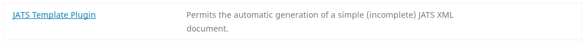
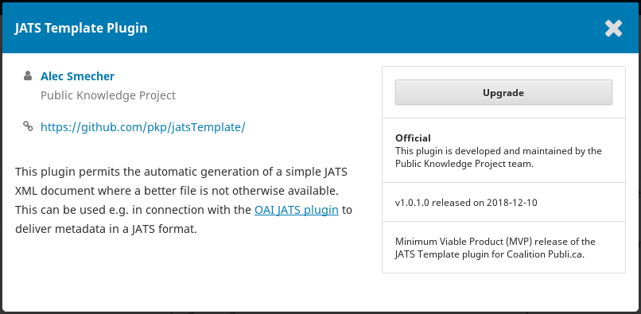
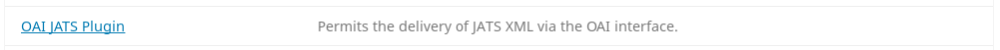
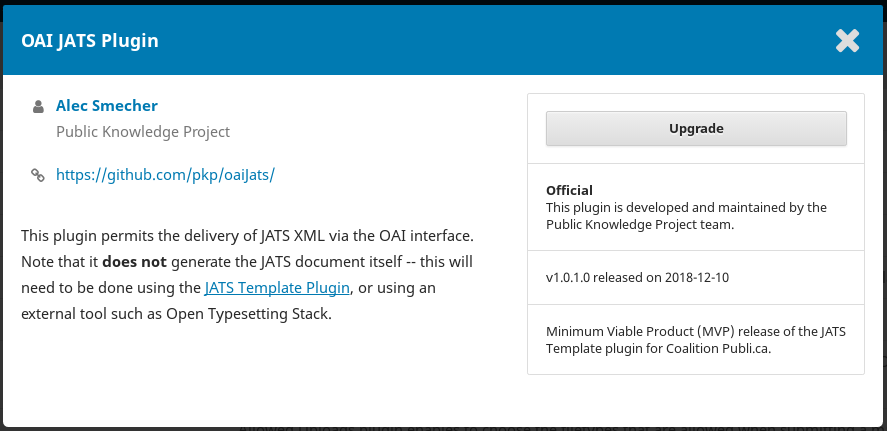
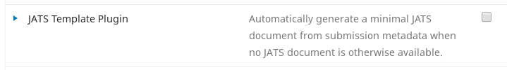
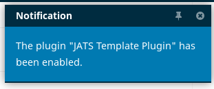
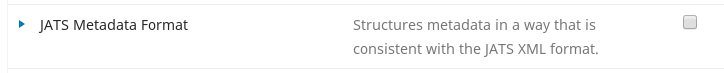
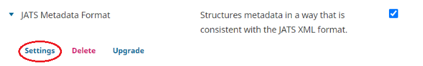
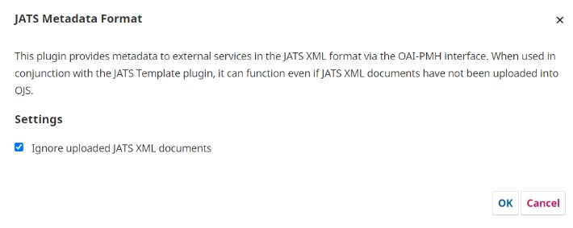
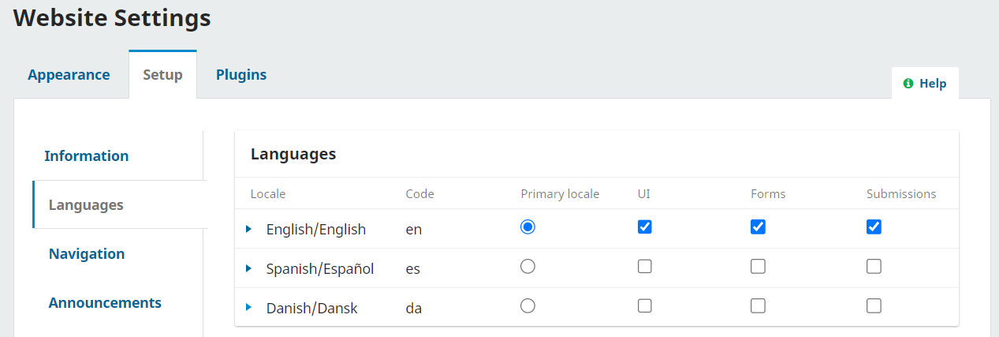

# Initial Setup

Érudit collects metadata from your OJS installation in ​[JATS XML](https://jats.nlm.nih.gov/)​. JATS is commonly used to publish or index journal articles.You will need to configure OJS to automatically generate simple JATS documents for inclusion in Érudit. 

In order to do this you will need Site Administrator permissions to install and enable plugins and to ensure language and distribution settings are properly set. 

You will need System Administration permissions to configure the text extraction and OAI repository elements. 

The steps required to install and configure OJS by each permission level are described in the following sections. 

## Site Administrator Steps {#site-admin}

### Step 1. Install the latest version of the JATS Template Plugin

Log into your OJS installation using your Site Administrator account.

Navigate to Settings > Website > Plugins.

Click on “Plugin Gallery”.

This will show a list of available plugins for installation. Find “JATS Template Plugin”:



Click on “JATS Template Plugin” to see more information about the plugin:


Click the “Install” button to install the plugin. (If you do not see the “Install” button, make sure you are logged in as a Site Administrator.) Confirm that you wish to install the plugin.

You should see a confirmation of installation:


Next, you’ll need to ensure that there is no newer version of the plugin available. 

In the “Plugin Gallery”, once again find the “JATS Template Plugin” and click on it to open the information  window. 

Click the upgrade button if available and confirm that you wish to update the plugin. If the upgrade button is unavailable, your plugin is up to date.



You will see a confirmation after the upgrade completes successfully.


### Step 2. Install the latest version of the OAI JATS Plugin
Find the “OAI JATS Plugin” in the Plugin Gallery.: 



Click on “OAI JATS Plugin” to see more information about the plugin:


Click the “Install” button to install the plugin. (If you do not see the “Install” button, make sure you are logged in as a Site Administrator.) Confirm that you wish to install the plugin.

You should see a confirmation of installation:


Next, you’ll need to ensure that there is no newer version of the plugin available. 

In the “Plugin Gallery”, once again find the “OAI JATS Plugin” and click on it to open the information  window. Click the upgrade button if available and confirm that you wish to update the plugin. If the upgrade button is unavailable, your plugin is up to date.



You will see a confirmation after the upgrade completes successfully.


### A note about updating and maintaining plugins

The plugins used for harvesting a journal’s metadata are occasionally updated to fix bugs or improve functionality. You may be instructed to update the plugins by Coalition Publica, or you may choose to update the plugins as part of regular maintenance.

Following any upgrade to your OJS, ensure that your plugins are updated to the latest version suitable for your version of OJS by following the same steps as above to update via the Plugin Gallery.

Although it is possible to update plugins in OJS by downloading the latest version from Github, it is possible that newer versions may not be compatible with your particular version OJS, so **please always update plugins from the Plugin Gallery unless otherwise instructed**

### Step 3. Enabling the Plugins

Now that you have installed the latest versions of both the JATS Template Plugin and OAI JATS Plugin, you will need to enable them *for each journal* that is to be included in Érudit.

For each journal to be included in Érudit, Navigate to Settings > Website > Plugins.

Click on “Installed Plugins” for a list of all installed plugins.

Look in the *Generic Plugins* section for “JATS Template Plugin”:



Click the checkbox on the right to enable the plugin. You should receive a confirmation:



Next, look in the *OAI Metadata Format Plugins* section for the “JATS Metadata Format” plugin (this is the OAI JATS Plugin, renamed by the system to align with this plugin section’s naming convention):



Click the checkbox beside that to enable it as well. You should receive a confirmation:


**If the journal publishes XML galleys**, you will need to change the JATS Metadata Format settings. This is **not** necessary for journals who do not publish XML galleys unless they have been directed otherwise by their Coalition Publica contact following a test harvest. 

Click the blue arrow next to JATS Metadata Format to access the plugin settings. 



Click the checkbox next to “Ignore uploaded JATS XML documents” and press OK. 



**Don’t forget to repeat Step 3 for any other journals that are to be included in Érudit.**


### Step 4. Review Required Language Locales 

A Language “Locale” is required for each language the journal publishes in, even if it does so infrequently. 

Logged in as Site Administrator, navigate to Settings > Website > Setup > Language to verify that all languages the journal publishes in are listed.



If a language is not listed, you’ll need to install that language Locale. 

Navigate to Administration > Site Settings > Site Setup > Languages. 

Click on “Install Locale” 


Click on the checkbox next to the locale(s) you need to install, and then click “Save”. 


The language should now appear in the list of available languages.


Note that if the journal publishes in French, the Français (Canada) locale is recommended for journals on Érudit.


### Step 5. Check your Distribution Settings

Under Settings > Distribution > Access, you will see a series of settings:


Ensure that “Enable OAI access to content” is checked. Save the settings.

### A Note for subscription and non publishing use of OJS

If the journal requires a subscription to access some or all of its contents, or does not use OJS to publish its content but uses the editorial workflow only, the Site Administrator or Journal Manager will need to complete the steps outlined in the *Subscriptions and Non-Publishing Use of OJS* section of this document finish configuring the journal. 

However, the steps outlined in the *Subscriptions and Non-Publishing Use of OJS* section must be taken **after** a System Administrator completes Steps 1, 2, and 3 in the System Administrator Steps section below.


## System Administrator Steps {#sys-admin}

The following steps require back-end access to  files on the server on which OJS is installed and can be performed by a System Administrator. These steps must be followed **after completing the steps outlined in the Site Administrator section**. You may need to contact your hosting provider or technical lead to perform the following steps.

### Step 1. Rebuild Your Search Index

* Ensure that OJS knows about your server’s text extraction tools: check your `config.inc.php` file in the `[search]` section to make sure your server’s locations for these tools are specified.
* If you had to modify your `config.inc.php` file to enable PDF indexing, you will also have to rebuild your search index. You can do this by running the following command on your server, in the OJS web root:

```
php tools/rebuildSearchIndex.php
```

NOTE: This step is required only if you have recently enabled PDF indexing.

* You can check that the index has been successfully rebuilt by searching for text that only appears in a PDF (ie. not in other submission metadata stored by OJS, such as title or abstract fields).

In addition to configuring your OJS for Coalition Publica, this step will also help OJS to index PDF documents for its own search indexing.


### Step 2: Configure Your OAI Namespace Identifier

Each OJS installation must have a globally unique OAI repository identifier/namespace. The identifier is configured on installation, and after that it is stored in the config.inc.php configuration file.

### Choosing a unique repository identifier
Your OAI repository identifier must be globally unique to your OJS installation. A common choice is the top-level portion of the OJS installation URL. For example, if your OJS installation's URL is `https://journals.library.example.com`, you could use `journals.library.example.com` as your identifier.
The identifier must correspond to that of the [URI (Uniform Resource Identifier)](https://www.ietf.org/rfc/rfc2396.txt?number=2396) syntax. Notably any of the reserved characters from section 2.2 cannot be used, including: `;`, `/`, `?`, `:`, `@`, `&`, `=`, `+`, `$`, or `,`.

### Editing your OAI repository identifier

This identifier can be configured within the `config.inc.php` file in your OJS installation directory and can be edited directly. It is found under the `[oai]` section of the config file and should be added after `repository_id = `. Avoid editing your repository identifier unnecessarily, but if you do, particularly if there is already a journal on your instance participating in Coalition Publica, please email info@coalition-publi.ca before doing so. 


### Step 3. Ensure that you have entered an API key secret

**The following step is only required if the journal is using OJS to publish content that requires subscription or is using OJS for workflow but not publishing.**

In your OJS configuration file (`config.inc.php` in your OJS installation directory) you will find a directive called “`api_key_secret`”. By default this setting is empty. If so, change it to contain a sequence of 32 characters or more (any letters and symbols). This will help make your installation more secure when using API keys.

You will not need to remember this setting, but if you lose it, anyone using API keys will need to get a new one.

Once the setting is no longer empty, save the file.
