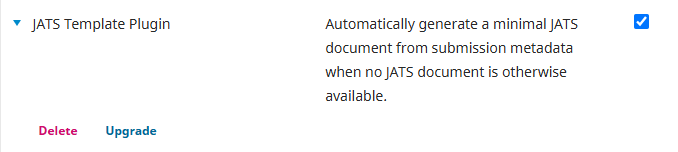
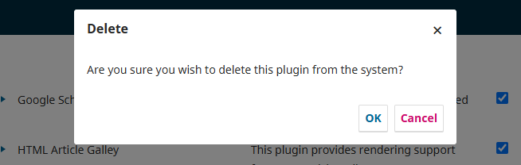

# Troubleshooting
If test harvests are unsuccessful or full text harvesting fails following successful harvests, please follow the instructions below as directed by the Coalition Publica team. They will require both Site Administrator and System Administrator permissions. 

# Uninstall and reinstall plugins and rebuild search index

## Site Administrator Steps

### Step 1. Delete the JATS Template and JATS Metadata Format plugins

Log into your OJS installation using your Site Administrator account.

Navigate to Settings > Website > Plugins.

Click on “Installed Plugins” for a list of all installed plugins.

Look in the *Generic Plugins* section for “JATS Template Plugin” and click on the blue arrow. 

Click the Delete button.



Confirm that you want to delete the plugin from the system.



Look in the *OAI Metadata Format Plugins* section for the “JATS Metadata Format” plugin and click on the blue arrow. 

Click the Delete button, and confirm your choice to delete the plugin from the system.

### Step 2. Reinstall and enable the two plugins.

Follow Steps 1 through 3 in the Initial setup{initial-setup#site-admin} instructions to reinstall and enable the JATS OAI and JATS Metadata plugins.

## System Administrator Steps

### Step 1. Rebuild Your Search Index

* Ensure that OJS knows about your server’s text extraction tools: check your `config.inc.php` file in the `[search]` section to make sure your server’s locations for these tools are specified.
* If you had to modify your `config.inc.php` file to enable PDF indexing, you will also have to rebuild your search index. You can do this by running the following command on your server, in the OJS web root:

```
php tools/rebuildSearchIndex.php
```

* You can check that the index has been successfully rebuilt by searching for text that only appears in a PDF (ie. not in other submission metadata stored by OJS, such as title or abstract fields).


### Step 2. Troubleshoot PDF full text parsing tool

Check that PDF parsing tools are installed and configured correctly

In the OJS directory, check within the config.inc.php file for the [search] section. Look under the area that starts with ; PDF. This is where the PDF parsing tool should be enabled. This will look something like:

```
index[application/pdf] = "/usr/bin/pdftotext -enc UTF-8 -nopgbrk %s - | /usr/bin/tr '[:cntrl:]' ' '"
```

The following should be confirmed:

One of the tools is enabled/uncommented in the config file. 
One of the lines under ; PDF should be uncommented (not prefixed with a ;).

In the example above, /usr/bin/pdftotext is the tool that will be used. You should confirm that the specified tool is correctly installed on the server, and the path is correct for your OS/version.
