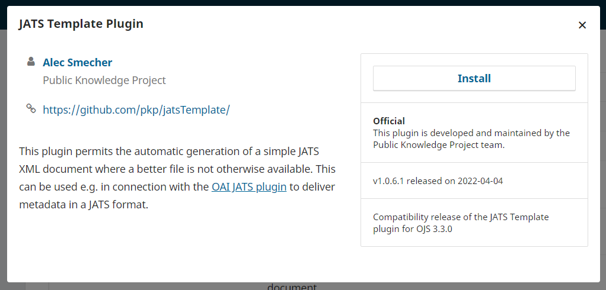
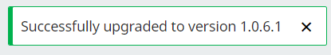
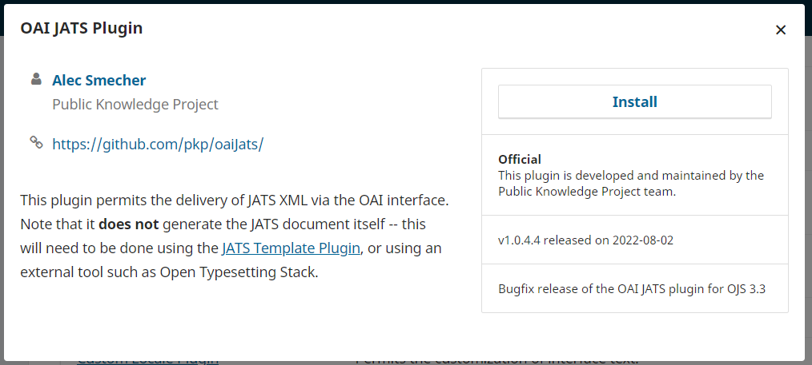
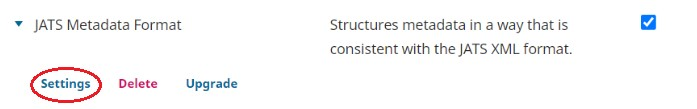
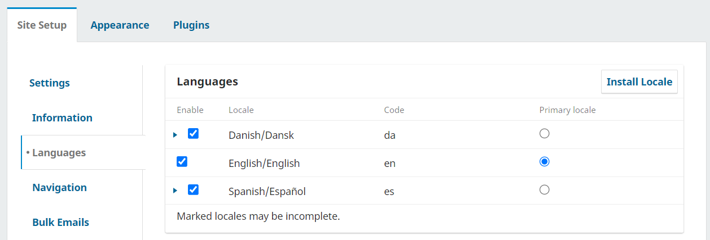
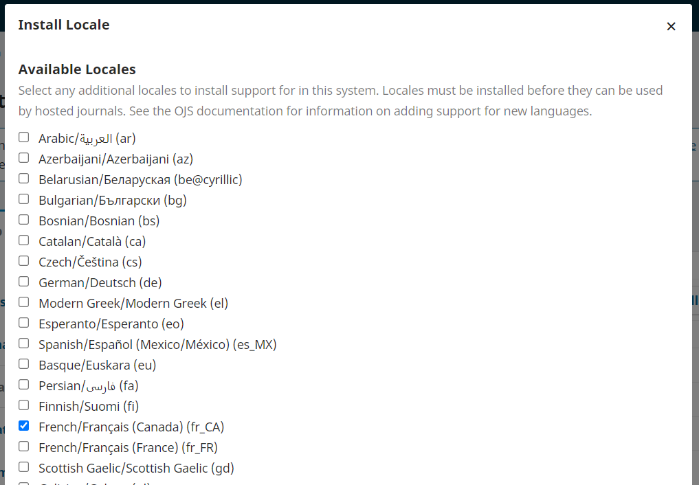
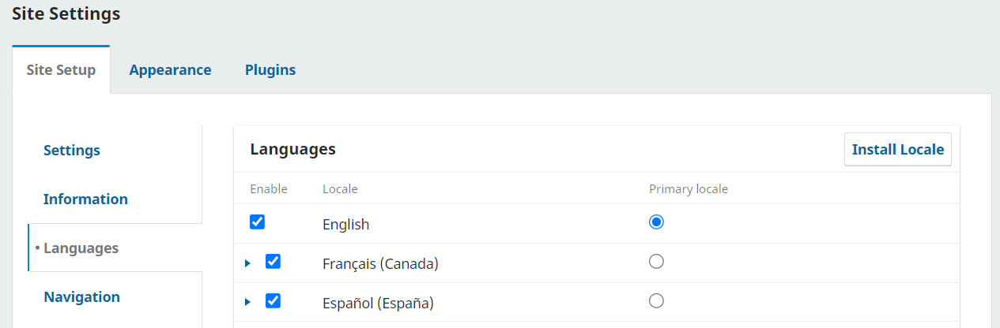

# Configuration initiale

Érudit utilise le format XML standardisé ​[JATS](https://jats.nlm.nih.gov/)​ pour récupérer les articles de votre instance OJS. Vous pouvez configurer OJS afin qu’il génère automatiquement des fichiers JATS simples permettant la diffusion sur Érudit. 

Vous devez disposer des droits d'administrateur du site pour installer et activer des *plugins* et pour vous assurer que les paramètres de langue et de distribution sont correctement définis. 

Vous devez disposer des droits d'administration du système pour configurer l'extraction de texte et les éléments du référentiel OAI. 

Les étapes nécessaires à l'installation et à la configuration d'OJS pour chaque niveau d'autorisation sont décrites dans les sections suivantes.


## Étapes de l’administrateur du site {#site-admin}

### Étape 1. Installer la dernière version du JATS Template Plugin

Connectez-vous à votre instance OJS avec les paramètres de connexion de votre compte Administrateur de site.

Allez dans Paramètres > Site Web > Modules externes

Cliquez sur “Galerie de plugiciels”.

Une liste des plugins​ disponibles pour installation sera affichée. Recherchez “JATS Template Plugin”:


Cliquez sur “JATS Template Plugin” pour afficher plus d’informations sur ce ​plugin​:



Cliquez sur le bouton “Installer” afin d’installer le ​plugin​. (Si vous ne voyez pas le bouton “Installer”, assurez-vous d’être connecté en tant qu’Administrateur de site.) Confirmez que vous souhaitez bien installer le ​plugin.​

Vous devriez voir une notification confirmant l’installation :


Ensuite, vous devez vous assurer qu'il n'existe pas de version plus récente du plugin. 

Dans la “Galerie de plugiciels”, trouvez à nouveau le "JATS Template Plugin" et cliquez dessus pour afficher plus d'informations. 

Cliquez sur le bouton de mise à jour s'il est disponible et confirmez que vous souhaitez mettre à jour le plugin. Si le bouton de mise à jour n'est pas disponible, votre plugin est à jour.


Vous devriez voir une notification confirmant la dernière version disponible du ​plugin​ à été installée.

 


### Étape 2. Installer la dernière version du OAI JATS Plugin

Recherchez “OAI JATS Plugin” dans la “Galerie de plugiciels”:


Cliquez sur “OAI JATS Plugin” pour afficher plus d’informations sur ce ​plugin​ :



Cliquez sur le bouton “Installer” afin d’installer le ​plugin​. (Si vous ne voyez pas le bouton “Installer”, assurez-vous d’être connecté en tant qu’Administrateur.) Confirmez que vous souhaitez bien installer le ​plugin​.

Vous devriez voir ce message confirmant l’installation :


Ensuite, vous devez vous assurer qu'il n'existe pas de version plus récente du plugin. 

Dans la “Galerie de plugiciels”, recherchez à nouveau le “OAI JATS Plugin” et cliquez dessus pour afficher plus d’informations.

Cliquez sur le bouton de mise à jour s'il est disponible et confirmez que vous souhaitez mettre à jour le plugin. Si le bouton de mise à jour n'est pas disponible, votre plugin est à jour.


Vous devriez voir une notification confirmant la dernière version disponible du ​plugin​ à été installée.


### Une note sur la mise à jour des plugins

Les plugins utilisés pour récolter les métadonnées de votre revue sont occasionnellement mis à jour pour corriger des bogues ou améliorer les fonctionnalités. Coalition Publica peut vous demander de mettre à jour les plugins, ou vous pouvez choisir de le faire dans le cadre d’une maintenance régulière.

Après toute mise à jour de votre OJS, assurez-vous que tous vos plugins sont mis à jour avec la dernière version adaptée à votre version d’OJS  en suivant les mêmes étapes que ci-dessus  pour effectuer une mise à jour via la Galerie de plugiciels.

Bien qu’il soit possible de mettre à jour les plugins dans OJS en téléchargeant la dernière version à partir de Github, il est possible que les nouvelles versions ne soient pas compatibles avec votre version particulière d’OJS, donc **s’il vous plaît, mettez toujours à jour les plugins à partir de la Galerie de plugiciels, sauf indication contraire.**


### Étape 3. Activer des plugins

Un coup les dernières versions des ​plugins​ JATS Template Plugin et OAI JATS Plugin installés, vous devez les activer​ **une fois ​pour chaque revue** que vous souhaitez inclure à Érudit.

Pour chaque revue à inclure à Érudit, allez dans Paramètres > Site Web > Modules externes.

Cliquez sur “Plugiciels installés” pour une liste des ​plugins installés.

Dans la rubrique *Plugiciels génériques* cherchez “JATS Template Plugin” 


Cochez la case à droite pour activer le ​plugin.​ Vous devriez voir ce message de confirmation:


Cherchez ensuite sous la rubrique *Plugiciels du format de métadonnées OAI* dans la liste des plugiciels installés pour le plugiciel “Format de métadonnées JATS” (il s'agit du plugin OAI JATS, renommé par le système pour s'aligner sur la convention de nommage de cette rubrique)


Cochez aussi la case à droite pour l’activer. Vous devriez voir ce message de confirmation :


**Si vous publiez les épreuves XML de vos articles**, vous devrez modifier les paramètres du plugin format des métadonnées JATS. Les revues qui ne publient **pas** d’épreuves XML peuvent ignorer cette étape, à moins qu'elles n'aient reçu des instructions contraires de la part de leur contact Coalition Publica à la suite d'un test de moissonnage.

Cliquez sur la flèche bleue à côté de “Format de métadonnées JATS” afin d’accéder aux paramètres du plugin:



Cochez ensuite la case à côté de "Ignorer les documents XML JATS téléchargés", puis cliquez sur OK. 


Si cette option n'apparaît pas pour vous, veuillez mettre à jour le plugin en suivant les instructions ci-dessous, puis réessayez.

**N’oubliez pas de répéter l’étape 3 pour chaque revue que vous souhaitez inclure à Érudit.**


### Étape 4. Réviser les paramètres régionales de revue

Un « paramètre régional » est requise et doit être installé pour pour chaque langue dans laquelle le journal publie, même s'il ne le fait que rarement.

Connecté en tant qu'administrateur du site, allez à Paramètres > Site web > Configuration > Langue pour vérifier que toutes les langues dans lesquelles la revue publie sont répertoriées.


Si une langue n'est pas répertoriée, vous devez installer cette langue. 

Allez à Administration > Paramètres du site > Réglage du site > Langues. 

Cliquez sur Installer le paramètre régional:



Cochez les paramètres régionaux que vous souhaitez installer et cliquez sur Enregistrer.



La langue devrait maintenant apparaître dans la liste des langues disponibles.



Notez que si la revue publie en français, la paramètre régional Français (Canada) est recommandée pour les revues sur Érudit.


### Étape 5. Vérifier les paramètres de distribution

Sous Paramètres > Distribution > Accès, vous verrez un ensemble de paramètres :


Assurez-vous d’avoir coché “​*Enable OAI access to content*​”. Enregistrez les paramètres.

### Note concernant les clés API

Un paramétrage supplémentaire est nécessaire pour permettre à Coalition Publica de moissonner le contenu de vos articles et numéros diffusés sur OJS dans les cas suivants : 
*la revue utilise OJS pour publier du contenu requérant un abonnement ;
*la revue utilise OJS pour la gestion éditoriale sans publier ;
*la revue a choisi la production XML du texte intégral et Érudit a besoin d'accéder aux fichiers prêts pour la production pour moissonnage.

Si Coalition Publica vous demande une clé API, l'administrateur du site ou quelqu’un ayant le rôle Directeur de la revue devra suivre les étapes décrites dans la section *Fournir une cleé API* du présent document pour terminer la configuration de la revue. 

Toutefois, les étapes décrites dans la section *Fournir une clé API* doivent être réalisées **après** qu'un administrateur système a effectué les étapes 1, 2 et 3 de la section Étapes de l'administrateur système ci-dessous.


## Étapes de l'administrateur système {#sys-admin}

Les étapes suivantes nécessite un accès *backend* à OJS par un administrateur système. Ces étapes doivent être suivies **après avoir effectué les étapes décrites dans la section relative à l'administrateur du site.** Il se peut que vous deviez contacter votre fournisseur d'hébergement ou votre responsable technique pour effectuer les étapes suivantes.


### Étape 1. Activer l’indexation des PDF

Cette étape peut requérir l'aide de votre administrateur système puisqu'elle requiert l’accès à un fichier sur le serveur où votre instance OJS est installée.

* Assurez-vous que votre instance OJS connaisse l’emplacement de vos outils d’extraction de texte sur vos serveurs : vérifiez la section ​`[search]`​ de votre fichier ​`config.inc.php`​ pour vous assurer que les emplacements serveur de ces outils sont spécifiés.
* Si vous avez dû modifier votre fichier ​`config.inc.php`​ pour activer l’indexation PDF, vous devrez également reconstruire votre index de recherche. Vous pouvez le faire en exécutant la commande suivante sur votre serveur, dans la racine Web OJS:

```
php tools/rebuildSearchIndex.php
```

REMARQUE: cette étape n’est requise que si vous avez récemment activé l’indexation PDF.

* Vous pouvez vérifier que l’index a été correctement reconstruit en recherchant du texte qui n’apparaît que dans un PDF (c’est-à-dire pas dans d’autres métadonnées de soumission stockées par OJS, telles que des champs de titre ou de résumé).

En plus de configurer votre OJS pour Coalition Publica, cela permettra à OJS d’indexer les documents PDF pour son propre moteur de recherche.


## Étape 2. Configurez l’identifiant d’espace de nom de votre OAI

Le dépôt OAI de chaque instance OJS doit être configuré afin d’avoir un identifiant d’espace de nom (un *namespace-identifier* selon la syntaxe OAI-PMH) unique. L'identifiant est configuré lors de l'installation, et se trouve par la suite dans le fichier de configuration config.inc.php.

### Choisir un identifiant unique pour le dépôt OAI
L’identifiant d’espace de nom de votre dépôt OAI doit être unique au sein de l’instance OJS sur laquelle votre revue est hébergée. Un choix logique consiste à utiliser la partie de premier niveau de l’URL de l’instance OJS. Par exemple, si l’URL est “https://revues.bibliotheque.exemple.com”, vous pouvez utiliser “revues.bibliotheque.exemple.com” comme identifiant de nommage. 
L’identifiant d’espace de nom que vous utilisez doit respecter la syntaxe [URI (Uniform Resource Identifiers)](https://www.ietf.org/rfc/rfc2396.txt?number=2396). En particulier, tous les caractères réservés de la section 2.2 ne peuvent pas être utilisés : `;`, `/`, `?`, `:`, `@`, `&`, `=`, `+`, `$`, ou `,`.

### Modifier l'identifiant d’espace de nom de votre dépôt OAI

Cet identifiant peut être configuré dans le fichier config.inc.php dans votre répertoire d'installation OJS et peut être modifié directement. Il se trouve dans la section [oai] du fichier de configuration et doit être ajouté après repository_id = . Évitez de modifier inutilement l'identifiant de votre dépôt, mais si vous devez le modifier, veuillez envoyer un courriel à info@coalition-publi.ca avant de le faire surout s'il y a déjà une revue sur votre instance qui participe à Coalition Publica.

### Étape 3. S’assurer d’avoir saisi un API key secret

**Cette étape n’est que requise si Coalition Publica vous une clé API.**

Dans votre fichier de configuration OJS (​`config.inc.php`​ dans le répertoire d’installation de votre OJS) vous trouverez une directive appelée “`api_key_secret`​”. Par défaut, ce paramètre est vide. Si c’est le cas, modifiez-le pour qu’il contienne une séquence de 32 caractères ou plus (n’importe quelle lettres et symboles). Votre instance OJS en sera plus sécurisée lors de l’utilisation des ​*API keys​*.

Vous n’aurez pas à mémoriser la valeur de ce paramètre, mais si vous le perdez, tous ceux utilisant les ​*API keys​* devront en obtenir une nouvelle.

Un coup le paramètre renseigné, sauvegardez le fichier.

