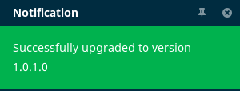
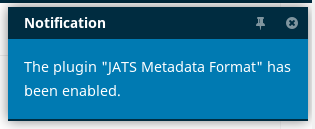
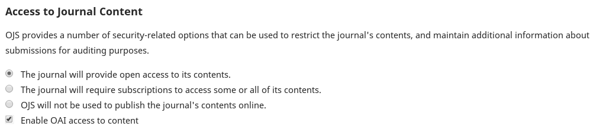

# Utiliser JATS avec OJS

Érudit utilise le format XML standardisé ​[JATS](https://jats.nlm.nih.gov/)​ pour récupérer les articles de votre instance OJS. L’utilisation de JATS est répandue pour la publication et l’indexation d’articles de revue. Toutefois, la création et l’utilisation de JATS peut s’avérer complexe. Il y a plusieurs façons de travailler avec JATS dans le contexte d’OJS.

La présente documentation part du principe que vous ne produisez pas déjà de XML JATS dans d’autres contextes (par exemple, à des fins d’indexation ou d’affichage). Si au contraire vous avez déjà vos articles au format XML JATS, svp contactez-nous.

Vous pouvez configurer OJS afin qu’il génère automatiquement des fichiers JATS simples permettant la diffusion sur Érudit. Il s’agit d’installer et activer deux ​*plugins*​. Voici les étapes à suivre :

## Étape 1. Installer JATS Template Plugin

Connectez-vous à votre instance OJS avec les paramètres de connexion de votre compte Administrateur.

Allez dans Paramètres > Site Web > Modules externes

Cliquez sur “Galerie de plugiciels”.

Une liste des ​*plugins*​ disponibles pour installation sera affichée. Recherchez “JATS Template Plugin”:

Cliquez sur “JATS Template Plugin” pour afficher plus d’informations sur ce ​*plugin​*:

(Votre version du ​*plugin*​ pourrait être différente de celle indiqué ci-haut. Nous recommandons de toujours utiliser la dernière version du ​*plugin*​ disponible dans la Galerie de plugiciels.)

Cliquez sur le bouton “Installer” afin d’installer le *​plugin*​. (Si vous ne voyez pas le bouton “Installer”, assurez-vous d’être connecté en tant qu’Administrateur.) Confirmez que vous souhaitez bien installer le ​*plugin*.​

Vous devriez voir une notification confirmant l’installation:

La dernière version disponible du ​*plugin*​ sera installée. (Lorsque de nouvelles versions du *plugin*​ seront disponibles, vous pourrez les mettre à jour de la même façon. Encore une fois, le numéro de version affiché pourrait différer de celle de la copie d’écran ci-haut.)

Afin de fournir à Érudit des contenus au format JATS, vous devez avoir la version **JATS Template Plugin 1.0.1.0 ou plus récente​**.

## Étape 2. Installer OAI JATS Plugin

Connectez-vous à votre instance OJS avec les paramètres de connexion de votre compte Administrateur.

Allez dans Paramètres > Site Web > Modules externes. Cliquez sur “Galerie de plugiciels”.

Une liste des ​*plugins*​ disponibles pour installation sera affichée. 

Rechechez “OAI JATS Plugin”:

Cliquez sur “OAI JATS Plugin” pour afficher plus d’informations sur ce ​*plugin​*:

(Votre version du ​*plugin*​ pourrait être différente de celle indiqué ci-haut. Nous recommandons de toujours utiliser la dernière version du ​*plugin​* disponible dans la Galerie de plugiciels.)

Cliquez sur le bouton “Installer” afin d’installer le ​*plugin*​. (Si vous ne voyez pas le bouton “Installer”, assurez-vous d’être connecté en tant qu’Administrateur.) Confirmez que vous souhaitez bien installer le ​*plugin​*.

Vous devriez voir ce message confirmant l’installation:

La dernière version disponible du ​*plugin*​ sera installée. (Lorsque de nouvelles versions du *plugin*​ seront disponibles, vous pourrez les mettre à jour de la même façon. Encore une fois, le numéro de version affiché pourrait différer de celle de la copie d’écran ci-haut.)

Afin de fournir à Érudit des contenus au format JATS, vous devez avoir la version **OAI JATS Plugin 1.0.1.0 ou plus récente​**.

## Étape 3. Activer les plugins

Un coup les *​plugins*​ JATS Template Plugin et OAI JATS Plugin installés, vous devez les activer.

**Il faut activer les ​*plugins*​ une fois ​*pour chaque revue*​ que vous souhaitez inclure à Érudit.** 

Allez dans Paramètres > Site Web > Modules externes.

Cliquez sur “Plugiciels installés”.

Cherchez “JATS Template Plugin” dans la liste des ​*plugins*:​

Cochez la case à droite pour activer le ​*plugin*.​ Vous devriez voir ce message de confirmation:

Cherchez ensuite “JATS Metadata Format”:

Cochez aussi la case à droite pour l’activer. Vous devriez voir ce message de confirmation:

Répétez ces étapes pour chaque revue que vous souhaitez inclure à Érudit.

## Étape 4. Réviser les paramètres de revue

Plusieurs paramètres de revue doivent être correctement configurés afin de permettre la récupération des données par Érudit. Pour chaque revue que vous souhaitez inclure, assurez-vous que:

* Pour chacune des rubriques de la revue, le champ “Identifier les articles publiés dans cette rubrique en tant que un(e)” utilise une des ​[valeurs suggérées pour le JATS article-type](https://jats.nlm.nih.gov/archiving/tag-library/1.1/attribute/article-type.html)​.
* Les paramètres de revue sont complets, ex.:
	* Un ISSN est spécifié
	* Le titre de la revue est le même que celui enregistré à ​[issn.org](https://www.issn.org/)
	* Un éditeur est spécifié dans Paramètres > Revue > Bloc générique
	* Droit d’auteur
		* Assurez-vous que le titulaire du droit d’auteur des articles (“Auteur”, “Revue” ou “Autre”) soit adéquatement identifié dans Paramètres > Distribution > Autorisations.
		* Assurez-vous, lorsque vous établissez le “Calendrier de publication” d’un article, d’y associer les autorisations (titulaire du droit d’auteur et année du droit d’auteur)
* Assurez-vous que votre instance OJS connaisse l’emplacement de vos outils d’extraction de texte sur vos serveurs. Vérifiez la section ​`[search]`​ de votre fichier `config.inc.php`​ pour vous assurer que les emplacements serveur de ces outils sont spécifiés. Par ailleurs, cela permettra à OJS d’indexer les documents PDF pour son propre moteur de recherche. (Cette étape peut requérir l’aide de votre administrateur système puisqu’elle requiert l’accès à un fichier sur le serveur où votre instance OJS est installée.)

## Étape 5. Reconstruisez votre index de recherche

Si vous avez dû modifier votre fichier `config.inc.php` pour activer l'indexation PDF comme indiqué à l'étape 4, vous devrez également reconstruire votre index de recherche. Vous pouvez le faire en exécutant la commande suivante sur votre serveur, dans la racine Web OJS:

`php tools/rebuildSearchIndex.php`

Vous pouvez vérifier pour confirmer que l'index a été correctement reconstruit en recherchant du texte qui n'apparaît que dans un PDF (c'est-à-dire pas dans d'autres métadonnées de soumission stockées par OJS, telles que des champs de titre ou de résumé).

REMARQUE: cette étape n'est requise que si vous avez récemment activé l'indexation PDF.

## Étape 6. Vérifier les paramètres de distribution

Sous Paramètres > Distribution > Accès, vous verrez un ensemble de paramètres:

Quel que soit votre choix pour votre revue parmi les 3 premiers paramètres d’accès, assurez-vous d’avoir coché “​*Enable OAI access to content*​”. Enregistrez les paramètres.

Si vos paramètres d’accès sont configurés

* pour exiger un abonnement pour accéder à une partie ou à l’intégralité de son contenu, ou
* ne pas utiliser OJS pour publier le contenu de la revue en ligne

... suivre les instructions ci-dessous, à la section ​*Abonnements et utilisation d’OJS sans publication*,​ afin d’inclure ses contenus sur Érudit.

## Étape 7. Activer l’inclusion

Contactez-nous pour vous assurer que les données de votre revue sont récupérées pour une diffusion sur Érudit dans le cadre de Coalition Publica!
