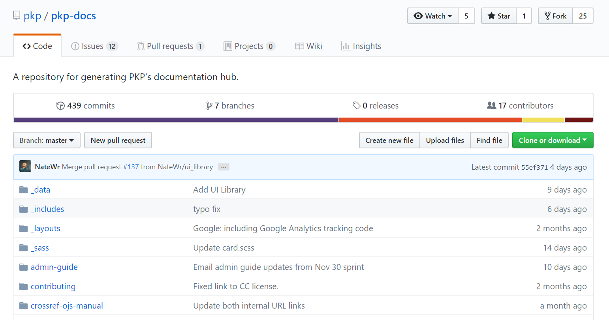

# Create and Edit Documentation

Most of PKP's documentation is hosted and managed in a GitHub repository called the PKP Documentation Hub and displayed as a website using an open source tool called [Jekyll](https://jekyllrb.com). The content files that make up PKP's documentation are stored in the [Documentation Hub repository](https://github.com/pkp/pkp-docs) and you can edit documents and add new documents to the repository with just a Github account. This chapter explains how to edit and add new documents in the repository.

Each folder represents a document. Short documents consist of a single file and maybe an Assets folder of image files.

, the abstract, and scrolling down...`

Here are three guides for writing markdown:

- [Daring Fireball Markdown Syntax](https://daringfireball.net/projects/markdown/syntax)
- [Mastering GitHub Flavoured Markdown](https://guides.github.com/features/mastering-markdown/)
- [Markdown Cheatsheet](https://github.com/adam-p/markdown-here/wiki/Markdown-Cheatsheet)

## Create a document

## Edit a document

If you want to edit existing documentation or add a section or chapter to existing documentation, you can edit the document directly from the docs repository itself.

1. Create a [GitHub](https://github.com) account if you do not already have one and log in.
2. Navigate to https://github.com/pkp/pkp-docs
3. Follow the directory structure in GitHub until you see the file you want to edit.
4. Click the filename to view that individual file.
5. From there, on the top right of the document window, you should see a small pencil icon.
6. Click that button to open up a plain text editor for the document within GitHub itself.

