# Getting Started

Most of PKP’s documentation is [hosted and managed in the pkp-docs GitHub repository](https://github.com/pkp/pkp-docs) and is published to the [web-based PKP Docs Hub](https://docs.pkp.sfu.ca/) using an open source tool called [Jekyll](https://jekyllrb.com/). GitHub is a collaborative version control system that manages and stores revisions of a project. 

The content files that make up PKP’s documentation are stored in the [pkp-docs repository](https://github.com/pkp/pkp-docs), and anyone with a GitHub account can edit and add documents. This chapter explains the important things you will need to know when working with PKP documentation and GitHub.

## Markdown

PKP documentation files are all in a format called Markdown, a simple, easy-to-read, easy-to-write text format that allows users to generate basic HTML without knowing HTML itself. It uses simple tags to format text on a website. Content files written in Markdown use the `.md` file extension.

Here are some examples of Markdown:

____

```
I am _really_ looking forward to learning Markdown.
```
The pair of `_` symbols surrounding the text generate italics for emphasis that are equivalent to the `<em>` element in HTML.
____

```
## About the Documentation Hub
```
The ## creates a header that is equivalent to the `<h2>` element in HTML.
____

```
Here's a helpful [guide to Markdown](https://daringfireball.net/projects/markdown/syntax).
```
The `[]()` symbols generate linked text that is equivalent to the `<a href=""`> element in HTML.
____


To learn more, consult these three guides for writing Markdown:

- [Daring Fireball Markdown Syntax](https://daringfireball.net/projects/markdown/syntax)
- [Mastering GitHub Flavoured Markdown](https://guides.github.com/features/mastering-markdown/)
- [Markdown Cheatsheet](https://github.com/adam-p/markdown-here/wiki/Markdown-Cheatsheet)


## File Structure

Each folder in the pkp-docs repository represents one document, meaning one guide, which may have multiple "chapters" represented by multiple files. For instance, this guide to contributing to PKP's documentation resides in the `contributing` folder.

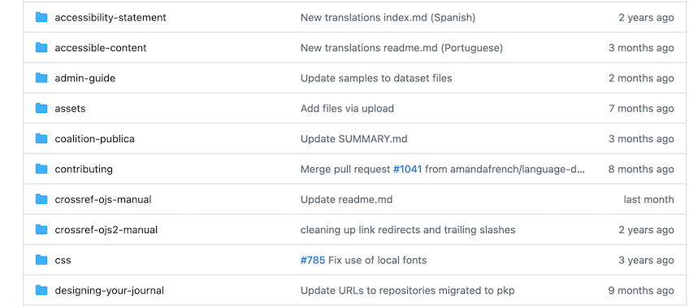

Within each document's main folder is an `index.md` Markdown file that contains information about the document's title, description, contributors, version, and languages. 

Single-page documents consist of only the single Markdown file `index.md` and, if necessary, an `/assets` folder for images. All document content is contained in the `index.md` file.

Sub-folders may include separate folders for each language version, named according to the two-character ISO code for the language, e.g., `en` for the English version and `pt` for the Portuguese version. 

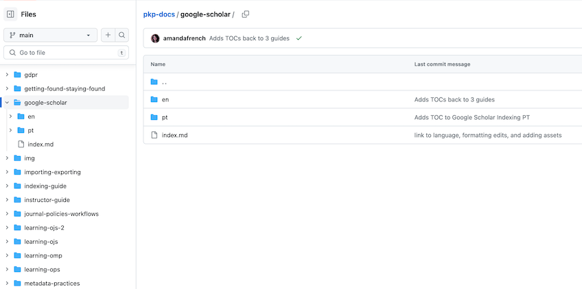

Additional sub-folders may include separate folders for previous software versions. When there are previous version folders, the top-level language folders will include documentation for the current version. 

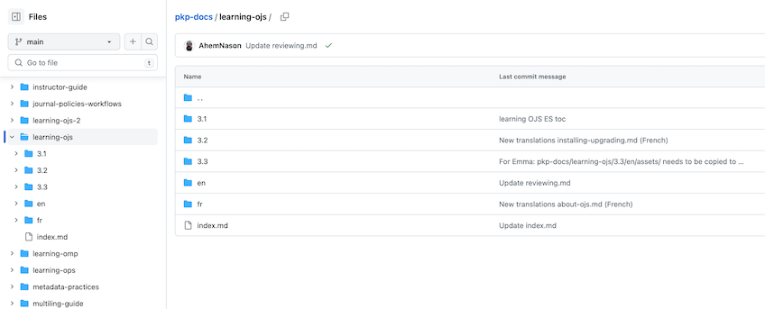

Within sub-folders, longer multi-page documents consist of a README file, a SUMMARY file, multiple content files ("chapters") in `.md` format, and an `/assets` folder that contains the document's images. The README file is the main landing page for the document, the SUMMARY file creates the table of contents, and the document content is stored in the separate chapter files. 

**All content files must be written in Markdown and have the `.md` file extension.**

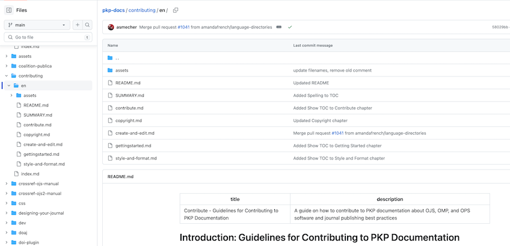

Notice that the folder and file structure in the repository controls the URL structure for locations of documents on the Docs Hub. For instance, the README.md landing page of "Style and Format" chapter of this document on contributing to PKP documentation is located in the directory `/contributing/en/style-and-format`, and the content of that file is what you will see when you navigate to the URL `https://docs.pkp.sfu.ca/contributing/en/style-and-format` on the Docs Hub.

## File Naming Conventions

**In General**: While any name you create should work, it’s best to keep titles short and descriptive. Always replace spaces between words with a dash.

**Titles**: Some example titles include: `learning-ojs`, `pkp-theming-guide`, `crossref-ojs-manual`. Remember that titles are part of the file path in the URL to individual docs so keep it simple.

**Chapters**:  You might be tempted to number chapters, but if we ever need to create new chapters in between existing ones, we would need to re-number. It’s best to keep chapters in the same style as title-level names. Some examples for chapters include: `getting-started.md`, `troubleshooting.md`, `data-import-and-export.md`.

**Images**: Store all images in a single "assets" folder in the language folder you’re working (e.g.,: `/learning-ojs/en/assets/`). Keep your image titles brief or with abbreviations and consistently named, so they’re easy to locate. Depending on how many images you have, numbering these might be a lot more convenient while working on the document. Listen to your heart. Some examples include: `contrib-01.png`, `authoring-images-01.png`. If you’re putting all your images into only the asset folder, it’s a good idea to name your images to correspond with chapter titles.

Note that file names are case sensitive, so if the image is saved as `learning-ojs3.1-jm-settings-workflow-email-templates.png` and you reference `Learning-OJS3.1-jm-Settings-Workflow-Email-Templates.png` in the document, the image will not display.


## GitHub Basics

The PKP Documentation Hub is stored and managed in the [pkp-docs GitHub repository](https://github.com/pkp/pkp-docs), and we therefore recommend that documentation contributors have a GitHub account and be able to execute basic functions in GitHub, although there are also other ways to contribute, as described below.  

Some key GitHub terms are defined in the [GitHub Docs Glossary](https://docs.github.com/en/get-started/quickstart/github-glossary) and linked to below. To learn even more about GitHub and Git, watch this ["What Is Git and GitHub?" video](https://www.youtube.com/watch?v=uUuTYDg9XoI) or this ["Git and GitHub for Poets" video](https://www.youtube.com/playlist?list=PLRqwX-V7Uu6ZF9C0YMKuns9sLDzK6zoiV) or consult the [GitHub Flow](https://docs.github.com/en/get-started/quickstart/github-flow) quickstart guide. 

To begin contributing to PKP Documentation, you will need to [create a GitHub account](https://github.com/join?source=header-home) if you don't already have one. 

Also, since most contributors will not have direct edit access to PKP documents, you will need to create a [fork](https://docs.github.com/en/get-started/quickstart/github-glossary#fork) of the [pkp-docs repository](https://github.com/pkp/pkp-docs) in your own account so that you can [commit](https://docs.github.com/en/get-started/quickstart/github-glossary#commit) changes to your own fork and then submit a [pull request](https://docs.github.com/en/get-started/quickstart/github-glossary#pull-request) via one of the methods described below so that your work can be reviewed, merged, and published.

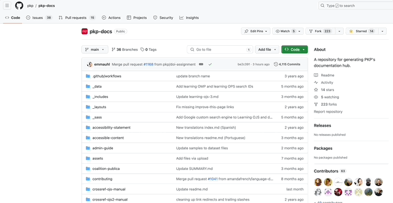


## Editing on GitHub 

If you want to edit existing documentation or add a section or chapter to existing documentation, you can edit the document directly from the docs repository itself on github.com.

1. Create a [GitHub](https://github.com) account if you do not already have one and log in.
2. [Fork](https://docs.github.com/en/get-started/quickstart/github-glossary#fork) the [pkp-docs GitHub repository](https://github.com/pkp/pkp-docs) to your own account.
2. Navigate to [the Docs Hub repository in GitHub](https://github.com/pkp/pkp-docs).
3. Follow the directory structure in GitHub until you see the file you want to edit.
4. Click the filename to view that individual file.
5. From there, on the top right of the document window, you will see a small pencil icon.
6. Click the pencil icon to open up a plain text editor for the document within GitHub itself.
7. Edit the document. When you are finished, click the green "Commit Changes" button in the top right. Your changes will be saved to a new [branch](https://docs.github.com/en/get-started/quickstart/github-glossary#branch) in your fork of the pkp-docs repository.
8. Create a [pull request](https://docs.github.com/en/get-started/quickstart/github-glossary#pull-request) for your changes. Someone will review your changes, merge them into the pkp-docs repository, and publish them to the Docs Hub. 


<figure class="video_container">
  <video controls="true" allowfullscreen="true">
    <source src="./assets/contrib-01.mp4" type="video/mp4">
  </video>
  <figcaption>File edit menu in GitHub.</figcaption>
</figure>


## Editing on the PKP Docs Hub 

You can also edit existing documentation directly from the [PKP Docs Hub](https://docs.pkp.sfu.ca/) on the web. Clicking "Make a suggestion" will bring up an email contact form where you can write to PKP to ask for a change to  documentation. Clicking "Edit this page" will allow you to make edits in the pkp-docs GitHub repository exactly as though you were editing on GitHub.com as described above. 


## Editing with GitHub Desktop

If you're working on a large piece of documentation and you're not comfortable using either the command line or the web interface for GitHub, consider using [GitHub Desktop](https://desktop.github.com/) and a [compatible text editor](https://docs.github.com/en/desktop/configuring-and-customizing-github-desktop/configuring-a-default-editor-in-github-desktop) of your choice. With this workflow, you can clone a copy of the docs repository to your computer, make your edits locally, and create a pull request with your changes once you're finished.

GitHub Desktop is free to install and is available for both Mac and Windows, but you will also need to choose a text editor to use with it, and many of these require purchase. See the [list of text editors that are supported by GitHub Desktop](https://docs.github.com/en/desktop/configuring-and-customizing-github-desktop/configuring-a-default-editor-in-github-desktop) for Mac and Windows and be sure to download and install one that you're comfortable with. If you're not sure which to choose, try [BBEdit for Mac](http://www.barebones.com/products/bbedit/) or [Notepad++ for Windows](https://notepad-plus-plus.org/). 

Once you've installed GitHub Desktop and have [configured your default text editor](https://docs.github.com/en/desktop/configuring-and-customizing-github-desktop/configuring-a-default-editor-in-github-desktop#configuring-a-default-editor), you should have an option while viewing any GitHub repository on github.com to "Open with GitHub Desktop".

1. Navigate to the repository you want to clone, e.g., [https://github.com/pkp/pkp-docs](https://github.com/pkp/pkp-docs) 
2. Click on the green button on the right that says "Code."
3. Select the "Open with GitHub Desktop" option.

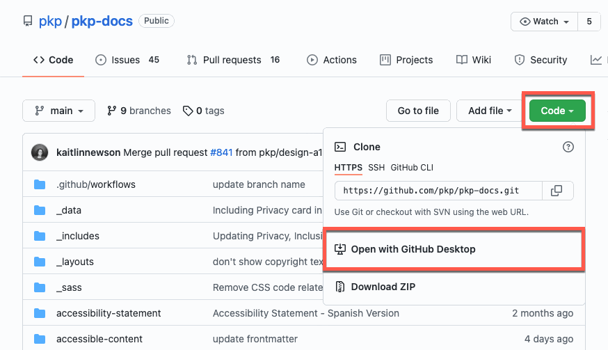

You'll be prompted to choose a download location for your copy of the repository. If you're happy with the default, click the blue "Clone" button.

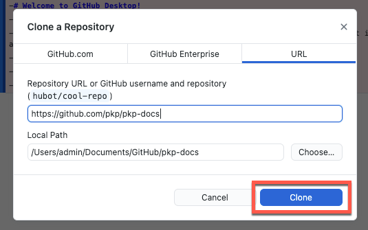

It'll take a few minutes for all the files to download.

GitHub Desktop manages your commits and pull requests locally. It's especially convenient if you're changing more than one file at once. If you like, you can open content files in a text editor directly from GitHub Desktop.

1. Open GitHub Desktop.
2. Right click on the name of the repository in which you want to work.
3. Select the option to open the repository in your default text editor.

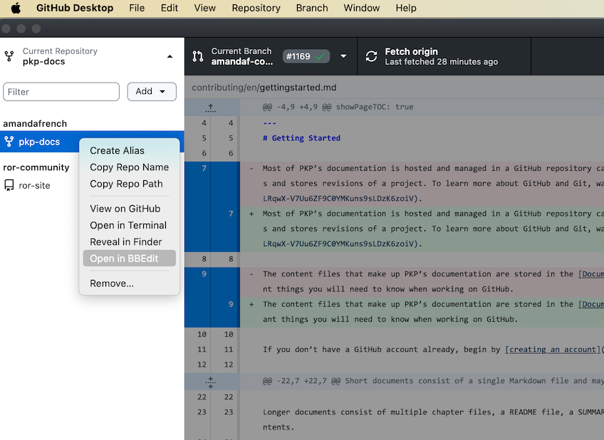

If you are working on a project over time, you may want to regularly pull changes "from origin." You can do this in GitHub Desktop by clicking the "Fetch origin" button at the top of the window. It pulls changes since the last time you pulled them (or, since the time you cloned initially).

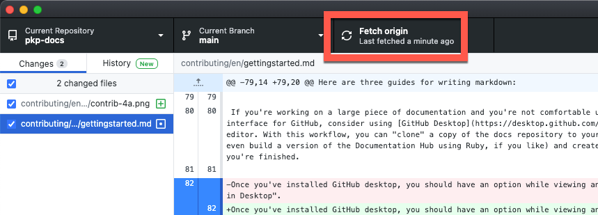

Whenever you make changes, you'll see a list of your changed files in GitHub Desktop. A green plus sign indicates a file you're adding; an orange dot denotes a file you've modified, and a red minus sign denotes a file you've removed or renamed.

In the bottom left-hand corner, you'll see a warning that you don't have write access to pkp-docs. GitHub Desktop invites you to create a fork by clicking on the hyperlink.

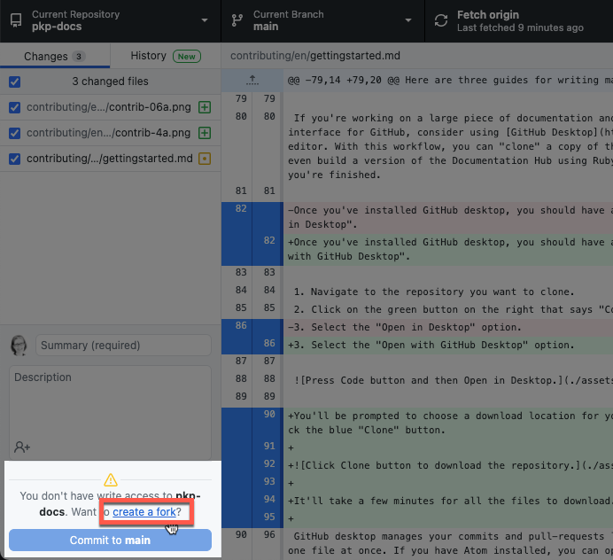

On the popup message, click the **Fork this Repository** button. GitHub then asks how you're planning to use this repository. Choose **To contribute to the parent project** and then click the blue **Continue** button.

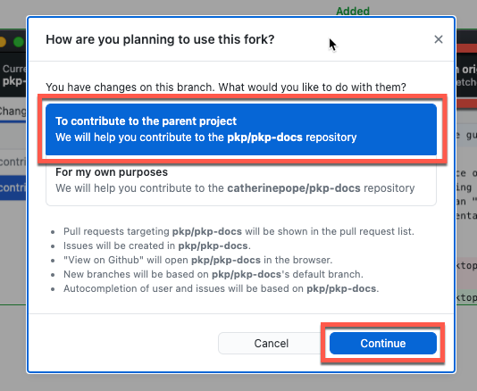

Once you've finished making your edits and have a document you want to submit, you'll need to contribute it back as a "branch."

1. In GitHub Desktop, click on the "Current Branch" button.
2. Click "New Branch"
3. Write a concise name for your branch based on the document you're submitting, with a single dash between words.
4. Click "Create Branch."

<figure class="video_container">
  <video controls="true" allowfullscreen="true">
    <source src="./assets/contrib-07.mp4" type="video/mp4">
  </video>
  <figcaption>Create a branch menu in GitHub Desktop.</figcaption>
</figure>

Now that you've made your edits/additions and created your branch, you can _commit_ your code. On the left side of your GitHub Desktop window, you should see all the files you're adding or changing and, at the bottom, a _commit_ option.


The Summary field is for a very short descriptor of what you just changed. A few words should do the trick. Here are some examples:

- Updated `filename.md`
- Migrated `filename.md`
- Added appendix to document
- Replaced images

The second field is for a more detailed description of what you changed. You might want to do this if you need to justify your changes or need to let everyone else know that a change is significant.

When you finish, click the button on the bottom left labelled "Commit to `branch name`."

Now you've committed your changes, you can push your changes back to the repository with the blue button on the top right. It should say "Publish branch" if it's the first time you've committed that branch. Once your branch has synced, you'll see a blue "Create Pull Request" button so you can submit your changes to the managers of the Docs Hub.

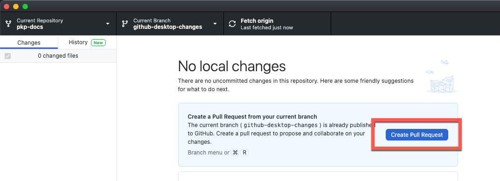

This document is, necessarily, a brief introduction to using GitHub. GitHub has a tremendous amount of documentation on its use, however. If you want to read more about GitHub basics, read ["Hello, World"](https://guides.github.com/activities/hello-world/).

## Contribute in Other Formats

We encourage users and community members to write and edit documentation in Markdown and contribute through GitHub. However, contributed documentation can be created or edited in any format you want to work in, including a .doc or .odt text document, a Google doc, or an email, and the DIG will convert the documentation to Markdown. Do not contribute documentation in PDF, HTML, or LaTeX format.

Some contributors prefer to create or edit documentation in a Word, Open Document, Google Doc, or another format. If you’re creating documentation with a group of people, it can be easier to use a Google Doc than GitHub.

If you have created documentation in one of these other formats, you can email the file as an attachment or link to a shared document to documentation@publicknowledgeproject.org. If you created documentation as a Google doc, you should send the link in an email message.

If you are editing an existing document, try to make it as clear as possible what you have changed.
