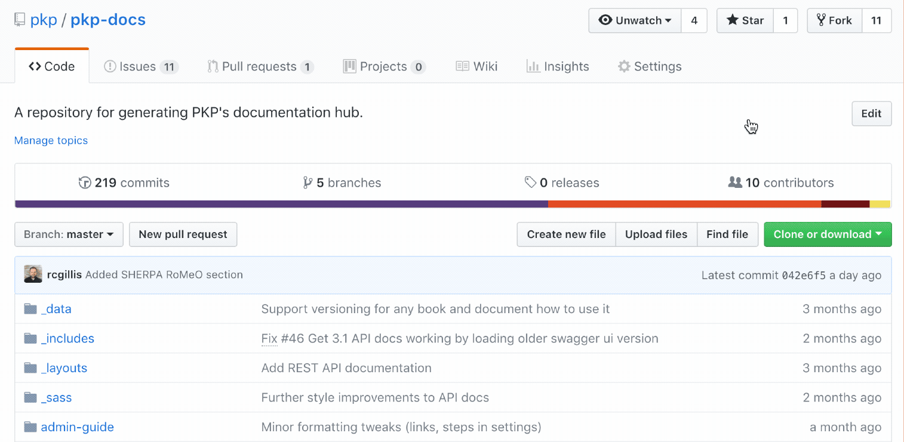
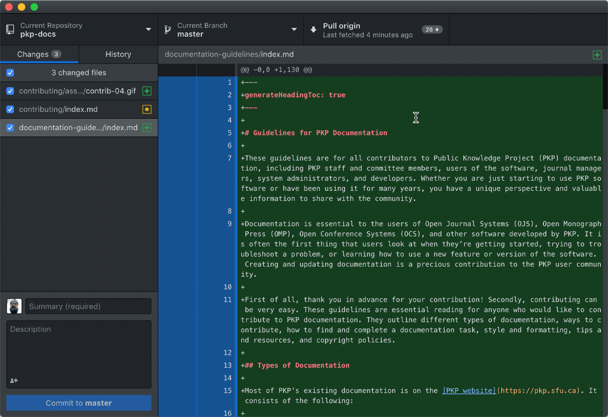
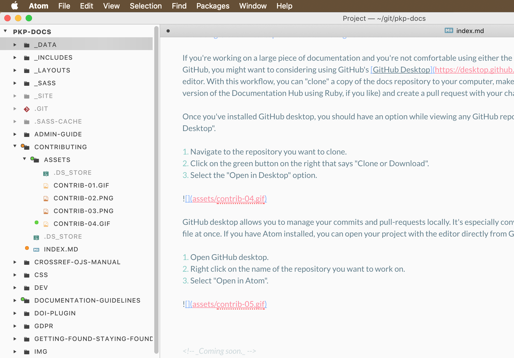
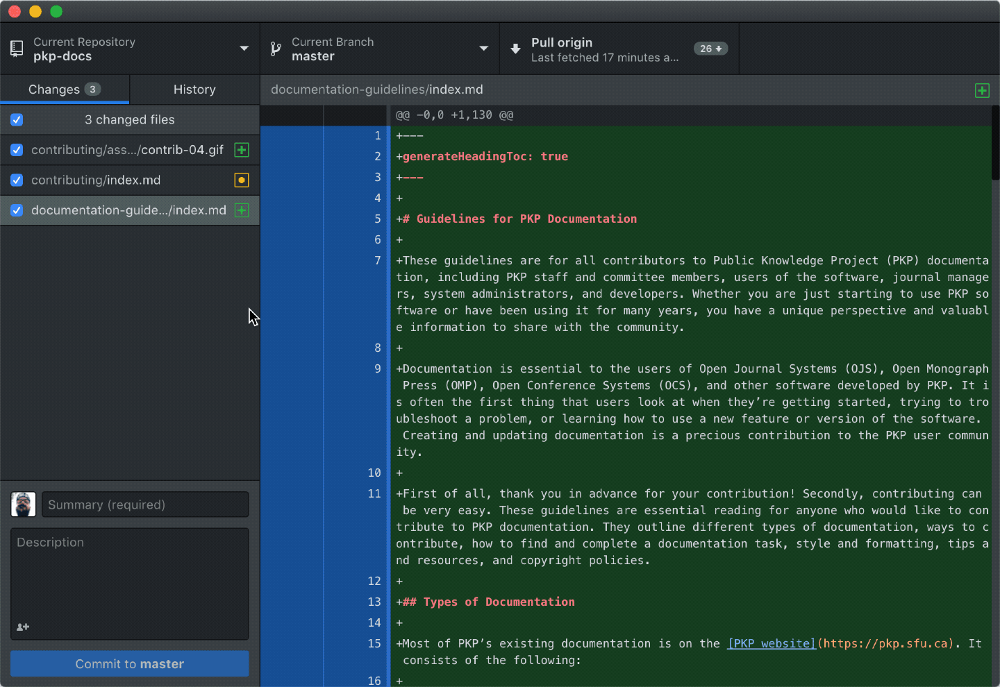

# Contributing to the PKP Documentation Hub

This document outlines how to contribute to/modify content in the PKP Documentation Hub. First of all, thank you in advance for your contribution! Secondly, don't be intimidated. Contributing to the docs hub can be very straightforward.

## Markdown

The majority of PKP documentation uses markdown syntax. Markdown is a simple, easy-to-read, easy-to-write text format that allows users to generate basic HTML without knowing HTML language itself. It uses simple tags (syntax) to format text on a website.

Knowing markdown syntax will help you immeasurably with contributing to documentation.

Here are three guides for writing markdown:

- [Daring Fireball Markdown Syntax](https://daringfireball.net/projects/markdown/syntax)
- [Mastering GitHub Flavoured Markdown](https://guides.github.com/features/mastering-markdown/)
- [Markdown Cheatsheet](https://github.com/adam-p/markdown-here/wiki/Markdown-Cheatsheet)

Markdown does not _require_ a specific or specialized editor. Any basic text editor should be sufficient. If you want to try writing Markdown on your own, we would recommend using [Atom](https://atom.io/). The [Atom Flight Manual](https://flight-manual.atom.io/) can get you started with this open source text editor.

## GitHub

All of our documents are managed using GitHub and – especially when looking to modify documents – it is essential to know a little bit about repositories, branches, and pull-requests. Don't let the language intimidate you! It's pretty easy. If you want to edit existing documentation or add a section or chapter to existing documentation, you can edit the document directly from the docs repository itself.

1. Create a [GitHub](https://github.com) account if you do not already have one and log in.
2. Navigate to https://github.com/pkp/pkp-docs
3. Follow the directory structure in GitHub until you see the file you want to edit.
4. Click the filename to view that individual file.
5. From there, on the top right of the document window, you should see a small pencil icon.
6. Click that button to open up a plain text editor for the document within GitHub itself.


### Committing via Browser

Once you've made your changes, it's time to _commit_ your changes and create a _pull request_. A _commit_ is merely a change to the file you are proposing to others who use the repository. You'll see two fields in the commit window.


The first is a very short descriptor of what you just changed. A few words should do the trick. Here are some examples:

- Updated link to OJS in ``filename.md``
- migrated Crossref guide to markdown
- added appendix to Learning OJS
- replaced images in admin guide

The second window allows you to enter a more detailed description of what you changed. You might want to do this if you need to justify your changes or need to let everyone else know that a change is significant.

Below those two fields, you'll see your committing options. **_If you are a member of the PKP team, you'll see the ability to commit directly to master branch_**. It's important to note that these changes are immediate, but they are also unreviewed. Please do not commit directly to master. We recommend that you always commit code via pull request.

### Branches and Pull Requests

A branch is a version of the repository that contains the changes you've proposed, uniquely. Since it is not part of "master," it won't have an impact on the way the site is built in real-time. If you create your own branch via this method, you'll be asked to name it. Name it something simple with no spaces. A suitable way to name your branch is with the name of the document you're adding or modifying. For example:

- crossref-doc-edits
- starting-a-journal-edits
- new-doc-filename

After naming your branch, you'll be asked to open a "pull request." A pull request is a _request you are making for the managers of the repository to pull your changes into the master version of the doc_.


You can see here that you can title your request and fill out a description of what you've changed. Once you're all set, you can click the link that says "create pull request." Once you do this, repository managers are notified of your change and can decide to merge your code with the master repository.

At the bottom of the page, you'll see what's known as a "diff." A diff is just a way to see what changes you've made from the original code.

### Using GitHub Desktop and Atom to Manage the Docs Hub

If you're working on a large piece of documentation and you're not comfortable using either the command line or the web interface for GitHub, you might want to consider using GitHub's [GitHub Desktop](https://desktop.github.com/) and the [Atom](https://atom.io/) text editor. With this workflow, you can "clone" a copy of the docs repository to your computer, make your edits locally (and even build a version of the Documentation Hub using Ruby, if you like) and create a pull request with your changes once you're finished.

Once you've installed GitHub desktop, you should have an option while viewing any GitHub repository to "Clone or Download" and "Open in Desktop."

1. Navigate to the repository you want to clone.
2. Click on the green button on the right that says "Clone or Download."
3. Select the "Open in Desktop" option.



GitHub desktop manages your commits and pull-requests locally. It's especially convenient if you're changing more than one file at once. If you have Atom installed, you can open your project with the editor directly from GitHub desktop.

1. Open GitHub desktop.
2. Right click on the name of the repository in which you want to work.
3. Select "Open in Atom."



In Atom, the repository directory structure is accessible on the left-hand side in the "project window." Clicking on any title opens it in the editor and allow you to make changes. You'll notice labels next to the files as you work. Green indicates a new file you've added. Yellow indicates a file you've changed since the last time you pulled an update from the primary repository.



If you are working on a project over time, you may want to regularly pull changes "from origin." You can do this in GitHub desktop by clicking on the "pull from origin" button near the top right of the window. It pulls changes since the last time you pulled them (or, since the time you cloned initially).

Once you make your edits with Atom and have a document you want to submit, you'll want to contribute it back as a "branch."

1. In GitHub desktop, click on the "Current Branch" button.
2. Click "New Branch"
3. Write a concise name for your branch based on the doc you're submitting, with a single dash between words.
4. Click "Create Branch."



Now that you've made your edits/additions and created your branch, you can _commit_ your code. On the left side of your GitHub desktop window, you should see all the files you're adding or changing and, at the bottom, a _commit_ option.


The first field is for a very short descriptor of what you just changed. A few words should do the trick. Here are some examples:

- Updated ``filename.md``
- Migrated ``filename.md``
- Added appendix to document
- Replaced images

The second field is for a more detailed description of what you changed. You might want to do this if you need to justify your changes or need to let everyone else know that a change is significant.

When you finish, click the button on the bottom left labelled "Commit to ``branch name``."

Now that you've committed your changes, you can push your changes back to the repo with the button on the top right. It should say "Publish your Branch to Github" if it's the first time you've committed that branch. It syncs versions locally and remotely with your branch changes and submits your "pull request" to managers of the Docs Hub.

This document is, necessarily, a brief introduction to using GitHub. GitHub has a tremendous amount of documentation on its use, however. If you want to read more about GitHub basics, please read ["Hello, World"](https://guides.github.com/activities/hello-world/).

## The "Documentation Hub"

The PKP Documentation Hub utilizes Jekyll to render our markdown files into static HTML. This information isn't super relevant to the modification of documents in general, but there are some rules for our file naming, file structure, and specific syntax you'll need to know while working on these files. Chiefly, there are significant differences between _single page documents_ and _multi-page documents_.

### Single Page Docs

Single Page Documents, like this one, are rendered fully from one markdown file. The table of contents on the side of the page is created using the header tags in markdown. For example,

````
## The "Documentation Hub"

### Single Page Docs
````

If you look on the left, you'll see that "The 'Documentation Hub'" is currently a level 1 header and "Single Page Docs" is a level 2 header. However, this doesn't happen by itself. When you are editing or creating a single page document, you'll need to do the following:

1. Create a folder for your document (if it's new) from the top level of the repository.
    - _Remember to follow naming conventions_.
2. Name the file inside ``index.md``.
3. Place the following code at the top of the file:

```
---
generateHeadingToc: true
---
```

From here, write the document out as you would using markdown. Any level two header (e.g.: ``## text``) displays on the table of contents on the left as a chapter. Any level three header (e.g.: ``### text``) displays as a sub-chapter. Levels four and up does not display on the sidebar table of contents.

> Headings should never skip a level. Do not jump from `## Heading` (2) to `#### Sub-heading` (3) just because you think it looks better. It is important that a sub-heading of `## Heading` (2) is `### Heading` (3) for accessibility.

### Multi-Page Docs

Multi-page documents, like [Learning OJS 3](./learning-ojs), are more robust directories with folders for individual languages/translations, and a single markdown file for every chapter of the document. They also contain a file called ``SUMMARY.md`` that creates the table of contents for the book and a file called ``README.md`` that serves as a first/landing page for your document. To create a book start with the following:

1. Create a folder for your document (if it's new) from the top level of the repository.
    - _Remember to follow naming conventions_. (e.g., if your book is a guide to ORCID, you could name it orcid-guide or orcid-plugin).
2. Create an ``index.md``.
    - A book-wide ``index.md`` file should contain a description of the book as well as copyright information. Look to other documents as examples. Also, if the document is available in more than one language, they should all be linked from this page.
    - At the top of your indexing file, include the following:

```
---
isBookIndex: true
---
```

Unlike with a Single-page document, you no longer need to add to index.md. The rest of your document steps should be as follows:

1. Create a folder for the [language of your document](http://www.lingoes.net/en/translator/langcode.htm) (eg: en_US, en_CA, fr_CA, fr_FR).
2. Create a file called SUMMARY.md
    - SUMMARY.md is the file that determines the display of the table of contents for your document. The markdown list hierarchy determines the nesting of contents titles in your sidebar. Each chapter title is written as a link to either a single markdown file per chapter _or_ as a link to a specific heading within that markdown file.
        - a chapter link would look like: ``- [Statistics](statistics.md)``
        - a heading inside that chapter would look like: ``- [Definitions](./statistics.md#definitions)``
3. Create a file called README.md which should be a language specific version of the text you had in ``index.md``.
4. Create your chapters and write your links to those files in the ``SUMMARY.md`` file.
    - Each full chapter of a multi-page document should be a single markdown file. Subheadings within those chapters can be linked in ``SUMMARY.md`` to allow for links to specific sections.

> A note on formatting: whereas your headers in single documents create the sidebar TOC, in multi-page docs, this is handled by the ``SUMMARY.md`` file. As a result, you'll want each chapter title as an H1, with all subtitles running H2-H5. Since you can add to the TOC manually, you can include chapters there as you see fit.

### Images/Assets

Adding images to your documentation helps users more easily locate some of the features about which you are writing. Images should go in a folder named ``assets``. The type of document you're working on changes where you should put your images.

1. Single-page documents:
    - Place the ``assets`` folder within your main document folder. For example: ``/contributing/assets/``
2. Multi-page documents:
    - Place the ``assets`` folder within the language folder of the document you're working on. For example: ``/learning-ojs/en/assets/``

#### Formatting Recommendations

Images are restricted to 848 pixels in width on display. Where possible, try to limit your file size by keeping your images below that width. The format should follow these guidelines:

- for screenshots, use PNG format
- for photographs, use JPEG format
- for animations, use GIF format  

## File Naming Conventions

**In General** // While any name you create should work, it's best to keep titles short and descriptive. Always replace spaces between words with a dash.

**Titles** // Some example titles include:``learning-ojs``, ``pkp-theming-guide``, ``crossref-ojs-manual``. Remember that titles are part of the file path in the URL to individual docs so keep it simple.

**Chapters** // You might be tempted to number chapters but, if we ever need to create new chapters in between existing ones, we would need to re-number. It's best to keep chapters in the same style as title-level names. Some examples for chapters include: ``getting-started.md``, ``troubleshooting.md``, ``data-import-and-export.md``.

**Images** // Please store all images in a single "assets" folder within the language you're working (e.g.: ``en/assets/``). Keep your image titles brief or with abbreviations and consistently named, so they're easy to locate. Depending on how many images you have, numbering these might be a lot more convenient while working on the document. _Listen to your heart._ Some examples include: ``contrib-01.png``, ``authoring-images-01.png``. If you're putting all your imagines into only the asset folder, it's a good idea to name your images to correspond with chapter titles.

## Modifications to Cards and Site Layout

Please read [Orientation to file structure](./README.md#orientation-to-file-structure) for guidance on how to configure the layout of the documentation hub. It is recommended that edits in this space be cleared via Git Issue or pull request.

## Create and Submit a Document in Another Format

We encourage users and community members to write and edit documentation in markdown and contribute through GitHub. However, contributed documentation can be created or edited in any format you want to work in, including a .doc or .odt text document, a Google doc, or an email message, and the Documentation Interest Group will convert the documentation to its final format when completed. Please do not contribute documentation in PDF, HTML, or LaTeX format.

Some documentation contributors prefer to create or edit documentation in a Word, Open Document, Google Doc, or another format. If you’re creating documentation with a group of people, it can be easier to use a Google Doc than GitHub.  

If you have created documentation in one of these other formats, you can email the file as an attachment to documentation@publicknowledgeproject.org. If you created documentation as a Google doc, you should send the link in an email message.

If you are editing an existing document, try to make it as clear as possible what you have changed.

Please include the following information in either the file name or the file contents:

- Title of the document, chapter, section, or webpage
- If your contribution is part of a larger document, the name of the larger document it is part of and where it belongs
- Your name and contact information
- Creation date

## Attribution, Copyright, Licensing

All PKP documentation is licensed under a [Creative Commons BY license] (http://creativecommons.org/licenses/by/4.0/). Contributors are acknowledged for contributions that they make, but the documents are owned by the Public Knowledge Project and Simon Fraser University Library.  

If you wish to retain ownership of documentation about PKP software that you create and contribute to the PKP project, you can host it in your own repository or on your website, and we can link to it.
