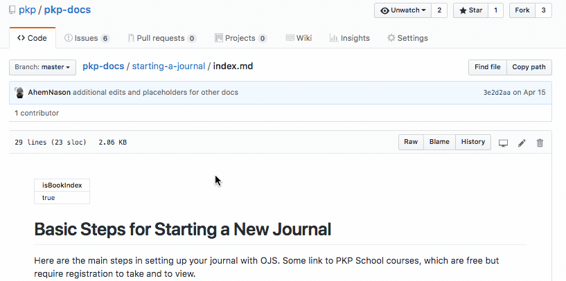

# Contributing to PKP Documentation

These guidelines are for all contributors to PKP documentation, including PKP staff and committee members, users of the software, journal managers, systems administrators, and developers. Whether you are just starting to use PKP software or have been using it for many years, you have a unique perspective and valuable information to share with others. 

Documentation is very important to the users of Open Journal Systems, Open Monograph Press, Open Conference Systems, and other software developed by the Public Knowledge Project (PKP). It is often the first thing that users look at when they’re getting started with the software, when they’re trying to troubleshoot a problem, or when they’re learning how to use a new feature or version of the software. Creating and updating documentation is an extremely valuable contribution to the PKP user community.

First of all, thank you in advance for your contribution! Secondly, contributing can be very easy once you know a little more about a few things. These guidelines are essential reading for anyone who would like to contribute to PKP documentation. They outline different types of documentation, ways to contribute, how to find and complete a documentation task, style and formatting, tips and resources, and copyright policies.

## How to Get Involved

Documentation at PKP is created and maintained by everyone in the organization and interested members of the user and developer community. It’s coordinated by the Documentation Interest Group (DIG), which is made up of representatives from the PKP organization and user community who contribute to documentation. 

Members of the DIG and other folks who work on PKP documentation are available to respond to questions and provide advice, assistance, and collaboration. We communicate using the following tools:

Documentation Slack channel - https://pkpdoc.slack.com 
Documentation Interest Group email list - pkp-documentation@sfu.ca 
Weekly virtual sprints to collaborate on documentation - Thursdays from approximately 11am to 1pm EST

To be added to any of these communication channels or if you have questions about PKP documentation or want to get involved, send an email to documentation@publicknowledgeproject.org

## Types of PKP Documentation

Most of PKP’s existing documentation can be found on the PKP website. It consists of the following types of documentation:

### Documents or Guides
- Instructions on how to use, administer, or develop PKP software 
- Hosted in PKP Documentation Hub, in Markdown format
- Example: [Learning OJS 3] (https://docs.pkp.sfu.ca/learning-ojs/)

### README Files
- A file included with each release of PKP software and each plugin that contains information about the software version, installation, and basic functions and usage.
- Usually available in PKP’s Github repository or in the individual plugin repository
- Example: [OJS Keyword Cloud Block Plugin readme file] (https://github.com/ali-sokhandan/ojs3-keywordcloud-plugin/blob/master/readme.md)

### Videos
- Video tutorials on how to use PKP software or participate in scholarly journal publishing. These include courses in the PKP School and other videos.
- Usually hosted on the PKP School website or the PKP website
- Example: [Setting up a Journal in OJS 3] (http://pkpschool.sfu.ca/courses/setting-up-a-journal-in-ojs-3/)

### FAQs
- Frequently asked questions about PKP software
- Could be part of a guide or a standalone document
- Example: [PKP FAQ] (https://pkp.sfu.ca/wiki/index.php?title=PKP_Frequently_Asked_Questions)

### Webpages
- Information about PKP software or the Project that does not consist of usage instructions but is related to documentation
- Usually hosted on the PKP website and maintained by PKP staff  
- Example: [Editorial Resources] (https://pkp.sfu.ca/editorial-resources/)

## Some Principles of PKP Documentation

1. If instructions already exist somewhere that you want to include in documentation, link to them instead of duplicating or reproducing them. This reduces the amount of updating and maintenance of documentation that is needed. For example, instructions on how to use an OJS plugin should be included in its ReadMe file, and the ReadMe file can be linked to from the Learning OJS section on that plugin.
2. Quality over quantity. Focus on creating larger comprehensive documents so there are fewer individual documents to maintain and translate.
3. Try to to use open source tools to create and maintain documentation.
4. PKP aims to host all PKP software documentation in its own repository and to provide a single access point to it.

## Versioning and Updates

Documentation is updated when a new major version of the software is released (e.g., OJS 3.1 -> OJS 3.2) that makes a significant portion of the documentation inaccurate. 

In this situation, a new updated version of the documentation is published and the old version of the documentation is still accessible in the Documentation Hub for users of older versions of the software.

When a minor software release (e.g., OJS 3.1.1 -> 3.1.2) results in minor changes to the documentation, edits should explain how feature works in the different minor versions (e.g., “In OJS releases 3.0 to 3.1.0, you cannot assign a user to review a submission if they are also an editor of the submission. However, starting with OJS 3.1.1, you can assign a user to review a submission if they are also an editor of the submission.”)

## Ways to Contribute to PKP Documentation

There are a number of different ways to contribute to PKP software documentation, depending on whether you want to write, edit, or update or whether you want a small and simple task or something large and more complex.

### Update existing documentation
PKP software is constantly being modified and improved, so most documentation eventually becomes out of date and needs to be updated.  Depending on how much the software has changed since the last documentation was written, updating documentation can involve making a few minor changes or a lot of rewriting. Documentation that needs to be updated is listed on the PKP Documentation Tasks spreadsheet, which is explained below. If you are new to writing documentation, updating can be a good place to start, depending on how much needs to be rewritten.

### Transform support forum topics into documentation
One way that PKP provides support to users, in addition to documentation, is by hosting a [support forum] (https://forum.pkp.sfu.ca/).  Users post questions about the software on the forum and members of the PKP staff and community answer the questions. The support forum has a lot of valuable information about how to use the software which may be lacking in documentation, especially regarding new features. However, it can be difficult to find relevant information on the forum. Therefore, you can contribute to PKP documentation by noting questions on the forum that are not answered in documentation (especially common questions) and transferring the answers to existing documentation or sometimes creating new documentation. This requires picking out relevant information from forum topics and synthesizing and re-writing it in the form of step-by-step instructions. 

### Create new documentation
This can include a whole document on how to use a plugin or software tool, or it could just be writing a chapter or section in a larger document, but it means creating original documentation. To do this you should have a solid understanding of the tool or feature you are writing instructions about. We have a list of documentation that needs to be created or you may have your own ideas. Instructions on how to access the list and format guidelines are available below.

### Review documentation
When PKP documentation has been created or updated, it goes through a review process, in which someone reads it and offers critical feedback on accuracy, clarity, and completeness. If you enjoy proofreading or editing or are new to documentation, this could be the right task for you. Documentation that needs to be reviewed is listed on the PKP Documentation Tasks spreadsheet, which is explained below.

### Translate documentation
PKP software users live all over the world and speak many different languages. PKP software has been translated into [over 35 languages] (https://pkp.sfu.ca/developers/translation/). Most PKP software documentation is written in English initially and needs to be translated into other languages. If you are fluent reader of English and fluent writer of another language, translating documentation into the other language is a valuable contribution to the documentation project. Translations are managed ...

### Make an instructional video or screencast
PKP has a set of videos called [PKP School] (http://pkpschool.sfu.ca/) on how to use OJS and contribute to OJS journals and we are building a collection of other videos about PKP software. If you’re interested in making video tutorials on using PKP software, you can volunteer to help make PKP School videos or you can make your own video on how to carry out a task or set of tasks in one of the PKP software tools. To assist with PKP School videos, contact Kevin Stranack at kstranac@sfu.ca. Guidelines for making videos are below.

### Contribute your own documentation to PKP
Have you made documentation about PKP software that is specific to your own institution, journal, conference, or press?  It may be useful for the PKP software user community if it provides information and instructions not available elsewhere or if other users are looking for examples of institution or journal-specific documentation.  We are building a collection of external documentation.  To add to it please contact documentation@publicknowledgeproject.org 

### Identify documentation that is missing or needs improvement
If you notice something that there should be documentation for or existing documentation that should be more clear or detailed, we want to know. You can send your suggestion to documentation@publicknowledgeproject.org, file an issue in the [Github PKP Docs repository] (https://github.com/pkp/pkp-docs), or add the task to the [Documentation Tasks spreadsheet] (https://docs.google.com/spreadsheets/d/1bo0etXPjDxC_xdmOGCdwAtdXv85ojdqRdNr3sfMD2aU) if you have access to it. To file an issue in the repository you first have to create a Github account and sign in.  

Members of the Documentation Interest Group review suggestions regularly and add them to lists of tasks to be completed. Please provide as much detail as possible in your suggestion.

## Find a Documentation Task to Do

PKP keeps track of documentation that needs to be created, updated, and reviewed on a [shared spreadsheet] (https://docs.google.com/spreadsheets/d/1bo0etXPjDxC_xdmOGCdwAtdXv85ojdqRdNr3sfMD2aU/). If you are looking for a documentation task to do, the spreadsheet is a good place to start. You can also add tasks that need to be done.  

Anyone with the link can view the spreadsheet but to edit it you must be added as a collaborator. Please email documentation@publicknowledgeproject.org to ask to be added or to ask to sign up for a task.

### About the spreadsheet
The tasks are listed on the spreadsheet according to the role that the documentation is for. Look for a task to do on the worksheet that matches your role or background with PKP software.  The roles are as follows:
- Administrators: Administrators are responsible for PKP software installation and upgrades, ensuring the server settings are accurate, adding language files, and creating any new journals on the installation. Administrators have an understanding of and may modify system files and settings, but are not responsible for programming new features or developing the software. 
- Developers: Developers participate in development of PKP software applications and plugins. They write and modify code and evaluate and implement new features.
- Application Users: Application Users represent end users of PKP software in a variety of different roles, including Journal Manager, Press Manager, Conference Manager, Editor, Reviewer, Author, Copyeditor, and Subscription Manager. They configure settings in the software applications but do not modify system files. 
- Other: Documentation tasks that do not specific to one of the above roles are added to this sheet.

Each worksheet has the following columns:
- Topic: A brief description of the topic and content of the documentation. To see or add more descriptive information, check the Description and Notes column on the far right. If more description or information is needed on the topic or content, ask the DIG.  
- Action Needed: A drop-down list noting whether the documentation needs to be created from scratch, updated, reviewed, maintained, or moved.   
- Status: This drop-down list notes whether the documentation is not started, in progress, or complete. If you sign up to work on the documentation, please change the status as applicable.
- Type: Whether the documentation is a document, part of a document, a FAQ, a webpage, or other. See the section above “Different Kinds of PKP Documentation” for definitions.
- Add to/Part of: If the documentation is part of an existing document, it will be noted here. If not, this will be blank or say “NA.”
- Old URL: If the document needs to be updated, the URL for the existing document will be here
- Working URL: If you are working on the documentation in a temporary location, such as a Google Doc, you can enter the URL here.
- New URL: Enter the new URL for the document here once it has been created. If it is part of a larger document the URL for the larger document can be noted here.
- Name of Person Responsible: If someone is already working on this documentation, their name will be here. If you you want to work on this documentation, enter your name here. Individual contact information for people who contribute to documentation is on the Contacts worksheet.
- Date Started: When work on the documentation has been started, the date can be entered here. This helps us keep track of progress and stick to a timeline.
- Target Completion Date: A deadline for completion of the documentation, which can be chosen and entered by the person working on the documentation.
- Description and Notes: Any further description of the topic or supplementary notes about the documentation can be added here, including further details about the content, questions that need to be answered, or history of the documentation. Feel free to enter notes for any documentation you are working on or adding to the spreadsheet.

There are 4 additional sheets:
- Obsolete lists documentation that is no longer current and may have been updated or moved to another location
- Contacts provides contact information for people who contribute to documentation. It is used to contact people about documentation tasks.
- Major Docs notes the main contact and personal responsible for each major document in the PKP documentation collection
- Sprints lists documentation to work on during upcoming documentation sprints and the sprint document schedule

### Sign up for a task
1. If you are not already active in PKP documentation, contact the Documentation Interest Group to introduce yourself and request access to the spreadsheet.  
2. Select a task based on your role or experience with PKP software, which has not already been claimed. It is also possible to assist with a task that already has a “Person Responsible” - instead of signing up for that task, contact the person and offer your assistance. Contact information is on the Contacts sheet.  
3. Enter your full name in the Person Responsible field for the task and add your name and email address to the Contacts sheet.
4. Ensure that you have all of the resources and information you need to work on the documentation.  If anything is missing, contact the DIG. 
5. When you are ready to start your task, change the Status field to In Progress and enter the current date in the Date Started field and a target completion date in the Target Completion Date field.  
6. Update the URL fields as needed to indicate a Working URL or New URL for the document.
7. If you need assistance at any time while working on the documentation task, contact the DIG through its Slack channel or email list or at a weekly sprint.
8. Once your documentation task is complete, submit it to the DIG in an appropriate format, following the instructions below. Once it is reviewed and published, you can change the Status to Complete on the spreadsheet and cross it off using the Strikethrough formatting button.  
9. If you have updated documentation and the original documentation is still available at the old URL, move the entry to the Obsolete worksheet.

## Documentation Style and Format

The final formats of different kinds of PKP documentation are noted above in the “Different Kinds of PKP Documentation” section, and we encourage people to write and edit documentation in markdown and contribute through Github. However, contributed documentation can be created or edited in any format you want to work in, including a .doc or .odt text document, a Google doc, or an email message, and the DIG will convert the documentation to its final format when completed. Please do not contribute documentation in PDF, HTML, or LaTeX format.

### Markdown

Documentation that is classified as “Documents” by PKP (see above) is written in markdown. Markdown simple, easy-to-read, easy-to-write text format that allows users to generate basic HTML without knowing HTML language itself. It uses simple tags to format text on a website. 

This is an example of markdown 
- https://daringfireball.net/projects/markdown/index.text

Here are the two most essential guides to learning how to write Markdown:
- [Daring Fireball Markdown Syntax](https://daringfireball.net/projects/markdown/syntax)
- [Mastering Github Flavoured Markdown](https://guides.github.com/features/mastering-markdown/)

This is a cheatsheet for markdown tags: 
- https://github.com/adam-p/markdown-here/wiki/Markdown-Cheatsheet

Markdown does not _require_ a specific or special editor. If you want to try writing Markdown on your own, we would recommend using [Atom](https://atom.io/) (there will be guides on setting up Atom optimally to come).

Please use these tags when writing or editing in markdown:
- Chapter heading: # H1
- Section heading: ## H2
- Sub-section heading: ### H3

### Images
Images or screenshots should be added to text files to visualize instructions whenever possible. Image files should be in png format.

Explain how to add images. We’ll need a naming convention for files… even retroactively. 

### Pronouns
When using pronouns to refer to a generic user, use gender neutral pronouns such as “they,” “their,” and “them.” Use “they” instead of “he” or “she.”  Use “their” instead of “his” or “her.” Use “them” instead of “her” or “him.” Use “themselves” instead of “himself” or “herself.”

## Edit a Document in Github

All of the documents we have are hosted in Github and – especially when looking to modify documents – it will be important to know  a little bit about repositories, branches, and pull-requests. Don't let the language intimidate you! It's pretty easy. If you want to edit existing documentation or add a section or chapter to existing documentation, you can edit the document directly from the docs repository itself.

1. Create a [Github](https://github.com) account if you do not already have one and log in.
2. Navigate to https://github.com/pkp/pkp-docs
3. Follow the directory structure in Github until you see the file you want to edit.
4. Click the filename to view that individual file.
5. From there, on the top right of the document window, you should see a small pencil icon.
6. Click that button to open up a plaintext editor for the document within Github itself.



### Commit your changes

Once you've made your changes, it's time to _commit_ your changes and/or create a _pull request_. A _commit_ is simply a change to the file you are proposing to others who use the repository. You'll see two fields in the commit window.


The first, is a very succinct descriptor of what you just changed. A few words should do the trick. Here are some examples:
- updated filename.md
- migrated filename.md
- added appendix to document
- replaced images

The second window allows you to enter a more detailed description of what you changed. You might want to do this if you need to justify your changes or need to let everyone else know that a change is significant.

Below those two fields you'll see your committing options. **_If you are a member of the PKP team, you'll see the ability to commit directly to master branch_**. It's important to note that these changes will be immediate, but they will also be unreviewed. If you are making small changes to one document, it's probably fine to commit to master. If you are changing the way documents link between each other or making more broad changes to the site itself, it's recommended that you _create a new branch and start a pull request_.

### Branches and Pull Requests

A branch is a version of the repository that contains the changes you've proposed, uniquely. Since it is not part of master, it won't have an impact on the way the site is built in real-time. If you create your own branch via this method, you'll be asked to name it. It's recommended that you name it something succinct with no spaces. A good way to name your branch is with the name of the document you're adding or modifying. For example:
- crossref-doc-edits
- starting-a-journal-edits
- new-doc-filename

When you propose a new pull request, after naming your branch, you'll be asked to open a pull request. This is simply a _request you are making for the managers of the repository to pull your changes into the master version of the doc_


You can see here that you can title your request and fill out a description of what you're changed. Once you're all set you can click the link that says "create pull request". Once you do this, repository managers will be notified of your change and can decide to merge your code with the main repository.

At the bottom of the page you'll see what's known as a "diff". A diff is just a way to see what changes you've made from the original code.

### Using Github Desktop and Atom to Manage the Docs Hub

_Coming soon._

## Create a New Document in the Documentation Hub

The PKP Documentation Hub utilizes Jeckyll to render our markdown files into static HTML. This isn't super relevant to the modification of documents in general, but there are some rules for our file naming, file structure, and unique syntax we'll need to know while working on our files. Chiefly, there are significant differences between _single page documents_ and _multi-page documents_.

### Single Page Docs

Single Page Documents, like this one, are rendered fully from one markdown file. The table of contents on the side of page is created using the header tags in markdown. For example,

````
## The "Documentation Hub"

### Single Page Docs
````

If you look on the left, you'll see that "The 'Documentation Hub'" is now a level 1 header and "Single Page Docs" is a level 2 header.

But, this doesn't happen by itself. When you are editing or creating a single page document, you'll need to do the following:

1. Create a folder for your document (if it's new) from the top level of the repository.
2. Name the file inside ``index.md``.
3. Place the following code at the top of the file:

```
---
generateHeadingToc: true
---
```

#### Images

_Coming soon._

### Multi-Page Docs

_Coming soon:_

- file structure
- images
- translations

## File Naming Conventions

_Coming soon._

## Modifications to Cards and Site Layout

_Coming soon._

## Create and Submit a Document in Another Format

Some documentation contributors prefer to create or edit documentation in a Word, Open Document, Google Doc, or another format. If you’re creating documentation with a group of people it can be easier to use a Google Doc than Github.  

If you have created documentation in one of these other formats, you can email the file as an attachment to documentation@publicknowledgeproject.org. If you created documentation as a Google doc, you can send the link in an email message.

If you are editing an existing document, try to make it as clear as possible what you have changed.

Please include the following information in either the file name or the file contents:
- Title of the document, chapter, section, or webpage
- If the documentation is part of a larger document, the name of the larger document it is part of and where it belongs
- Your name and contact information
- Creation date 

## Documentation Tips and Resources

### Tips for writing documentation
If you would like further instructions on writing documentation, please ask us, but here are some tips:
- Although the information you are writing about may be quite technical, try to write in simple, straightforward language that is easy to understand for a variety of different people from different backgrounds and whose first language may not be the language you are writing in.  
- Keep in mind what group of users will likely be using the documentation, what background and technical knowledge they may have, and what kind of information they may be looking for. User groups could include developers, system administrators, journal managers, editors, authors, and readers. 
- Within that user group, write for a user with the most basic knowledge and experience. Explain and define acronyms and technical concepts.
- Break things down into simple steps and use numbered or bulleted lists whenever possible.
- Include a lot of screenshots to demonstrate visually how to use the software.
- Give examples to help users understand concepts.
- Try to anticipate problems and issues that the user might have. Explain how to overcome them.

### Further Resources
- [Documentation Guide by WritetheDocs] (http://www.writethedocs.org/guide/)

## Attribution, Copyright, Licensing

All PKP documentation is licensed under a [Creative Commons BY license] (http://creativecommons.org/licenses/by/4.0/). Contributors will be acknowledged for contributions that they make, but ownership will be held by the Public Knowledge Project and Simon Fraser University Library.  

If you wish to retain ownership of documentation about PKP software that you create and contribute to the PKP project, you can host it in your own repository or on your own website and we will link to it.


