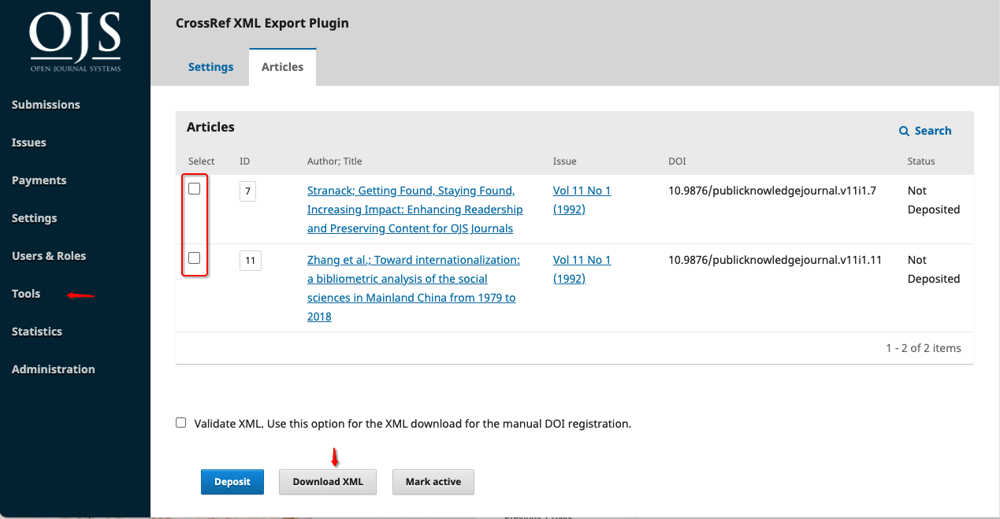
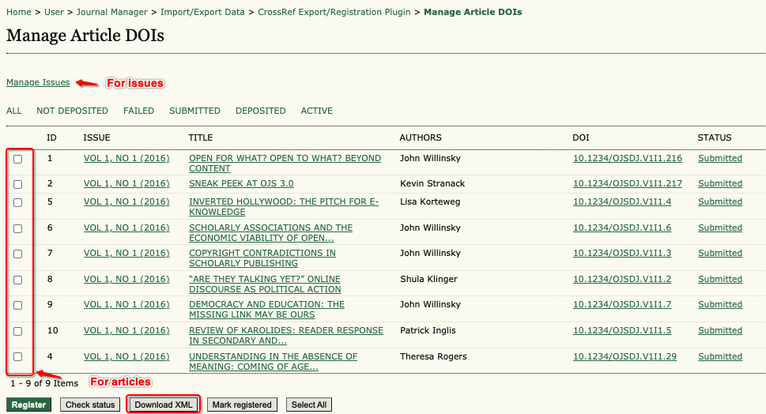

# How to Configure OJS for Crossref XML Export

## Configuring OJS 2.4.x

See the [OJS 2.4.x Crossref Plugin Guide](../../../crossref-ojs2-manual/en/configManual.html).

## Configuring OJS 3.0, 3.1

Setup for the Crossref Export Plugin in these versions is the same as detailed in the [OJS 3.1.2 Crossref Plugin Guide](../../3.1.2/en/config.html)

## Depositing DOIs with Crossref via XML Export

The XML Export generated by the Crossref XML plugin can be used to manually deposit your content into Crossref via the [Crossref Administrative Console](https://doi.crossref.org/servlet/useragent).

### Exporting Crossref XML file

### OJS 3.1.x

In OJS 3.1.x this can be completed by a user with the Journal Manager and/or Journal Editor role. 

* Navigate to the Crossref XML Export Plugin (Tools > Import/Export > CrossRef XML Export Plugin > Articles)
* To export individual articles, click the boxes for each article you want to export
* Once you have selected the issue(s) or article(s) click 'Download XML'
* Save a copy of the file on your local desktop
* Navigate to [Crossref’s metadata quality check](https://www.crossref.org/02publishers/parser.html) and upload your file here first to check for any validation errors.
* Login to your [Crossref Administrative Console](https://doi.crossref.org/servlet/useragent)
* Click on the Submissions tab
* Click on “choose file” and select your XML export file. Make sure that “metadata” is selected below, and click upload

You should receive an email to let you know the status of your submission, provided you are listed as the “technical support contact” of your journal. You can change the submitter email name and ID in the XML before you export, if you like.

#### OJS 2.x

In OJS 2, the Journal Manager role  will be required to complete this step. 

* Navigate to the Crossref XML Export Plugin (Journal Manager > Import/Export Data > CrossRef Export/Registration Plugin)
* Click 'Manage DOIs'
* In OJS 2.x you can either export individual articles or entire issues
  - To export an entire issue click 'Manage Issue'
  - To export individual articles, click the boxes for each article you want to export
* Once you have selected the issue(s) or article(s) click 'Download XML'
* Save a copy of the file on your local desktop
* Navigate to [Crossref’s metadata quality check](https://www.crossref.org/02publishers/parser.html) and upload your file here first to check for any validation errors.
* Login to your [Crossref Administrative Console](https://doi.crossref.org/servlet/useragent)
* Click on the Submissions tab
* Click on “choose file” and select your XML export file. Make sure that “metadata” is selected below, and click upload

You should receive an email to let you know the status of your submission, provided you are listed as the “technical support contact” of your journal. You can change the submitter email name and ID in the XML before you export, if you like.

For further instructions on Crossref's Admin Tool, see Crossref's documentation - [Upload XML files using our admin tool](https://www.crossref.org/documentation/member-setup/direct-deposit-xml/admin-tool/).
