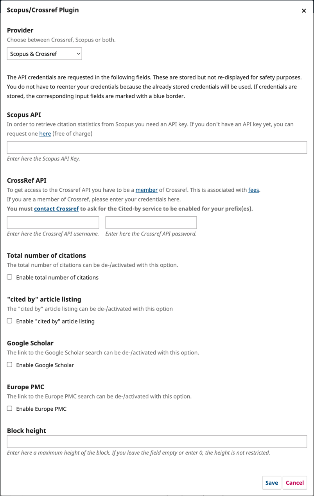

# OJS Scopus/Crossref Plugin

This [third-party plugin](https://github.com/RBoelter/citations) allows journals to display citations and citation counts (using article DOIs) from Scopus and/or Crossref. The option to display citation for Google Scholar and Europe Pubmed is also supported.

## Installing and Enabling the Plugin

If the plugin is compatible with your version of OJS, you can install this plugin via the plugin gallery. 

1. Enable the plugin in the Installed Plugins tab (Website > Plugins > Installed Plugins)
2. Choose which Providers (Crossref, Scopus, or both) you'll use for the plugin using the dropdown menu
3. Enter the API Key for Scopus and API username and password for Crossref 
4. Configure the information you want to display on your article landing page along with the Block height if desired.

Once enabled and configured, the plugin will display the count and list of the citation on the sidebar of the article landing page.

