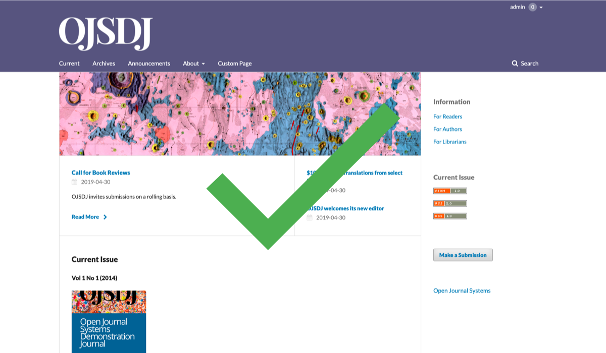

# Inclusive and Accessible Theming

When making design changes, it is important to be mindful of the diversity of your readership and inclusive of users’ needs and circumstances. In addition to visual impairments, users may be affected by hearing, cognitive, and motor limitations when browsing a website; others may have a different social or cultural background that may alter their understanding of content. These circumstances may be permanent, as with colour vision deficiencies (CVD), or temporary, as with browsing on a smaller screen with a slow internet connection.

In this guide we will focus on visual impairments specifically, but it is always valuable to maintain clear and concise editorial standards so that your articles reach and remain accessible to as many researchers or readers interested in your field as possible.

## Colour

You can use [WebAim's Contrast Checker](http://webaim.org/resources/contrastchecker), [Contrast Ratio Checker](http://leaverou.github.io/contrast-ratio), or the [Colour Contrast Analyser](https://www.paciellogroup.com/resources/contrastanalyser) to check the contrast ratio between your website’s background and text colours and make sure it is accessible based on the [WCAG 2.0 Guidelines](https://www.w3.org/TR/WCAG20/#visual-audio-contrast).

Most OJS 3 themes allow you to customize the main or header colour of your website. With [WebAim’s Contrast Checker(https://webaim.org/resources/contrastchecker/), for example, you can check whether you should use black or white text, as well as header logo, with your main colour of choice in order to ensure readability for users with visual limitations. In the following example, the user is testing out a pink as well as a purple selected to match their homepage cover image.

The test recommends that the user only display black text on pink or white text on purple. Therefore, the user has two accessible options using these colours:

Additionally, with tools such as the [Spectrum Chrome extension](https://chrome.google.com/webstore/detail/spectrum/ofclemegkcmilinpcimpjkfhjfgmhieb?hl=en) you can emulate various types of colour vision deficiencies (CVD) on any website. Tools like the [Accessible Color Palette Builder](https://toolness.github.io/accessible-color-matrix/) can help you decide on the best colour combinations for your website.

Text colour should not be the only way of conveying important information, since it may not be available to a person with CVD and will be unavailable to screen reader users. Consider other visual emphasis (bold, italic) OR an explicit mention (in plain text) that the following information is important.

## Alternative text for images

You should provide ‘alt’ (alternative) text for images unless they are decorative or the text is present elsewhere on the page. Having such text is especially helpful for people with visual impairments who rely on a screen reader to have the content of the website read to them.

Alt text can be added in designated fields or in the HTML.

``

Make sure to use descriptive language (e.g., describing a photograph in detail: "a woman in a lab coat holding a petri dish in a bright laboratory"). Avoid using "image of...” at the start of your description.

## Descriptive URLs

When writing URL text, make sure it can be understood without additional context. For example, use “see Author Guidelines” rather than “click here.”

## Page structure

When writing web content, ensure that:
* Proper headings (e.g., <h1>, <h6>) are used to separate content in longer text. The headings should follow in order (e.g. <h1> - <h2> - <h3>) to allow a screen reader to navigate correctly through the page
* Enumerative lists are presented as lists (e.g., ordered or unordered, definition lists)
* Tables have appropriate table headers (the <th> element).

## Document accessibility

Non-HTML content, such as documents you upload, should be accessible as well. When creating journal documentation, such as author guidelines, style guides, etc., consider presenting them as static HTML pages rather than uploading PDFs to the website. If using PDFs, ensure that they are appropriately tagged to be screen-reader friendly.

## Checking your website for accessibility

When modifying the theme of your journal website, ensure that it remains accessible by checking your journal on different browsers and on various devices.

Additional online tools such as [AChecker](http://achecker.ca/checker/index.php) (free) or [Wave browser extension](http://wave.webaim.org/extension) (free) can facilitate website auditing. Tabbing through your pages and using a screen reader such as [ChromeVox](http://www.chromevox.com/) (free), [NVDA](http://www.nvaccess.org/) (free) or [JAWS](http://www.freedomscientific.com/products/fs/jaws-product-page.asp) can help ensure that a person with a visual impairment can navigate your website.
