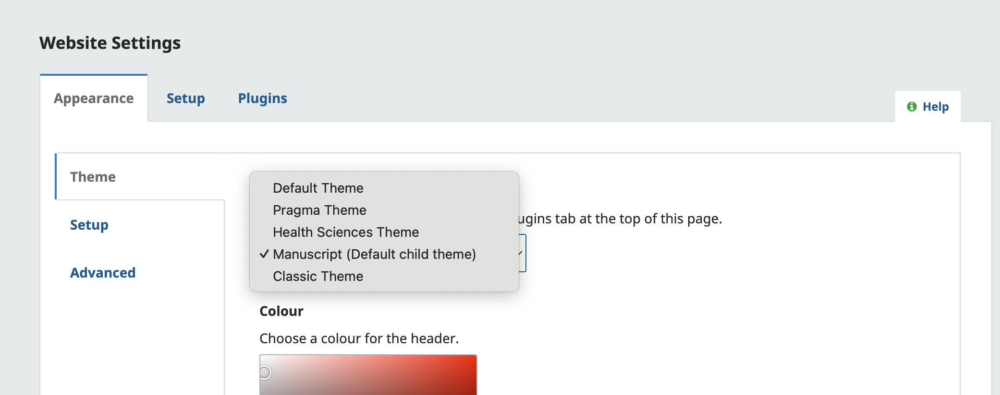
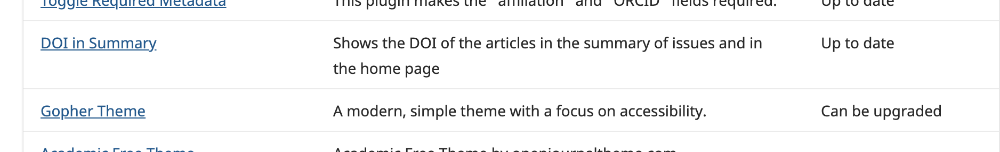

# Theme Plugins

OJS offers several theme plugin options that will change the look and feel of the journal's site. To preview the available themes, see the [OJS Demonstration Journal](https://ojs33.demo.publicknowledgeproject.org/).

A new OJS installation will include the 'Default' theme. The **Journal Administrator must install the remaining prepackaged themes from the Journals Plugin Gallery before using them**. 

## Installing Theme Plugins
The Plugin Gallery can be accessed by going to Website> Plugins > Plugin Gallery. 

To install a Theme plugin, click the plugin name. This will open an additional page with the plugin information and the option to install it. 

## Enabling Theme Plugins

Once installed, the Journal Manager can enable theme plugins by going to Website > Plugins > Installed plugins. All the installed Theme plugins will be listed at the bottom of this page. Click the checkbox to enable them. 

The enabled plugins will be listed in the Theme dropdown bar within Website > Appearance > Theme. 

## Updating Theme Plugins

Theme plugins may be updated periodically by the developer. If an update for the theme is available, it will be listed with *' Can be upgraded '* status in the Plugin Gallery. **The Journal Administrator will need to update theme plugins.**

