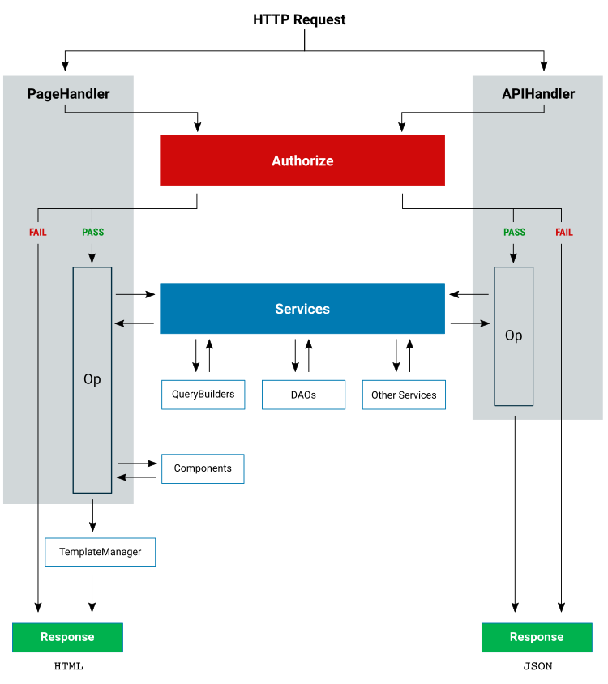

# Ciclo de vida da solicitação

As solicitações HTTP são roteadas para um `Handler` que responde à solicitação. O `Handler` coordena outras classes para autenticar solicitações, buscar dados e formatar a resposta.

Saiba como as solicitações são [roteadas para handles](./architecture-routes.md).