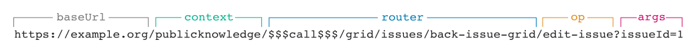

# Rotas

Cada solicitação é mapeada para uma Página, API ou Controlador `Handler` com base na URL.

## Rotas de Página

O diagrama abaixo mostra uma URL para um [Gerenciador de Página](architecture-handlers#page-handlers).


O roteador procurará um arquivo em `/pages/issue/index.php` ou `/lib/pkp/pages/issue/index.php`, que carrega o handler correto.

```php
switch ($op) {
    case 'view':
        define('HANDLER_CLASS', 'IssueHandler');
        import('pages.issue.IssueHandler');
        break;
}
```

Todas as operações de uma página geralmente são gerenciadas pelo mesmo `Handler`. No entanto, é possível direcionar cada operação para um handler diferente.

```php
switch ($op) {
    case 'view':
        define('HANDLER_CLASS', 'IssueHandler');
        import('pages.issue.IssueHandler');
        break;
    case 'archive':
        define('HANDLER_CLASS', 'ArchiveHandler');
        import('pages.issue.ArchiveHandler');
        break;
}
```

Isso não é possível para rotas de API ou Controller.

## Rotas de API

O diagrama abaixo mostra uma URL para um [API Handler](architecture-handlers#api-handlers).


O roteador procurará um arquivo em `/api/v1/submissions/index.php`, que carrega o handler correto.

```php
import('api.v1.submissions.SubmissionsHandler');
return new SubmissionsHandler();
```

O roteador **não** encontrará um arquivo em `/lib/pkp/api/v1/submissions/index.php`.

## Rotas de Controlador

O diagrama abaixo mostra uma URL para um [Controller Handler](architecture-handlers#controller-handlers).



The router will look for and load a `Handler` at `/controllers/grid/issues/BackIssueGridHandler.php`.

As URLs do controlador são derivadas do nome da classe `Handler`. O sufixo `Handler` é descartado e o nome restante é transformado de `PascalCase` para `kebab-case`.

# Escrevendo URLs

Nunca escreva manualmente um caminho de URL porque a aplicação pode ser executado sem o roteamento de URL ativado. Quando a opção de configuração `disable_path_info` estiver ativada, o roteamento de URL usará parâmetros de consulta.

```
http://example.org/?journal=publicknowledge&page=issue&op=view&path[]=1
```

As URLs devem sempre ser geradas pelo método `Router` de `url`. Você pode recuperar o `Router` apropriado do objeto `Request`.

```php
$url = $request->getRouter()->url($request, null, 'issue', 'view', 1);
```

*O objeto `Request` estará disponível no `Handler`. Consulte [Handlers](./architecture-handlers).*

O objeto `Request` sempre retornará um tipo `Router` que corresponde à rota atual e gera URLs para esse tipo. Em uma Página Handler retornará um `PageRouter`.

```php
$pageUrl = $request->getRouter()->url($request, null, 'issue', 'view', 1);
```

Em um API Handler retornará um `APIRouter`.

```php
$apiUrl = $request->getRouter()->url($request, null, 'issues/1');
```

Em um Controller Handler retornará um `PKPComponentRouter`.

```php
$controllerUrl = $request->getRouter()->url($request, null, 'grid.issues.IssueGridHandler', 'editIssue', [1]);
```

Se precisar obter uma URL para um roteador diferente, use o `Dispatcher`.

```php
$pageUrl = $request->getDispatcher()->url($request, ROUTE_PAGE, 'issue', 'view', 1);
$apiUrl = $request->getDispatcher()->url($request, ROUTE_API, $context->getPath(), 'issues/1');
$controllerUrl = $request->getDispatcher()->url($request, ROUTE_COMPONENT, null, 'grid.issues.IssueGridHandler', 'editIssue', [1]);
```

---

Saiba mais sobre [como os handlers respondem à solicitação](./architecture-handlers).
