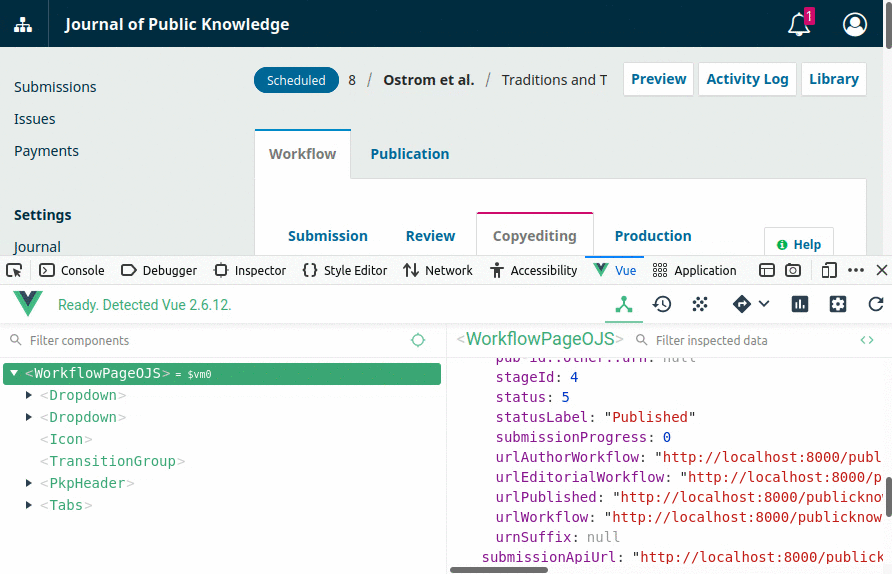

# UI Library

> Read and understand the essentials section of the [Vue.js guide](https://vuejs.org/v2/guide/) before continuing. 
> 
> {:.tip}

The [UI Library](/dev/ui-library/dev) is built with [Vue.js](https://vuejs.org/). It provides reusable components to create consistent, accessible user interfaces for all PKP applications. This chapter describes how to pass data into the root Vue.js component and manage state in the browser.

## Page Component

The [Page component](/dev/ui-library/dev/#/component/Page) is the root component on a page that manages data and passes props down to child components. Whenever a backend template is used, a `Page` component is automatically mounted to the DOM. This means that global components can be used without any additional configuration.

```html
{extends file="layouts/backend.tpl"}

{block name="page"}
    <badge :is-success="true">Published</badge>
{/block}
```

Smarty syntax can be mixed with components from the UI Library. The template below shows a badge when a submission is published.

```html
{extends file="layouts/backend.tpl"}

{block name="page"}
    {if $isPublished}
        <badge :is-success="true">Published</badge>
    {/if}
{/block}
```

Sometimes the publication status will change before the Smarty template is reloaded. When actions are taken in the browser that change the publication status, we need to show or hide the `<badge>` by using state.

## State

Data that may change after the page is loaded is called state. For example, when an editor publishes or unpublishes a submission the template needs to update to reflect the new submission status.

> State is another name for the `data` properties of the root Vue.js component. 
> 
> {:.tip}

Initialize state on the server by using the `setState` method to pass data to the `Page` component.

```php
class WorkflowHandler extends Handler {
    public function distribution(Array $args, Request $request) {
        $templateMgr = TemplateManager::getManager($request);
        $templateMgr->setState([
            'isPublished' => $publication->getData('status') === STATUS_PUBLISHED,
        ]);
        return $templateMgr->display('/workflow.tpl');
    }
}
```

State can be accessed in templates by using the [Vue.js template syntax](https://vuejs.org/v2/guide/syntax.html). The example below will show or hide the `<badge>` when the `isPublished` state changes.

```html
{extends file="layouts/backend.tpl"}

{block name="page"}
    <badge
        v-if="isPublished"
        :is-success="true"
    >
        Published
    </badge>
{/block}
```

Use the Vue.js dev tools for [Firefox](https://addons.mozilla.org/en-GB/firefox/addon/vue-js-devtools/) or [Chrome](https://chrome.google.com/webstore/detail/vuejs-devtools/nhdogjmejiglipccpnnnanhbledajbpd?hl=en) to toggle state and see how the template changes.



State should only be used when data changes the UI must update to reflect that change without reloading the page. It is not always easy to determine which data should be managed by Vue.js as state and which data should be managed by Smarty.

To help make the distinction, consider a city street. At any given moment, the number and location of cars on the street will change. But the boundaries of the street and the direction of travel will not.

In this example, the number and location of cars are state and should be passed to the template using the `setState` method. The boundaries and the direction of travel are not and can be passed to the template using the `assign` method.

## State Management for Complex Components

The `Page` component sometimes manages state that should be passed down to a complex component. A single `Page` may manage many complex components such as [Forms](/dev/ui-library/dev/#/component/Form) and [ListPanels](/dev/ui-library/dev/#/component/ListPanel) which need to update the state after making requests to the API.

> The convention described below is a lightweight alternative to state management libraries such as [Vuex](https://vuex.vuejs.org/). 
> 
> {:.tip}

State is passed down to these components as `props`.

```php
class WorkflowHandler extends Handler {
    public function distribution(Array $args, Request $request) {
        $templateMgr = TemplateManager::getManager($request);
        $templateMgr->setState([
            'formId' => 'exampleForm',
            'fields' => [...],
        ]);
        return $templateMgr->display('/workflow.tpl');
    }
}
```
```html
{extends file="layouts/backend.tpl"}

{block name="page"}
    <pkp-form
        :id="formId"
        :fields="fields"
        ...
    />
{/block}
```

This leads to a problem when a field's value changes. The `Form` component can not modify that value because Vue.js enforces a strict [one-way data flow](https://vuejs.org/v2/guide/components-props.html#One-Way-Data-Flow).

> Read this guide on [organizing components](https://vuejs.org/v2/guide/components.html#Organizing-Components) to understand how props and events are used in Vue.js to manage state across multiple components. 
> 
> {:.notice}

In such cases, `Page` components make use of events to manage state for these components. The component's props are added to a `components` object in the state.

```php
class WorkflowHandler extends Handler {
    public function distribution(Array $args, Request $request) {
        $templateMgr = TemplateManager::getManager($request);
        $templateMgr->setState([
            'components' => [
                'exampleForm' => [
                    'fields' => [...],
                ],
            ],
        ]);
        return $templateMgr->display('/workflow.tpl');
    }
}
```

The props are bound to the component in the template and the `Page` component listens for a `set` event.

```html
{extends file="layouts/backend.tpl"}

{block name="page"}
    <pkp-form
        v-bind="components.exampleForm"
        @set="set"
    />
{/block}
```

When the child component needs to update its props, it fires the `set` event with the following signature.

```js
const newData = {
    fields: [...],
};
this.$emit('set', 'exampleForm', newData);
```

The `Page` component will locate the component's props and update them with the `newData`. In order for this to work, the event must pass the object key, `exampleForm`, as the second argument in the `$emit` function.

The following example shows how the `set` method in a `Page` component updates a component's data.

```js
set(key, newData) {
    if (!this.components[key]) {
        return;
    }
    this.components[key] = {
        ...this.components[key],
        ...newData
    };
}
```

## Extend the Page Component

It is often necessary to extend the `Page` component to provide additional functionality for a page. The example below shows the `SettingsPage` component, which adds or removes a navigation menu item when the announcements have been enabled or disabled.

```js
import Page from './Page.vue';

export default {
    name: 'SettingsPage',
    extends: Page,
    data() {
        return {
            announcementsLabel: '',
            announcementsUrl: ''
        };
    },
    mounted() {
        pkp.eventBus.$on('form-success', (formId, context) => {
            if (formId === pkp.const.FORM_ANNOUNCEMENT_SETTINGS) {
                let menu = {...this.menu};
                if (!context.enableAnnouncements) {
                    delete menu.announcements;
                } else {
                    menu.announcements = {
                        name: 'Announcements',
                        url: 'http://example.org/announcements'
                    };
                }
                this.menu = menu;
            }
        });
    },
    destroyed() {
        pkp.eventBus.$off('form-success');
    }
};
```

Once a new page component has been created, it must be imported and registered in `js/load.js`.

```js
...
import SettingsPage from '@/components/Container/SettingsPage.vue';

window.pkp = Object.assign(PkpLoad, {
    controllers: {
        ...
        SettingsPage
    }
});
```

Finally, the `PageHandler` must assign the `pageComponent` variable to the template and pass the correct state

```php
$templateMgr = TemplateManager::getManager($request);
$templateMgr->assign([
    'pageComponent' => 'SettingsPage',
]);
$templateMgr->setState([
    'announcementLabel' => __('announcement.announcements'),
    'announcementsUrl' => $request->getRouter()->url($request, null, 'management', 'settings', 'announcements'),
])
```

Consult the [UI Library](/dev/ui-library/dev/#/component/Page) for a list of available page components.

## Reference

The [UI Library](/dev/ui-library/dev) provides a demo, technical specification and usage guidance for each component. It also provides important documentation on utilities such as the [event bus](/dev/ui-library/dev/#/pages/event-bus), [localization](/dev/ui-library/dev/#/pages/localization), and more.

---

The next chapter describes how to create and use [Forms](./frontend-forms).