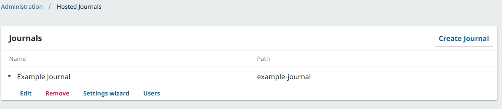
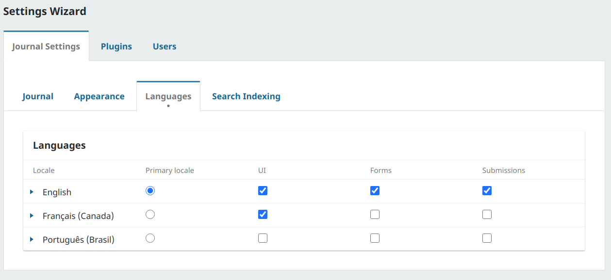

# Exercise 3 - Create List of Announcements

This exercise is designed as an introduction to the `Repository` classes and entity definitions in OJS/OMP/OPS.

In your OJS install, go to Administration > Site Settings > Site Setup > Languages and add a second language if one doesn't already exist.

Enable the second language on your Journal.

- Choose one Journal at Hosted Journals;
    - Click at Settings Wizard:
        
        
        
    - Click at tab Languages
        
        
        
    - Enable the second language on UI and Forms.
        
        
        

Go to Settings > Website > Setup > Announcements and enable announcements in your OJS instance. Find the Announcements link in the main navigation menu on the left and create 3 or more announcements

Read the [Entities](../architecture-entities), [DAOs](../architecture-daos) and [Repositories](../architecture-repositories) sections of the developer documentation. Explore the code for the announcement's schema, repository and data object.

Use what you've learned to show the announcements for the current journal on the example page you created in [Exercise 1](./exercise1).

*Do not worry about making this page look nice.*

# Specifications

- When I visit `http://localhost:8000/index.php/publicknowledge/example/announcements` I can see all of the announcements that I created in this journal.
- For each announcement, I can see the the ID, title, date it was created, and a link to the announcement.
- For each announcement, the title that is shown reflects the current language that I am using. When I change languages, I see the title in the other language. (You can change the language you are using by going to any backend page, like submissions, clicking the user profile icon at the top right, and changing your language.)
