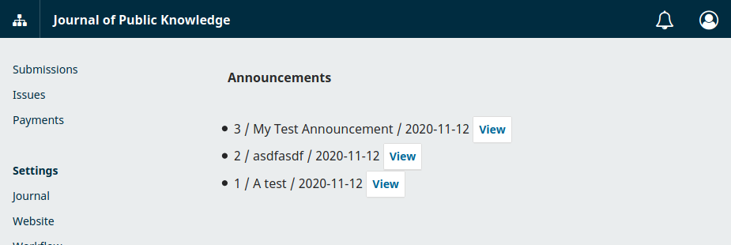

# Exercise 5 - Use Templates for a Backend Page

This exercise is designed to help you learn about the templating language and UI Library in OJS/OMP/OPS.

- Read the [introduction](../frontend) to the frontend documentation.
- Read about [how to use templates in PageHandlers](../frontend-pages).
- Read about [how to use the UI Library in templates](../frontend-ui-library).

Use what you have learned to turn the announcement page you created in previous exercises into backend pages. Review the UI Library and use the `<pkp-header>` and `<pkp-button>` components in your announcements list.

You are aiming for something that looks similar to this.

## Specifications

- The announcements page that I created shows the top bar and side navigation menu that appears, like the picture above.
- The announcements page that I created shows the page title and announcements in a list that looks like the components in the UI Library.
- The `<title>` of the announcements page, as it appears in the browser tab, says `Announcements | <journal-name>`.

