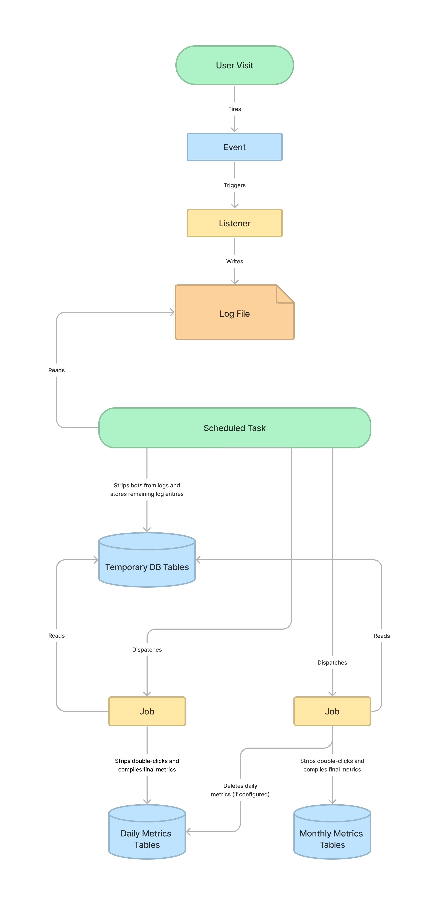
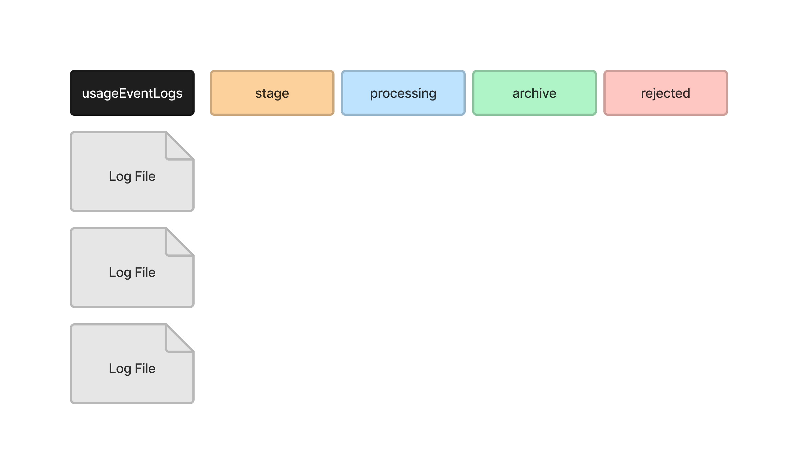
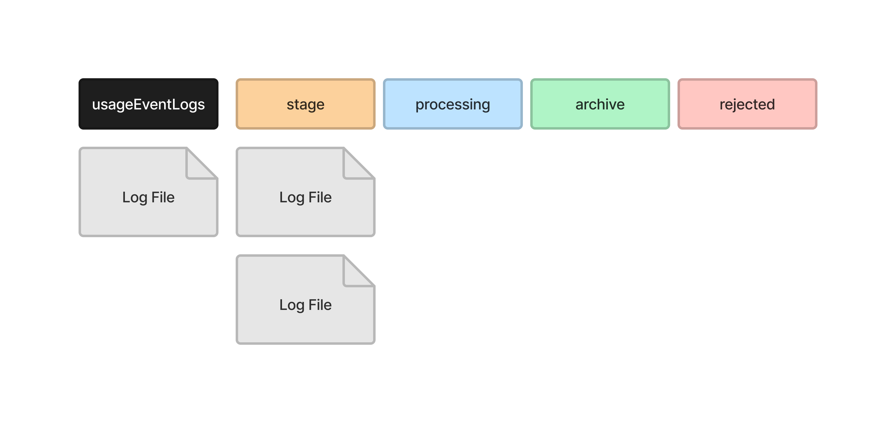
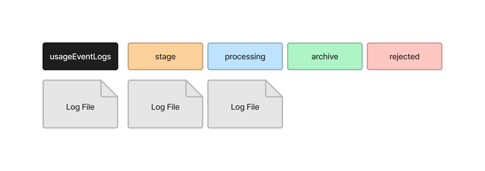
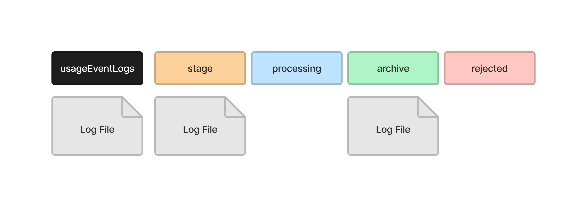
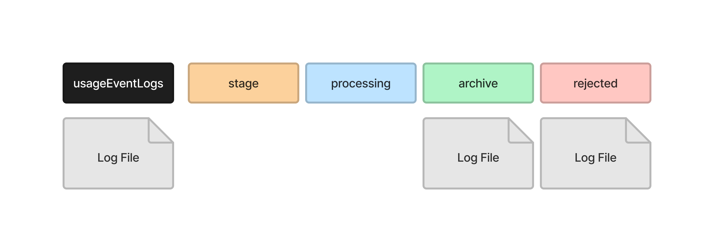

# Statistics

> This section describes how the application compiles stats. For an overview of what statistics are available to administrators and managers, read the [Administrator's Guide](/admin-guide/en/statistics).
{:.notice}

The application provides statistics on the number of users who visit the public website for each journal, press or preprint server. These stats are logged, processed, and compiled into metrics in a series of steps.

## How stats are compiled

When a user visits one of the [tracked pages](#when-a-usage-event-is-dispatched), an event is triggered which logs the visit to a log file in the `files_dir`. The application then uses scheduled tasks and [jobs](./utilities-jobs) to process the logs and compile the final metrics. The following diagram describes how this happens.



| Class | Description |
| --- | --- |
| `UsageEvent` | The [Event](./utilities-events) dispatched when a user visits a tracked page. The event will include data about what page was visited, such as the `Submission` and `Context`. |
| `LogUsageEvent` | The [Listener](./utilities-events) which anonymizes the IP, determines the user's geography and institution, and writes to the log file. |
| `UsageStatsLoader` | The scheduled task which writes to the temporary records tables and dispatches jobs to compile the daily and monthly metrics. |
| `CompileUsageStatsFromTemporaryRecords` | The [Job](./utilities-jobs) which compiles the temporary records into the final daily metrics. |
| `CompileMonthlyMetrics` | The [Job](./utilities-jobs) which compiles daily metrics into monthly metrics. If the application is configured to only store monthly metrics, it will also delete the daily metrics. |

## Understanding the log files

A log entry is recorded in the log files for each user visit. This entry is a JSON string with information about what was visited, like the context, submission, file, issue, and more. A log entry will look like the following.

```json
{"time":"2023-02-27 11:41:14","ip":"87d8edf8ca58ab4d3e9421b03edcd9c5a2093a79c341964179b8e379faabd324","userAgent":"Mozilla\/5.0 (X11; Ubuntu; Linux x86_64; rv:109.0) Gecko\/20100101 Firefox\/110.0","canonicalUrl":"https:\/\/example.org\/publicknowledge\/index","assocType":256,"contextId":1,"submissionId":null,"representationId":null,"submissionFileId":null,"fileType":null,"country":null,"region":null,"city":null,"institutionIds":[],"version":"3.4.0.0","issueId":null,"issueGalleyId":null}
```

It will be easier to read when it is run through a JSON formatter.

```json
{
    "time": "2023-02-27 11:41:14",
    "ip": "87d8edf8cac2b8fd179421b03edcd9c5a2093a79c341964179b8e379faabd324",
    "userAgent": "Mozilla\/5.0 (X11; Ubuntu; Linux x86_64; rv:109.0) Gecko\/20100101 Firefox\/110.0",
    "canonicalUrl": "https:\/\/example.org\/publicknowledge\/index",
    "assocType": 256,
    "contextId": 1,
    "submissionId": null,
    "representationId": null,
    "submissionFileId": null,
    "fileType": null,
    "country": null,
    "region": null,
    "city": null,
    "institutionIds": [],
    "version": "3.4.0.0",
    "issueId": null,
    "issueGalleyId": null
}
```

The log files are stored in `<files_dir>/usageStats`, in the following subdirectories.

| Directory | Description |
| --- | --- |
| `archive` | All log files that have been successfully processed into metrics. |
| `processing` | All log files currently being processed. Log files are moved into this directory when `UsageStatsLoader` is moving log entries into the temporary records tables. |
| `reject` | Any log files which could not be processed, usually due to a formatting error. |
| `stage` | Any log files which are about to be processed. `UsageStatsLoader` will move all log files it expects to process into this directory before processing them one-by-one. |
| `usageEventLogs` | All log files which are waiting to be processed. |

When the scheduled task, `UsageStatsLoader`, is run, the log files are moved through the directories as they are processed. Consider the following example. There are three log files waiting to be processed.



`UsageStatsLoader` starts by moving all of the files it wants to process into the `stage` directory. One file is not moved because this file includes logs for the current day, so more log entries may still be written to it.



It then moves the first file into the `processing` directory, where it reads the log entries into the temporary records tables in the database.



It moves the file into the `archive` directory when it has finished.



It then moves the next file into the `processing` directory, where it reads the log entries into the temporary records tables in the database.


And moves the file into the `archive` directory when it has finished.


If `UsageStatsLoader` encounters a problem reading the log file, it will remove any data it inserted into the temporary records tables and move the log file into the `rejected` directory.



## When a usage event is dispatched

The usage event will be dispatched when a user visits one of the following pages.

| Page | Description |
| --- | --- |
| Publication | The webpage for any published article, book or monograph, including all versions of that publication. |
| File | A file for any published article, book or monograph. |
| Issue | The table of contents of a published issue (OJS). |
| Issue Galley | The galley of a published issue (OJS). |
| Homepage | The homepage of the journal, press or preprint server. |
| Catalog | The catalog of a press (OMP). |
| Chapter | The webpage for the chapter of a published book (OMP). |
| Series | The webpage of a series in the catalog of a press (OMP). |

## Understanding the database tables

Statistics are initially processed into the `*_temporary_records` tables of the database. These are then compiled into the final `metrics_*` tables.

Read a description of these tables in the database reference. (TODO: add database reference.)

## Service Classes

Several service classes are available to access the compiled metrics data for submissions, files, geographic regions, institutions and more. Use these classes instead of going directly to the metrics tables.

For example, get a list of the most viewed submissions.

```php
$totals = Services::get('publicationStats')->getTotals([
    'contextIds' => [1]
]);
```

The following service classes are available.

| Service | Class | Description |
| --- | --- | --- |
| `Services::get('contextStats')` | `PKPStatsContextService` | Views of the homepage. |
| `Services::get('publicationStats')` | `StatsPublicationService` | Views and downloads of submissions and submission files. |
| `Services::get('issueStats')` | `StatsIssueService` | Views and downloads of issues (OJS). |
| `Services::get('geoStats')` | `PKPStatsGeoService` | Views and downloads by country, region or city. |
| `Services::get('sushiStats')` | `PKPStatsSushiService` | Metrics according to the [COUNTER 5 SUSHI](https://www.projectcounter.org/counter-sushi/). |
| `Services::get('editorialStats')` | `StatsEditorialService` | Stats about editorial activity. See [Editorial Stats](./statistics-editorial). |


## JSON vs CSV

All of the API endpoints for statistics can return the data in JSON or CSV format. When adding an API endpoint that delivers statistics, look for the `Accept` header in requests.

```php
$useCsvResponse = str_contains(
  $slimRequest->getHeaderLine('Accept'),
  APIResponse::RESPONSE_CSV
);
```

The `APIResponse` has a helper method that can be used to return CSV data.

```php
use PKP\core\APIResponse;
use Slim\Http\Request;


public function getMany(Request $request, APIResponse $response): APIResponse
{

  // ...

  $useCsvResponse = str_contains(
    $slimRequest->getHeaderLine('Accept'),
    APIResponse::RESPONSE_CSV
  );

  if ($useCsvResponse) {
    return $response->withCSV(
      $items
      $columnNames,
      $items
    );
  }

  return $response->withJson([
    'items' => $items,
    'itemsMax' => $itemsMax
  ], 200);
}
```

## Best Practices

Since the `UsageEvent` is dispatched every time someone visits the website, any task performed in the event or listener will slow down the site. Never access the database, load data, make a HTTP request, or perform any resource intensive task in the event or listener. Add the smallest amount of data that you need to the log and keep all other tasks in a job or scheduled task.
