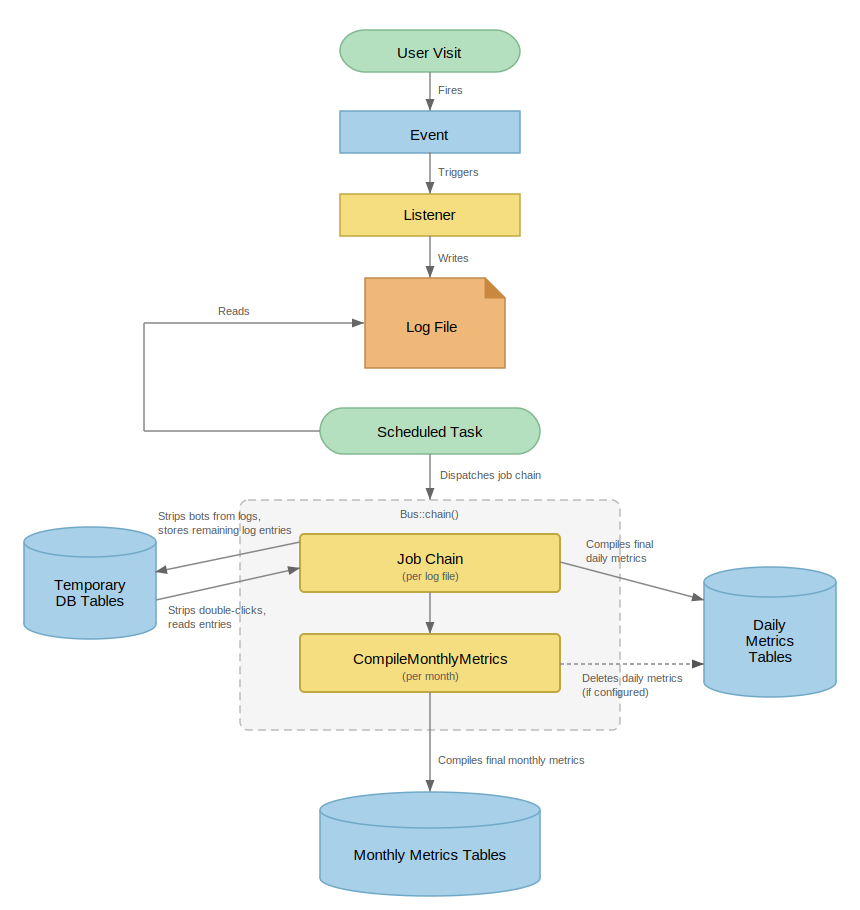
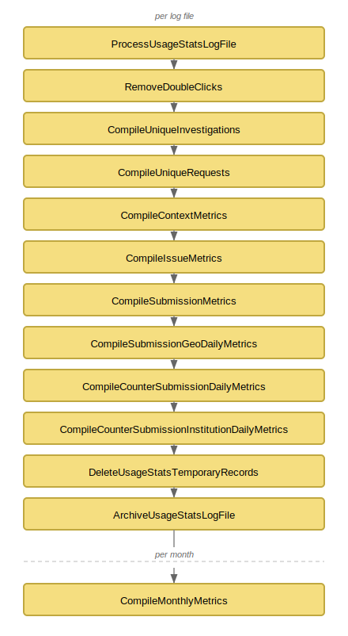
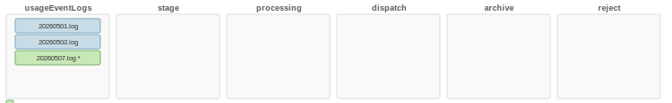
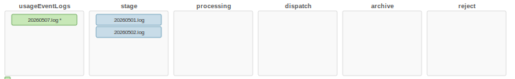
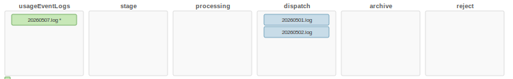
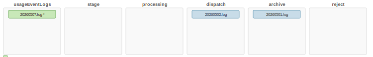
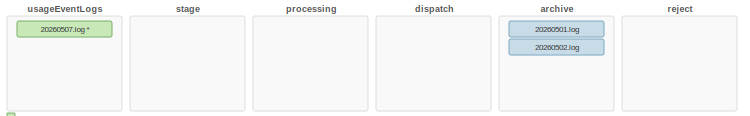
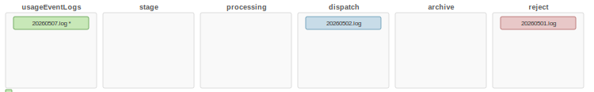

# Statistics

> This section describes how the application compiles stats. For an overview of what statistics are available to administrators and managers, read the [Administrator's Guide](/admin-guide/en/statistics).
{:.notice}

The application provides statistics on visits and downloads on the public website for each journal, press or preprint server. These stats are logged, processed, and compiled into metrics in a series of steps.

## How stats are compiled

When a user visits one of the [tracked pages](#when-a-usage-event-is-dispatched), an event is triggered which logs the visit to a log file in the `files_dir`. The application then uses [scheduled tasks](/admin-guide/en/deploy-scheduled-tasks) and [jobs](./utilities-jobs) to process the logs and compile the final metrics. The following diagram describes how this happens.



The following diagram shows the individual jobs that make up the job chain dispatched by `UsageStatsLoader` (example: OJS).



| Class | Description |
| --- | --- |
| `UsageEvent` | The [Event](./utilities-events) dispatched when a user visits a tracked page. The event will include data about what page was visited, such as the `Submission` and `Context`. |
| `LogUsageEvent` | The [Listener](./utilities-events) which anonymizes the IP, determines the user's geography and institution, and writes to the log file. |
| `UsageStatsLoader` | The scheduled task which reads log files from the `usageEventLogs` directory and dispatches a `Bus::chain()` of jobs per log file to compile the daily metrics, plus one `CompileMonthlyMetrics` job per affected month. |
| `ProcessUsageStatsLogFile` | The [Job](./utilities-jobs) which reads the log file line by line, filters out bot entries, validates each entry, and inserts the remaining entries into the usage stats temporary DB tables. |
| `RemoveDoubleClicks` | The [Job](./utilities-jobs) which removes duplicate interactions within 30 seconds from the same user on the same item, as required by [COUNTER](https://cop5.projectcounter.org/) guidelines. |
| `CompileUniqueInvestigations` | The [Job](./utilities-jobs) which compiles unique item investigations (views of a submission or its metadata) per user session in the temporary tables, producing the COUNTER unique investigation metric. |
| `CompileUniqueRequests` | The [Job](./utilities-jobs) which compiles unique item requests (accesses to full-text content) per user session in the temporary tables, producing the COUNTER unique request metric. |
| `CompileContextMetrics` | The [Job](./utilities-jobs) which compiles total homepage views of the journal, press, or preprint server from the temporary tables into the daily metrics tables. |
| `CompileIssueMetrics` | The [Job](./utilities-jobs) which compiles total views of issues and issue galleys from the temporary tables into the daily metrics tables. OJS only. |
| `CompileSeriesMetrics` | The [Job](./utilities-jobs) which compiles total views of series from the temporary tables into the daily metrics tables. OMP only. |
| `CompileSubmissionMetrics` | The [Job](./utilities-jobs) which compiles total views of submissions and submission files from the temporary tables into the daily metrics tables. |
| `CompileSubmissionGeoDailyMetrics` | The [Job](./utilities-jobs) which compiles submission views broken down by country, region, and city into the daily geo metrics tables. |
| `CompileCounterSubmissionDailyMetrics` | The [Job](./utilities-jobs) which compiles COUNTER-compliant total, unique investigation, and unique request counts per submission per day into the daily metrics tables. |
| `CompileCounterSubmissionInstitutionDailyMetrics` | The [Job](./utilities-jobs) which compiles COUNTER-compliant metrics per submission and institution into the daily metrics tables. |
| `DeleteUsageStatsTemporaryRecords` | The [Job](./utilities-jobs) which removes all temporary records for the processed log file from the usage stats temporary DB tables. |
| `ArchiveUsageStatsLogFile` | The [Job](./utilities-jobs) which moves the processed log file to the `archive` directory and optionally compresses it. |
| `CompileMonthlyMetrics` | The [Job](./utilities-jobs) which aggregates the daily geo and COUNTER metrics into monthly totals for a given month. If the site is not configured to keep daily stats, it also deletes the daily records for that month, except for the current and previous month. |

## Understanding the log files

A log entry is recorded in the log files for each user visit. This entry is a JSON string with information about what was visited, like the context, submission, file, issue, and more. A log entry will look like the following.

```json
{"time":"2026-02-27 11:41:14","ip":"87d8edf8ca58ab4d3e9421b03edcd9c5a2093a79c341964179b8e379faabd324","userAgent":"Mozilla\/5.0 (X11; Ubuntu; Linux x86_64; rv:109.0) Gecko\/20100101 Firefox\/110.0","canonicalUrl":"https:\/\/example.org\/publicknowledge\/index","assocType":256,"contextId":1,"submissionId":null,"representationId":null,"submissionFileId":null,"fileType":null,"country":null,"region":null,"city":null,"institutionIds":[],"version":"3.5.0.0","issueId":null,"issueGalleyId":null}
```

It will be easier to read when it is run through a JSON formatter.

```json
{
    "time": "2026-02-27 11:41:14",
    "ip": "87d8edf8cac2b8fd179421b03edcd9c5a2093a79c341964179b8e379faabd324",
    "userAgent": "Mozilla\/5.0 (X11; Ubuntu; Linux x86_64; rv:109.0) Gecko\/20100101 Firefox\/110.0",
    "canonicalUrl": "https:\/\/example.org\/publicknowledge\/index",
    "assocType": 256,
    "contextId": 1,
    "submissionId": null,
    "representationId": null,
    "submissionFileId": null,
    "fileType": null,
    "country": null,
    "region": null,
    "city": null,
    "institutionIds": [],
    "version": "3.5.0.0",
    "issueId": null,
    "issueGalleyId": null
}
```

Log files written by `LogUsageEvent` are named `usage_events_YYYYMMDD.log` (e.g., `usage_events_20260507.log`).

The log files are stored in `<files_dir>/usageStats`, in the following subdirectories.

| Directory | Description |
| --- | --- |
| `archive` | All log files that have been successfully processed into metrics. |
| `dispatch` | All log files that have been validated by `UsageStatsLoader` and are waiting to be processed by the job chain. |
| `processing` | A temporary directory used by `UsageStatsLoader` while it validates each log file before moving it to `dispatch`. A file remaining here after `UsageStatsLoader` has run indicates the task was interrupted mid-run. |
| `reject` | Any log files that could not be processed by `ProcessUsageStatsLogFile`, usually due to a formatting error. |
| `stage` | Log files moved from `usageEventLogs` that are waiting for `UsageStatsLoader` to validate and move to `dispatch`. |
| `usageEventLogs` | All log files written by the `LogUsageEvent` listener, waiting to be processed. |

When the scheduled task, `UsageStatsLoader`, is run, the log files are moved through the directories as they are processed. Consider the following example. There are three log files waiting to be processed.



`UsageStatsLoader` starts by moving all of the files it wants to process into the `stage` directory. One file is not moved because this file includes logs for the current day, so more log entries may still be written to it.



It then validates each staged file and moves it through the `processing` directory into the `dispatch` directory. Once all files have been moved to `dispatch`, it dispatches the job chain.



The job chain processes each file sequentially. `ProcessUsageStatsLogFile` reads the log entries into the temporary records tables, and the other jobs compile the metrics. When all jobs for a file are complete, `ArchiveUsageStatsLogFile` moves it from `dispatch` to the `archive` directory.



It then processes the next file in the same way.



If `ProcessUsageStatsLogFile` encounters a problem reading a log file, it removes any data it inserted into the temporary records tables and moves the file from `dispatch` to the `reject` directory. The remainder of the job chain is stopped.



## When a usage event is dispatched

The usage event will be dispatched when a user visits one of the following pages.

| Page | Description |
| --- | --- |
| Publication | The webpage for any published article, preprint, book or monograph, including all versions of that publication. |
| File | A file for any published article, preprint, book or monograph. |
| Issue | The table of contents of a published issue (OJS). |
| Issue Galley | The galley of a published issue (OJS). |
| Homepage | The homepage of the journal, press or preprint server. |
| Catalog | The catalog of a press (OMP). Tracked under the same metric as the press homepage. |
| Chapter | The webpage for the chapter of a published book (OMP). |
| Series | The webpage of a series in the catalog of a press (OMP). |

## Best Practices

Since the `UsageEvent` is dispatched every time someone visits the website, any task performed in the event or listener will slow down the site. Never access the database, load data, make a HTTP request, or perform any resource intensive task in the event or listener. Add the smallest amount of data that you need to the log and keep all other tasks in a job or scheduled task.

## Understanding the database tables

Statistics are initially processed into the `usage_stats_*_temporary_records` tables of the database. These are then compiled into the final `metrics_*` tables.

Read a description of these tables in the [database reference](/dev/database/).

## Service Classes

Several service classes are available to access the compiled metrics data for submissions, files, geographic regions, institutions and more. Use these classes instead of going directly to the metrics tables.

For example, get a list of the most viewed publications.

```php
$totals = app()->get('publicationStats')->getTotals([
    'contextIds' => [1]
]);
```

This will return an array of submission IDs and totals.

```
[
    [0] => stdClass Object
        (
            [submission_id] => 5
            [metric] => 1102
        )
    [1] => stdClass Object
        (
            [submission_id] => 6
            [metric] => 875
        )
    ...
]
```

The method accepts several arguments to filter submissions by date, section, or a search phrase. For example, here is how to get a list of the top 10 publications of a journal by total visits in March 2022.

```php
$totals = app()->get('publicationStats')->getTotals([
    'contextIds' => [1],
    'count' => 10,
    'offset' => 0,
    'dateStart' => '2022-03-01',
    'dateEnd' => '2022-03-31'
]);
```

It can also return publications ranked by the number of downloads of primary or supplementary files, or a specific file type like PDF. Get a list of the top 10 publications of a journal by total downloads of their primary PDF files.

```php
$totals = app()->get('publicationStats')->getTotals([
    'contextIds' => [1],
    'count' => 10,
    'offset' => 0,
    'assocTypes' => [Application::ASSOC_TYPE_SUBMISSION_FILE],
    'fileTypes' => [StatisticsHelper::STATISTICS_FILE_TYPE_PDF]
]);
```

Most service classes have a method to view total visits broken down into a monthly or daily timeline. Get a count of monthly visits to all publications in 2022.

```php
$timeline = app()->get('publicationStats')->getTimeline(
    StatisticsHelper::STATISTICS_DIMENSION_MONTH,
    [
        'contextIds' => [1],
        'dateStart' => '2022-01-01',
        'dateEnd' => '2022-12-31',
    ]
);
```

This will return an array like this.

```
[
    [
        'date' => '2022-01',
        'label' => 'January, 2022',
        'value' => 530,
    ],
    [
        'date' => '2022-02',
        'label' => 'February, 2022',
        'value' => 430,
    ],
    [
        'date' => '2022-03',
        'label' => 'March, 2022',
        'value' => 630,
    ],
    ...
]
```

Most of the statistics service classes support the same methods and arguments. View the source code for each service class listed below to see which methods and arguments are supported.

| Service | Class | Description |
| --- | --- | --- |
| `app()->get('contextStats')` | `PKPStatsContextService` | Views of the homepage. |
| `app()->get('publicationStats')` | `StatsPublicationService` | Views and downloads of submissions and submission files. |
| `app()->get('issueStats')` | `StatsIssueService` | Views and downloads of issues (OJS). |
| `app()->get('geoStats')` | `PKPStatsGeoService` | Views and downloads by country, region or city. |
| `app()->get('sushiStats')` | `PKPStatsSushiService` | Metrics according to the [COUNTER 5 SUSHI](https://cop5.projectcounter.org/en/5.0.3/08-sushi/index.html). |
| `app()->get('editorialStats')` | `StatsEditorialService` | Stats about editorial activity. See [Editorial Stats](./statistics-editorial). |


## JSON vs CSV

All of the API endpoints for statistics can return the data in JSON or CSV format. When adding an API endpoint that delivers statistics, check the `Accept` header — CSV is returned only when explicitly requested, otherwise JSON is returned by default.

```php
$useCsvResponse = str_contains($illuminateRequest->headers->get('Accept'), PKPRoutingProvider::RESPONSE_CSV['mime']);
```

`response()->withFile()` — a Laravel response macro registered in `PKPRoutingProvider` — can be used to return CSV data.

```php
use Illuminate\Http\JsonResponse;
use Illuminate\Http\Request;
use Illuminate\Http\Response;
use Symfony\Component\HttpFoundation\StreamedResponse;

public function getMany(Request $illuminateRequest): StreamedResponse|JsonResponse
{
    // ...
    $useCsvResponse = str_contains($illuminateRequest->headers->get('Accept'), PKPRoutingProvider::RESPONSE_CSV['mime']);

    if ($useCsvResponse) {
        return response()->withFile($items, $columnNames, $itemsMax);
    }

    return response()->json(['items' => $items, 'itemsMax' => $itemsMax], Response::HTTP_OK);
}
```
