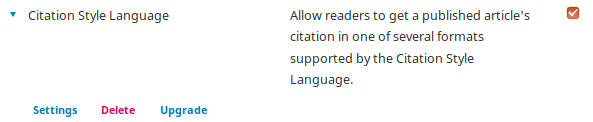

# Plugin Settings

> This section describes how to create a special settings form for a plugin. You can also add fields to existing forms. See the [custom field example](./examples-custom-field).
{:.tip}

Plugins can add a settings form so that an editor or admin can configure the plugin. Settings are accessed through the plugins list in the Website Settings area.

As of 3.5, plugin settings are built using two key pieces:

- **PluginSettingsController** — a base controller class that your plugin extends to define form fields and handle the API endpoints for reading and saving settings.
- **FormModal** — a Vue.js component from the ui-library that renders the settings form in a modal dialog, handling validation and saving automatically.

View the [Plugin Template](https://github.com/pkp/pluginTemplate) for a complete working example.

---

When you're ready, learn how to [release your plugin](./release) to the public.
