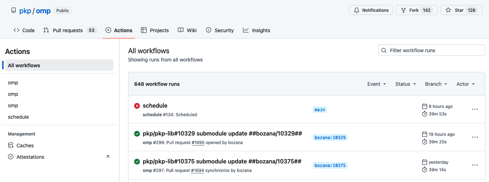
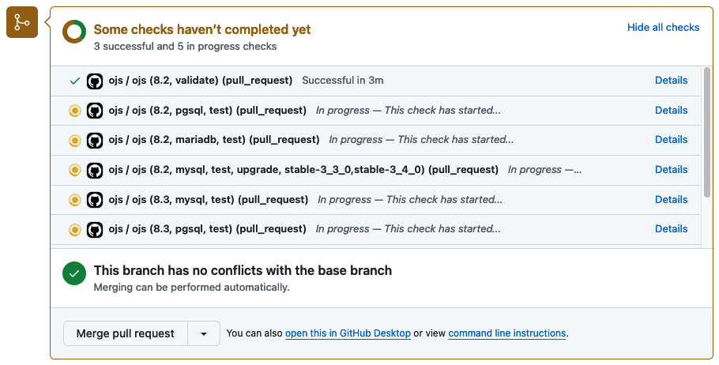

# Continuous Integration

We use [GitHub Actions](https://github.com/features/actions) for Continuous Integration (CI) testing. Integration and unit tests are run against every pull request to help catch regressions before they are released.

CI tests are configured to run the tests against multiple PHP versions and databases. The configuration details are stored in `.github/workflows/main.yml` for each application.



View the tests for [OJS](https://github.com/pkp/ojs/actions), [OMP](https://github.com/pkp/omp/actions) and [OPS](https://github.com/pkp/ops/actions).

## Tests for pull requests

GitHub Actions will run tests against every pull request to OJS, OMP, or OPS. The tests are listed in the checks at the bottom of the pull request.



Click the **Details** link beside a test to watch the test as it runs and see which tests have passed or failed. All tests must pass before a pull request will be merged.

### Prepare pull requests for testing

A change to an application may involve pull requests to more than one repository. For example, a change that impacts `pkp-lib` and `ojs` will require two pull requests. To ensure that all changes are tested, add a submodule commit to the application repository.

The example below will add a submodule update commit for `pkp-lib` for OJS:

```
cd path/to/ojs
git add lib/pkp
git commit -m "Submodule update"
```

> In most cases, your work will be spread across multiple repositories. Use the same branch name across each repository to keep track of them. For example, work on issue 5421 might be in a branch named `i5421_function` in `ojs` and `pkp-lib`.
{:.tip}

Sometimes changes are made to `pkp-lib` that do not require changes to OJS or OMP. In such cases, the tests must still be run. Create a branch in OJS or OMP, add the submodule commit, and create a pull request to OJS or OMP to run the tests.

---

Learn how to [write tests](./writing-tests).
