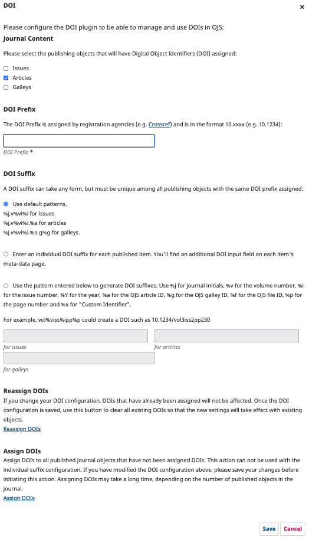

# DOI Plugin

The DOI Plugin assigns DOIs to publications. It can be configured to assign DOIs automatically or manually. The plugin will also generate and display the DOIs on the publication's landing page.  

The plugin is included with OJS 2.4.x and 3.x, OPS 3.x, and OMP 3.x.

## Enabling the DOI Plugin

Enabling the plugin in OJS, OMP, and OPS 3.x is all very similar.

1. As Journal Manager, go to Settings &gt; Website &gt; Plugins
2. Under Installed Plugins &gt; Public Identifier Plugins, find DOI
3. Click the box to the right of the DOI Plugin description to enable it

## Configuring the DOI Plugin

After enabling the plugin, a **Settings** link will appear.  You may need to click a blue arrow next to the plugin name to make the Settings link appear.

Select **Settings** and (with some variations depending on the platform and version) something similar to this form will appear.

Let's walk through these settings.

### Content

Here, you can choose the content that you want DOIs to be assigned to. Selecting a content type does not mean that all objects of that type will get a DOI. Depending on the chosen DOI suffix generation method, you can selectively assign DOIs if you like.  

_Recommendation_ // Keep it simple! Unless you have a specific use case, it's probably best to assign DOIs to the very basics (eg. article, book).

### DOI Prefix

The DOI prefix is mandatory. You'll receive your organization's prefix from your chosen DOI registration agency. The exact process for application is described on the agencies' web pages.

### DOI Suffix

There are several suffix generation strategies available. There are a few things you should know when selecting your suffix patterns.

**Default Patterns**: When you choose one of the pattern-based generation methods then a DOI will be generated for all objects. You will be able to see what that DOI will be _prior to publication_ if you want to put it in your galleys.

**Individual DOI suffix**: Choosing the individual DOI suffix option will allow you to enter suffixes independently for any object. Only use this option if none of the other suffix generation strategies fulfill your needs - e.g. when your organization has global rules for suffix generation different from what can be implemented with custom patterns, or if you do not want to generate DOIs for all objects by default.

**Custom Patterns**: When you enter custom patterns, it is your responsibility to create patterns that result in unique DOI suffixes for your prefix. You have to enter a combination of journal, issue, and object-specific identifiers to make sure that DOIs cannot be duplicated. A galley-suffix for example, that does not contain the journal ID can be duplicated among several journals if the same prefix is used for those journals. The same can happen if you generate DOIs for articles and issues without using the issue ID in the article suffix (e.g. when generating the DOI for the issue with the internal ID 1 and the article with internal ID 1). Look at the standard patterns for examples.

_Recommendation 1_ // Read [Crossref's guide to constructing your DOIs](https://www.crossref.org/documentation/member-setup/constructing-your-dois/).

_Recommendation 2_ // DOIs are not intended to be human-readable! You may be tempted to convey a lot of shorthand meaning to your suffixes. But, properly updated DOIs will take you where you want to go and contain all of the relevant metadata about a publication. A DOI with a completely opaque suffix functions the exact same way as a DOI that contains human-readable citation-based information. The less you have to worry about a typo in a DOI the better, because DOIs _cannot be edited once they are registered_. Save yourself the headache!

_Recommendation 3_ // Use default patterns if you want to assign DOIs automatically.

### Reassign DOIs

> Does not appear in all versions of the DOI Plugin

The **Reassign DOIs** button deletes all currently assigned DOIs but not your individually assigned URL or DOI suffixes. This is an advanced action. _Please use it with utmost care and make sure you understand its exact action first_ - e.g. within a test environment. All DOIs will be regenerated based on the patterns or custom identifiers you entered. This means that if you change the patterns or custom identifiers after you already assigned DOIs then previously assigned DOIs will be completely lost and the same object will receive a different DOI. This should be avoided in most cases as it means double-registration of the same object with two different DOIs which is contrary to the purpose of DOIs in the first place. In any case you should make a **database backup** before you delete all assigned DOIs.

### Assign DOIs

> Does not appear in all versions of the DOI Plugin

**Assign DOIs** will, when clicked, assign a DOI to any published material using the chosen suffix pattern. This is a good way to catch any DOIs you may have missed, or to assign DOIs to a newly-uploaded back-issue.
