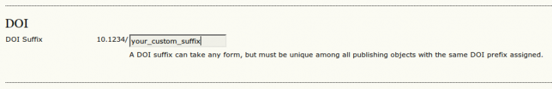

# When Are DOIs Assigned?

It is important that you understand when DOIs will be assigned because **DOI assignment is irreversible**. Once an article or issue is published there is no way from impeding automatic DOI assignment to the corresponding objects (issues, articles, galleys and supplementary files). This is due to the nature of permanent IDs: they are meant to be assigned once and only once and then never change again. This means that as soon as any public user got the chance to access a DOI it may never be changed after.

The DOI of the object is generated automatically during the first public access to the object. Public access to a publication object is assumed whenever the object is viewed for the first time on the public web site of the journal or whenever the object was exported to a file format that contains and supports DOIs (e.g. PubMed format, native OJS export format, Crossref, DataCite, mEDRA formats, etc.).

The assignment logic is slightly different for the different suffix generation strategies

## Pattern-based Suffix Generation (custom or default patterns)

DOIs will always be generated according to the currently configured pattern on first public access. This also means that changing a pattern will not change already assigned DOIs. It will only have effect on DOIs being generated from that moment on. Be careful when changing patterns that the new pattern does not share its namespace with the previous pattern. Otherwise duplicate DOIs may result which will lead to problems when trying to register these IDs.

Once you configured the pattern for DOI suffix generation in the DOI plug-in you'll not have to do anything special for an object to get a DOI assigned. As soon as the object is published and has been publicly accessed for the first time a DOI will be assigned based on the corresponding pattern.

## Custom IDs / URL Suffixes

The DOI will also always be generated on first public access. If no custom ID / URL suffix has been entered for the object then a DOI will be generated based on the default OJS URL suffix. This DOI will not change even if you enter a URL suffix later. There is no way to change your DOI once it has been assigned so be sure to enter a URL suffix before you publicly access an object for the first time!

Once you correctly configured OJS to generate DOIs based on custom IDs / URL suffixes and you enabled the custom ID option in journal setup step 4 for the same object types you'll see URL entry fields on the metadata pages of issues, galleys and supplementary files. URL suffixes for articles can NOT be entered on the article metadata page but must be entered into the issue's "table of content". If you correctly configured OJS then you'll find a URL entry field for every article there.

NB: If you forget to enable "custom IDs" for the objects you want to assign DOIs to in journal setup, then you will not be able to enter DOI suffixes and you DOI suffixes will be generated based on the OJS default URL suffix.

## Individual DOI Suffixes

The logic is slightly different to support selective DOI assignment. In this case a DOI will not be assigned even for already published objects if a DOI suffix has not been entered for that object. This allows the journal to offer DOIs to the authors as an optional (and potentially paid) service on a one-by-one basis. The individual suffix can be changed as long as no DOI has been assigned by public access to the object. Once the object has been accessed publicly with an individual suffix assigned, the suffix cannot be changed any more!

As long as no DOI has been assigned to the object (see "When are DOIs being assigned?" above), you'll find a DOI suffix entry field on the object's metadata page. See "When are DOIs being assigned?" for a list of these metadata pages.

See the following example of the DOI suffix field for issues:

You can change this field as long as no DOI has been assigned to the object. Leaving the field empty or deleting its contents and saving the form means that the object will not get a DOI assigned, even if it is publicly accessed.

## DOI Preview

Whatever suffix generation strategy you choose, you'll be able to preview the DOI on the object's metadata page without actually assigning a DOI, provided that the object has not yet been published. The metadata pages for the different object types are:

- Issues: The issue data page that can be reached through the issue lists available to the editor role.
- Articles: The article metadata page available through the article's summary page available to all editorial roles.
- Galleys and Supplementary Files: The galley metadata page available through the corresponding article's "Editing" page. Click on the "Edit" link corresponding to the file in the "Layout" section of the page.

These pages will be referred to as "metadata pages" throughout this documentation.
