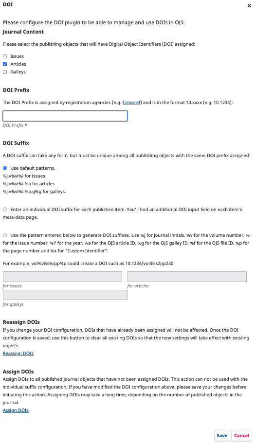

# DOI Plugin

The DOI Plugin works in OJS and OMP to automatically or manually assign DOIs to publications and to generate and display the DOIs on the publication page.  The plugin is included with OJS 2.4.x and 3.x and OMP 3.x.

## Enable the DOI Plugin

To enable the plugin in OJS 3.x:

1. As Journal Manager, go to Settings &gt; Website &gt; Plugins
2. Under Installed Plugins &gt; Public Identifier Plugins, find DOI
3. Click the box to the right of the DOI Plugin description to enable it

To enable the plugin in OJS 2.4.x:

1. As Journal Manager, go to User Home / Journal Management
2. Under Management Pages, select System Plugins &gt; Public Identifier Plugins
3. Under DOI, click Enable

To enable the plugin in OMP 3.x:

1. As Administrator or Press Manager, go to Settings &gt; Plugins
2. Under Public Identifier Plugins, find DOI
3. Click the box to the right of the DOI Plugin description to enable it

## Configure the DOI Plugin

After enabling the plugin, a Settings link will appear.  You may need to click a blue arrow next to the plugin name to make the Settings link appear.

Select Settings and something similar to this form will appear.

First select the types of content that you want DOIs to be assigned to. Selecting this option does not mean that all objects of the selected type need to get a DOI assigned. Depending on the chosen DOI suffix generation method, you can selectively assign DOIs if you like (see "When are DOIs being assigned?" below). Selecting a type of content makes the DOI configuration fields available on the corresponding object-specific metadata entry pages. Please be aware that not all registration agencies support all object types for DOI registration. For example, while DataCite is able to support all object types, mEDRA will not register supplementary files.

In OJS DOIs can be assigned to individual issues, articles, galleys, or supplementary files.

In OMP DOIs can be assigned to books, publication formats, and files, but they cannot be assigned to chapters.

The DOI prefix is mandatory. As described in the previous chapter you'll receive your organization's prefix from the DOI registration agency. The exact process for application is described on the agencies' web pages.

There are several suffix generation strategies available:

**Pattern generated method**: When you choose one of the pattern-based generation methods then a DOI will be generated for all objects. You are not obliged to register all these DOIs with the registration agencies, though. The DOI registration agency connectors allow for selective registration.

When you enter custom patterns, it is your responsibility to create patterns that result in unique DOI suffixes for your prefix. You have to enter a combination of journal, issue, and object-specific identifiers to make sure that DOIs cannot be duplicated. A galley-suffix for example, that does not contain the journal ID can be duplicated among several journals if the same prefix is used for those journals. The same can happen if you generate DOIs for articles and issues without using the issue ID in the article suffix (e.g. when generating the DOI for the issue with the internal ID 1 and the article with internal ID 1). Look at the standard patterns for examples.

**Custom identifiers:** If you use custom identifiers (custom URL suffixes) to improve your URLs, you can use those same identifiers as DOI suffixes. Again you are responsible to not assign the same custom identifier to several objects. This is also true across object categories: You cannot assign the same URL suffix to articles and corresponding galleys for example. While this would still result in unique URLs due to the differing OJS URL prefix per object type it would mean duplicated DOI suffixes as the DOI prefix is common to all object types. OJS will check uniqueness of URL suffixes when you enter suffixes and will present you with a form error when you try to enter the same suffix twice.

**Individual DOI suffix:** Choosing the individual DOI suffix option will allow you to enter suffixes independently from the OJS URL of the object. Only use this option if none of the other suffix generation strategies fulfill your needs - e.g. when your organization has global rules for suffix generation different from what can be implemented with custom patterns, or if you do not want to generate DOIs for all objects by default.

The **Reassign DOIs** button deletes all currently assigned DOIs but not your individually assigned URL or DOI suffixes. This is an advanced action. Please use it with utmost care and make sure you understand its exact action first - e.g. within a test environment. All DOIs will be re-generated based on the patterns or custom identifiers you entered. This means that if you change the patterns or custom identifiers after you already assigned DOIs then previously assigned DOIs will be completely lost and the same object will receive a different DOI. This should be avoided in most cases as it means double-registration of the same object with two different DOIs which is contrary to the purpose of DOIs in the first place. In any case you should make a **database backup** before you delete all assigned DOIs.
