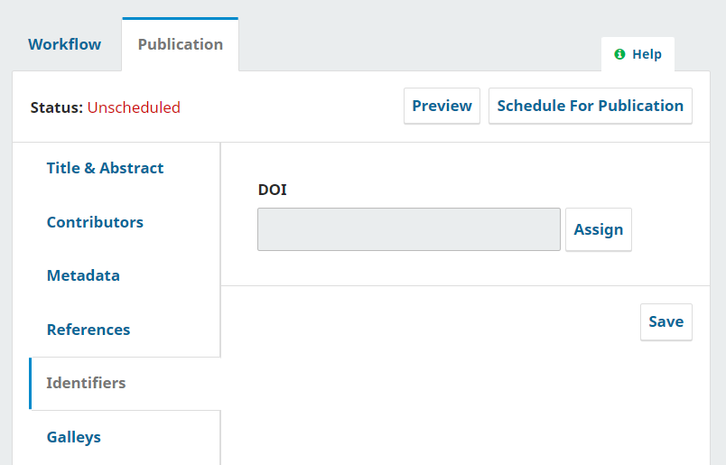

- - -
title: ¿Cuándo se asignan los DOIs?
- - -

# ¿Cuándo y cómo se asignan los DOIs?

Es importante saber cuándo se asignarán los DOIs porque **el registro de DOIs es irreversible**. Una vez publicado un artículo o número y registrado su DOI en una agencia de registro, no podrá cambiarlo. Esto se debe a la naturaleza de los identificaciones permanentes: están pensados para ser asignados una vez y sólo una vez y no volver a cambiar nunca más. En términos generales, los DOIs deben asignarse en *OJS cuando se programan para su publicación en un número*.

# Asignación de DOIs
Una vez configurados los DOIs en el plugin, en OJS/OMP/OPS versión 3.3 o anterior, deberá asignarlos a los objetos correspondientes. El proceso se ha renovado significativamente para OJS/OMP/OPS versión 3.4 y posteriores, donde los DOIs pueden gestionarse desde un área central. Próximamente se publicará la documentación sobre la asignación de DOIs para las versiones 3.4 y posteriores.

Si tiene una gran cantidad de números atrasados, puede [utilizar el botón Asignar DOIs en la configuración del plugin DOI como se ha descrito anteriormente](https://docs.pkp.sfu.ca/doi-plugin/en/doi-plugin#assign-dois).

Sin embargo, para futuros objetos publicados, tendrá que crear y asignar el DOI manualmente. En las versiones 3.2 y 3.3, desde la pestaña Publicación del flujo de trabajo de un envío, encontrará el área de gestión de DOI en la barra lateral izquierda, dentro del menú "Identificadores". (En la versión 3.1, deberá hacer clic en "Metadatos" en la barra de navegación superior y, a continuación, en la pestaña "Identificadores").

Pulse el botón "Asignar" para crear el DOI, y luego pulse el botón "Guardar" para confirmarlo. Aunque puede asignar un DOI antes de programarlo a un número, si su patrón de sufijos incluye volúmenes o números, será necesario primero programarlo para publicación.

(Si está asignando un DOI a un artículo que ya ha sido publicado, tendrá que despublicarlo temporalmente utilizando el botón "Despublicar" y volver a publicarlo después de asignar y guardar el DOI utilizando el botón "Programar para publicación").
