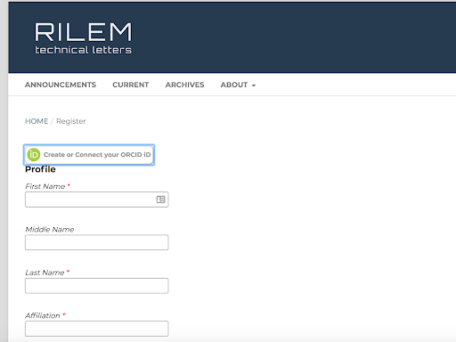
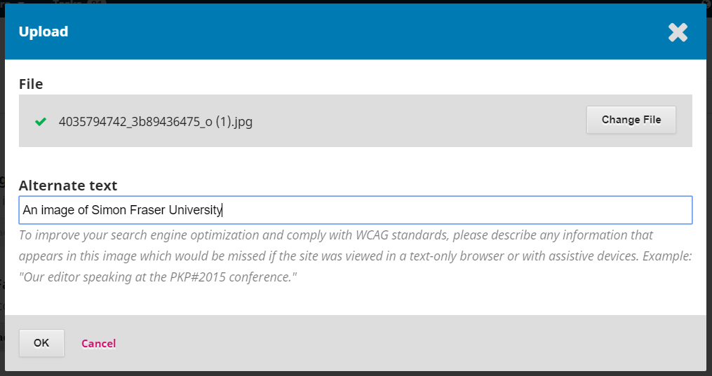
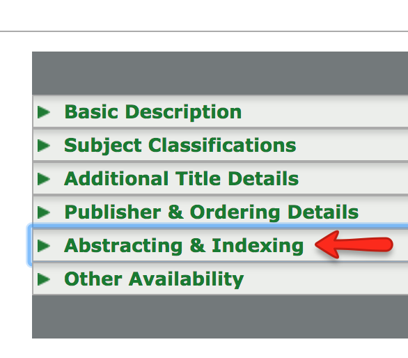
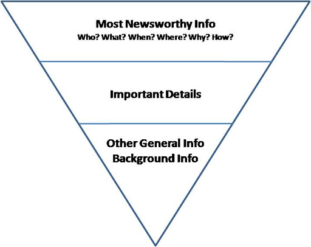

# Getting Found: Building Visibility

The success of your journal depends on developing a regular readership, who will become part of your scholarly community, cite your content in their own work, and tell others about the value of your publication. To do this, however, they will first need to be able to find you. This section examines a variety of ways to increase the “findability‟ of your journal through the use of commercial indexes, open databases, libraries, the media, professional networks, and professional recognition.

## Journal Standards and Identifiers

> Contributed by Roger Gillis

There are several different standards and identifiers that are commonly used in academic publishing, and it is important for journal managers to become familiar with them and the role that they play in the operation of the journal. Although not exhaustive, this section will cover the most important ones: ISSN (International Standard Serial Number), Digital Object Identifier (DOI), and ORCID (Open Researcher and Contributor ID).

### ISSNs

An important way of helping people find your journal, and helping libraries and other organizations to make it discoverable, is to obtain an International Standard Serial Number (ISSN). An ISSN is an eight-digit international standard, which allows for any serial publication (i.e. any publication that is published on a repeating or “serial”  basis -- journal, magazine, etc.), regardless of where it is published, the medium, language, or frequency of publication. ISSNs are widely used by libraries, citation indexes, and the publishing industry to uniquely identify and distinguish journals. They are often more important than the journal title itself for serials management because they provide a consistent identifier that helps to disambiguate like-titled journals.

Many external services, including indexing services such as the [Directory of Open Access Journals](https://doaj.org), require that journals have an ISSN.

An ISSN can be obtained free of charge from a [local ISSN Centre](http://www.issn.org/services/requesting-an-issn/).

 _An example of an ISSN application from Library and Archives Canada_

ISSNs should be displayed on the journal’s website where it can be easily located, such as the footer or sidebar. If the publication has both a print and online edition there is typically one for each. In OJS, you will be asked to enter your ISSN as part of the Journal Settings. This is used for metadata purposes and is not shown to readers. To make the ISSN visible in the journal footer, type it into the footer text field in the Website Settings. To make the ISSN visible in the sidebar, create a custom block.

For the final published version of an article (e.g., a PDF galley), you may also want to include the ISSN, along with the journal name and DOI (see below), on the final page, in the footer of the PDF, or in another area of the layout version of the article itself. This is important, as PDFs can be downloaded, shared via email, and become disassociated with the journal. You always want to provide an easy and obvious link back to your journal.

#### Best Practices for ISSN Usage

The ISSN International Organization has a [list of recommendations](https://www.issn.org/understanding-the-issn/assignment-rules/issn-the-major-principles/) for how best to apply ISSNs. Some of the more important principles include:

- a new ISSN should be applied for when a journal's title changes
- a new ISSN should be applied for when a journal's medium changes (from print to electronic)
- a new ISSN should be applied for when a journal merges with another title

### Digital Object Identifiers (DOIs)

> Contributed by Roger Gillis

The Digital Object Identifier or DOI is used to individually identify unique content and its location on the internet. They are typically applied to journal articles, but can be used for other content types such as datasets, images, or other supplementary materials added alongside articles. DOIs are what are called “persistent identifiers” — so even if the URL (Uniform Resource Locator - in other words, a website link) for a journal changes, the DOI remains the same and can be used to locate an article no matter where it moves on the web. DOIs are not only useful for readers trying to access articles, but are also used extensively by indexers, aggregators, and repositories, so it is important to take them seriously when trying to increase the visibility and impact of your journal.

### The anatomy of a DOI

A DOI consists of a series of characters divided into two parts -- a prefix and a suffix, which are separated by a slash. The prefix uniquely identifies the registrant (i.e. the publisher) of the title, and the suffix identifies the specific object.

For example, the article [“Health Care Professionals’ Opinions and Expectations of Clinical Pharmacy Services on a Surgical Ward”](http://www.cjhp-online.ca/index.php/cjhp/article/view/1606) has the DOI 10.4212/cjhp.v69i6.1606

* The “10.” part of the prefix identifies the DOI registry or the agency that issues the DOI numbers - in this example the agency is Crossref.
* The characters “4212” in the prefix identify the registrant - in this case, the publisher is Multimed.
* cjhp.v69i6.1606, the suffix, consists of several different parts, meant to distinguish the particular content.
* “cjhp” is an abbreviation for the journal -- The _Canadian Journal of Hospital Pharmacy_. This is a common feature of DOIs, where a journal will opt to be identified in a DOI by a standardized journal abbreviation. Multimed publishes multiple journals, and this helps to identify to which of its titles this article belongs.
* “v69i6.1606” is the volume number of the article (69), then the issue number (6), and finally “1606” is a unique identifier for the individual article. For journals using OJS, the DOI will be automatically generated for each article.

DOIs are capable of identifying a journal, an individual issue or volume of a journal, an individual article in a journal, or can even go so granular as to identify a table or chart in a particular article. Not all journals use an abbreviation as part of the suffix. Many use a random number that is assigned by a DOI registration agency. However, using a journal abbreviation is a good way of allowing users to more quickly identify your journal.

You may often see DOIs communicated as URLs: “https://dx.doi.org/10.4212/cjhp.v69i6.1606.” This method can be used to obtain any article that has a DOI, by indicating the DOI following the “dx.doi.org.”

### Setting up DOIs in OJS

Journals publishing with OJS will find it very easy to work with DOIs. However, some initial setup steps are required. First, you will need to register with [Crossref](https://www.crossref.org/membership/), which does require an annual fee. Further integration regarding OJS’ integration with Crossref can be found in the [Crossref manual](https://docs.pkp.sfu.ca/crossref-ojs-manual/). You will then need to enable the DOI plugin within the OJS Journal Settings. [Using DOIs and the DOI plugin](https://docs.pkp.sfu.ca/doi-plugin/) provides you with the detailed steps you need to follow to configure DOIs for OJS.

### Registering your DOIs in OJS

Once you have joined Crossref and configured OJS to use DOIs, you will need to register your content as it is published. OJS can be used to manually deposit DOIs to Crossref, or configured to automatically deposit DOIs. A step-by-step guide to making DOI deposits to Crossref can be found in the [Crossref manual](http://docs.pkp.sfu.ca/crossref/).

### Open Researcher and Contributor ID (ORCID)

> Contributed by Jennifer Chan

The Open Research and Contributor ID (ORCID) is a persistent digital identifier that distinguishes one researcher or contributor from another, and is being increasingly adopted in workflows for grant and publication submission. The ORCID also serves as a means of ensuring that a researcher is accurately identified as a contributor for a particular work. This is particularly useful when authors have the same names. ORCID also ensures that works are properly attributed to authors who have undergone a legal name change.

An ORCID can be obtained by any researcher by [registering on the ORCID website](https://orcid.org/register). Registering for an ORCID is free, and filling out a basic profile takes just a few minutes.

Here’s an example of an ORCID profile: [http://orcid.org/0000-0001-6192-8687](http://orcid.org/0000-0001-6192-8687) for researcher and PKP Director John Willinsky.

ORCID adoption is increasingly becoming a requirement among journal publishers and funders and many systems are using ORCIDs as a way to easily integrate author and/or contributor information into online submission forms. By identifying yourself with your ORCID in filling out a grant submission or manuscript submission form, the system that you’re entering can easily pull in all of the information contained in your ORCID profile into the registration form.

> **Note:** Having a public profile also lends credibility to a researcher, allowing them to specify their education, employment, as well as published works in one central location. It also lends credibility to the journal, such as when you include the ORCID numbers for each of your editorial team members on your website. It is a valuable way to demonstrate that there are real people associated with your journal, not a list of made up names (which is seen as a sign of being a “predatory” journal).

Journal managers can encourage the use of ORCIDs by authors as a means of effectively collecting up-to-date information. While it might not be appropriate to enforce the use of ORCIDs, as not all authors will have them, it could be suggested to authors that they obtain an ORCID as part of the submission process and that it be required upon acceptance. This information, including a link to the ORCID registration form, could be part of the journal’s submission policy and featured on the journal’s website.

For journals using OJS, the ORCID can be entered as part of a user profile (under “Public” in OJS 3):

The OJS registration page can also include the option for new users to use their ORCID when registering:

This will automatically pull their personal data (first name, last name, email, etc.) from the ORCID database into the OJS registration form.

## Search Engines

> Contributed by Roger Gillis

Despite the existence of specialized research databases, many researchers begin their online investigation in a search engine, like Google. Ensuring your journal is well placed within search engine search results is therefore an important responsibility for journal managers.

### Search Engine Optimization

Search Engine Optimization (SEO) refers to the process of increasing the visibility of a website, webpages, or website content (such as your journal articles) within search engines. SEO is an important consideration for online journals seeking to draw visitors to their sites. When a researcher does a search on Google that is relevant to your subject area, you want your articles to appear as close to the top of their result list as possible. SEO can help to put you higher on that list.

Most visits to websites are driven by search engines. Two major search engines make up more than 95% of all search traffic in the United States: Google and Yahoo!-Bing alliance. For most countries outside of the US, over 80% of search traffic comes solely from Google (with some exceptions, including Russia and China [(Fishkin & Moz, 2015)](https://moz.com/beginners-guide-to-seo).

Search engines provide two important functions: they return results relevant to the search query and they return results often according to popularity of the websites. Much of what is written about SEO pertains to commercially-oriented businesses and organizations seeking the maximum exposure for their brands and products via search engines. Some of these organizations have deep pockets and have invested considerable time, effort, and money on SEO. For those with limited or no budget and with highly specialized content, there are still some simple steps you can take to raise your visibility.

While most modern search engines are fairly adept at indexing sites, there are a number of things that you can do to rank higher in search engine results and draw more readers to your journal.

Some of the best ways to ensure good SEO are based on more general principles related to modern websites and design:

* Make your website easy to use, navigate, and understand
* Provide direct, actionable information relevant to a user's search query
* Deliver high quality, legitimate, credible content

Source: [(Fishkin & Moz, 2015)](https://moz.com/beginners-guide-to-seo).

Used appropriately, OJS can help you adhere to these principles, provide effective SEO for journals, and help you raise your visibility on the web.

### Practical steps and technical issues

Search engines work by sending out automated “crawlers” across the web. These “crawlers” need to be able to visit your site and index every page. Here are some practical steps and considerations you can use in order to help crawlers index your site:

* Search engines have an easier time indexing material that is in HTML format. For OJS journals, your site is in HTML and will present no problems for crawlers. Although more resource-intensive, you may wish to consider publishing HTML versions of your articles, as PDFs are typically not as indexable. However, keep in mind that steps can be taken to make PDFs more accessible to search engines. See: [10 Tips to make your PDFs SEO friendly](https://www.searchenginejournal.com/pdf-seo-best-practices/59975/)

* If you use images on your journal website or in your articles, it is advisable to use the “alt” attribute to provide search engines with a text-based description of images. This also improves the overall accessibility of your journal website, assisting users with screen readers to understand the contents of an image. For OJS journals, you can add alt tags for the information you enter as a part of the setup process.

Similarly, video and audio content is typically not indexed well by search engines, so providing things like transcripts can go a long way in making this content more accessible and indexed by search engines, as well as usable by a broader spectrum of users, such as those with hearing or visual disabilities.

### Usability and User experience

Another important way to enhance your SEO is by having a modern site that provides a positive user experience:

> “Usability and user experience are second order influences on search engine ranking success. They provide an indirect but measurable benefit to a site's external popularity, which the engines can then interpret as a signal of higher quality. This is called the "no one likes to link to a crummy site" phenomenon.” [(Fishkin & Moz, 2015, p. 27)](https://moz.com/beginners-guide-to-seo).

For OJS users, designing an appropriate site can be achieved through the new OJS theming capabilities.  In particular, OJS 3 offers significant improvements when it comes to user experience and usability, having undergone significant user testing in its development. For guidance on how to customize the look and feel of the OJS software, please consult the [PKP Theming Guide](https://docs.pkp.sfu.ca/pkp-theming-guide/en/).

### Getting Found and Getting Social

With the rise of social media, the sharing of content of websites (including academic articles) via social media outlets such as Facebook and Twitter has also arisen as a factor considered as part of SEO. While search engines may treat socially shared links differently than other web content, it is a factor that is taken into consideration when ranking search results [(Fishkin, & Moz, 2015)](https://moz.com/beginners-guide-to-seo). Google, for example, takes into account different social sharing factors when ranking its search results.

For advice on developing a social media presence for your journal, see the section in this guide on [using Social Media for your Journal](#social-media). Publicizing your publication and its contents through social media will help boost your [search engine](#search-engine-optimization) rankings.

### Linking up

Links aren't everything in SEO, but search professionals attribute a large portion of the engines' algorithms to link-related factors. Through links, engines can not only analyze the popularity of websites and pages based on the number and popularity of pages linking to them, but also metrics like trust, spam, and authority.” [(Fishkin, & Moz p.30)](https://moz.com/beginners-guide-to-seo)

Linking on the web works in two directions: links to your journal, including to your articles, from other sites, and links you include on your journal to other sites. Both play an important role in SEO. The more sites that link to your journal, the more likely your journal is to rank higher in search engine rankings. Here are some things you can do to help get more links to your journal:

1. Hire a professional graphic designer to create a journal logo that others could use to link to your site.
2. Have other journals, conferences, or associations in your discipline link to your site, in exchange for you linking to them.
3. Ask your professional association, universities, libraries, academics working in your discipline, or other related organizations in your field to provide a link to your site on their web pages.
4. Get articles from your journal featured (and therefore linked) in a news story, media release, or blog. Media stories also tend to reach larger audiences, ensuring that your journal website is noticed by more readers than usual.

Getting linked to often comes about through letting others know about your journal, and may not require any additional effort. Be wary of mass solicitation in attempting to get others to link to your site, however, as this is often seen as spam and can undermine the credibility of your journal as well as negatively impact your SEO.

Linking from your journal to other relevant sites is another important way to increase your SEO. Relevance is key here, as search engines are smart enough to recognize if you fill your site with unrelated links in an obvious attempt to raise your SEO illegitimately. Some simple ways to increase the relevant links on your website include:

1. Include links to profile pages at the home institutions or professional websites for all of your editorial team and authors. [See this example for PKP Director, Dr. John Willinsky](https://ed.stanford.edu/faculty/willinsk). This not only adds many relevant links to your journal website, but also significantly boosts its credibility by demonstrating that these are all real people. A common practice of predatory journals is to make up editorial board members, or to list people without their knowledge, so this is a good way to show you are a legitimate journal.
2. Include links to the ORCIDs of your editorial team and authors. Similar to the item above, it increases relevant links and increases your credibility.
3. Add DOI links to as many items in the references of your articles as possible. This will further boost both your relevant linking and your demonstration of being a professional publication. In OJS, this can be done by adding links to the reference list entries in the PDF galleys, the HTML galleys, and on the article abstract page.
4. Create a page for relevant journals, associations, and other organizations closely associated with your journal. For example the _Canadian Journal of Sociology_ would likely link to the Canadian Sociological Association.
5. Add a relevant Twitter feed to the homepage or sidebar of your journal, displaying the latest 5 or 6 links to the latest tweets from a related hashtag.

### Evaluating Your SEO

One of the easiest ways to determine how your publication might be faring in search engines is to do some tests for keywords and phrases. Try searching for your journal name or an article title in a search engine like Google and see your journal site is being indexed.

There are a wide variety of tools that can assist you with Search Engine Optimization and can help you understand the traffic for your website:

* [Google Webmaster tools](https://www.google.com/webmasters/) and the [Google Search Console](https://search.google.com/search-console/about) can help you understand how your site is performing, and provide many tools to help improve your search ranking and performance.
* [Google analytics](https://analytics.google.com/analytics/web/) or [Piwik](https://analytics.google.com/analytics/web/) can help you understand your web traffic. Both have OJS plugins and are popular, free, and effective ways to understand and report on traffic to your journal website.
* [Moz Link Explorer](https://moz.com/link-explorer) is another tool that allows you to analyze the sites that link to your website.

SEO can be intimidating and take time, practice, and experience to do properly. But by following some of the advice outlined in this section, you can take steps towards ensuring that your journal will be highly visible in the search engines used by researchers interested in your content and understand the web traffic reaching your website.

## Indexes and Databases

Indexes and databases are online, searchable collections of information. Sometimes they only include metadata (author names, article titles, subjects, keywords, etc.) and sometimes they contain the full-text. Some of them are freely available, and some of them require individual or institutional subscriptions to access. They are typically curated for relevance and quality and will have some set of criteria for what is included. For your journal, three important questions to ask are: is this database relevant to my journal? What are the criteria for being included? How do I submit my journal’s content?

### An introduction to indexing services

> Contributed by Andrea Kosavic

Indexing services ensure that scholarly content is discoverable and accessible to the broadest possible audience. It is strategic for a journal’s content to be visible where researchers in the field are conducting their research, and this is achievable by targeting indexes favoured by scholars in a given area of study. This includes any number of open and commercial indexing services and universal indexes like [Google Scholar](https://scholar.google.com).

Indexes can broadly be categorized as commercial and open. Both have their advantages and disadvantages and are explored in further detail in the sections that follow.

Those seeking maximum exposure for journals are advised to pursue inclusion in as many indexes as is appropriate and possible. It is prudent to bear in mind the significant [documented advantages of publishing in an open access format in terms of usage and impact](http://sparceurope.org/what-we-do/open-access/sparc-europe-open-access-resources/open-access-citation-advantage-service-oaca/oaca-list/). These advantages are magnified by indexing with open indexes.

It is strategic to target indexes for your journal that address the needs of the scholarly community engaging with your publication. These vary from one discipline to the next. Journal editors are advised to consult [Ulrichs Web Global Serials Directory](https://ulrichsweb.serialssolutions.com/), a commercial service for which institutional libraries may have a subscription. A common strategy is to look up related journals in your subject area within Ulrichs and explore their abstracting & indexing affiliations. This figure shows a tab that be expanded within a respective journal’s description page within Ulrichs.

 _A screenshot from Ulrichs Web Global Serials Directory_

This provides an ideal starting point for identifying services to approach. [SPARC also provides a broader list of indexes to consider](http://sparc.arl.org/resources/papers-guides/journal-indexing).

### The indexing process

Different indexes will have varying criteria for including your publication's content in their index. Depending on the index, the indexing process may require manual intervention. As an example, regular exports of metadata from your journal, sometimes in particular formats, may be required.

Some organizations may provide guidelines and their requirements for publishers providing content to them. This can include (but is not limited to):

* Delivery mechanism (e.g., via File transfer protocol or web upload)
* Acceptable file formats (e.g., PDF, HTML)
* Provision of metadata -- (e.g., JATS/NLM XML)

Also, bear in mind that some indexes may require that you meet certain criteria before being included in their indexes, such as reaching a minimum number of published articles or publishing a certain category of scholarly outputs (e.g., articles vs. reviews).

In OJS, there are many data export utilities, such as plugins that export to DOAJ and PubMed, that will facilitate providing some of the necessary contents and metadata to certain indexes.

Most often, when an independently published publication such as a journal seeks to partner with a commercial indexing service for inclusion with a particular commercial database or index, they will often be presented with a legal agreement.

If at all possible, it is advisable to seek legal counsel, or advice from those knowledgeable in electronic licensing, to review this document to ensure that it is in the best interest of your journal/publication.

Some things to be wary of:

If the commercial index asks for “exclusive” rights to index your publication, this is problematic. This means that you may not be free to provide other entities (commercial or noncommercial)  with the ability to index your content. Granting the indexing organization “nonexclusive” rights is much better because it frees your journal to seek out other indexing partnerships and not be limited to indexing in just one database or with one commercial vendor.

The amount of time between the provision of your content to the vendor (e.g., PDF files and article metadata) may vary from one subject index to the next. The vendor will typically provide some mechanism for correction of errors in the guidelines for providing them with content.

It is important to note that commercial products are not Open Access products. They are designed to provide access to a limited audience, and as such limit your publication's exposure. It is important to broaden one’s indexing strategy beyond commercial indexes and take advantage of multiple different indexes -- both commercial and noncommercial -- to seek the maximum exposure of your journal or publication to a wide variety of audiences.

### Open indexes

Open indexes are similar to commercial indexes in that they aggregate citation metadata into a single searchable database or listing. The main types of open indexes include directories and search engines. One of the principle advantages of open indexes is that they are freely available online for anyone to use, including individual readers and libraries.

Many open indexes are also more willing to include content from new journals, placing more emphasis on the quality of your content and your open access policy than on a large archive of published material. In addition, your content can often be included more quickly in open indexes. Open indexes are becoming increasingly important to researchers. While they may not yet have the same prestige or influence as some of the commercial indexes, becoming part of one or more of them will significantly raise your journal’s profile with a wider audience of readers.

Like commercial indexes, open indexes are also looking for high-quality content, peer review, compatible subject matter, and evidence of stability and sustainability. Some, however, may be willing to accept submissions from new journals lacking an established history of publication. If you do not know the best open indexes for your journal, contact your library. They will be able to guide you in the appropriate direction.

### Directory of Open Access Journals (DOAJ)

> Contributed by Andrea Pritt

The [Directory of Open Access Journals (DOAJ)](/doaj/en/) is an online, community-curated list of open access journals, which aims to be the starting point for researchers looking for quality peer-reviewed open access resources. As stated on the DOAJ website: “the aim of the DOAJ is to increase the visibility and ease of use of open access scientific and scholarly journals, thereby promoting their increased usage and impact”[(Directory of Open Access Journals [DOAJ], 2018)](https://doaj.org). The DOAJ's mission is to increase the visibility, accessibility, reputation, usage and impact of quality, peer-reviewed, open access scholarly research journals globally, regardless of discipline, geography or language."[DOAJ, “Mission” 2018](https://doaj.org/about). As of this writing, DOAJ claims to have approximately 11,000+ journals included as part of its index [(DOAJ, 2018)](https://doaj.org).

Having your journal included in DOAJ can have significant benefits for your journal’s reputation, usage, and impact. The DOAJ has established itself as a key index for high-quality open access journals worldwide. It is becoming the defacto “white list” of non-predatory open access journals, so you definitely want to be part of it. Including your journal in DOAJ will bring significant visibility to your journal -- libraries include DOAJ journals as part of their catalogs, which will mean that your journal's content will be included when thousands of students, faculty, and other researchers are looking for content. DOAJ is also a very common resource for authors looking for open access journals to publish in, which will also serve to raise the profile of your journal and assert its legitimacy. To help authors identify potential journals for submission by subject, DOAJ includes a "Browse Subjects" feature.

DOAJ determines quality and acceptance into the directory through an extensive application process. In March 2014, new criteria guidelines were established. DOAJ provides guidance for journals for its application process. Journals may also be removed from the index if they do not meet DOAJ’s requirements. More information about inclusion and removal of journals can be found at the [DOAJ FAQ list](https://doaj.org/faq#list). For guidance in applying for inclusion in DOAJ, please see [the DOAJ Application Guide](/doaj/).

### Google Scholar

> Contributed by  Roger Gillis and Andrea Kosavic

Google Scholar is a search engine for scholarly literature that has grown quite popular since it launched in 2004. It provides a simple search interface allowing users to search across many disciplines and sources for scholarly material such as articles, theses, books, abstracts, and court opinions and includes material from academic publishers, professional societies, online repositories, universities, and other web sites. [Google Scholar “About” 2018](https://scholar.google.ca/intl/en/scholar/about.html). The [Google Scholar Guide](/google-scholar/) provides a detailed guide for using and troubleshooting Google Scholar.

Google scholar is used by many people to access scholarly research, including researchers themselves, so having your journal included in its search results can provide great exposure for your journal.

OJS interacts very well with Google Scholar. In fact, Google Scholar [recommends OJS as a publishing system for journals seeking to get their articles discovered online](https://scholar.google.ca/intl/en/scholar/inclusion.html). In order to expedite indexing in Google Scholar you can also use [Google Webmaster Tools](https://www.google.com/webmasters/). And, see [the Google Scholar Indexing Guide](/google-scholar/) for detailed guidance relating to troubleshooting indexing with Google Scholar.

Google Scholar has as part of its criteria, that your content feature primarily scholarly articles. Additionally, at a minimum, the abstracts will need to be made freely available in order that they may be viewed in Google Scholar search results.

To be crawled by Google Scholar, the articles that your journal publishes need to be in either the HTML or PDF format. If publishing in PDF, the text must be searchable. To configure searchable text in OJS ensure that the appropriate search settings are enabled in the OJS `config.inc.php` file. You can read more about this in the [Administrator's Guide](https://docs.pkp.sfu.ca/admin-guide/en/managing-the-environment).

Google Scholar requires that particular technical specifications be followed to ensure proper indexing. OJS users can take comfort in the knowledge that Google Scholar recognizes OJS as meeting its specifications but should take care to read the [indexing guidelines](https://scholar.google.ca/intl/en/scholar/inclusion.html) to ensure their content is optimized for inclusion.

### PubMed/Medline inclusion resources

> Contributed by Andrea Kosavic

PubMed  is one of the most recognized and respected open indexes. As with commercial indexes, PubMed collects metadata from various journals (all in the field of life sciences and biomedicine) and combines them into a single searchable database.

Journals in life sciences, medicine, or biomedicine fields that use the Open Journal Systems platform should endeavour to be included in PubMed. To facilitate this, OJS includes an exporting tool, which produces a file of all of your journal’s metadata suitable for sending directly to PubMed. Some open indexes, such as BioMed Central or Chemistry Central, only include their own published content. For journals not published by BioMed Central or Chemistry Central, it is not an option. Examples of other open indexes include [Agricola](https://agricola.nal.usda.gov/) from the U.S. National Agriculture Library and [ERIC](https://eric.ed.gov/) sponsored by the U.S. Department of Education, Institute of Education Sciences.

*Further reading:* [Medline journal selection FAQ:](https://wayback.archive-it.org/org-350/20180312141547/https://www.nlm.nih.gov/pubs/factsheets/j_sel_faq.html) [Medline online application:](https://wwwcf.nlm.nih.gov/lstrc/lstrcform/med/index.html) [PubMed Central FAQ for publishers:](https://www.ncbi.nlm.nih.gov/pmc/about/faq-pub/) [PubMed Central online application:](https://www.ncbi.nlm.nih.gov/pmc/pub/addjournal/)

### Knowledge Bases and ERM

> Contributed by Andrea Kosavic

A knowledge base in the context of electronic resource management refers to a database of metadata about online journals and other online formats. The information about online journals in a knowledge base is frequently organized by publisher/provider and lists of related titles or titles in a product and is used to facilitate user-facing discovery services such as:

* Linking between indexes and content platforms (link resolving)
* Maintaining lists of journal titles that are searchable, are browsable, and that link to publisher platform
* Populating unified / federated indexes of content for “discovery” by specific communities of users

Knowledge bases and link resolvers, journal title lists, and discovery tools may be more or less interoperable, and may be open source projects, but are more frequently developed and maintained by commercial service providers. In either event, representation of title-level metadata in a knowledge base is prerequisite to link resolving, presence in user-facing journal lists, and indexing in discovery tools such as[Summon](https://www.proquest.com/products-services/The-Summon-Service.html), [EBSCO discovery service](https://www.ebscohost.com/discovery), and [Primo](http://www.exlibrisgroup.com/products/primo-library-discovery/).

Frequently, participation in open indexes such as the DOAJ (as detailed above) will also achieve representation even in commercial knowledge bases, which often seek to include Open Access materials as value-added resources. However, the completeness and currency of open access title lists in knowledge bases varies, and it may be necessary to contact a knowledge base provider to request inclusion or an update to a title list that should include a journal but does not.

## Commercial indexes and aggregators

> Contributed by Andrea Kosavic and Roger Gillis

Commercial indexes and aggregators are collections of journal citation details (such as author names, article title, journal title, volume and issue numbers, abstracts, etc. – also known as “metadata”) maintained in a central, searchable database. As commercial services, these indexes are only available with a paid subscription and are often accessed by readers through their library. Significant portions of many academic library budgets go toward making these commercial products freely available to their faculty and students. One of the most influential indexes is [Clarivate Analytics](https://clarivate.com/) (previously Thomson Reuters) [Web of Science](https://clarivate.com/products/web-of-science/).

Some indexes may be focused on a single discipline, such as [PsycInfo](https://www.apa.org/pubs/databases/psycinfo) for psychology, whereas others are multidisciplinary, such as Elsevier’s [Scopus](https://www.elsevier.com/solutions/scopus). Some combine information from hundreds of journals, and others may only include the metadata from a few. Some indexes are produced by scholarly societies or nonprofit organizations, and others are produced by for-profit businesses. Commercial indexes are often an  important way for readers to find your content, and getting included in one or more of them is important for your journal’s success.

### Listing your journal with commercial indexes

How you get journal included in a subject index will vary from one subject database to the next. It’s possible that your journal may be approached by commercial index organizations such as ProQuest and EBSCO.

One important consideration is the ownership of intellectual property. Often, part of the agreements that some commercial organizations will ask journals to sign will include a clause requiring that the journals have the rights to be able to grant the right for the index to include the journal's content as part of the database. In order to do this, the journal must have had an appropriate policy that has assigned the journal the appropriate rights to redistribute this content. Journal managers may wish to consult the following document, which [provides guidance for working with commercial aggregators](http://goo.gl/98YgL).

The actual steps involved to getting material included in commercial databases will differ. For commercial indexes (and many other indexes) they will make information available on how to go about getting indexed as a part of their databases. For example:

* [EBSCO publisher support](https://www.ebsco.com/publisher-support)
* [Proquest publisher partnerships](http://www.proquest.com/about/publishers-partners/why-partner-with-proquest.html)

### Web of Science inclusion resources

> Contributed by Andrea Kosavic

Web of Science is another popular commercial index that many journals wish to get indexed in. Editors will first want to consult the master journal list to see if the journal is included, and ensure that their publication is in alignment with the selection criteria.

*Web of Science Resources*

* [Web of Science master journal list](http://ip-science.thomsonreuters.com/mjl/?utm_source=false&utm_medium=false&utm_campaign=false)
* [Selection process: FAQs](http://wokinfo.com/essays/journal-selection-process/)
* [Submission form](http://ip-science.thomsonreuters.com/info/journalsubmission-front/?utm_source=false&utm_medium=false&utm_campaign=false)
* [Evaluation status update request](http://ip-science.thomsonreuters.com/info/jrneval-status/)

## Promotion and Marketing

> Contributed by Suzanne Jay and Kevin Stranack

Promoting and marketing your journal to propspective audiences can be a great way to raise the profile of your journal. There are a variety of ways to go about this, including via social media, as well as getting media attention for research that your journal publishes.

### Social media

Social media is a valuable way to reach specific audiences to introduce and amplify the work of your journal’s contributors. It can also supplement your communication with contributors by providing a channel that acknowledges and promotes their work. Your chosen platform should apply the established brand of your journal (for example, your journal’s logo, wordmark, or colours), as this consistency will support perception of credibility.

#### Managing multiple platforms

While most platforms are available for use without fees, effective use requires a sustained investment of attention to plan and maintain. Tools such as Twitter, Facebook, Instagram, etc. can help you target an audience, but there is huge competition and lots of “noise.”

Building an engaged social media following can absorb as many resources as you are willing to commit. Your social media plan should include recruiting the support of those who have already developed a credible profile and following among the target audience. Social media management tools bring multiple social media accounts into a single platform to facilitate scheduling of content, supervising contributors, and tracking metrics. It is worthwhile to determine your needs and capacities to select a suitable management tool. Few are free, most are subscription based. Examples include [Hootsuite](https://hootsuite.com) or [Social Pilot](https://socialpilot.co/?refer=UWUNR13U).

#### Building a team

It is common for scholarly social networking platforms, such as [Academia.edu](https://academia.edu), [ResearchGate](https://researchgate.net), or [Humanities Commons](https://hcommons.org), to provide social features to network users by encouraging them to follow one another and to receive alerts when a followed person publishes. Educating authors about these features can increase their findability and also increase visits to your journal.

Your authors and editorial team are the logical “core” of a journal’s social media team. Useful things they can do to bolster your publication’s social media presence include the following:

* Like, follow and share the content on the journal’s social media platforms.
* Follow and promote each other as co-contributors to the journal on their personal or professional social media accounts. For example, point to articles published in the same issue of a journal: “Appreciate the methodology used by Dr. Chao in this article just published in [Journal Name with URL]”
* A member of the editorial team can build and oversee a team of staff or volunteers to populate your journal’s social media platforms with content that is vetted before publication. Online management tools such as Hootsuite can help to streamline this process.

### The news release

The inverted pyramid style media release remains a valid tool for getting information to key individuals and organizations about content published in your journal. The method of delivery has changed, but the media release is still a valuable way to pitch a story to a reporter who is almost always a layperson. We may consume media on different platforms, but commercial or traditional media remain the producers of trusted content that is shared across new platforms. Videos from TV news, stories from newspaper websites and blogs, and audio from radio stations continue to be widely shared on the news media. These traditional media still confer credibility and reliability to sources. Reporters and their editors still turn to news releases as a way to discover stories. With some exceptions, a news story shared on social media about something in your journal will be perceived with a higher degree of credibility among a wider (though shallower) audience than if you simply post a link to the information on your social media platform.

### Reasons to use media releases

It might be tempting to rely on an article abstract in place of a media release, but abstracts, regardless of effort to use “plain language,” perform a different function and are not accessible to a general audience. The decision to create and use a media release will depend on your journal’s public profile needs and how important it is that your contributors’ work is noticed and by whom.

Image source: Air Force Departmental Publishing Office (AFDPO) [Public domain], via [Wikimedia Commons](https://en.wikipedia.org/wiki/Inverted_pyramid_(journalism)-Check).

It is increasingly common that funders require projects to include a knowledge translation or mobilization component. Getting a story into the local community paper may or may not fulfill this requirement, but an article or mention in an industry magazine such as _Nature_, _Aviation Week_, or _CPA Magazine_ might. News reporters rarely spend time researching stories on their own. They rely on trusted sources. Unless they are assigned to a beat, which is rare now, most reporters will need explicit guidance to understand your subject area. Reporters rely on media releases to understand and shape a story. Media releases point out the relevance of an article to the media outlet’s audience, position an author as an expert and invite reporters to connect with the expert. Keep in mind that reporters may not be able to read the original journal article and may not have the necessary disciplinary background to interpret it appropriately.

#### Factors to consider in developing a news release

* Who is your audience and what do you want them to do? Example:  If your journal is for perfusionists and you want them to subscribe or read your new journal about perfusion, consider a media release to The Canadian Society of Clinical Perfusion, not _The Globe and Mail_
* Are you the person who should write the release?  An editor may have the support of an institution’s communications staff who will have the skill set and contacts to help you get the story out. In this situation, an editor serves the role of guide and educator to the communications person who is usually not an expert in your field. The editor may also be an important go-between with the author(s).
* A modern media release can be multi-media, incorporating video, animation, live links and text.
* The findings or content of specific articles is  much more interesting than the fact you have published a new issue. So each issue offers many promotional opportunities as long as each is tailored to specific audiences.
* It may be a better use of resources to recruit others who already have a following to promote the content in your journal than to devote resources to building a following from scratch.  The support of influencers who use social media will also help build a journal’s following.
* Social media can amplify your story, but the substantive content usually resides elsewhere such as a news website, institutional blog, or your journal’s announcements page.
* Journal content can have a long life. Consider promoting articles published several years earlier, especially if an article can fill an information vacuum for something current.

## Further Reading

Library Publishing Coalition (LPC) Webinar Series: [ORCID in Publishing Workflows](https://www.youtube.com/watch?v=9A3sk13C7QM)

[Creating Accessible PDFs (Library Publishing Coalition Webinar)](https://www.youtube.com/watch?v=Ex-XdcO7hjk)

[PDF SEO best practices](https://web.archive.org/web/20181222172840/https://www.searchenginejournal.com/pdf-seo-best-practices/59975/)
