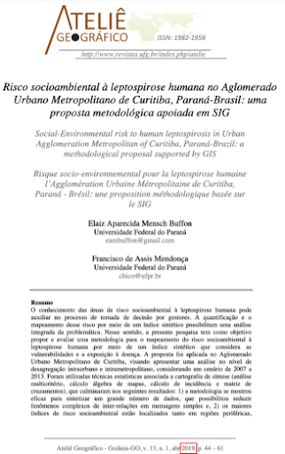
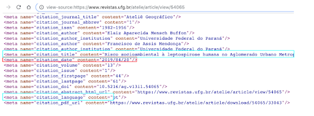
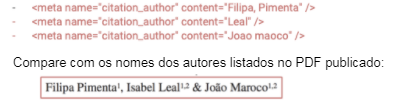

# Indexação no Google Acadêmico

> Colaboradores: Kate Shuttleworth, Emily Zheng, Monica Westin, Roger Gillis, Patricia Manghais, Tiago Ferreira, Washington Segundo

## Introdução

Este guia provê orientação sobre a indexação do Open Journal Systems (OJS) no Google Acadêmico. É direcionado principalmente para os gestores de periódicos bem como para os administradores de sistemas - responsáveis pela instalação, atualização e manutenção geral do sistema. Procuramos sugerir as seções que são mais aplicáveis a este público.

Este guia está focado na indexação de sites OJS no Google Acadêmico. Algumas destas informações são aplicáveis ao OMP e OPS, porém a interação do Google Acadêmico com estes sistemas ainda não foi pesquisada.

## Visão geral da indexação do Google Acadêmico

O Google Acadêmico é um conhecido motor de busca acadêmico que vasculha a internet em busca de publicações acadêmicas: artigos, livros, relatórios, dissertações e teses, anais de conferências, preprints, entre outros. O Google Acadêmico identifica o conteúdo acadêmico, determina os metadados bibliográficos de cada item e agrupa as diferentes versões online de um item junto aos metadados no resultado da busca.

Não é necessário registrar seu periódico no Google Acadêmico. O Google Acadêmico eventualmente o encontrará e vasculhará automaticamente o site. Se você perceber que seu periódico não está sendo exibido no Google Acadêmico, pode ser que hajam alguns problemas que precisam ser resolvidos, confira abaixo os [problemas comuns de indexação do OJS e as correções sugeridas](#troubleshooting-google-scholar-indexing-problems-for-journal-managers-and-editors).


O Google Acadêmico depende de duas informações-chave para realizar a indexação:

1. Uma maneira de rastrear todos os Uniform Resource Locators (URLs) - ou basicamente links - para artigos, seja por meio de uma navegação amigável (geralmente configurada como padrão nas instâncias do OJS) ou um mapa do site (sitemap).

2. Informações bibliográficas dos artigos na forma de tags (etiquetas) de metadados legíveis por máquina ("metatags"). Essas metatags são extraídas das informações adicionadas aos formulários no OJS para descrever seu periódico, edições e submissões.

Metatags bibliográficas indicam ao Google Acadêmico os metadados específicos para um artigo (por exemplo, título, autor, data de publicação, etc.)

Exemplo de conjunto de metatags das [diretrizes de inclusão do Google Acadêmico](https://scholar.google.com/intl/en/scholar/inclusion.html#indexing):

```html
<meta name="citation_title" content="The testis isoform of the phosphorylase kinase catalytic subunit (PhK-T) plays a critical role in regulation of glycogen mobilization in developing lung">
<meta name="citation_author" content="Liu, Li">
<meta name="citation_author" content="Rannels, Stephen R.">
<meta name="citation_author" content="Falconieri, Mary">
<meta name="citation_author" content="Phillips, Karen S.">
<meta name="citation_author" content="Wolpert, Ellen B.">
<meta name="citation_author" content="Weaver, Timothy E.">
<meta name="citation_publication_date" content="1996/05/17">
<meta name="citation_journal_title" content="Journal of Biological Chemistry">
<meta name="citation_volume" content="271">
<meta name="citation_issue" content="20">
<meta name="citation_firstpage" content="11761">
<meta name="citation_lastpage" content="11766">
<meta name="citation_pdf_url" content="http://www.example.com/content/271/20/11761.full.pdf">
```

A `<meta name="citation_pdf_url"/>` informa ao sistema de indexação qual arquivo deve ser associado a esses metadados e fornece uma URL para a composição final do artigo, isto é, arquivo digital finalizado, a prova.

Você pode revisar as metatags de um de seus artigos acessando a página do artigo e visualizando o código-fonte em HTML. Normalmente, você pode fazer isso clicando com o botão direito na página e selecionando "Exibir código-fonte da página", "Inspecionar elemento", "Ferramentas de desenvolvedor" ou usando um comando de teclado, dependendo do navegador usado por você.


Depois de visualizar o código-fonte da página do seu artigo, você pode pesquisar o HTML por "citation_" para visualizar as  metatags. Este procedimento pode ser usado para testar e solucionar muitos dos erros de indexação do OJS descritos neste guia.


## Solução de problemas para gestores e editores de periódicos

Se você perceber que o Google Acadêmico não indexou ou parou de indexar seu periódico, isto pode ter ocorrido por inconsistências entre os metadados do periódico e os arquivos de prova. Estes metadados devem corresponder rigorosamente. Entre as discrepâncias comuns pode-se citar:

- Datas de publicação incorretas listadas nas metatags

- Vários idiomas ou scritps misturados nas metatags

- Idioma dos metadados (especialmente título e resumo) diferente daquele do artigo

- Discrepâncias na formatação do nome do autor entre os metadados e a publicação (por exemplo, formato do nome e sobrenome e letras maiúsculas).

- Autores listados em ordem diferente nas metatags e na publicação

<br>Siga as etapas abaixo para verificar a consistência nos metadados de seu periódico. Se os metadados parecerem estar corretos, mas os artigos do seu periódico não estiverem sendo exibidos nos resultados da busca do Google Acadêmico, pode ser que leve algum tempo para que as alterações apareçam no site do Google Acadêmico, já que uma vez que o Google Acadêmico tenha indexado um artigo, nenhuma alteração será refletida em seu site até que o Google Acadêmico faça alterações em seu índice (o que ocorre duas vezes por ano). Se ainda assim as alterações não aparecerem, entre em contato com o administrador do site para obter apoio suplementar para solução de problemas (consulte abaixo a seção 'Solucionando problemas de indexação do Google Acadêmico" para administradores de site).

### Check for consistency in the publication date

<br>A metatag da publicação deve coincidir com a data de publicação formal da edição, bem como a data de publicação listada no PDF do artigo. Se uma dessas datas estiver incorreta, você pode alterá-la no site do periódico (nas configurações de Dados da Edição) ou no PDF do artigo.





Há um bug conhecido para diferentes versões do OJS que faz com que datas incorretas sejam listadas nas metatags. Se você estiver usando qualquer versão do 3.0.x ou 2.4.x e tiver erros de data generalizados nas metatags em seu site, esse bug é uma causa provável.

Para testar esse problema, analise o código-fonte HTML de seus artigos para visualizar a metatag de data para artigos em seus periódicos. Compare essas datas com as datas de publicação listadas nos PDFs, bem como a data de publicação para as edições em que esses artigos aparecem.

Se o problema estiver generalizado por todo o site do OJS e você estiver usando uma das versões listadas aqui, existe um patch que foi desenvolvido especificamente para corrigir esse problema. Este patch irá garantir que apenas a data de publicação seja usada na metatag de data.

Patches for supported versions of OJS include:

- [OJS 3.0.1 and 3.0.2](https://github.com/pkp/ojs/commit/9105b7ebc397f3647d500d62d30654b56a4f1e60.diff)

- [OJS 3.0.0](https://github.com/asmecher/ojs/commit/c46a9d7a0873ba21ab7fec1cd1453cae215f9a3f.diff)

- [OJS 2.4.x](https://github.com/pkp/ojs/commit/6cf0078cff0556231696cf9979377381d18d721d.diff)

[More information about the code patch can be found here.](https://github.com/pkp/pkp-lib/issues/2739)

Entre em contato com o administrador do site se você acredita que seu periódico possa estar sendo afetado por este bug.

### Use only one language in each metadata tag, and don't reproduce duplicate metadata in different languages/scripts across multiple metatags

Outro erro comum para periódicos OJS ocorre quando vários idiomas ou scripts são combinados nas metatags para um único artigo, resultando em informações bibliográficas mistas. Isso causa confusão tanto para o sistema de indexação do Acadêmico quanto para os pesquisadores que podem, por exemplo, clicar em um resultado de pesquisa do Acadêmico que parece ser um artigo escrito em um idioma conhecido - e acabar em um PDF que eles não podem ler. Evite duplicar essas informações em diferentes idiomas ou scripts em um único campo.

Exemplo com a versão traduzida do título nas metatags do título:

```html
<meta name="citation_title" content="War and Peace == Война и мир" />
```

Exemplo de lista de autores em script / idioma proveniente da instituição de origem, quando não é o idioma em que o artigo foi escrito:

```html
<meta name="citation_author" content="Толстой, Лев Николаевич " />
```

```html
<meta name="citation_author" content="Tolstoy, Lev Nikolayevich "/>
```

### Use nas tags de metadados o idioma empregado na íntegra do texto

O idioma do resumo deve corresponder ao idioma das metatags, tal como a metatag do título. Usar o inglês como idioma padrão para metatags, independentemente do idioma do artigo, também causará problemas de indexação. Isso também resulta em citações perdidas, porque os artigos que citam outro artigo provavelmente usarão o idioma do texto na íntegra para a citação. Citações perdidas significam que os artigos não serão classificados como deveriam nos resultados de pesquisa do Google Acadêmico - e ambos resultam em autores insatisfeitos.



A solução para ambos problemas é usar o idioma do texto completo que está no PDF como um guia para o idioma a ser usado ao inserir os metadados nos campos do OJS.

#### Adding multilingual metadata in OJS 3.2

No OJS 3.2, é possível habilitar vários idiomas para o seu periódico e adicionar metadados nesses idiomas em campos separados. Isso evita os problemas de indexação que podem resultar de inconsistências com o idioma dos metadados que não correspondem ao idioma do texto do artigo ou da combinação de vários idiomas no mesmo campo de metadados. Observe que você ainda deve garantir que o [idioma principal da submissão](/learning-ojs/en/authoring#step-1) corresponda ao idioma do texto completo do artigo e que os metadados sejam inseridos no idioma do texto completo do artigo, independentemente da inclusão ou não metadados em outros idiomas.

Consulte o guia Aprendendo sobre o OJS 3.2 em [Configurações do site - Idiomas](/learning-ojs/en/settings-website#languages) para maiores detalhes sobre como habilitar vários idiomas em seu jornal. Consulte Produção e Publicação - [Submissões Multilíngues](/learning-ojs/en/production-publication#multilingual-submissions) para maiores detalhes sobre como adicionar metadados em vários idiomas.

### Ensure that authors’ names are formatted consistently

Erros de formatação comuns podem incluir nome / sobrenome incorreto / inconsistente: formato, nomes incompletos, erros de ortografia ou uso de letras maiúsculas e discrepâncias entre as metatags e o PDF publicado.

Abaixo, nas metatags vermelhas, você pode observar alguns exemplos de erros comuns relacionados aos nomes de autores, que suspenderão a indexação no Google Acadêmico. Na primeira metatag, note que o nome e o sobrenome do autor foram invertidos. No segundo, apenas parte do nome do autor foi inserido. E no último exemplo, no sobrenome do autor, além do uso de letra minúscula, houve um erro de digitação (falta a letra "r").



Para solucionar e corrigir esses erros, você deve comparar os nomes nas metatags citation_author com o modo como aparecem no PDF. Se houver discrepâncias, altere as metatags nos metadados do artigo em seu periódico para corresponder ao PDF. Lembre-se de observar a formatação e o uso de letras maiúsculas.

## Troubleshooting for Site Administrators

Caso você note que o Google Acadêmico não indexou ou parou de indexar seu periódico, saiba que há algumas causas potenciais para que isto ocorra. O Google Acadêmico deixará de indexar um periódico se:

- Há um grande número de erros de metadados (consulte a seção Indexação do Google Acadêmico para Gestores de Periódicos deste guia para obter detalhes)
- The metatags are missing entirely (a known bug for upgrades to some versions of OJS)
- The HTTPS certificate is invalid or expired
- Há frequentes períodos de inatividade do site
- The OJS site has been hacked

Detalharemos abaixo como reconhecer e corrigir esses problemas comuns.

### Metatags ausentes após atualização do OJS

Há um bug conhecido para atualizações de algumas versões do OJS: OJS 2.x para OJS 3.0.1, 3.0.2, 3.1.0 e 3.1.1 que cria problemas para periódicos em relação ao Google Acadêmico.

Nesses casos, o plug-in Google Acadêmico que cria metatags para periódicos OJS é desativado durante a atualização, mesmo que tenha sido ativado na versão anterior.

Se o seu site OJS foi atualizado para qualquer versão do OJS listada acima, é aconselhável verificar se seus periódicos foram afetados por esse problema. A melhor maneira de verificar é pesquisar a metatag “citation_title” no código-fonte HTML para alguns artigos em cada periódico atualizado. Se não houver metatag de título, você provavelmente foi afetado por esse problema de plug-in desativado.

Existem diferentes maneiras de corrigir esse problema, dependendo da quantidade de periódicos OJS publicados por você. Se a coleção de periódicos em seu portal de periódicos OJS for pequena o suficiente para que você possa fazer um simples ajuste manual para cada periódico, essa é provavelmente a solução mais fácil. Para ativar o plug-in do Google Acadêmico manualmente, periódico por periódico, comece fazendo o login no painel do administrador de seu periódico. Na guia “Plugins”, encontre a lista de “Plugins genéricos” e marque a caixa de seleção “Google Acadêmico Indexing Plugin”. Certifique-se de salvar suas configurações. Repita para todos os periódicos afetados.

Do contrário, caso você tenha muitos periódicos em seu site OJS que a alteração em cada periódico tome muito tempo, você pode usar [um comando SQL para ajustar seu banco de dados de periódicos de uma só vez](https://github.com/pkp/ojs/blob/stable-3_1_2/dbscripts/xml/upgrade/3.1.2_update.xml#L41..L42) .

Por fim, você pode atualizar para o OJS versão 3.1.2 e mais recente, nas quais a correção para esse bug foi incorporada. Esta é a solução recomendada tanto pelo PKP quanto pelo Acadêmico Scholar (consulte a seção “Melhores práticas para periódicos OJS”).

### Secure Socket Layer (SSL) certificate errors

Quando a versão https de um site replica erros devido a um certificado inválido, o sistema de indexação é impedido de rastrear o site e é forçado a removê-lo do Google Acadêmico.

Para testar, abra um artigo em vários navegadores diferentes (Chrome, Safari, etc). Se você detectar avisos de que a conexão não é privada, entre em contato com seu provedor de certificado SSL para corrigir tal erro. Se possível, peça-lhes para configurar renovações automatizadas para evitar expirações futuras.


### Site downtimes

As interrupções frequentes do site farão com que o Google Acadêmico pare de indexar um periódico.

Trabalhe com seu hospedeiro para minimizar o tempo de inatividade para manutenção programada e gerencie o tráfego previsto para evitar sobrecarga de tráfego.

Ao migrar um periódico OJS, recomenda-se manter o site antigo funcional e ativo enquanto o novo site está sendo desenvolvido, evitando assim interrupções no acesso dos pesquisadores e do sistema de indexação. Quando o novo site estiver pronto para entrar no ar, primeiro insira os redirecionamentos em nível de artigo e, em seguida, altere a pesquisa de DNS para o novo servidor. (Consulte também “[Configurar redirecionamentos em nível do artigo](#set-up-article-level-redirects)”)

Ao migrar um periódico OJS, tente manter o site antigo funcional enquanto desenvolve seu novo site. Isso evita interrupções no acesso dos pesquisadores e dos sistemas de indexação. Quando o novo site estiver pronto para entrar no ar, primeiro coloque os redirecionamentos de nível de artigo no lugar e, em seguida, altere a pesquisa de DNS para o novo servidor.

### Invasão de sites

Os sites OJS invadidos são usados para spam comercial. A invasão pode não ser evidente de imediato a editores e gerentes de periódicos.

O Google Acadêmico busca identificar sites invadidos e interromper sua indexação.

Se você suspeitar que seu site OJS tenha sido invadido:

- Emule o rastreador do Google (para ver o que ele “vê”) configurando seu user-agent como Googlebot: `curl -A Googlebot URL_DO_SEU_SITE`
    - Verifique uma ampla amostra de artigos selecionados aleatoriamente para ver se eles abrem uma página diferente da que você vê no navegador ou redirecionam para outro site.
- Alerte seu provedor de hospedagem, os quais devem ser capazes de analisar e corrigir problemas de segurança subjacentes.
- Alerte o fórum [da comunidade PKP](https://forum.pkp.sfu.ca) e compartilhe suas soluções.

A melhor prática para o OJS é garantir que você esteja executando a versão mais recente e monitorar o fórum da comunidade PKP e o site do PKP para novos lançamentos e atualizações, se possível. Caso seja vítima de spammers, você poderá usar a ferramenta “mesclar usuários” na interface de administração do usuário ou [por meio da linha de comando](/admin-guide/en/securing-your-system#cleaning-lots-of-users) para remover essas contas em um grande bloco. Recomendamos também que [se habilite o reCaptcha em sua configuração do OJS](/admin-guide/en/securing-your-system#captcharecaptcha) para reduzir o número de contas de spam criadas.

## Best practices for OJS journal indexing

### Avoid customized URL structures

O sistema de indexação do Google Acadêmico foi treinado para reconhecer a estrutura de URL padrão do OJS. Embora o OJS permita a personalização de endereços de URL, os URLs personalizados tornam mais difícil para o rastreador identificar os periódicos do OJS. A estrutura deve ser:

https://NOMEDOSITE.COM/index.php/ABREVIACAODOPERIODICO/article/view/SUBMISSION#

For example:

http://seer.unipampa.edu.br/index.php/agropampa/article/view/23142

Não recomendamos a personalização das URLs do OJS, o que dificultará e tornará mais lento para que os rastreadores do Google Acadêmico indexem o site.

### Configure redirecionamentos em nível do artigo

Quando um site de periódico é movido ou itens são renumerados, isso resultará na necessidade de se redirecionar o HTTP no nível do artigo.

Se a seu periódico for migrar ou tenha migrado, ou os artigos foram renumerados ou receberam novos identificadores, será importante minimizar os links quebrados. Você precisará configurar redirecionamentos no nível do artigo, da URL do artigo para a nova URL do artigo; não é suficiente simplesmente redirecionar os artigos antigos para o novo URL da página inicial.

Esses redirecionamentos precisam ser HTTP 301s permanentes e não HTTP 302s. Para maiores informações sobre as diferenças entre os dois, consulte [este guia para os redirecionamentos 301 e 302.](https://www.searchenginejournal.com/301-vs-302-redirects-seo/299843/)

## Diretrizes de indexação e Recursos do Google Acadêmico para OJS

1. [Inclusão no Google Acadêmico e diretrizes à solução de problemas](https://scholar.google.com/intl/en/scholar/inclusion.html#indexing)

2. [Apresentação “Indexing Repositories: Pitfalls & Best Practices” na conferência Open Repositories 2015](https://www.or2015.net/wp-content/uploads/2015/06/or-2015-anurag-google-scholar.pdf) (direcionada aos repositórios, mas apresenta boas diretrizes gerais para indexação acadêmica e da web)

3. [PKP Community Forum](https://forum.pkp.sfu.ca/)
