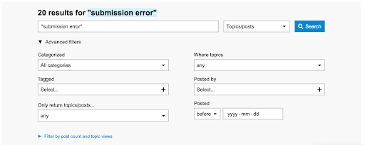
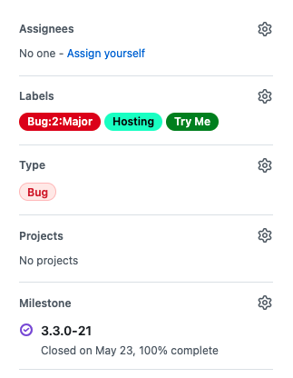

# Introduction

This guide is meant to assist PKP software users troubleshoot problems with OJS, OMP, and OPS software. It outlines available resources and guides you through some suggested steps to find solutions to common issues.

PKP provides a number of resources to help you learn how to use our software, resolve issues, and communicate with PKP staff and other users. Some are general in nature and are aimed at non-technical users, while others are more technical in nature and are aimed at administrators and developers. This guide is generally structured from introductory to advanced use of these resources and, wherever appropriate, we have indicated the level of technical expertise likely required to make the best use of a particular help tool or resource.

# Support Resources

## Where to look for help?

  

### Where to start?

Choosing a starting point will depend on your level of familiarity with a given software platform (e.g. OJS/OMP/OPS), as well as your ability to carry out specific technical tasks, should your issue relate to some of the more technical aspects of the site (e.g. [locating server error log messages](https://forum.pkp.sfu.ca/t/how-do-i-find-my-php-error-log/29374) for your site).

If you are unfamiliar with PKP software in general, a good place to start is the Getting Started sections for the different platforms on the [Documentation Hub](https://docs.pkp.sfu.ca), or the [PKP School](https://pkpschool.sfu.ca/), a short course on using the OJS software.

If you have a specific question and are familiar with PKP software, you can consult more specific guides included in the [Documentation Hub](https://docs.pkp.sfu.ca) and then move on to posting a question on the [PKP Forum](https://forum.pkp.sfu.ca/) if you do not find relevant information in the documentation.

Finally, technical users may make use of the [PKP Technical Documentation](https://docs.pkp.sfu.ca/dev/) or the [GitHub Repository](https://github.com/pkp/). In many cases, resolving technical issues may require technical expertise, particularly with server configuration and administration. Further, if you intend to customize the OJS codebase, expertise with the technologies that OJS is built on (e.g. PHP, Javascript, HTML, CSS) will likely be required, for example, with the necessary components involved in modifying [themes](https://docs.pkp.sfu.ca/pkp-theming-guide/en/). The [development guide](https://docs.pkp.sfu.ca/dev/documentation/en/) provides a good overview of what is involved in developing and customizing PKP software.

### PKP School

[PKP School](https://pkpschool.sfu.ca) is an online, open, self-paced collection of courses designed to help improve the quality of scholarly publishing around the world. PKP School includes courses in setting up a journal in OJS 3, the editorial workflow in OJS 3, as well as getting started in library publishing. Certain classes are available in both English and Spanish.

  

### Starting Points

  

The following is a good overview of common needs and what potential start points might be for users in different types of categories:

  
| Type of need | Potential starting point |
|--|--|
| Unfamiliarity with OJS/OMP/OPS | [Documentation Hub](https://docs.pkp.sfu.ca/); [PKP School](https://pkpschool.sfu.ca/) 
|Familiarity with PKP software, but a specific question regarding OJS/OMP/OPS.|[PKP Forum](https://forum.pkp.sfu.ca/)|
|Desire to customize PKP software|[PKP Technical Docs](https://docs.pkp.sfu.ca/dev/), [Github Repository](https://github.com/pkp/)|
|Questions/information related to particular plugins|[PKP Forum](https://forum.pkp.sfu.ca/), [Plugin Inventory](https://docs.pkp.sfu.ca/plugin-inventory/en/)|

### Documentation

PKP has many user guides and videos on how to install, configure, and use our software in the [PKP Documentation Hub](https://docs.pkp.sfu.ca) . If you’re looking for information about how a certain feature works or how to carry out a task in OJS, OMP, or OPS, the PKP Documentation Hub is the best place to go as a starting point.

The Documentation Hub also includes a variety of materials on privacy, discoverability, sustainability, and other relevant issues that are more broadly applicable to open access digital publishing which are not particular to PKP software (but may reference it). Browsing the [Documentation Hub](https://docs.pkp.sfu.ca) is a good way to understand the tools offered and to locate resources best suited to your needs.

#### General PKP guides (intended for non-technical audiences):

-   [Learning OJS 3](https://docs.pkp.sfu.ca/learning-ojs/): is a comprehensive guide on how to use OJS for journal managers, editors, reviewers, and authors. It explains journal setup, editorial workflow, and OJS tools.
    
-   [Learning OMP 3](https://docs.pkp.sfu.ca/learning-omp/): explains how to use OMP to publish books and manage the editorial workflow.
    
-   [Learning OPS](https://docs.pkp.sfu.ca/learning-ops/en/): explains how to use OPS to publish preprints.
    
-   (PKP Software FAQ)[https://docs.pkp.sfu.ca/faq/en/](https://docs.pkp.sfu.ca/faq/en/): is a list of frequently asked questions and responses related to PKP software.
    

  

#### Technical guides (intended for technical audiences):

-   [PKP Administrators’ Guide](https://docs.pkp.sfu.ca/admin-guide/en/): is for systems administrators of PKP software. It includes instructions on managing the server environment, importing and exporting, security, and configuring statistics and email.
    
-   [Upgrade Guide](https://docs.pkp.sfu.ca/dev/upgrade-guide/): is for systems administrators, focused on how to complete OJS upgrades.
    
-   [Developer Documentation](https://docs.pkp.sfu.ca/dev/): is a guide for coders who may want to customize or contribute to PKP software development.
    

#### General publishing guides (intended for non-technical audiences)

There are a number of guides in the Documentation Hub devoted to various topics related to, but not specific to, PKP software. They are generally more focused on areas related to open access publishing such as:

-   [Creating Accessible Content](https://docs.pkp.sfu.ca/accessible-content/)
    
-   [Student Journal Toolkit](https://docs.pkp.sfu.ca/student-toolkit/en/)
    
-   [Plan-S Compliance](https://docs.pkp.sfu.ca/plan-s/)

#### Documentation in Languages Other than English

Limited documentation is published in languages other than English. Available translations are dependent on community contributions. Available translations are indicated on the landing page for the particular guide. For example: [Learning OJS 3.3](https://docs.pkp.sfu.ca/learning-ojs/3.3/) (offered in multiple languages).

For those interested in multilingual aspects of PKP software, including contributing to translations, users may wish to check out the [translation guide](https://docs.pkp.sfu.ca/translating-guide/en/) and [Using PKP software in Multiple Languages Guide](https://docs.pkp.sfu.ca/multiling-guide/en/).

  

### Support Forum

The forum is a place for PKP community members and software users to get technical support and exchange publishing best practices with other community members.

  

New and existing users of the forum are strongly encouraged to read and review the [Forum Guidelines and Code of Conduct](https://forum.pkp.sfu.ca/t/forum-guidelines-and-code-of-conduct/37) as well as the [Welcome page](https://forum.pkp.sfu.ca/t/welcome-to-the-pkp-community-forum/67) and inform themselves on forum etiquette and expectations.

  

The Forum is also a great place to go to: 
  

-   Help other users learn how to use the software
-   Get publishing practices advice
-   Learn how others are using the software
-   Get advice on customizing PKP software
-   Showcase something unique that you did with the software
-   Share a plugin or theme you developed
-   Find PKP software developers or service providers
-   Connect with other journals, presses, or organizations
-   Suggest improvements to the software (via the [Features Requests](https://forum.pkp.sfu.ca/c/feature-requests/8) category)
 

The PKP Forum is a very active community space, with an average of 53 topics posted per day. PKP staff members, development partners, and software users around the world visit the forum every day and provide support to other users using the forum.

#### Forum Language

Although English is the primary language of the site, members are allowed to post in any other language of their choosing. On the PKP Forum, some support is available in languages other than English, under the [“Regional Networks”](https://forum.pkp.sfu.ca/c/regional-networks/25) categories (presently, German, Spanish, and Italian).

Responses to forum posts in languages other than English, similar to PKP documentation, is dependent on participation and contribution from particular communities.

### Github

[Github](https://github.com) is the online space where PKP software development is managed and discussed. Github is a commonly-used platform for managing open source software development because it makes the development process open and transparent and allows for users to contribute software code, provide input on issues or features, as well as reuse the code for other projects.

PKP stores all the code for its software applications (OJS, OMP, OPS) in its [Github repository](https://github.com/pkp/pkp-lib)) on the Github website. As the software developers build the software, they add their code to the Github repository and the code is assembled into [software releases](https://github.com/pkp/pkp-lib/tags). Different versions of the software are stored in the Github repository and software developers can keep track of what features, changes, and bug fixes are included in different software versions. An overview of the versioning system used by PKP software can be found as part of the [upgrade guide](https://docs.pkp.sfu.ca/dev/upgrade-guide/en/#a-note-on-versions).

  

Users can download software from the Github repository and install it locally. Users can get patches and bug fixes from Github and apply them to their own software installations (much of this is explored in the [administrator’s guide](https://docs.pkp.sfu.ca/admin-guide/en/)). The software code can also be used to develop other applications, so long as the rules of the [licence](https://github.com/pkp/pkp-lib/blob/main/LICENSE) are respected.

The Github repository is also where software developers and PKP software users can suggest and discuss new features and report bugs (errors in the software). If you’re having an issue with OJS, OMP, or OPS that you think might be a bug, you can search on Github to see if it has already been reported and/or resolved (you may also be able to find this information through searching the forum). Then, if it has, you may be able to solve the issue by applying a patch or upgrading to a new version of the software, though this might have to be done by a systems administrator.

# Troubleshoot your issue

These are steps you can take to try to answer your question or solve your problem, using the resources above.

## 1. Clarify the question or issue

Before you start looking for help, you should note which specific version you are running (e.g. OJS 3.3.0-11) and clarify as much as possible what your issue or question is. This will help you find relevant documentation and to post better questions on the forum should the documentation not be sufficient to resolve your issue. Having a good sense of what your problem is will allow you to find answers more quickly, and enable you to articulate it more clearly in order to obtain help.

As you are clarifying the issue, make notes about the information you find, including keywords that could be useful in searching for help. Saving links to where the issue is occurring, taking screenshots, or recording short video demonstrations of the errors can assist if you have to post your issue to the forum.

Think about additional information that could be relevant to the issue you’re having. Did you recently upgrade? Or make a significant change to the site settings? Or install a new plugin? Some of these factors may have an impact on your issue.  

If someone other than yourself is experiencing a problem, ask them follow-up questions to ensure you have all the information needed to articulate the problem.

#### Examples:

If the issue is “My editor isn’t getting email notifications,” you could ask yourself the following questions:

-   Are other users getting email notifications? If not, this might be indicative of larger email issues occurring on your system.
    
-   Is the editor getting some email notifications and not others?

If your issue is “I can’t upload an image,” you could ask the following questions:

-   Where are you trying to upload an image?
    
-   What error message do you receive when you upload an image?
    
-   What are the size and file type of the image you’re trying to upload?

## 2. Search for existing documentation

Once you’ve clarified your problem, search the Documentation Hub or the PKP Forum for possible solutions. The Documentation Hub may be more helpful if you need to verify that you’ve understood a particular workflow or setup instructions properly, while the Forum may be more helpful if you are experiencing a specific error message when trying to accomplish a task.

#### Differences in versions

It is important to look for documentation and forum posts that are appropriate to your version of the software. For example, if you are using OJS version 3.2, try to look for relevant forum threads in which the other user reports using the same version of the software that you are using, or, at least, close to it. This might not always be possible, but it is worth noting that functionality of the software may vary from one version of the software to the next, more so between major versions than minor versions. For example, who a particular feature might work on version 3.3.0-8 might be minimally different than how it works in 3.3.0-11, but there may be greater differences between how that same feature operates in version 3.1 to how it works in 3.3. Versions of PKP software are explained in more detail [here](https://docs.pkp.sfu.ca/dev/upgrade-guide/en/#a-note-on-versions). PKP software is continually being developed with new enhancements, features, and bug fixes constantly being added.

  

### Searching the Documentation Hub

The Documentation Hub also has a new search feature that enables users to search across the entire documentation hub for their specific queries. The search feature may also be found on select guides within the documentation hub as well.

### Searching the forum for a solution

1.  Do a keyword search on the forum for questions that are similar to the ones you noted.
    
2.  Using the “Sort by” option to identify relevant posts that are (e.g. by Relevance, Latest Post, Most viewed, tend to be most helpful).
    
3.  If you find similar topics, see if there are useful solutions proposed.
    
Depending on the issue you are encountering, you may want to consider the following search strategies:

If you have an error message, put your search query in quotation marks:

“Delete submissions”

The more specific your search query, the more narrow your results will be. If you use broad terms like “DOI” “error” you’re likely to retrieve a large number of results, making it difficult to filter for relevant posts on the issue you are facing.

Using the various advanced search filters on the forum may also assist in narrowing down your search if you find your searches are returning too many results. For example, you can search for results only within specific forum categories (such as “Software support"), or within specific date ranges. It may be helpful to limit the timeframe of search results to a certain time period, for example if you are using a more recent version of OJS that has been released within the last year. When looking at search results it is important to look into the content of the discussion as titles of the forum may not always be indicative of the content contained within forum discussions.

## 3. Posting to the Forum

It is important to note that support on the PKP Community Forum is provided for free by PKP staff and community members. PKP staff are particularly active on the forum, however, it should be noted that PKP staff are a small team and need to balance time spent answering questions on the Forum with other work developing and maintaining our free and open source software and other services. We cannot guarantee that every question will be answered or that every issue is resolved. As such, we ask that users of the forum have appropriate levels of patience and reasonable expectations, and abide by [forum guidelines](https://forum.pkp.sfu.ca/t/forum-guidelines-and-code-of-conduct/37) when posing questions on the forum.

### Forum etiquette and approach

It is considered good etiquette to first search the forum for answers to the problem you are facing, as users may have encountered and resolved the same, or similar, issue. More information on searching the forum can be found in the above [search](#searching-the-forum-for-a-solution) section.
  
Please bear in mind that you should limit your posts to one question only (if you have multiple questions, please remember to create separate forum posts, as per forum [guidelines](https://forum.pkp.sfu.ca/t/forum-guidelines-and-code-of-conduct/37#keep-the-forum-tidy-7)).

  

In posting questions to the forum, it is important to provide as much information as possible, including, but not limited to:

-   the specific version number and software you are using [e.g. OMP/OJS/OPS 3.3.0-11]
    
-   specific steps that you have taken to resolve your issue
    
-   error log messages (where relevant)
    
-   screenshots and links where possible (to illustrate something that is publicly visible on the site)
    

In addition to the above best practices, please respond promptly when asked for follow-up information. More detail on each of these best practices is elaborated here below:

Including the specific version number and software you are using will help those who may respond to your post potentially test the issue out using an appropriate version. Or, if the issue you are facing has been resolved, they may be able to point out how your issue may be remedied by applying a patch to your software or by upgrading the version of your software to a version wherein your issue has been resolved. Please see the (forum post on how to determine your version) number[https://forum.pkp.sfu.ca/t/how-do-i-determine-my-pkp-softwares-version/28534] if you are unsure of how to determine which version of the software you are using.

Providing a detailed explanation of the issue, including what steps you have taken to try and resolve the issue and what the results were, can be extremely helpful for PKP staff and community members who would like to help you. It can be difficult for those trying to answer questions on the forum if only minimal information is provided and problems are not articulated properly. Users of the forum are also highly encouraged to share their expertise in working with various aspects of PKP software.

 
When posting errors on the forum, those posting will be asked to provide error messages from their PHP error log. This [forum post](https://forum.pkp.sfu.ca/t/how-do-i-find-my-php-error-log/29374) provides some helpful advice on how to go about finding your PHP error log (please note that access to PHP error logs is typically done through those with server access). The [FAQ](https://docs.pkp.sfu.ca/faq/en/) also provides some helpful advice in this area as well.

  

Take care to exclude any personal information when sharing screenshots or video demonstrations [e.g. through the use of blurring or redacting].

When considering posting to the forum, it is important to note that your issue may have been encountered before and therefore solutions to your issue may exist already.
  

If you want to suggest a new feature, it’s better to first post about the feature request on the [Forum](https://pkp.sfu.ca/2022/07/20/improving-how-we-collect-community-feedback/). When proposing a feature request, the post should be posted under the “Feature Request” category and follow the template provided. Please see this [blog post](https://pkp.sfu.ca/2022/07/20/improving-how-we-collect-community-feedback/) for an overview of how feature requests are handled by the PKP development team. If unsure about the availability of a particular feature in OJS/OMP/OPS, It could be that the software already does what you want it to do (or that there is an available plugin that may meet your need). In those cases, it may be appropriate to create a post on the forum (in the “Software Support” category), if you are unsure whether PKP software may meet your particular need, you may wish to pose a question about your use case on the forum and other users will comment.

## 4. Github

Please note that working with Github with PKP often requires technical knowledge, and familiarity with the PKP software codebase as technical issues related to software development, testing, and other aspects of software development process are discussed as part of [PKP’s Github issues](https://github.com/pkp/pkp-lib/issues). Working and using Github requires familiarity with version control, Git, and the Github platform itself. However, it is possible to search for outstanding issues that PKP is working with (or has resolved), using Github issues. This can be a good way to see if there is an issue, such as the development of a new feature, enhancements, bug fixes, or other issues that have been resolved, or are still outstanding, that might be related to the particular issue you are facing.

  

### Understanding Github issues  

Github issues are used by PKP to track enhancements to PKP software. When arriving at [PKP’s Github issues repository](https://github.com/pkp/pkp-lib/issues), a search bar is presented, allowing users to search across the multiple issues related to the pkp-lib github repository (which relates to all PKP software platforms [OJS, OMP, and OPS]). Using the search option, one can search across the open and closed issues that are in the Github repository.

(PKP-Lib - Github)[https://github.com/pkp/pkp-lib/issues]

It is worth noting that if you have an issue with a particular theme or plugin, these often have their own Github repositories and may have separate issues that are filed again. The manner in which these issues are dealt with may vary, especially when they are developed by third parties that are not a part of PKP.

In the example above, `is:issue` `is:open` filters are used  to search for relevant issues that contain your search terms. Github has a lot of advanced searching and filtering capabilities, to explore them in more detail have a look at [Github’s documentation](https://docs.github.com/en/issues/tracking-your-work-with-issues/filtering-and-searching-issues-and-pull-requests)

One critical difference to note in PKP’s Github issues is the difference between open and closed issues. Open issues are issues that are still outstanding and do not currently have resolution. Closed issues are issues that are closed, and may or may not have a resolution, depending on the issue. The content of the issue will describe things like code fixes that have been applied and whether a fix for the issue is applied to a given release of the software. For example:

In this case, this issue, which was deemed an “Enhancement” is associated with the Milestone of the OJS/OMP/OPS 3.3 release and would be included as part of that version of the software.

### Searching Github:

To search Github for an issue using an example of an editor on a journal using OJS 3.1.2 who finds that the Copyeditor cannot access an article’s metadata.

-   Go to [pkp-lib Github repository](https://github.com/pkp/pkp-lib)
    
-   In the Search box on the top left of the page, enter search terms and press Enter. For this example, we will enter “copyeditor metadata” in the search field.
    
-  See below for tips on choosing search terms.
    
-  In Github, remember that it is mainly developers who are creating issues and may use quite different terminology than a regular user. For example, if you are having an issue with adding or uploading content to a text field in your OJS site, you may say the problem is with “upload image” or “text box.” However, a developer will know that the text field uses a plugin called TinyMCE and they may explain the issue as a problem with TinyMCE.
    

-  Click Issues next to the list of results to narrow the results to issues.
    
- Look at the list of results and determine whether any issues may match your issue. Please note that the title of an issue in Github is often obscure and you may need to open the issue, and read the conversation to fully understand what it is about.
    
-   For our example, we would see the issue titled [Enable assistants like copyeditors and layout editors to edit article metadata](https://github.com/pkp/pkp-lib/issues/4006) and open it.

## 5. Dealing with bugs

A bug, in software terms, is generally considered an error, flaw, or fault in the design, development, or operation of the software that often leads to an incorrect, unexpected, or unintended result.

 
The [contributor’s guide](https://docs.pkp.sfu.ca/dev/contributors/) provides a good overview of how bug fixes are identified and remedied, how new features are assessed and worked on, and how the software development process takes place in general for PKP software.

When encountering an issue using PKP software, there are some steps that can be followed to test an issue and determine if it might be a bug, and whether that bug has been previously fixed. It is important to thoroughly test an issue before identifying whether it may be a bug. In some cases, bugs may have already been identified and there are solutions available for remedying the bug.

Some initial steps to identify whether the issue you are encountering may be a bug:

  

1.  Check what version of the software you are using.
    
2.  Test the issue on the [testdrive site](https://pkp.sfu.ca/ojs/ojs_demo/) or a local test site to see if you have the same result.
    
3.  Search GitHub for issues that refer to the same problem. Go to https://github.com/pkp/pkp-lib/issues and do a keyword search for open and closed issues..
    

If you find the same issue on Github, and it’s closed, look at the milestone software release and check it against the version of the software being used. In some cases, applying the bug fix may require that you upgrade to a newer version of the software wherein the big fix has been applied, or apply a patch to solve the issue (often done by a systems administrator or your web host).

 
If you find the same issue and it is open:

1.  If you have new information or suggestions to add to the issue, based on your experience, add a comment to the github issue
    
2.  Often a member of the PKP development team will test and acknowledge the issue, and indicate that it will be included in a future version of OJS.
    
3.  If you wish, you may continue to monitor the issue in Github and track any continuing discussion or progress made on the issue

# PKP Software Service Providers

If you don’t want to troubleshoot your own issues related to installation, upgrades, and server errors, publishing support services may exist in your institution that can help you identify sources of help. Or you can seek hosting and support from commercial service providers, such as [PKP Publishing Services](https://pkpservices.sfu.ca/).

## Non-PKP Resources

Sometimes your issue will not actually be related to the software itself and could be a problem with your server, webhost, email provider, internet provider, or other software applications that work with PKP software. If this is the case, here are some other resources to consult.

  

-   [Stack Overflow](https://stackoverflow.com/): A general technical support forum for developers and systems administrators. Useful for questions about servers, php, etc.
    
-   Your IT support person or team
    
-   Your website host: For issues with url path, domain names, slow response, downtime, if the entire site is offline
    
-   Your email or domain provider: If there are email or domain problems in OJS, the problem may be how OJS is configured to send and receive email or how the domain is set up. Your email or domain provider is often the same as your website host but occasionally it may not be.
