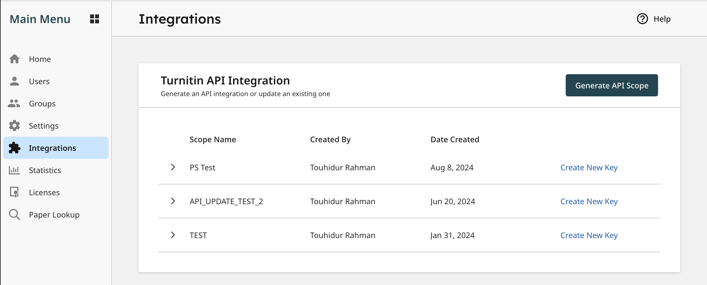
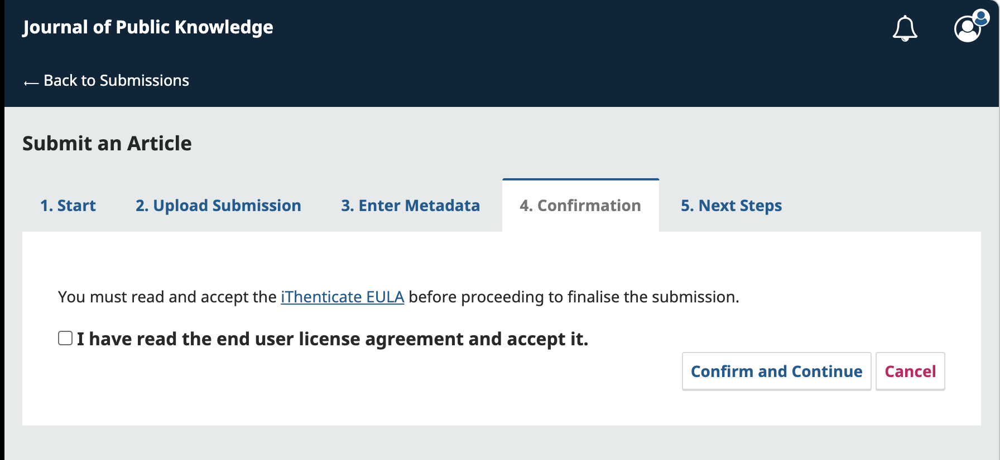
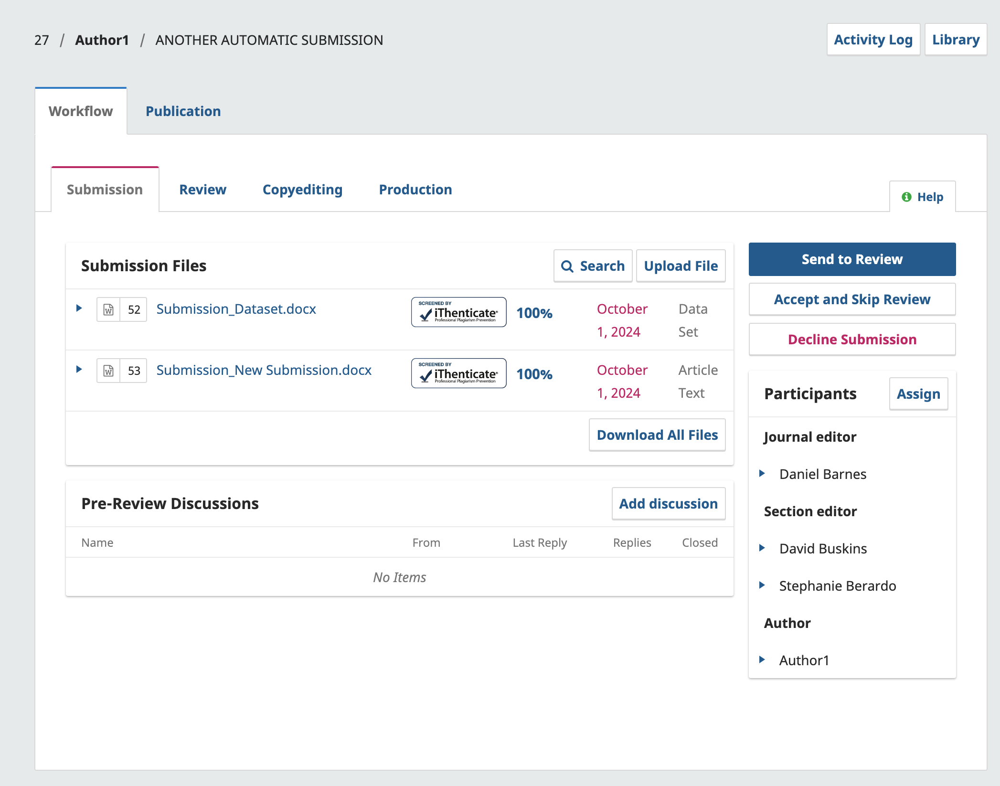
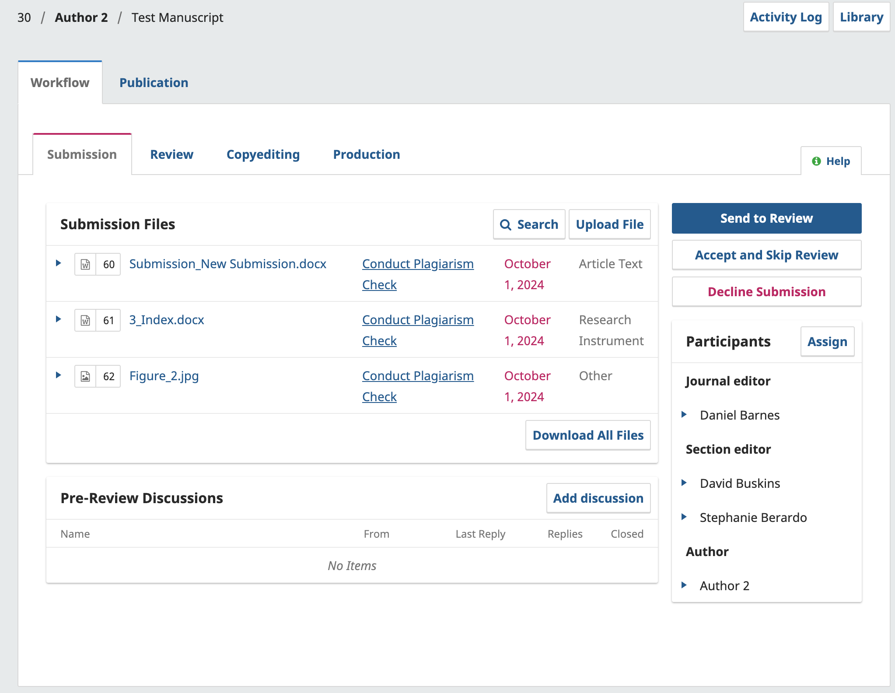
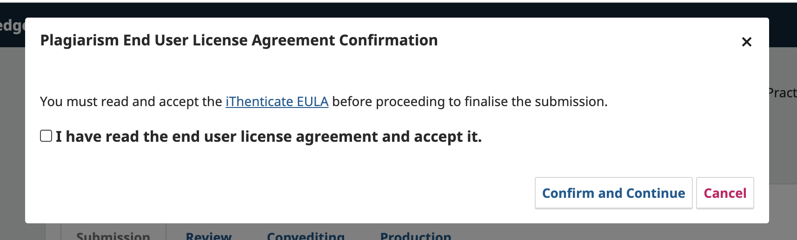
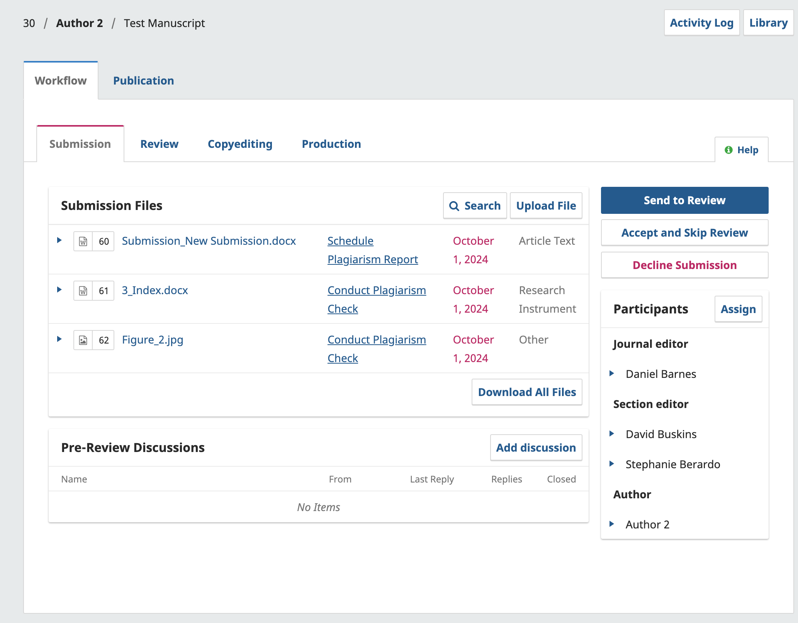
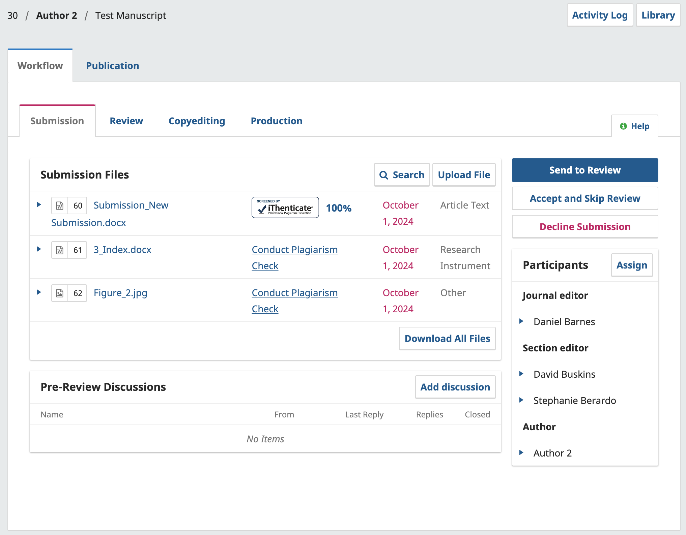
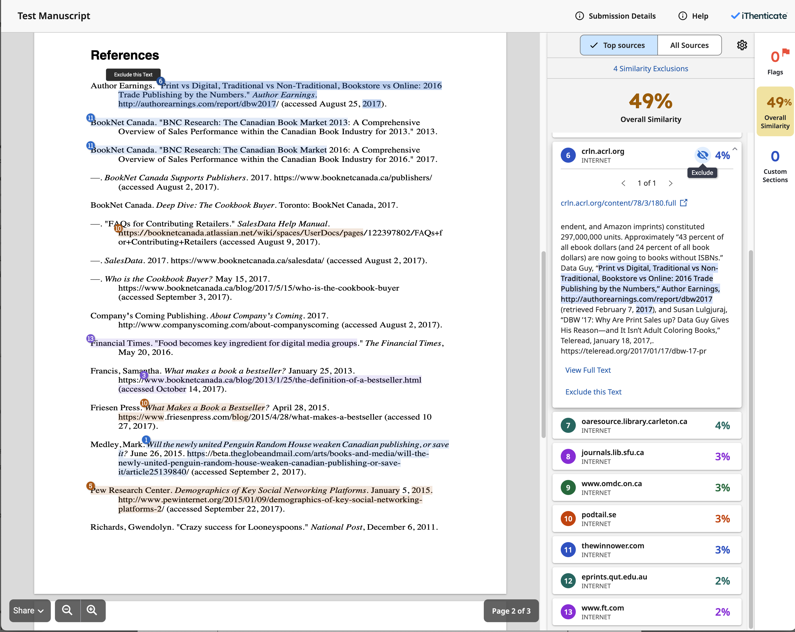

# iThenticate Plagiarism Detector Plugin Guide

## Introduction {#intro}

The 1.0.9.0 version of the iThenticate Plagiarism Detector Plugin released in late 2024 introduces several new and highly requested features, including:

- Control over which content is sent to iThenticate, and when it is sent.
- The ability to view plagiarism check results directly within the OJS interface.

It also integrates the iThenticate End User License Agreement (EULA), which users must agree to before completing a plagiarism check. The EULA will be displayed in the journal’s language if available, otherwise, it will default to English.

> **IMPORTANT**: To use the updated plugin, journal users must upgrade to an iThenticate 2.0 account. **This version of the plugin requires iThenticate API credentials**. Your iThenticate username and password will no longer work with the plugin. For assistance with upgrading your account, please contact your service provider. {:.warning}

## Upgrading the Plugin {#upgrading}

If you are using OJS 3.3 or 3.4, you can update the iThenticate Plagiarism Detector Plugin [directly from the Plugin Gallery](https://docs.pkp.sfu.ca/learning-ojs/en/settings-website#plugin-gallery).

> **IMPORTANT**: Ensure that you have completed migration to iThenticate 2.0 before upgrading your plugin. {:.warning}

## Configuring the Plugin Settings {#plugin-settings}

Once you’ve upgraded the plugin:

1. Navigate to the Plugin Gallery.
2. Search for the iThenticate Plagiarism Detector Plugin.
3. Expand the menu and click **Settings** to update your credentials.
    
    
    

### Step 1: Enter Your iThenticate API URL {#url}

Enter your iThenticate API URL in the corresponding field. For Crossref Similarity Check users, **your unique iThenticate API URL will include your Crossref membership number** in the following format:

`https://crossref-[membership-number].turnitin.com`

For example, if your Crossref membership number is 1234, your URL would be: `https://crossref-1234.turnitin.com`.

If you are unsure of your Crossref membership number, please [contact Crossref](https://support.crossref.org/hc/en-us/requests/new?ticket_form_id=360001642691).

### Step 2: Enter Your iThenticate API Key {#api-key}

Enter your iThenticate API Key in the corresponding field. If you have not already created an API key, follow the steps below:

1. Log in to [iThenticate.com](https://www.ithenticate.com/).
2. Navigate to the **Integrations** section.
3. Follow the detailed instructions in Crossref’s [Setting up your MTS integration with an API key](https://www.crossref.org/documentation/similarity-check/ithenticatev2-mts-account-setup/api-key/) guide.

### Step 3: Choose Automatic or Manual Submission  {#auto-toggle}

The plugin offers two options for submitting files for plagiarism checking:

1. **Automatic Submission:** All submitted files are automatically sent to iThenticate upon successful submission. **This option is enabled by default**.
2. **Manual Submission:** Editors can choose specific files to submit for checking. Clicking the "Disable auto upload of submission files to iThenticate at submission time” checkbox will disable Automatic Submission and enable Manual Submission.

### Step 4: Configure Submission Similarity Check Settings {#refine-settings}

Checking the options in this section will allow you to refine which sections of a submission should be **excluded** from the plagiarism check. Carefully review the options to select those that suit your preferences when performing a similarity check.

### Step 5: Enable/Disable Report Changes  {#toggle-report-changes}

Enabling this option will save any changes and/or comments made by Editors for all other users to view when accessing the report. 

## Performing Similarity Checks {#perform-checks}

Reports and plagiarism checks are only available during the **Submission & Review** stage of the editorial workflow. The procedure will change depending on whether automatic submission is enabled or disabled.

### Similarity Checks with Automatic Submission {#auto-checks}

When automatic submission is enabled, all author-uploaded files will be automatically checked by iThenticate after a successful submission. Authors must agree to the iThenticate End User License Agreement before completing their submission.

Once the submission is complete, the iThenticate report will be available for review.

> If you see a "Refresh Plagiarism Similarity Score" message in place of the iThenticate logo, this indicates that the system has not yet updated the interface with the report. You can either click the message or refresh the page to see the updated report for all files. {:.notice}

### **How to Manually Conduct Similarity Checks {#manual-checks}**

Manual submission allows editors to select which files associated with a submission should be sent to iThenticate for checking.

After a submission is received, editors will be be given an option conduct a plagiarism check for each file. 

1. Click “Conduct Plagiarism Check” on a file you would like to submit for a check.

1. Accept the EULA. Editors will be required to accept iThenticate EULA once for each submission where a manual check will occur. 
    

    
2. Click **Schedule Plagiarism Report**. The report will be generated and submitted to iThenticate.
    

    
3. To view the report, simply refresh the page in the OJS interface. The iThenticate logo will be displayed on the OJS interface once the report is ready to be viewed. The similarity score will also be displayed beside the icon which will show all the similarities marked by iThenticate.

> If you see a "Refresh Plagiarism Similarity Score" message in place of the iThenticate logo, this indicates that the system has not yet updated the interface with the report. You can either click the message or refresh the page to see the updated report for all files. {:.notice}

### Reviewing and Updating the iThenticate Report  {#report-changes}

If [saving Report Changes is enabled in the plugin settings](#toggle-report-changes), editors can make changes and update the report that will affect the assigned Similarity Score.

For example, editors can access the report and select portions of text to be excluded from screening. This can be done by highlighting the relevant text and clicking the exclude icon. This will update the score in both the window and OJS. 

Once the editor closes the iThenticate report window, the updated similarity score will be displayed on the list of submission files.
