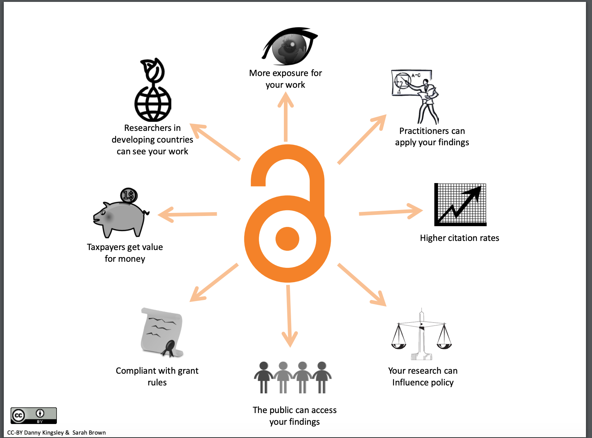

# Open access policies

## Open access vs subscription journals

Open Access (OA) has a variety of definitions, but essentially it refers to publications that are published online and made freely available to copy, use, and distribute. A more extensive definition of Open Access is featured as part of the [Berlin Declaration](https://en.wikipedia.org/wiki/Berlin_Declaration_on_Open_Access_to_Knowledge_in_the_Sciences_and_Humanities) and through the Open Knowledge Foundation’s [Open Definition](https://opendefinition.org).

In addition to making the work freely available online, permission must be granted for users to download, share, and distribute the work, providing they give credit to the original author. This permission is usually granted through Creative Commons licensing, described below.

By contrast, Subscription journals restrict access to the journal’s contents to a limited audience by charging for access - typically through individual or institutional subscription fees - and by limiting the ways the journal content can be distributed and shared without seeking permission from the copyright holder.

### Why to make your journal open access

Many benefits of OA have been well documented, such as the citation advantage, more widespread access, and recognition by funders (to name a few).

#### Citation advantage

One key advantage of OA is that works that are published as OA are proven to be cited much more than works that are not. The [Open Access Citation Advantage](https://sparceurope.org/what-we-do/open-access/sparc-europe-open-access-resources/open-access-citation-advantage-service-oaca/) from SPARC Europe reports a significant number of studies that outline the benefits of OA.

#### Widespread access

Subscription journals whose readership is limited to those who can afford to pay (often large amounts) to access its contents. OA journals, on the other hand, allow for free, immediate access (to those with an internet connection) to up-to-date research to those who most need it, which could include scientists and scholars in developing countries, government officials, non-profit and community organization workers, humanitarian works, students, or general enthusiasts.

#### Recognition by funders

Increasingly, many funding agencies have recognized the value of OA and have required that grantees publish the results of their research in OA venues. Research funding agencies are often being called upon to demonstrate the impact of the research that they fund to the broader public, and OA publishing provides a means of doing so.

[Benefits of Open Access](https://aoasg.files.wordpress.com/2013/02/benefitsofopenaccess_cc-by_logo.pdf). By Danny Kingsley and Sarah Brown. Licensed Under a [CC-BY license](https://creativecommons.org/licenses/by/4.0/).

### How to write an OA statement and policy for the journal

An OA statement should state a journal’s commitment to OA. For example, the Journal of Copyright in Education and Librarianship’s OA statement reads:

“JCEL provides immediate open access to published content in support of the idea that free access to research helps support the exchange of knowledge and ideas. All articles will be published under [Creative Commons](https://creativecommons.org/) licenses. In order to lower barriers to publication for authors, JCEL does not charge any form of author fees. JCEL is published through the support of our generous sponsors.”
