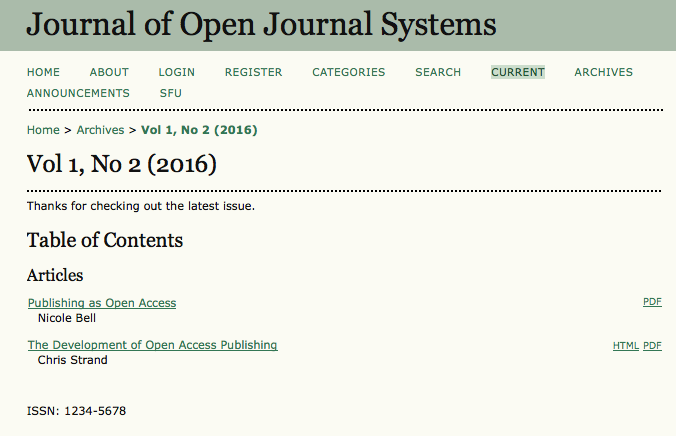
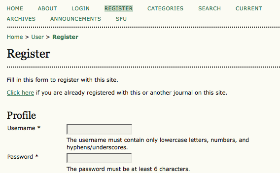
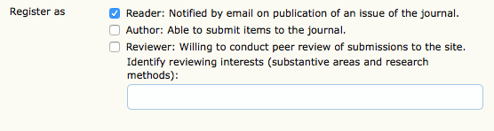

# Accessing Content

For open access journals using OJS, accessing content is as simple as selecting the Current link to see the latest issue, or the Archives link to see previous issues. You do not need to login to access open access journals.

# Subscribing

If a subscription is required to access content, you will need to register for a Reader account with the OJS journal.

# Signing up for notification

If you would like to receive an automatic email message alerting you to new content from an OJS journal you can often register for a Reader account and check the box for notification:

