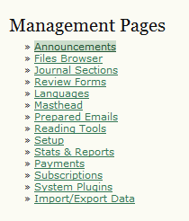
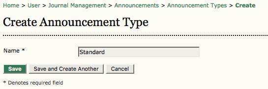
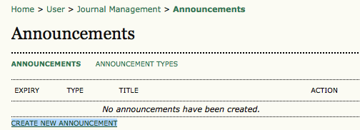
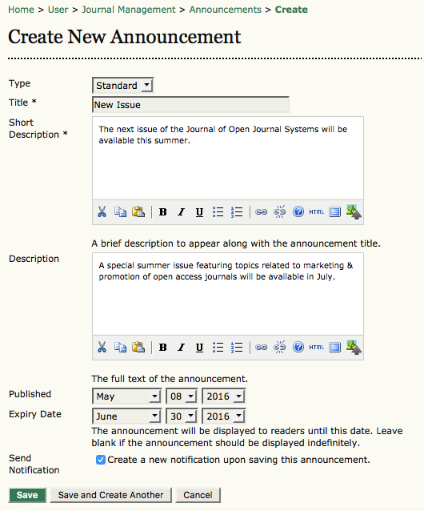
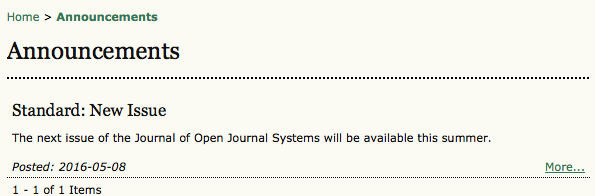
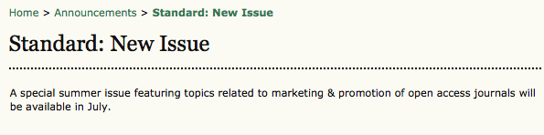

# Announcements

If you have chosen the announcements option in [Step Four](https://docs.pkp.sfu.ca/learning-ojs-2/en/step_four_management) for your journal, a link to manage **Announcements** will appear under Management Pages. Select this link to discover your announcement options.

To create a new Announcement Type, select **Announcement Types** from the menu under Announcements, and then Create Announcement Type.

Fill in the name for a new announcement type and click save.

You may only have one type for now (e.g., Standard), but this gives you the opportunity to create others at any time, or return here to edit this announcement type.

Return to the main Announcement page by selecting **Announcements**.

From here you can create and post an announcement using the **Create New Announcement** link.

On the next screen, select announcement type from the dropdown (e.g., Standard), fill in the announcement title, provide the short and detailed descriptions for the announcement, and specify the expiry date for the announcement to display.

This announcement will now be visible by clicking on the journal Announcements link on the top navigation bar, and remain there until the expiry date selected.

To see the full announcement, click on the **More** link.

