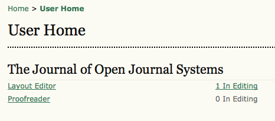
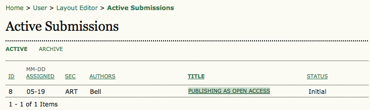

# Layout Editor Home Page

Once you've logged in, as a Layout Editor you will have access to your User Home Page. This page includes a link to an Active Submissions page, as well an Archives link to view previously completed submissions. Clicking on the **Active** link from the Layout Editor link will take you to the Active Submissions page. Alternatively, from the **User Home** page, select the link displaying the number of submissions in editing (e.g. 1 In Editing).

Select the submission from the resulting list by clicking on its linked title.

  