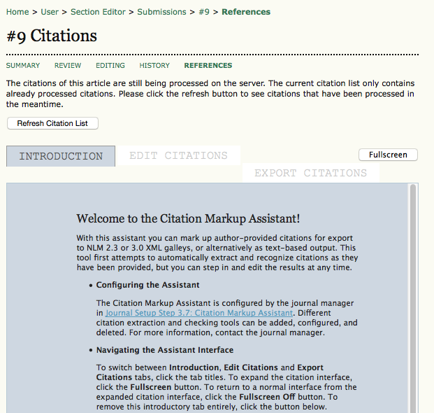
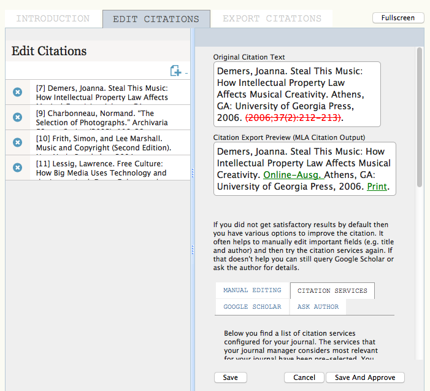
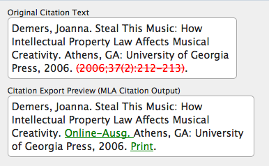
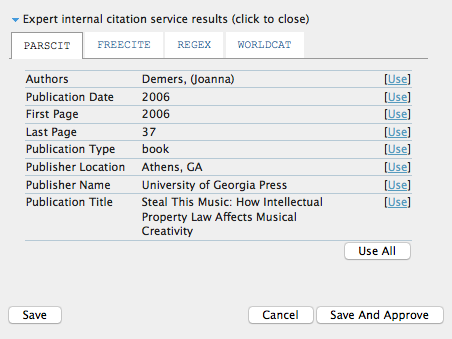
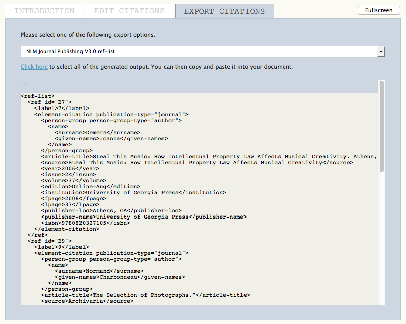
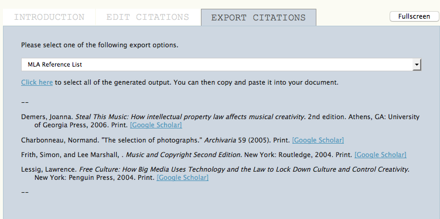

# Submission References

At any point in the review and editing process, the Editor, Section Editor and Copyeditor assigned to the submission can access the submission's References page. This page contains the Citation Markup Assistant tool (configured in Journal Setup Step 3.7). This tool helps to edit article references, and allows approved citations to be exported in various formats (including NLM XML and a number of different citation styles) to be added to final article galleys.

The first time you use the assistant, you will see an introductory text explaining how it can be used.

If you don't want to see this text every time you use the assistant, check the bottom check-box.

The assistant helps you with two processes: editing citations, including attempting to extract them from the reference list supplied by the Author, and checking them against external databases for accuracy and extra detail; and formatting citations for export in various formats. These two processes are available in their own tabs and you can switch between them

> **Note**
> 
> All citations must be approved through the editing process before they can be exported.

Clicking on the **Edit Citations** tab will display all extracted citations on the left view pane.

Clicking on an individual citation in the left pane will display information on that citation in the right view pane. Changes can be made and saved by clicking the Save button at the bottom of the pane, or canceled by clicking the Cancel button. New citations can be added by clicking the New Citation icon, found just above the left view pane, and individual citations can be deleted by clicking the Delete Citation icon to the left of the citation listing in the left view pane.

Citations that have been fully proofed can be marked as approved by clicking the Save and Approve button. When a citation has been approved, it will show up with a blue border in the left view pane, and you will be automatically moved to the next unapproved citation.

You will see the original citation, and the changes the Assistant has made as part of the extraction and lookup process. It will display the way the citation will appear as per your journal's selected citation style.

Additionally, you can also manually edit the citation; check it again against the journal's configured citation database services; search for it in Google Scholar; or ask the Author for further citation information.

Finally, you can access and choose between detailed expert internal citation service results to help improve the citation. You can access and choose results for each citation database connector that has been configured by the Journal Manager.

Once all citations have been approved, you will be automatically moved to the Export Citations tab. Citations can be exported in NLM XML (2.3 or 3.0), or in a variety of different citation formats, including ABNT, APA, MLA, and Vancouver. Exported citations can be copied and pasted directly into your final galley document; the different citation formats, meant for pasting into Word or other non-XML-specific layout and editing applications, include links to look up each citation in Google Scholar.

