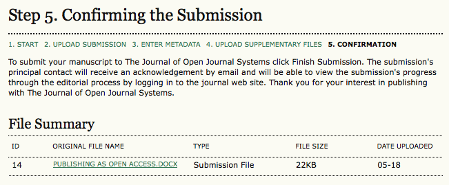

# Submission Step Five: Confirming the Submission

This final step provides a summary of your submission.

!\[Fees\](images/chapter6/step5_1 copy.png)

If the journal charges submission, fast-track review, or publication fees, your required payment will also be detailed here. If you paid previously, use the checkbox to indicate that you have. If you require a fee waiver to be considered, check that box and an provide an explanation (required).

Click **Finish Submission** to submit your manuscript. You will receive an acknowledgment by email and will be able to view your submission's progress through the review and editorial process by returning to the Active Submissions section of your Author page.
