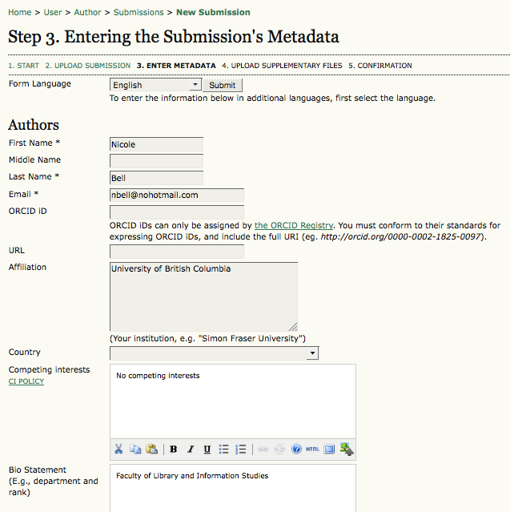
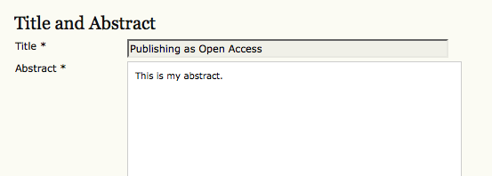
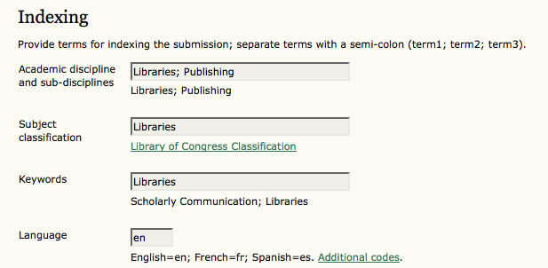
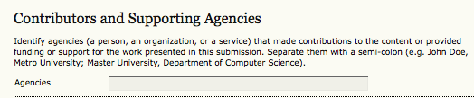
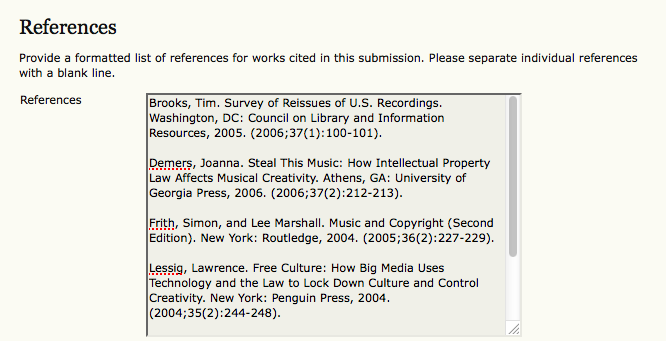

# Submission Step Three: Entering the Submission's Metadata

The third step of the submission process serves to collect all relevant metadata from the author. The first section of metadata covers the authors. The submitting author will have their personal information automatically appear. Any additional information, such as Competing Interests should also be added at this time, if required.

If there are multiple authors for the submission, their information can be added using the Add Author button. You can also re-order the list of authors, make one of the authors the principal contact with the editor, and delete any authors added in error.

Next, enter the submission title and abstract.

You will then add **indexing** information. This will help others find your article. The suggested indexing options were determined by the Journal Manager in [Setup Step 3](https://docs.pkp.sfu.ca/learning-ojs-2/en/step_three_submissions).

The next section allows you to enter the name of any organization that may have supported your research.

Depending on how the journal is configured, you may find an option to provide your list of **references** separately. This will allow the journal's Editors and Copyeditors to check your references using a Citation Markup Assistant. You should provide your list with each reference on a separate line.

Hit the **Save and Continue** button to move on to Step 4.