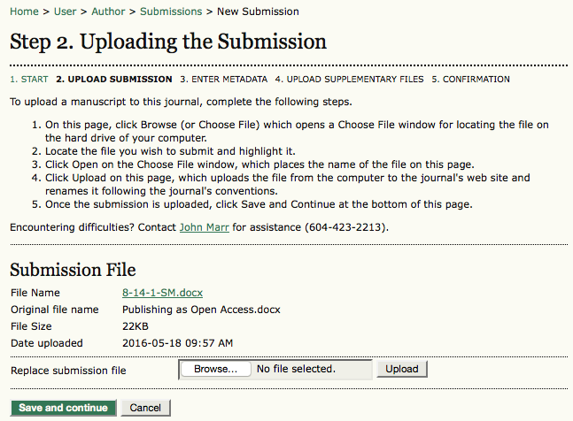

# Submission Step Two: Uploading the Submission

Submission Step Two allows you to upload the submission file, typically a word-processing document.

   * Click **Browse** to open a Choose File window for locating the file on the hard drive of your computer.

   * Locate the file you wish to submit and highlight it.

   * Click **Open** on the Choose File window, which places the name of the file on this page.

   * Click **Upload** on this page, which uploads the file from the computer to the journal's web site and renames it following the journal's conventions.

   * Once the submission is uploaded, click **Save and Continue**.

