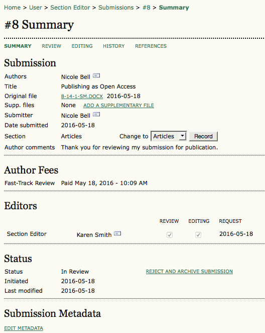

# Submission Summary

The Section Editor's Submission Summary page is almost identical to the Editor's Submission Summary Page, with the exception that the Section Editor does not have access to the Editors Assignment section. Otherwise, the Section Editor can add supplementary files; change the article section; adjust fees and status; and/or modify the article's metadata just as the Editor can. For further information, please refer to the [Editor's pages](https://pkp.gitbooks.io/learning-ojs-2/content/en//submissions.html) in this manual.

 