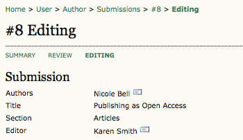
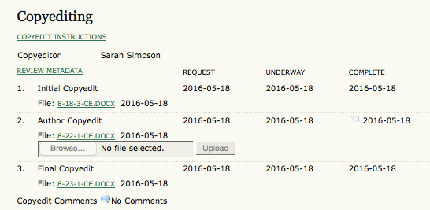
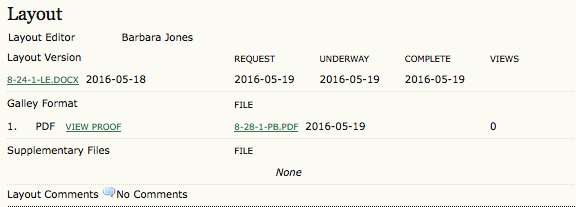
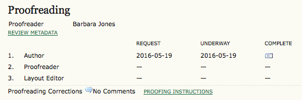
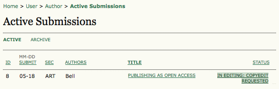
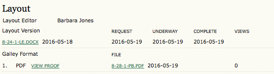
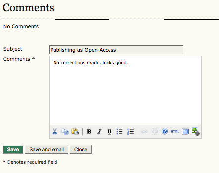
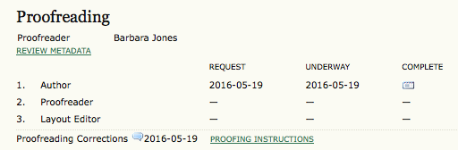
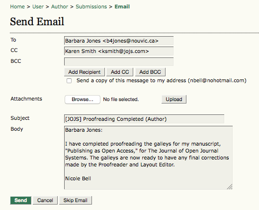

# Submissions Editing Page

Your submission is considered "In Editing" once it has been approved for publication. Next it will go through Copyediting to correct any grammatical or stylistic errors, Layout Editing to create the published galleys (e.g., HTML or PDF), and Proofreading to take one final look at the article before it is made publicly available.

If your submission is In Editing, you can view its details in the Editing section (linked from the top of your page). The first section again includes basic submission information.

## Copyediting

In the next section, you can follow the copyediting process.

  * Step 1: The journal's Copyeditor (Sarah Simpson) has made changes to the submission file. You can download a revised copy here from Initial Copyedit (e.g., 8-18-3-CE.DOCX).
  *  Step 2: You will review the Copyeditor's changes, and make any final changes of your own. You then upload your revised submission file here under Author Copyedit (e.g., 8-22-1-CE.DOCX). Be sure to use the email icon to notify the Copyeditor that you have submitted your file.
  *  Step 3: The Copyeditor takes a last look at your changes before passing the submission over to the Layout Editor in Final Copyedit (e.g.,8-23-1-CE.DOCX) No action is required by the author.
> ** Note**
> 
> Copyedit comments can be added using the icon near the bottom of this section. There is also a link to "Copyedit Instructions".

## Layout Editing

The next stage in the editorial process is layout editing. The Layout Editor takes the final copyedited version of the submission and converts it into a format suitable for publishing on the journal web site (e.g., typically HTML or PDF). These are known as the "galleys". As the author, from here you can view the proof of the converted file, or even download it.

## Proofreading

The final editing stage is proofreading. Similar to Copyediting, it is also broken down into 3 steps. The Author's role in proofreading is in Step 1.

* Step 1: Once the galleys have been uploaded by the Layout Editor, you will receive an email from the Editor asking that you review them and note any errors in the Proofreading Corrections comments. Proofing Instructions are also available. To view these, you will need to login to the journal and select the appropriate submission link:

On the resulting screen, you can use the View Proof links to display the files. You can click the linked file names (e.g, 8-28-1-PB.PDF) to download a copy.

Review the files and make any comments using the Layout Comments icon.

Once you have completed your review and noted any necessary changes, hit the Complete button.

This will generate an email informing the Proofreader and Section Editor that you are satisfied with the galleys.

* Step 2: The journal's own Proofreader will also check for errors and make their own notes and inform the Layout Editor when all proofreading is complete. No action is required by the Author.

* Step 3: The Layout Editor takes all of the notes and incorporates all of the changes into revised galleys. These are then ready to publish. No action is required by the Author.

You have now completed all of the steps involved in submitting to the journal and participating in the review and editing of your submission.
