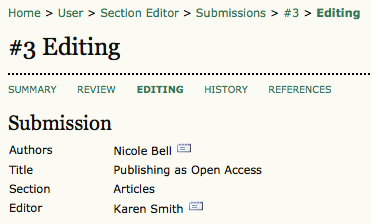

# Submissions In Editing

Upon acceptance, the submission moves from "In Review" to "In Editing". You can go to "In Editing" by selecting the Editing link at the top of the submission record.

The first section provides basic submission information (authors, title, section, editor). The Copyediting section follows below.

The Editing process comprises 4 sections:

* 
### [Copyediting](https://pkp.gitbooks.io/learning-ojs-2/content/en//in_editing_copyediting.html)

* 
### [Scheduling](https://pkp.gitbooks.io/learning-ojs-2/content/en/scheduling.html)

* 
### [Layout Editing](https://pkp.gitbooks.io/learning-ojs-2/content/en//layout_editing.html) 

* 
### [Proofreading](https://pkp.gitbooks.io/learning-ojs-2/content/en//in_editing_proofreading.html)

