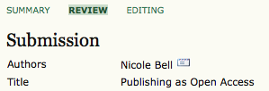
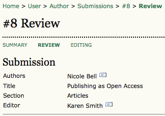
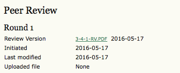
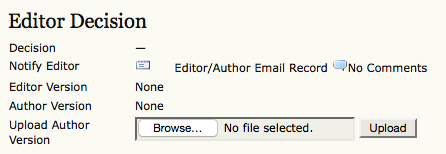

# Submissions Review Page

If your submission is in Review, you can view its details in the **Review** section linked from the top of the page.

First, you will see the basic **submission** information again. An editor has now been assigned to the submission.

Below that is the **Peer Review** section. You will see information about each round of review (there may be one or more, or none yet taken place) and any revised files (e.g., a version of your original submission file with changes marked in) uploaded by each reviewer (Reviewer A, Reviewer B, etc.). In this example Peer Review has started, and the information displayed will change as the submission moves through the stage.

Last on this page is the Editor Decision section. From this section you can notify the editor once you have submitted your revised submission file, view the reviewer comments (click on the cloud icon), and upload your revised submission file (if revisions were required). In this example an editor decision has not been made yet, but an author can check back to see updates on this stage.

Possible decisions include:

   * Accept: Your submission has been accepted as is.

   * Revisions Required: Your submission requires minor changes and will be accepted once those have been completed.

   * Resubmit for Review: Your submission needs significant re-working. A new file must be submitted and another round of review will take place.

   * Reject: Your submission was not accepted for publication with this journal, either because it was not seen to be of high enough quality, or its subject did not match the journal.
